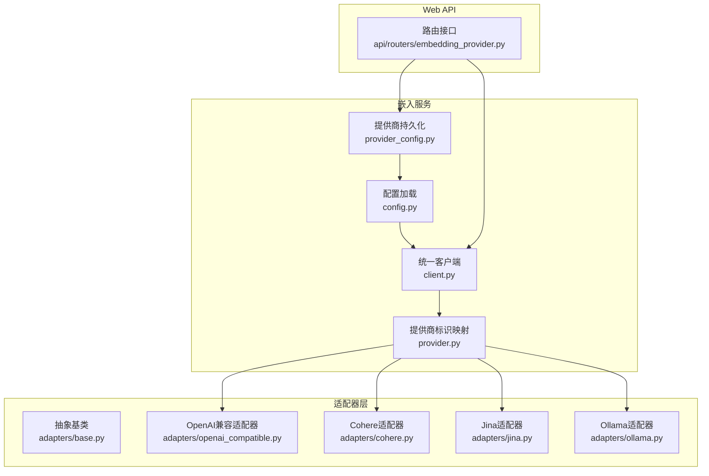
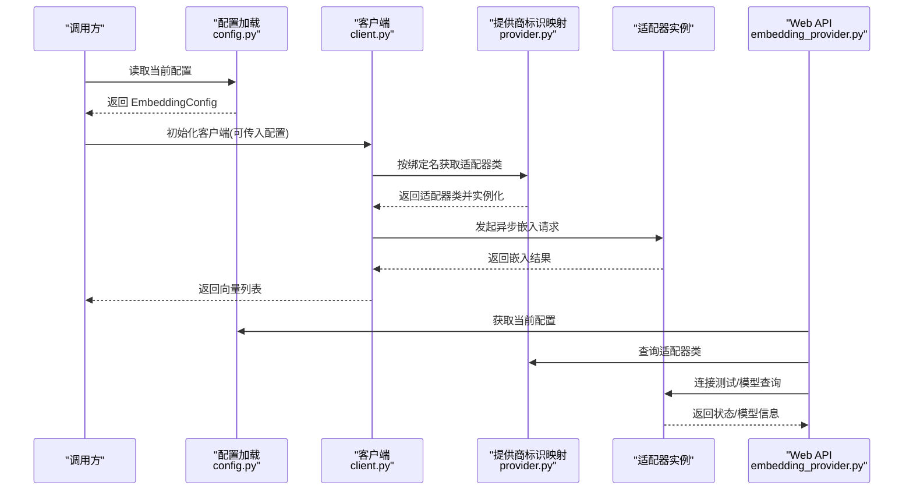
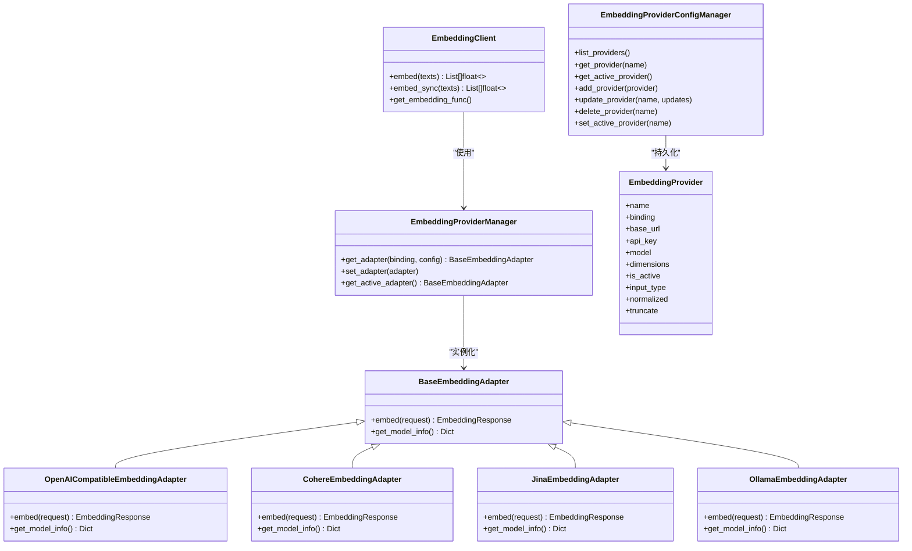
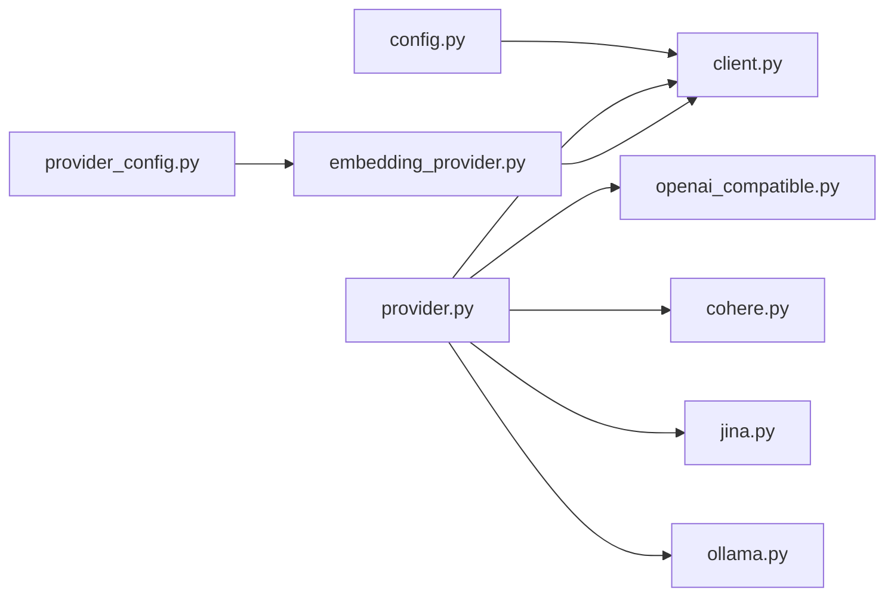
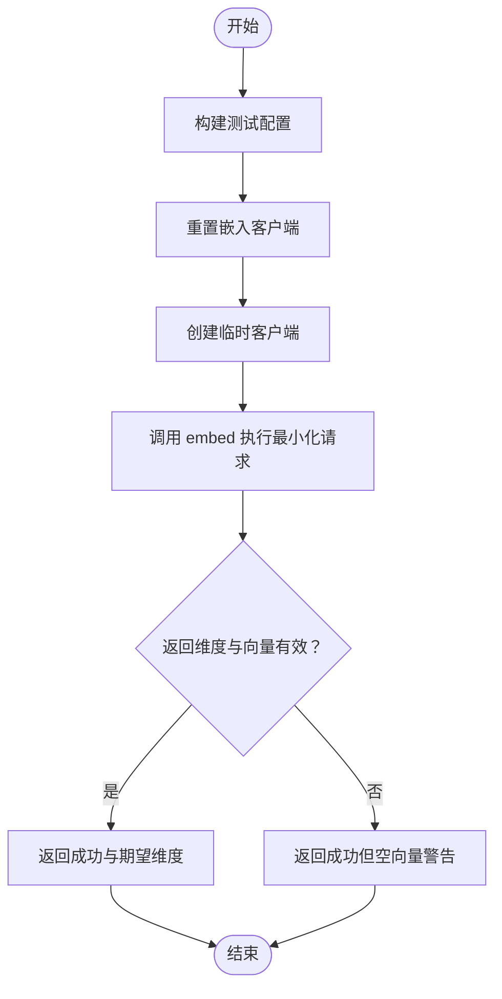
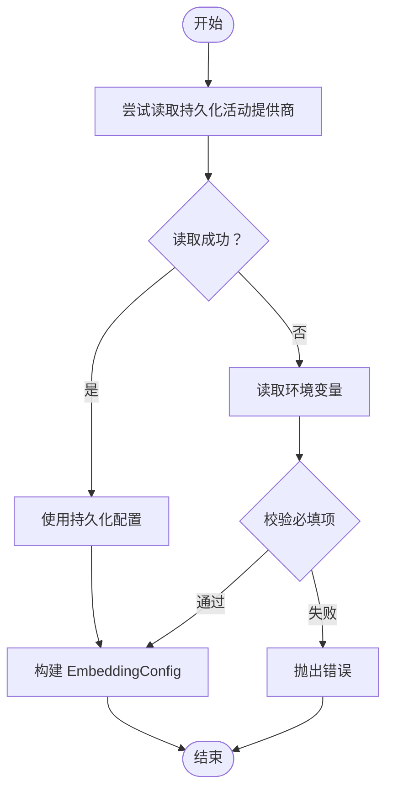

# 嵌入模型提供商管理

<cite>
**本文引用的文件**
- [provider.py](file://src/services/embedding/provider.py)
- [client.py](file://src/services/embedding/client.py)
- [config.py](file://src/services/embedding/config.py)
- [provider_config.py](file://src/services/embedding/provider_config.py)
- [embedding_provider.py](file://src/api/routers/embedding_provider.py)
- [base.py](file://src/services/embedding/adapters/base.py)
- [openai_compatible.py](file://src/services/embedding/adapters/openai_compatible.py)
- [cohere.py](file://src/services/embedding/adapters/cohere.py)
- [jina.py](file://src/services/embedding/adapters/jina.py)
- [ollama.py](file://src/services/embedding/adapters/ollama.py)
- [.env.example](file://src/services/embedding/.env.example)
</cite>

## 目录
1. [简介](#简介)
2. [项目结构](#项目结构)
3. [核心组件](#核心组件)
4. [架构总览](#架构总览)
5. [详细组件分析](#详细组件分析)
6. [依赖关系分析](#依赖关系分析)
7. [性能与可用性考虑](#性能与可用性考虑)
8. [故障排查指南](#故障排查指南)
9. [结论](#结论)
10. [附录](#附录)

## 简介
本文件系统化梳理 DeepTutor 中“嵌入模型提供商管理”的设计与实现，覆盖从配置加载、适配器工厂、客户端封装到 Web API 的全链路流程。目标是帮助开发者快速理解如何在多云/本地嵌入服务之间切换与管理，并安全地集成到知识库与 RAG 流水线中。

## 项目结构
围绕嵌入模型提供商管理的关键目录与文件如下：
- 配置与客户端：config.py、client.py、provider.py
- 提供商配置持久化：provider_config.py
- 适配器层：adapters/base.py 及各具体适配器（openai_compatible.py、cohere.py、jina.py、ollama.py）
- Web API：api/routers/embedding_provider.py
- 示例环境变量：services/embedding/.env.example

图表来源
- [config.py](file://src/services/embedding/config.py#L63-L183)
- [client.py](file://src/services/embedding/client.py#L18-L155)
- [provider.py](file://src/services/embedding/provider.py#L21-L120)
- [provider_config.py](file://src/services/embedding/provider_config.py#L19-L183)
- [base.py](file://src/services/embedding/adapters/base.py#L14-L106)
- [openai_compatible.py](file://src/services/embedding/adapters/openai_compatible.py#L13-L89)
- [cohere.py](file://src/services/embedding/adapters/cohere.py#L13-L125)
- [jina.py](file://src/services/embedding/adapters/jina.py#L13-L100)
- [ollama.py](file://src/services/embedding/adapters/ollama.py#L13-L117)
- [embedding_provider.py](file://src/api/routers/embedding_provider.py#L1-L451)

章节来源
- [config.py](file://src/services/embedding/config.py#L63-L183)
- [client.py](file://src/services/embedding/client.py#L18-L155)
- [provider.py](file://src/services/embedding/provider.py#L21-L120)
- [provider_config.py](file://src/services/embedding/provider_config.py#L19-L183)
- [base.py](file://src/services/embedding/adapters/base.py#L14-L106)
- [openai_compatible.py](file://src/services/embedding/adapters/openai_compatible.py#L13-L89)
- [cohere.py](file://src/services/embedding/adapters/cohere.py#L13-L125)
- [jina.py](file://src/services/embedding/adapters/jina.py#L13-L100)
- [ollama.py](file://src/services/embedding/adapters/ollama.py#L13-L117)
- [embedding_provider.py](file://src/api/routers/embedding_provider.py#L1-L451)

## 核心组件
- 配置加载器：负责从环境变量或持久化提供商中读取当前绑定、模型、维度、超时等参数。
- 提供商标识映射：将字符串绑定名映射到具体适配器类，集中管理适配器实例。
- 统一客户端：封装异步/同步调用、LightRAG 兼容函数，屏蔽底层差异。
- 适配器抽象与实现：定义统一请求/响应结构，各云/本地提供商按协议实现。
- Web API：提供提供商列表、新增/更新/删除、设置活动提供商、连接测试、模型查询与校验。

章节来源
- [config.py](file://src/services/embedding/config.py#L63-L183)
- [provider.py](file://src/services/embedding/provider.py#L21-L120)
- [client.py](file://src/services/embedding/client.py#L18-L155)
- [base.py](file://src/services/embedding/adapters/base.py#L14-L106)
- [embedding_provider.py](file://src/api/routers/embedding_provider.py#L1-L451)

## 架构总览
下图展示从配置到适配器再到客户端与 API 的交互路径。

图表来源
- [config.py](file://src/services/embedding/config.py#L63-L183)
- [client.py](file://src/services/embedding/client.py#L18-L155)
- [provider.py](file://src/services/embedding/provider.py#L21-L120)
- [embedding_provider.py](file://src/api/routers/embedding_provider.py#L1-L451)

## 详细组件分析

### 配置加载与环境变量策略
- 优先级：先尝试从持久化的提供商配置中读取当前活动提供商；若无，则回退到环境变量。
- 绑定名决定前缀映射，优先使用 provider-specific 变量（如 OPENAI_EMBEDDING_MODEL），否则回退到通用变量（EMBEDDING_*）。
- 必填项校验：模型名必填；除本地提供商外，其他均需 API Key；Host 必填。
- 可选参数：最大 token 数、编码格式、是否归一化、是否截断、延迟分块等。

章节来源
- [config.py](file://src/services/embedding/config.py#L63-L183)
- [.env.example](file://src/services/embedding/.env.example#L1-L164)

### 提供商标识映射与适配器工厂
- 映射表将字符串绑定名映射到具体适配器类，支持 openai、azure_openai、jina、huggingface、google、cohere、ollama、lm_studio。
- 工厂方法根据绑定名与配置字典创建适配器实例；未识别绑定会抛出错误。
- 单例管理器维护当前活跃适配器，提供获取与重置能力。

章节来源
- [provider.py](file://src/services/embedding/provider.py#L21-L120)

### 统一客户端与 LightRAG 兼容
- 客户端初始化时读取配置并创建适配器，随后通过 EmbeddingRequest 封装输入参数（文本、模型、维度、输入类型等）。
- 支持异步 embed 与同步包装 embed_sync，便于在非异步上下文中使用。
- 提供 get_embedding_func，返回 LightRAG 所需的 EmbeddingFunc，包含维度、最大 token 数与异步包装函数。

章节来源
- [client.py](file://src/services/embedding/client.py#L18-L155)

### 适配器抽象与各提供商实现
- 抽象基类定义 EmbeddingRequest/EmbeddingResponse 标准结构，统一输入输出。
- 各适配器实现 embed 与 get_model_info：
  - OpenAI 兼容：支持自定义维度（部分模型支持），处理 v1/v2 差异。
  - Cohere：区分 v1/v2 接口，支持多维模型与 input_type。
  - Jina：支持任务感知（input_type 转换为 task）、归一化、延迟分块。
  - Ollama：本地模型，支持 keep_alive、模型存在性检查与错误提示。

章节来源
- [base.py](file://src/services/embedding/adapters/base.py#L14-L106)
- [openai_compatible.py](file://src/services/embedding/adapters/openai_compatible.py#L13-L89)
- [cohere.py](file://src/services/embedding/adapters/cohere.py#L13-L125)
- [jina.py](file://src/services/embedding/adapters/jina.py#L13-L100)
- [ollama.py](file://src/services/embedding/adapters/ollama.py#L13-L117)

### 提供商配置持久化与 Web API
- 持久化模型：EmbeddingProvider 记录名称、绑定、URL、模型、维度、是否激活及高级选项。
- 管理器：支持列出、新增、更新、删除、设置活动提供商；自动处理激活互斥。
- Web API：
  - 列表/新增/更新/删除提供商
  - 设置活动提供商
  - 连接测试：构造临时客户端进行最小化请求验证
  - 当前模型信息：返回绑定、模型、维度、最大 token、超时、输入类型与适配器信息
  - 模型查询：对 Ollama/LM Studio 直接拉取可用模型；对其他提供商返回已知模型清单
  - 配置校验：连通性、模型可用性、维度兼容性、API Key 要求

章节来源
- [provider_config.py](file://src/services/embedding/provider_config.py#L19-L183)
- [embedding_provider.py](file://src/api/routers/embedding_provider.py#L1-L451)

### 类关系图

图表来源
- [base.py](file://src/services/embedding/adapters/base.py#L55-L106)
- [openai_compatible.py](file://src/services/embedding/adapters/openai_compatible.py#L13-L89)
- [cohere.py](file://src/services/embedding/adapters/cohere.py#L13-L125)
- [jina.py](file://src/services/embedding/adapters/jina.py#L13-L100)
- [ollama.py](file://src/services/embedding/adapters/ollama.py#L13-L117)
- [client.py](file://src/services/embedding/client.py#L18-L155)
- [provider.py](file://src/services/embedding/provider.py#L21-L120)
- [provider_config.py](file://src/services/embedding/provider_config.py#L19-L183)

## 依赖关系分析
- 组件耦合
  - client.py 依赖 config.py 与 provider.py，形成“配置—适配器—客户端”闭环。
  - provider.py 仅依赖适配器基类与各具体适配器，保持低耦合。
  - provider_config.py 与 embedding_provider.py 通过 FastAPI 路由交互，API 层不直接依赖业务实现细节。
- 外部依赖
  - httpx 用于异步 HTTP 请求；pydantic 用于配置模型；dotenv 用于加载 .env。
- 循环依赖
  - 未发现循环导入；模块职责清晰，分层明确。

图表来源
- [config.py](file://src/services/embedding/config.py#L63-L183)
- [client.py](file://src/services/embedding/client.py#L18-L155)
- [provider.py](file://src/services/embedding/provider.py#L21-L120)
- [provider_config.py](file://src/services/embedding/provider_config.py#L19-L183)
- [embedding_provider.py](file://src/api/routers/embedding_provider.py#L1-L451)

章节来源
- [config.py](file://src/services/embedding/config.py#L63-L183)
- [client.py](file://src/services/embedding/client.py#L18-L155)
- [provider.py](file://src/services/embedding/provider.py#L21-L120)
- [provider_config.py](file://src/services/embedding/provider_config.py#L19-L183)
- [embedding_provider.py](file://src/api/routers/embedding_provider.py#L1-L451)

## 性能与可用性考虑
- 异步并发：客户端 embed 使用异步 httpx，适合高并发场景；同步包装通过线程池执行，避免阻塞事件循环。
- 超时控制：适配器统一使用 request_timeout，防止长时间等待。
- 维度与模型：不同提供商支持的维度与模型不同，建议在配置校验阶段提前发现不匹配问题。
- 本地模型：Ollama 适配器支持 keep_alive，减少冷启动开销；同时提供模型存在性检查与下载指引。
- 日志与监控：各适配器记录关键信息，便于定位问题；客户端与 API 层也记录关键步骤。

[本节为通用指导，无需列出具体文件来源]

## 故障排查指南
- 无法初始化适配器
  - 检查绑定名是否在映射表中；确认 .env 或持久化提供商配置正确。
  - 参考：[provider.py](file://src/services/embedding/provider.py#L47-L71)
- 缺少必要配置
  - 模型名、API Key（除本地提供商）、Host 必须设置；配置加载器会抛出明确错误。
  - 参考：[config.py](file://src/services/embedding/config.py#L134-L156)
- 连接失败或超时
  - 检查 Host 是否可达；调整 request_timeout；查看适配器日志。
  - 参考：[openai_compatible.py](file://src/services/embedding/adapters/openai_compatible.py#L39-L46)、[ollama.py](file://src/services/embedding/adapters/ollama.py#L40-L82)
- 维度不匹配
  - 某些模型不支持自定义维度；适配器会记录警告；请核对模型支持范围。
  - 参考：[openai_compatible.py](file://src/services/embedding/adapters/openai_compatible.py#L53-L58)、[cohere.py](file://src/services/embedding/adapters/cohere.py#L99-L104)
- Ollama 模型不存在
  - 适配器会提示可用模型列表并建议下载命令；确保模型已拉取。
  - 参考：[ollama.py](file://src/services/embedding/adapters/ollama.py#L44-L63)
- Web API 使用建议
  - 先使用“连接测试”与“配置校验”，再切换活动提供商；模型查询可用于选择合适模型。
  - 参考：[embedding_provider.py](file://src/api/routers/embedding_provider.py#L107-L157)、[embedding_provider.py](file://src/api/routers/embedding_provider.py#L343-L451)

章节来源
- [provider.py](file://src/services/embedding/provider.py#L47-L71)
- [config.py](file://src/services/embedding/config.py#L134-L156)
- [openai_compatible.py](file://src/services/embedding/adapters/openai_compatible.py#L39-L46)
- [ollama.py](file://src/services/embedding/adapters/ollama.py#L44-L63)
- [embedding_provider.py](file://src/api/routers/embedding_provider.py#L107-L157)
- [embedding_provider.py](file://src/api/routers/embedding_provider.py#L343-L451)

## 结论
该嵌入模型提供商管理体系以“配置—适配器—客户端—API”四层解耦实现，既支持多云/本地提供商灵活切换，又通过 Web API 提供了可视化的配置与诊断能力。通过统一的请求/响应结构与严格的配置校验，系统在易用性与稳定性之间取得良好平衡。

[本节为总结，无需列出具体文件来源]

## 附录

### 关键流程图：连接测试与模型查询

图表来源
- [embedding_provider.py](file://src/api/routers/embedding_provider.py#L107-L157)

### 关键流程图：配置加载与回退策略

图表来源
- [config.py](file://src/services/embedding/config.py#L63-L183)