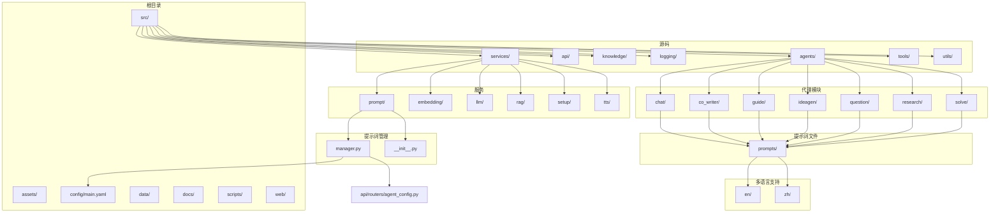
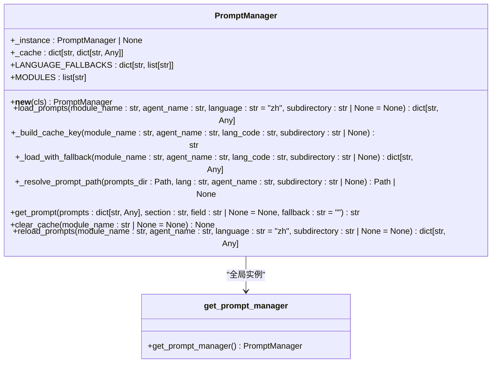
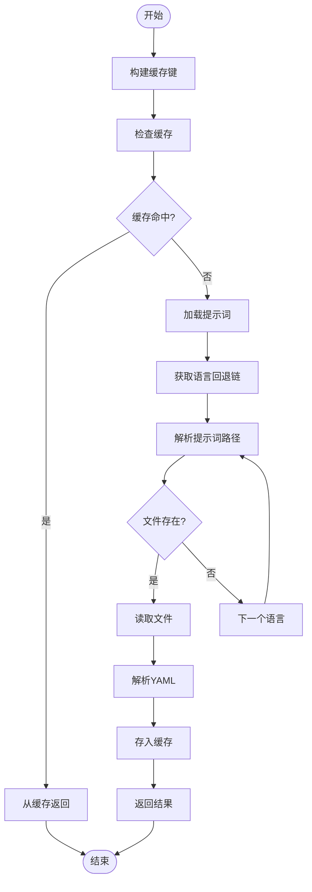
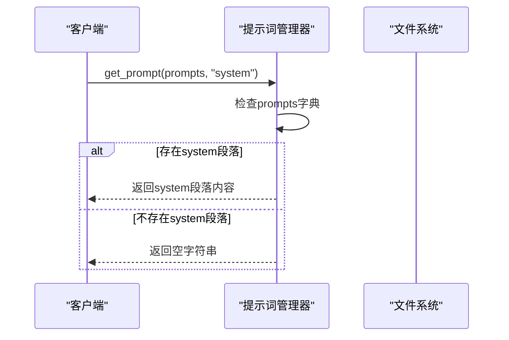
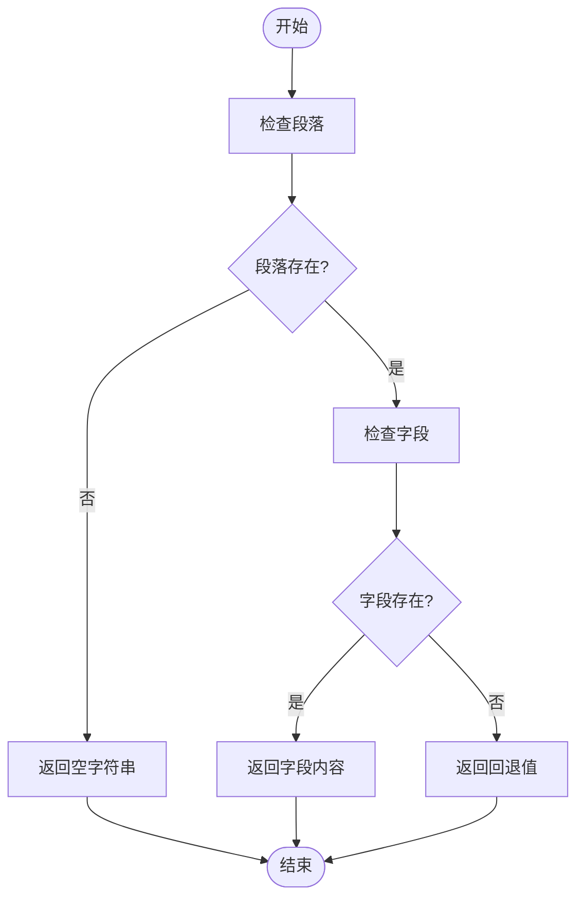
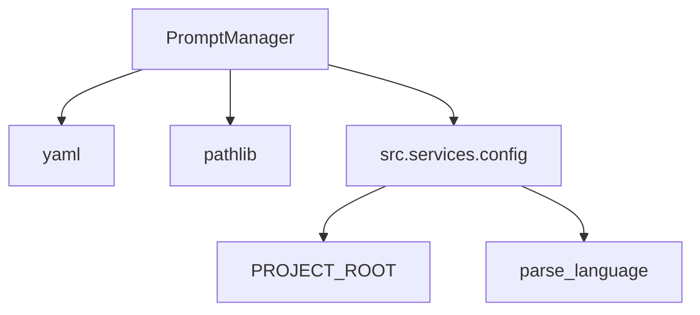

# 提示词管理器

<cite>
**本文档引用的文件**   
- [manager.py](file://src/services/prompt/manager.py)
- [chat_agent.yaml](file://src/agents/chat/prompts/zh/chat_agent.yaml)
- [edit_agent.yaml](file://src/agents/co_writer/prompts/en/edit_agent.yaml)
- [narrator_agent.yaml](file://src/agents/co_writer/prompts/zh/narrator_agent.yaml)
- [research_agent.yaml](file://src/agents/research/prompts/en/research_agent.yaml)
- [manager_agent.yaml](file://src/agents/solve/prompts/en/solve_loop/manager_agent.yaml)
- [interactive_agent.yaml](file://src/agents/guide/prompts/zh/interactive_agent.yaml)
- [validation_workflow.yaml](file://src/agents/question/prompts/en/validation_workflow.yaml)
- [material_organizer.yaml](file://src/agents/ideagen/prompts/en/material_organizer.yaml)
- [main.yaml](file://config/main.yaml)
- [agent_config.py](file://src/api/routers/agent_config.py)
</cite>

## 目录
1. [简介](#简介)
2. [项目结构](#项目结构)
3. [核心组件](#核心组件)
4. [架构概述](#架构概述)
5. [详细组件分析](#详细组件分析)
6. [依赖分析](#依赖分析)
7. [性能考虑](#性能考虑)
8. [故障排除指南](#故障排除指南)
9. [结论](#结论)
10. [附录](#附录)（如有必要）

## 简介
提示词管理器是 DeepTutor 项目的核心组件，负责统一管理所有模块的提示词加载和缓存。它支持多语言、缓存和语言回退机制，确保系统能够高效地加载和使用提示词。提示词管理器采用单例模式，通过全局缓存避免重复加载，提高系统性能。它支持多种模块，包括研究、求解、指导、问题生成、创意生成和协同写作等，每个模块都有相应的提示词文件，支持中英文双语。

## 项目结构
DeepTutor 项目的结构清晰，分为多个模块和子模块，每个模块负责不同的功能。提示词管理器位于 `src/services/prompt` 目录下，负责加载和管理所有模块的提示词。提示词文件分布在各个模块的 `prompts` 目录下，按语言和子目录组织。



**Diagram sources**
- [manager.py](file://src/services/prompt/manager.py)
- [main.yaml](file://config/main.yaml)
- [agent_config.py](file://src/api/routers/agent_config.py)

**Section sources**
- [manager.py](file://src/services/prompt/manager.py)
- [main.yaml](file://config/main.yaml)
- [agent_config.py](file://src/api/routers/agent_config.py)

## 核心组件
提示词管理器的核心组件包括 `PromptManager` 类和 `get_prompt_manager` 函数。`PromptManager` 类实现了单例模式，确保全局只有一个实例。它提供了加载提示词、获取提示词、清除缓存和重新加载提示词的方法。`get_prompt_manager` 函数用于获取全局的 `PromptManager` 实例。

**Section sources**
- [manager.py](file://src/services/prompt/manager.py)

## 架构概述
提示词管理器的架构设计简洁高效，通过单例模式和全局缓存机制，确保提示词的加载和使用高效且一致。它支持多语言和语言回退机制，确保在主语言提示词文件缺失时，能够回退到备用语言。提示词管理器通过 `load_prompts` 方法加载提示词，通过 `get_prompt` 方法获取具体的提示词内容，通过 `clear_cache` 方法清除缓存，通过 `reload_prompts` 方法重新加载提示词。



**Diagram sources**
- [manager.py](file://src/services/prompt/manager.py)

## 详细组件分析
### 提示词管理器分析
提示词管理器通过 `PromptManager` 类实现，该类提供了加载提示词、获取提示词、清除缓存和重新加载提示词的方法。`load_prompts` 方法通过构建缓存键，检查缓存中是否已存在提示词，如果存在则直接返回，否则通过 `_load_with_fallback` 方法加载提示词。`_load_with_fallback` 方法根据语言回退链，依次尝试加载提示词文件，如果找到则返回，否则返回空字典。`get_prompt` 方法用于从加载的提示词字典中获取具体的提示词内容，支持嵌套查找。`clear_cache` 方法用于清除缓存，支持清除特定模块的缓存。`reload_prompts` 方法用于重新加载提示词，先清除缓存中的提示词，再重新加载。

#### 对象导向组件
```mermaid
classDiagram
class PromptManager {
+_instance : PromptManager | None
+_cache : dict[str, dict[str, Any]]
+LANGUAGE_FALLBACKS : dict[str, list[str]]
+MODULES : list[str]
+__new__(cls) PromptManager
+load_prompts(module_name : str, agent_name : str, language : str = "zh", subdirectory : str | None = None) dict[str, Any]
+_build_cache_key(module_name : str, agent_name : str, lang_code : str, subdirectory : str | None) str
+_load_with_fallback(module_name : str, agent_name : str, lang_code : str, subdirectory : str | None) dict[str, Any]
+_resolve_prompt_path(prompts_dir : Path, lang : str, agent_name : str, subdirectory : str | None) Path | None
+get_prompt(prompts : dict[str, Any], section : str, field : str | None = None, fallback : str = "") str
+clear_cache(module_name : str | None = None) None
+reload_prompts(module_name : str, agent_name : str, language : str = "zh", subdirectory : str | None = None) dict[str, Any]
}
PromptManager : +_instance : PromptManager | None
PromptManager : +_cache : dict[str, dict[str, Any]]
PromptManager : +LANGUAGE_FALLBACKS : dict[str, list[str]]
PromptManager : +MODULES : list[str]
PromptManager : +__new__(cls) PromptManager
PromptManager : +load_prompts(module_name : str, agent_name : str, language : str = "zh", subdirectory : str | None = None) dict[str, Any]
PromptManager : +_build_cache_key(module_name : str, agent_name : str, lang_code : str, subdirectory : str | None) str
PromptManager : +_load_with_fallback(module_name : str, agent_name : str, lang_code : str, subdirectory : str | None) dict[str, Any]
PromptManager : +_resolve_prompt_path(prompts_dir : Path, lang : str, agent_name : str, subdirectory : str | None) Path | None
PromptManager : +get_prompt(prompts : dict[str, Any], section : str, field : str | None = None, fallback : str = "") str
PromptManager : +clear_cache(module_name : str | None = None) None
PromptManager : +reload_prompts(module_name : str, agent_name : str, language : str = "zh", subdirectory : str | None = None) dict[str, Any]
```

**Diagram sources**
- [manager.py](file://src/services/prompt/manager.py)

#### API/服务组件
```mermaid
sequenceDiagram
participant Client as "客户端"
participant PromptManager as "提示词管理器"
participant FileSystem as "文件系统"
Client->>PromptManager : load_prompts(module_name, agent_name, language)
PromptManager->>PromptManager : _build_cache_key()
PromptManager->>PromptManager : 检查缓存
alt 缓存命中
PromptManager-->>Client : 返回缓存中的提示词
else 缓存未命中
PromptManager->>PromptManager : _load_with_fallback()
PromptManager->>PromptManager : LANGUAGE_FALLBACKS.get(lang_code)
loop 语言回退链
PromptManager->>PromptManager : _resolve_prompt_path()
PromptManager->>FileSystem : 检查文件是否存在
alt 文件存在
PromptManager->>FileSystem : 读取文件
FileSystem-->>PromptManager : 返回文件内容
PromptManager->>PromptManager : yaml.safe_load()
PromptManager->>PromptManager : 存入缓存
PromptManager-->>Client : 返回提示词
break
end
end
alt 未找到文件
PromptManager-->>Client : 返回空字典
end
end
```

**Diagram sources**
- [manager.py](file://src/services/prompt/manager.py)

#### 复杂逻辑组件


**Diagram sources**
- [manager.py](file://src/services/prompt/manager.py)

**Section sources**
- [manager.py](file://src/services/prompt/manager.py)

### 提示词文件分析
提示词文件分布在各个模块的 `prompts` 目录下，按语言和子目录组织。每个提示词文件是一个 YAML 文件，包含多个提示词段落，每个段落对应一个特定的功能。例如，`chat_agent.yaml` 文件包含系统提示、上下文模板、用户模板和历史格式等段落。`edit_agent.yaml` 文件包含系统提示、动作模板、上下文模板、用户模板和自动标记系统等段落。`narrator_agent.yaml` 文件包含多种叙述风格、生成脚本系统模板、长度指令、生成脚本用户模板和提取关键点系统等段落。

#### 对象导向组件
```mermaid
classDiagram
class chat_agent_yaml {
+system : str
+context_template : str
+user_template : str
+history_format : str
}
class edit_agent_yaml {
+system : str
+action_template : str
+context_template : str
+user_template : str
+auto_mark_system : str
+auto_mark_user_template : str
}
class narrator_agent_yaml {
+style_friendly : str
+style_academic : str
+style_concise : str
+generate_script_system_template : str
+length_instruction_long : str
+length_instruction_short : str
+generate_script_user_long : str
+generate_script_user_short : str
+extract_key_points_system : str
+extract_key_points_user : str
}
chat_agent_yaml : +system : str
chat_agent_yaml : +context_template : str
chat_agent_yaml : +user_template : str
chat_agent_yaml : +history_format : str
edit_agent_yaml : +system : str
edit_agent_yaml : +action_template : str
edit_agent_yaml : +context_template : str
edit_agent_yaml : +user_template : str
edit_agent_yaml : +auto_mark_system : str
edit_agent_yaml : +auto_mark_user_template : str
narrator_agent_yaml : +style_friendly : str
narrator_agent_yaml : +style_academic : str
narrator_agent_yaml : +style_concise : str
narrator_agent_yaml : +generate_script_system_template : str
narrator_agent_yaml : +length_instruction_long : str
narrator_agent_yaml : +length_instruction_short : str
narrator_agent_yaml : +generate_script_user_long : str
narrator_agent_yaml : +generate_script_user_short : str
narrator_agent_yaml : +extract_key_points_system : str
narrator_agent_yaml : +extract_key_points_user : str
```

**Diagram sources**
- [chat_agent.yaml](file://src/agents/chat/prompts/zh/chat_agent.yaml)
- [edit_agent.yaml](file://src/agents/co_writer/prompts/en/edit_agent.yaml)
- [narrator_agent.yaml](file://src/agents/co_writer/prompts/zh/narrator_agent.yaml)

#### API/服务组件


**Diagram sources**
- [chat_agent.yaml](file://src/agents/chat/prompts/zh/chat_agent.yaml)
- [edit_agent.yaml](file://src/agents/co_writer/prompts/en/edit_agent.yaml)
- [narrator_agent.yaml](file://src/agents/co_writer/prompts/zh/narrator_agent.yaml)

#### 复杂逻辑组件


**Diagram sources**
- [chat_agent.yaml](file://src/agents/chat/prompts/zh/chat_agent.yaml)
- [edit_agent.yaml](file://src/agents/co_writer/prompts/en/edit_agent.yaml)
- [narrator_agent.yaml](file://src/agents/co_writer/prompts/zh/narrator_agent.yaml)

**Section sources**
- [chat_agent.yaml](file://src/agents/chat/prompts/zh/chat_agent.yaml)
- [edit_agent.yaml](file://src/agents/co_writer/prompts/en/edit_agent.yaml)
- [narrator_agent.yaml](file://src/agents/co_writer/prompts/zh/narrator_agent.yaml)

## 依赖分析
提示词管理器依赖于 `yaml` 库来解析 YAML 文件，依赖于 `pathlib` 库来处理文件路径，依赖于 `src.services.config` 模块来获取项目根目录和解析语言。`src.services.config` 模块提供了 `PROJECT_ROOT` 和 `parse_language` 函数，`PROJECT_ROOT` 是项目根目录的路径，`parse_language` 函数用于解析语言代码。



**Diagram sources**
- [manager.py](file://src/services/prompt/manager.py)
- [config.py](file://src/services/config.py)

**Section sources**
- [manager.py](file://src/services/prompt/manager.py)
- [config.py](file://src/services/config.py)

## 性能考虑
提示词管理器通过全局缓存机制避免重复加载提示词文件，提高系统性能。`load_prompts` 方法通过构建缓存键，检查缓存中是否已存在提示词，如果存在则直接返回，否则加载提示词并存入缓存。`clear_cache` 方法用于清除缓存，支持清除特定模块的缓存。`reload_prompts` 方法用于重新加载提示词，先清除缓存中的提示词，再重新加载。这些方法确保提示词的加载和使用高效且一致。

## 故障排除指南
如果提示词管理器无法加载提示词文件，可能的原因包括文件路径错误、文件不存在、文件格式错误等。可以通过检查文件路径、文件是否存在、文件格式是否正确来排除故障。如果提示词管理器无法解析 YAML 文件，可能的原因包括 YAML 语法错误、YAML 库版本不兼容等。可以通过检查 YAML 语法、更新 YAML 库版本来排除故障。

**Section sources**
- [manager.py](file://src/services/prompt/manager.py)

## 结论
提示词管理器是 DeepTutor 项目的核心组件，负责统一管理所有模块的提示词加载和缓存。它支持多语言、缓存和语言回退机制，确保系统能够高效地加载和使用提示词。提示词管理器采用单例模式，通过全局缓存避免重复加载，提高系统性能。它支持多种模块，包括研究、求解、指导、问题生成、创意生成和协同写作等，每个模块都有相应的提示词文件，支持中英文双语。通过详细的分析和设计，提示词管理器确保了系统的高效性和一致性。