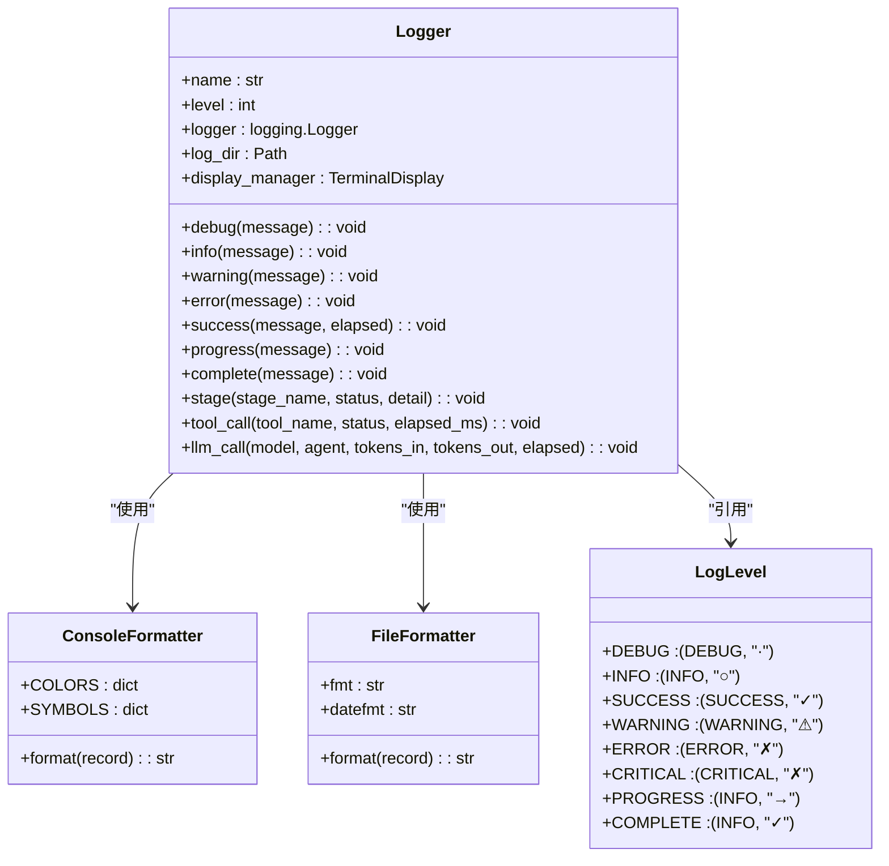
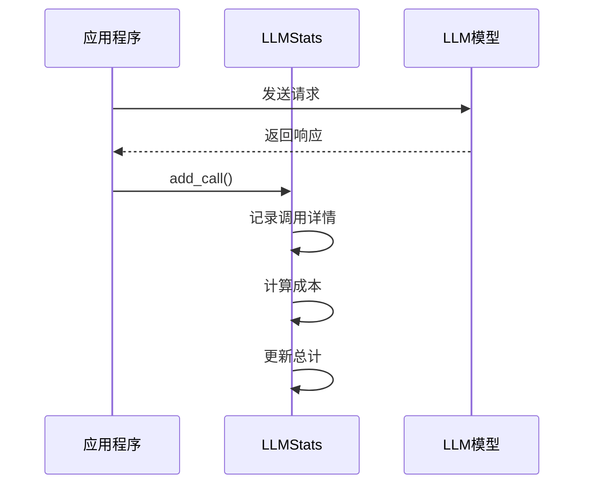
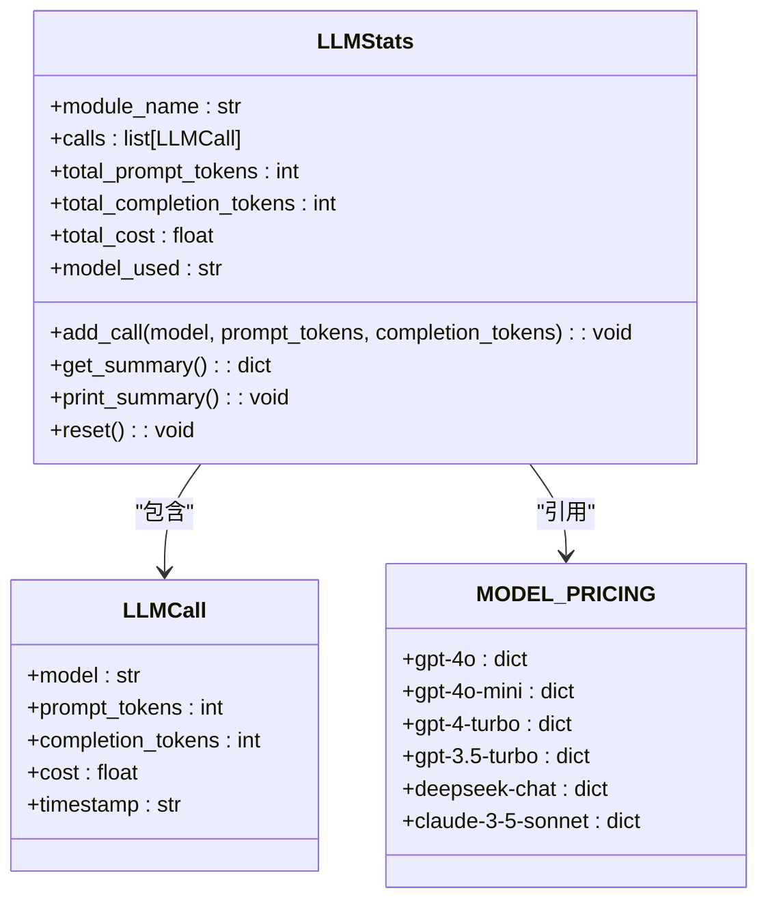
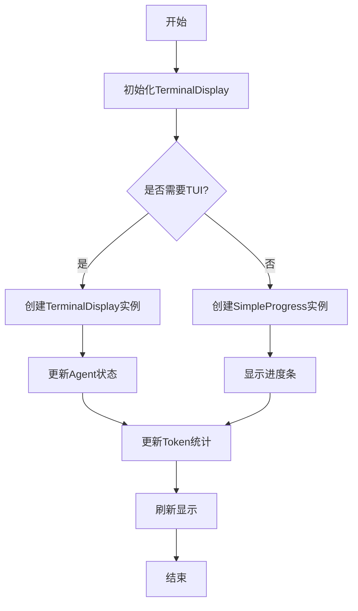
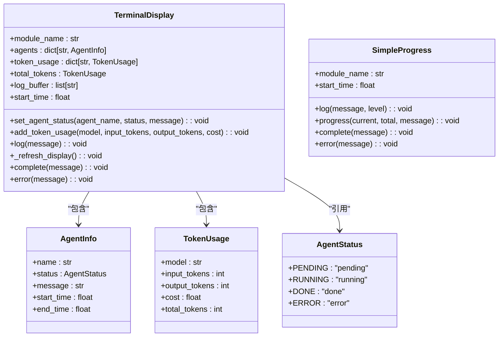
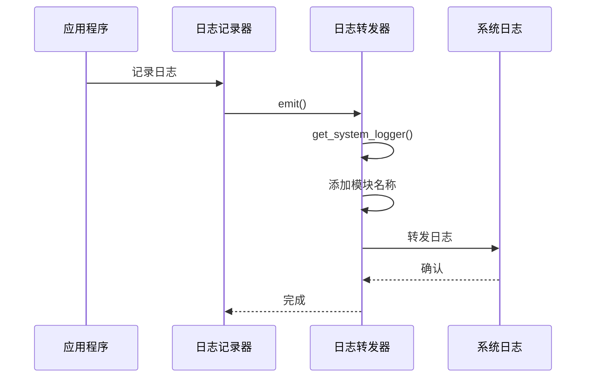
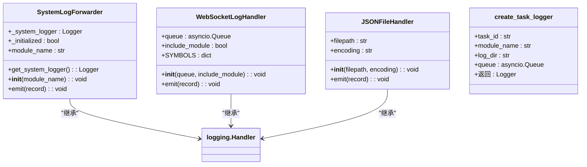
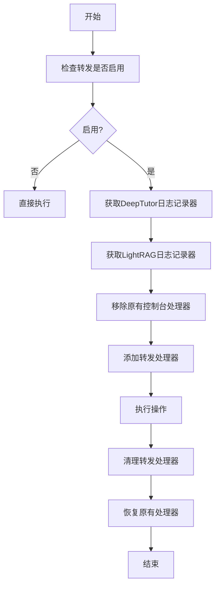
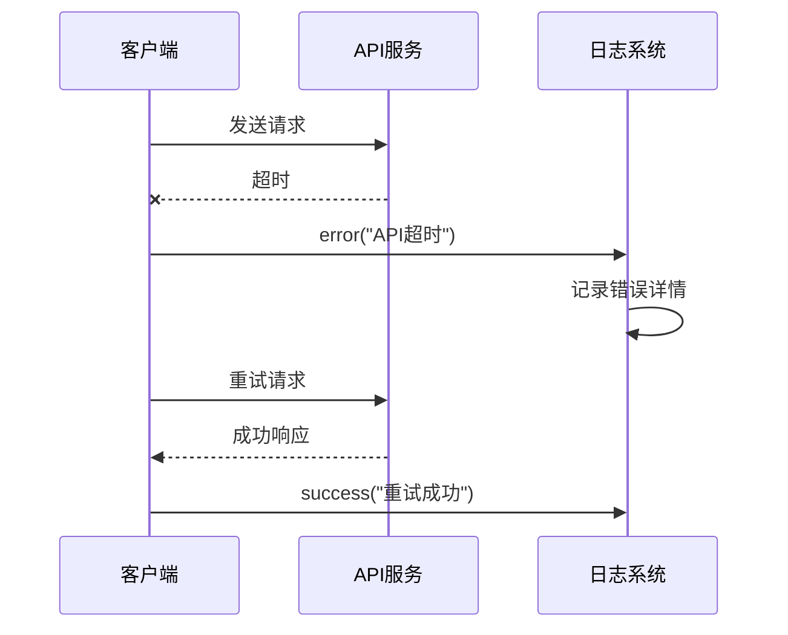
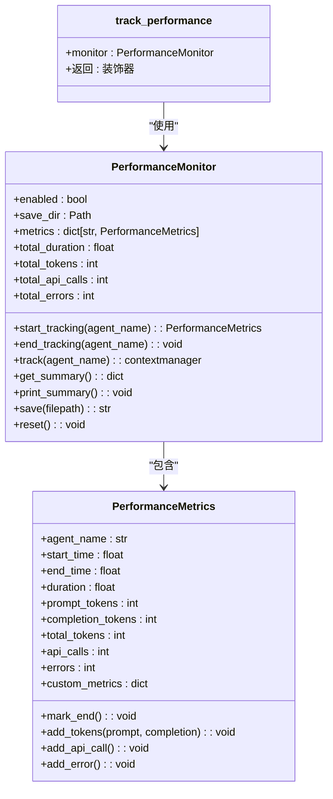

# 日志与监控系统

<cite>
**本文档引用的文件**   
- [logger.py](file://src/core/logging/logger.py)
- [llm_stats.py](file://src/core/logging/llm_stats.py)
- [terminal_display.py](file://src/core/logging/terminal_display.py)
- [log_forwarder.py](file://src/core/logging/log_forwarder.py)
- [handlers.py](file://src/core/logging/handlers.py)
- [lightrag_forward.py](file://src/core/logging/lightrag_forward.py)
- [main.yaml](file://config/main.yaml)
- [performance_monitor.py](file://src/agents/solve/utils/performance_monitor.py)
- [token_tracker.py](file://src/agents/solve/utils/token_tracker.py)
</cite>

## 目录
1. [日志系统概述](#日志系统概述)
2. [多级别日志记录机制](#多级别日志记录机制)
3. [LLM调用统计与性能分析](#llm调用统计与性能分析)
4. [终端实时输出与显示管理](#终端实时输出与显示管理)
5. [日志转发与外部集成](#日志转发与外部集成)
6. [日志采样与敏感信息处理](#日志采样与敏感信息处理)
7. [问题诊断与故障排查](#问题诊断与故障排查)
8. [系统配置与最佳实践](#系统配置与最佳实践)

## 日志系统概述

DeepTutor的日志与监控系统是一个综合性的解决方案，旨在提供全面的运行时洞察、性能分析和故障排查能力。该系统由多个核心组件构成，包括统一的日志记录器、LLM调用统计器、终端显示管理器和日志转发器，共同构成了一个完整的监控生态。

系统设计遵循模块化原则，各组件职责分明：
- **logger.py** 提供统一的日志记录接口，支持多级别日志分类和格式化输出
- **llm_stats.py** 专门用于追踪LLM调用的token消耗、响应延迟和成本
- **terminal_display.py** 负责在终端提供实时的可视化输出，展示工作流进度和状态
- **log_forwarder.py** 实现日志的转发功能，将日志发送到外部监控系统

整个系统通过配置文件`config/main.yaml`进行集中管理，允许用户自定义日志级别、输出路径和其他监控参数。这种设计既保证了系统的灵活性，又确保了不同模块间日志格式的一致性。

**Section sources**
- [logger.py](file://src/core/logging/logger.py#L1-L712)
- [llm_stats.py](file://src/core/logging/llm_stats.py#L1-L177)
- [terminal_display.py](file://src/core/logging/terminal_display.py#L1-L324)
- [log_forwarder.py](file://src/core/logging/log_forwarder.py#L1-L134)
- [main.yaml](file://config/main.yaml#L1-L142)

## 多级别日志记录机制

DeepTutor的`logger.py`实现了一套完善的多级别日志记录机制，通过`LogLevel`枚举类定义了多种日志级别，每个级别都配有独特的符号标识，便于快速识别日志类型。

### 日志级别与分类

系统定义了以下主要日志级别：

| 日志级别 | 符号 | 颜色 | 用途 |
|---------|-----|------|------|
| DEBUG | · | 灰色 | 调试信息，详细的操作细节 |
| INFO | ○ | 白色 | 一般信息，系统正常运行状态 |
| SUCCESS | ✓ | 绿色 | 操作成功完成 |
| WARNING | ⚠ | 黄色 | 警告信息，潜在问题 |
| ERROR | ✗ | 红色 | 错误信息，操作失败 |
| CRITICAL | ✗ | 品红色 | 严重错误，系统可能无法继续运行 |
| PROGRESS | → | 白色 | 进度指示，正在进行的操作 |
| COMPLETE | ✓ | 绿色 | 完成指示，任务结束 |

这些级别通过`ConsoleFormatter`和`FileFormatter`两个格式化器分别处理控制台和文件输出。控制台输出采用简洁的格式`[模块] 符号 消息`，便于快速阅读；文件输出则包含时间戳、日志级别等详细信息，格式为`TIMESTAMP [LEVEL] [Module] Message`。

### 日志输出格式

日志系统支持两种主要的输出格式：

**控制台输出格式：**
```
[Solver]    ✓ Ready in 2.3s
[Research]  → Starting deep research...
[Guide]     ○ Compiling knowledge points
[Knowledge] ✓ Indexed 150 documents
```

**文件输出格式：**
```
2024-01-15 14:30:25 [INFO     ] [Solver      ] Processing...
2024-01-15 14:30:27 [SUCCESS  ] [Solver      ] Ready in 2.3s
2024-01-15 14:30:28 [WARNING  ] [Research    ] Rate limit approaching
```

这种双格式设计既保证了开发人员在终端调试时的可读性，又为后续的日志分析提供了完整的上下文信息。



**Diagram sources**
- [logger.py](file://src/core/logging/logger.py#L24-L35)
- [logger.py](file://src/core/logging/logger.py#L37-L83)
- [logger.py](file://src/core/logging/logger.py#L85-L95)
- [logger.py](file://src/core/logging/logger.py#L104-L594)

**Section sources**
- [logger.py](file://src/core/logging/logger.py#L24-L35)
- [logger.py](file://src/core/logging/logger.py#L37-L95)
- [logger.py](file://src/core/logging/logger.py#L104-L594)

## LLM调用统计与性能分析

`llm_stats.py`是DeepTutor系统中专门用于追踪LLM调用性能和成本的核心组件。它通过精确的统计机制，为用户提供详细的token消耗、API调用次数和成本估算信息。

### LLM调用追踪机制

`LLMStats`类是统计系统的核心，它通过`add_call`方法记录每次LLM调用的详细信息：



`add_call`方法支持多种参数输入方式：
- 直接提供token数量：`prompt_tokens`和`completion_tokens`
- 通过文本内容估算：`system_prompt`、`user_prompt`和`response`
- 自动计算成本：基于预定义的模型定价表

### 成本计算与定价模型

系统内置了详细的模型定价表`MODEL_PRICING`，支持多种主流LLM模型的成本计算：

```python
MODEL_PRICING = {
    "gpt-4o": {"input": 0.0025, "output": 0.010},
    "gpt-4o-mini": {"input": 0.00015, "output": 0.0006},
    "gpt-4-turbo": {"input": 0.01, "output": 0.03},
    "gpt-3.5-turbo": {"input": 0.0005, "output": 0.0015},
    "deepseek-chat": {"input": 0.00014, "output": 0.00028},
    "claude-3-5-sonnet": {"input": 0.003, "output": 0.015},
}
```

成本计算公式为：
```
总成本 = (输入token数 / 1000) × 输入单价 + (输出token数 / 1000) × 输出单价
```

### 统计摘要输出

`print_summary`方法生成详细的统计摘要，以清晰的格式展示关键指标：

```
============================================================
📊 [Module] LLM Usage Summary
============================================================
  Model       : gpt-4o-mini
  API Calls   : 15
  Tokens      : 12,345 (Input: 8,000, Output: 4,345)
  Cost        : $0.002345 USD
============================================================
```

这种摘要信息对于性能分析和成本控制至关重要，帮助用户了解系统的资源消耗情况，优化LLM调用策略。



**Diagram sources**
- [llm_stats.py](file://src/core/logging/llm_stats.py#L54-L63)
- [llm_stats.py](file://src/core/logging/llm_stats.py#L65-L177)
- [llm_stats.py](file://src/core/logging/llm_stats.py#L29-L37)

**Section sources**
- [llm_stats.py](file://src/core/logging/llm_stats.py#L29-L37)
- [llm_stats.py](file://src/core/logging/llm_stats.py#L65-L177)

## 终端实时输出与显示管理

`terminal_display.py`是DeepTutor系统中负责终端实时输出的核心组件，它提供了一个统一的终端显示管理界面，用于可视化工作流进度、Agent状态和Token消耗等关键信息。

### 终端显示管理器

`TerminalDisplay`类是主要的显示管理器，它通过ANSI转义序列实现丰富的终端输出效果。该类在初始化时接受以下参数：
- `module_name`: 模块名称，显示在标题栏
- `agents`: Agent名称列表，用于状态跟踪
- `show_tokens`: 是否显示token统计
- `show_time`: 是否显示时间信息

显示界面采用边框包围的布局，包含四个主要区域：
1. **标题区域**：显示模块名称和运行时间
2. **Agent状态区域**：显示各Agent的执行状态
3. **Token统计区域**：显示模型token消耗和成本
4. **日志区域**：显示最近的执行日志

### 状态符号与颜色编码

系统使用统一的状态符号和颜色编码来表示不同状态：

| 状态 | 符号 | 颜色 | ANSI代码 |
|------|------|------|---------|
| PENDING | ○ | 灰色 | \033[90m |
| RUNNING | ● | 黄色 | \033[33m |
| DONE | ✓ | 绿色 | \033[32m |
| ERROR | ✗ | 红色 | \033[31m |

这种视觉编码使得用户能够快速识别系统的当前状态，无需阅读详细文本。

### 简单进度显示

对于不需要完整TUI界面的场景，系统提供了`SimpleProgress`类，它提供基本的进度条和日志输出功能：



`SimpleProgress`类的`progress`方法实现了动态进度条，通过`\r`回车符实现原地更新，避免了屏幕滚动。



**Diagram sources**
- [terminal_display.py](file://src/core/logging/terminal_display.py#L13-L18)
- [terminal_display.py](file://src/core/logging/terminal_display.py#L20-L32)
- [terminal_display.py](file://src/core/logging/terminal_display.py#L34-L43)
- [terminal_display.py](file://src/core/logging/terminal_display.py#L45-L259)
- [terminal_display.py](file://src/core/logging/terminal_display.py#L261-L304)

**Section sources**
- [terminal_display.py](file://src/core/logging/terminal_display.py#L13-L43)
- [terminal_display.py](file://src/core/logging/terminal_display.py#L45-L304)

## 日志转发与外部集成

`log_forwarder.py`是DeepTutor系统中负责日志转发的核心组件，它实现了将内部日志转发到外部系统的能力，支持ELK、Prometheus等监控平台的集成。

### 系统日志转发器

`SystemLogForwarder`类是主要的日志转发器，它继承自`logging.Handler`，能够拦截日志记录并将其转发到统一的系统日志文件。该类采用单例模式，确保全局只有一个系统日志记录器实例。

转发器的工作流程如下：
1. 获取或创建系统日志记录器
2. 为日志记录添加模块名称
3. 将日志转发到系统日志文件
4. 处理转发过程中的异常



### 统一日志格式

系统日志采用统一的格式，便于后续的解析和分析：
```
%(asctime)s | [%(module_name)s] | %(levelname)-8s | %(message)s
```

这种格式包含时间戳、模块名称、日志级别和消息内容，使用竖线`|`分隔，提高了可读性。日志文件按日期滚动，每天生成一个新的日志文件，文件名为`ai_tutor_system_YYYYMMDD.log`。

### WebSocket日志处理

`handlers.py`中的`WebSocketLogHandler`类实现了将日志流式传输到WebSocket的功能，支持实时前端显示：



`create_task_logger`函数可以创建任务专用的日志记录器，支持文件输出和WebSocket流式传输，适用于需要独立日志跟踪的场景。

**Diagram sources**
- [log_forwarder.py](file://src/core/logging/log_forwarder.py#L11-L134)
- [handlers.py](file://src/core/logging/handlers.py#L14-L219)

**Section sources**
- [log_forwarder.py](file://src/core/logging/log_forwarder.py#L11-L134)
- [handlers.py](file://src/core/logging/handlers.py#L14-L219)

## 日志采样与敏感信息处理

DeepTutor系统在日志记录过程中实施了严格的采样策略和敏感信息处理机制，确保日志既具有足够的诊断价值，又不会泄露敏感数据。

### 日志采样策略

系统通过配置文件`config/main.yaml`中的`logging`部分控制日志采样：

```yaml
logging:
  level: DEBUG
  save_to_file: true
  console_output: true
  lightrag_forwarding:
    enabled: true
    min_level: DEBUG
    add_prefix: true
    logger_names:
      knowledge_init: LightRAG-Init
      rag_tool: LightRAG
```

关键配置项包括：
- `level`: 全局日志级别，控制哪些日志会被记录
- `save_to_file`: 是否保存到文件
- `console_output`: 是否输出到控制台
- `lightrag_forwarding`: LightRAG日志转发配置

### 敏感信息脱敏

系统在记录LLM输入输出时，对敏感信息进行了特殊处理：
- **输入截断**：`log_llm_input`和`log_llm_output`方法只记录前500个字符
- **内容摘要**：`log_llm_call`方法在INFO级别只显示摘要信息，在DEBUG级别才显示完整内容
- **符号化输出**：使用`◇`符号表示LLM调用，避免直接暴露模型交互细节

### LightRAG日志转发

`lightrag_forward.py`实现了专门的LightRAG日志转发功能，通过上下文管理器`LightRAGLogContext`自动设置和清理日志转发：



这种设计确保了LightRAG的日志能够被统一管理，同时避免了日志重复输出。

**Section sources**
- [main.yaml](file://config/main.yaml#L30-L38)
- [logger.py](file://src/core/logging/logger.py#L461-L479)
- [lightrag_forward.py](file://src/core/logging/lightrag_forward.py#L85-L183)

## 问题诊断与故障排查

DeepTutor的日志系统为问题诊断和故障排查提供了强大的支持，通过详细的日志记录和统计信息，能够快速定位和解决各种运行时问题。

### 智能体死循环诊断

当系统出现智能体死循环时，可以通过以下日志特征进行诊断：
- **频繁的阶段日志**：`stage`方法会记录智能体的执行阶段，死循环表现为同一阶段的重复记录
- **持续的进度日志**：`progress`方法会显示持续的进度更新，但长时间没有完成
- **异常的token消耗**：`llm_stats`会显示异常高的token消耗，远超正常范围

诊断步骤：
1. 检查`ai_tutor_system_YYYYMMDD.log`中的阶段日志
2. 分析LLM调用统计，查看token消耗趋势
3. 使用`get_logger`获取特定模块的日志记录器，增加调试信息

### API超时处理

API超时问题可以通过以下方式诊断和处理：
- **错误日志**：`error`方法会记录API调用失败的详细信息
- **响应延迟**：`llm_call`方法的`elapsed`参数显示响应时间
- **重试机制**：系统会自动记录重试次数和结果



### 性能监控工具

`performance_monitor.py`提供了高级的性能监控功能，能够记录智能体的执行时间、token消耗和错误次数：



该工具支持上下文管理器和装饰器两种使用方式，能够自动记录智能体的执行性能。

**Diagram sources**
- [performance_monitor.py](file://src/agents/solve/utils/performance_monitor.py#L18-L85)
- [performance_monitor.py](file://src/agents/solve/utils/performance_monitor.py#L88-L286)
- [performance_monitor.py](file://src/agents/solve/utils/performance_monitor.py#L289-L324)

**Section sources**
- [performance_monitor.py](file://src/agents/solve/utils/performance_monitor.py#L18-L324)

## 系统配置与最佳实践

为了充分发挥DeepTutor日志与监控系统的潜力，需要正确配置系统参数并遵循最佳实践。

### 配置文件详解

`config/main.yaml`中的`logging`部分是日志系统的核心配置：

```yaml
logging:
  level: DEBUG
  save_to_file: true
  console_output: true
  lightrag_forwarding:
    enabled: true
    min_level: DEBUG
    add_prefix: true
    logger_names:
      knowledge_init: LightRAG-Init
      rag_tool: LightRAG
```

**配置项说明：**
- `level`: 设置全局日志级别，DEBUG级别会记录最详细的信息
- `save_to_file`: 控制是否将日志保存到文件
- `console_output`: 控制是否在控制台输出日志
- `lightrag_forwarding`: 配置LightRAG日志转发

### 最佳实践建议

1. **开发环境**：使用DEBUG级别，全面记录系统行为
2. **生产环境**：使用INFO或WARNING级别，减少日志量
3. **性能分析**：启用`llm_stats`和`performance_monitor`，定期检查资源消耗
4. **安全考虑**：定期清理日志文件，避免敏感信息长期存储
5. **监控集成**：配置日志转发，将关键日志发送到外部监控系统

### 日志轮转策略

系统采用基于大小的日志轮转策略，每个日志文件最大10MB，保留5个备份文件。这种策略既能防止单个日志文件过大，又能保留足够的历史记录用于问题排查。

**Section sources**
- [main.yaml](file://config/main.yaml#L30-L38)
- [log_forwarder.py](file://src/core/logging/log_forwarder.py#L64-L69)
- [handlers.py](file://src/core/logging/handlers.py#L64-L68)