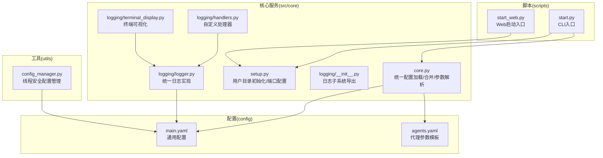
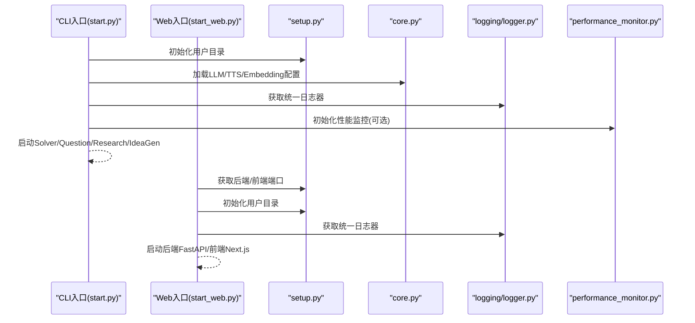
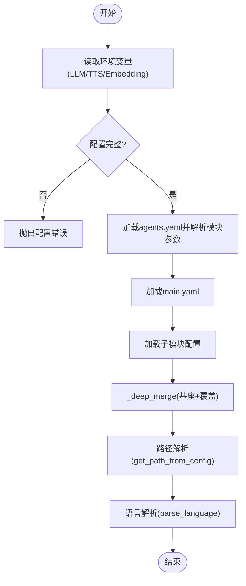
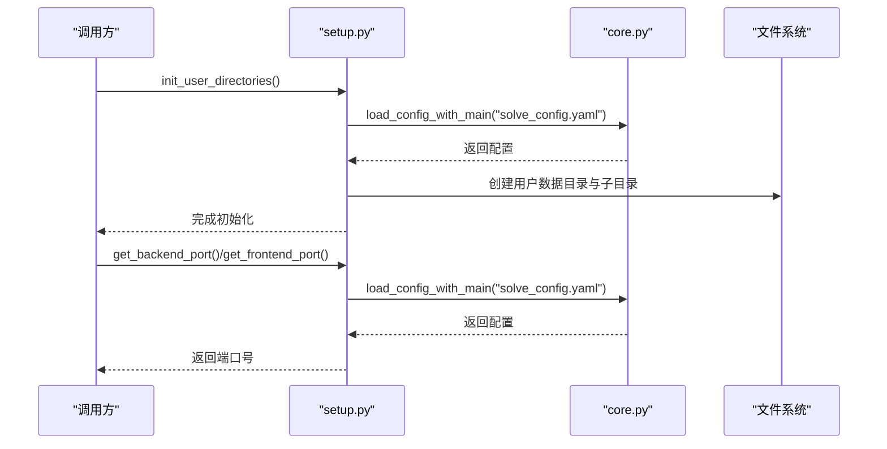
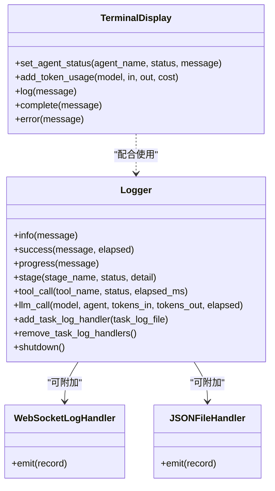
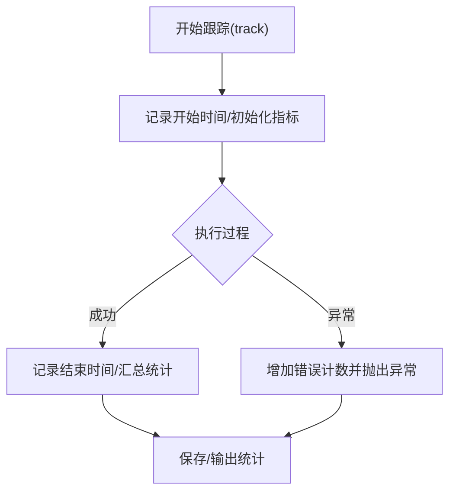
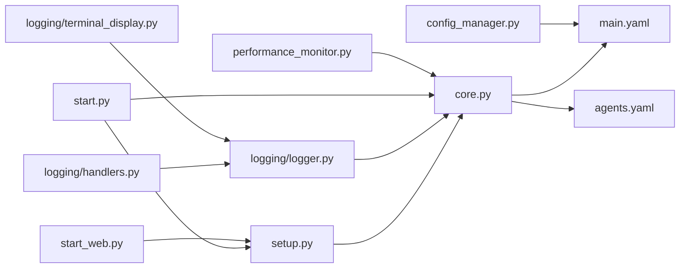

# 核心服务模块

<cite>
**本文引用的文件**
- [src/core/core.py](file://src/core/core.py)
- [src/core/setup.py](file://src/core/setup.py)
- [src/utils/config_manager.py](file://src/utils/config_manager.py)
- [src/core/logging/logger.py](file://src/core/logging/logger.py)
- [src/core/logging/__init__.py](file://src/core/logging/__init__.py)
- [src/core/logging/handlers.py](file://src/core/logging/handlers.py)
- [src/core/logging/terminal_display.py](file://src/core/logging/terminal_display.py)
- [config/main.yaml](file://config/main.yaml)
- [config/agents.yaml](file://config/agents.yaml)
- [scripts/start.py](file://scripts/start.py)
- [scripts/start_web.py](file://scripts/start_web.py)
- [src/agents/solve/utils/performance_monitor.py](file://src/agents/solve/utils/performance_monitor.py)
</cite>

## 目录
1. [引言](#引言)
2. [项目结构](#项目结构)
3. [核心组件](#核心组件)
4. [架构总览](#架构总览)
5. [详细组件分析](#详细组件分析)
6. [依赖分析](#依赖分析)
7. [性能考虑](#性能考虑)
8. [故障排查指南](#故障排查指南)
9. [结论](#结论)
10. [附录](#附录)

## 引言
本文件聚焦DeepTutor核心服务模块，围绕以下目标展开：
- 深入解析core.py中多智能体系统的初始化、协调与调度机制，说明LLM配置加载、模型参数管理及运行时环境设置。
- 阐述config_manager.py在配置解析与验证中的作用，以及核心模块如何与日志系统（logger.py）集成实现结构化日志输出。
- 解释setup.py中的组件装配流程，包括用户目录初始化、端口配置、工具注册、智能体依赖注入和事件监听器注册。
- 提供核心服务启动时序图，说明各组件协作关系，并涵盖性能监控、资源管理和异常传播机制。

## 项目结构
核心服务模块位于src/core目录，包含统一的配置加载与合并、用户目录初始化与端口管理、日志系统与终端显示等能力；同时通过scripts脚本完成启动装配与服务编排。

图表来源
- [src/core/core.py](file://src/core/core.py#L1-L357)
- [src/core/setup.py](file://src/core/setup.py#L1-L346)
- [src/core/logging/__init__.py](file://src/core/logging/__init__.py#L1-L48)
- [src/core/logging/logger.py](file://src/core/logging/logger.py#L1-L712)
- [src/core/logging/handlers.py](file://src/core/logging/handlers.py#L1-L219)
- [src/core/logging/terminal_display.py](file://src/core/logging/terminal_display.py#L1-L324)
- [config/main.yaml](file://config/main.yaml#L1-L142)
- [config/agents.yaml](file://config/agents.yaml#L1-L55)
- [scripts/start.py](file://scripts/start.py#L1-L808)
- [scripts/start_web.py](file://scripts/start_web.py#L1-L374)
- [src/utils/config_manager.py](file://src/utils/config_manager.py#L1-L138)

章节来源
- [src/core/core.py](file://src/core/core.py#L1-L357)
- [src/core/setup.py](file://src/core/setup.py#L1-L346)
- [src/core/logging/logger.py](file://src/core/logging/logger.py#L1-L712)
- [src/core/logging/handlers.py](file://src/core/logging/handlers.py#L1-L219)
- [src/core/logging/terminal_display.py](file://src/core/logging/terminal_display.py#L1-L324)
- [config/main.yaml](file://config/main.yaml#L1-L142)
- [config/agents.yaml](file://config/agents.yaml#L1-L55)
- [scripts/start.py](file://scripts/start.py#L1-L808)
- [scripts/start_web.py](file://scripts/start_web.py#L1-L374)
- [src/utils/config_manager.py](file://src/utils/config_manager.py#L1-L138)

## 核心组件
- 统一配置加载与合并：从环境变量与YAML读取配置，支持main.yaml与子模块配置的深度合并，提供路径解析与语言标准化。
- 用户目录初始化与端口管理：按配置创建用户数据目录、必要子目录与默认文件，读取后端/前端端口并进行校验。
- 日志系统：统一格式、控制台彩色输出、文件落盘、WebSocket流式输出、阶段/工具/LLM调用专用日志方法。
- 终端可视化：统一的TUI进度面板，展示Agent状态、Token消耗与最近日志。
- 性能监控：记录执行时长、Token用量、API调用次数与错误数，支持上下文管理与装饰器追踪。
- 配置管理器：线程安全地缓存与持久化main.yaml，支持增量更新与环境变量信息读取。

章节来源
- [src/core/core.py](file://src/core/core.py#L1-L357)
- [src/core/setup.py](file://src/core/setup.py#L1-L346)
- [src/core/logging/logger.py](file://src/core/logging/logger.py#L1-L712)
- [src/core/logging/terminal_display.py](file://src/core/logging/terminal_display.py#L1-L324)
- [src/agents/solve/utils/performance_monitor.py](file://src/agents/solve/utils/performance_monitor.py#L1-L382)
- [src/utils/config_manager.py](file://src/utils/config_manager.py#L1-L138)

## 架构总览
核心服务模块通过“配置—初始化—日志—监控”的主干流程，为多智能体系统提供统一的运行时环境与可观测性支撑。CLI与Web两种启动方式均依赖上述能力完成装配。

图表来源
- [scripts/start.py](file://scripts/start.py#L1-L808)
- [scripts/start_web.py](file://scripts/start_web.py#L1-L374)
- [src/core/setup.py](file://src/core/setup.py#L1-L346)
- [src/core/core.py](file://src/core/core.py#L1-L357)
- [src/core/logging/logger.py](file://src/core/logging/logger.py#L1-L712)
- [src/agents/solve/utils/performance_monitor.py](file://src/agents/solve/utils/performance_monitor.py#L1-L382)

## 详细组件分析

### 统一配置加载与参数解析（core.py）
- 环境变量配置
  - LLM/TTS/Embedding配置从环境变量读取，包含绑定提供商、模型名、API密钥、基础URL等字段，并进行严格校验与默认值处理。
  - 提供温度与最大token参数的统一入口，从agents.yaml读取模块级默认值，作为所有Agent的单一真实来源。
- YAML配置加载
  - 支持以main.yaml为基座，合并子模块配置文件，采用递归深度合并策略，确保覆盖优先级清晰。
  - 路径解析函数支持从paths/system/tools等键空间查找路径，默认回退到其他键位，兼容历史配置。
  - 语言解析函数统一多种输入形式，返回标准语言代码。
- 运行时环境设置
  - 通过加载DeepTutor.env与.env，确保环境变量优先级与可用性。
  - 与日志系统集成：日志目录可通过配置解析函数获取，避免硬编码。

图表来源
- [src/core/core.py](file://src/core/core.py#L1-L357)
- [config/agents.yaml](file://config/agents.yaml#L1-L55)
- [config/main.yaml](file://config/main.yaml#L1-L142)

章节来源
- [src/core/core.py](file://src/core/core.py#L1-L357)
- [config/agents.yaml](file://config/agents.yaml#L1-L55)
- [config/main.yaml](file://config/main.yaml#L1-L142)

### 用户目录初始化与端口管理（setup.py）
- 用户目录初始化
  - 依据配置获取用户数据根目录，若不存在或为空则创建所需子目录与默认文件（如user_history.json、settings.json），并打印结构化日志。
  - 对特定模块（如co-writer、research）创建额外子目录，保证运行时写入需求。
- 端口配置管理
  - 从配置读取后端/前端端口，未配置时打印教程并退出；提供统一获取接口与双端口返回。
  - Web启动脚本在启动前后读取端口，用于健康检查与服务展示。

图表来源
- [src/core/setup.py](file://src/core/setup.py#L1-L346)
- [src/core/core.py](file://src/core/core.py#L1-L357)

章节来源
- [src/core/setup.py](file://src/core/setup.py#L1-L346)
- [src/core/core.py](file://src/core/core.py#L1-L357)

### 日志系统集成（logging/logger.py 与 handlers.py）
- Logger类
  - 统一日志格式与符号，支持控制台彩色输出与文件落盘；提供阶段、工具、LLM调用等专用日志方法。
  - 支持任务级日志处理器添加与移除，便于多任务隔离输出。
  - 通过全局注册表按名称复用日志器，避免重复创建。
- 自定义处理器
  - WebSocketLogHandler：将日志条目结构化后推送到异步队列，供前端实时展示。
  - JSONFileHandler：以JSONL格式写入结构化日志，便于后续分析。
- 终端可视化
  - TerminalDisplay：提供Agent状态、Token统计与最近日志的TUI面板，支持刷新与完成/错误标记。
  - SimpleProgress：轻量进度条输出，适合非TUI场景。

图表来源
- [src/core/logging/logger.py](file://src/core/logging/logger.py#L1-L712)
- [src/core/logging/handlers.py](file://src/core/logging/handlers.py#L1-L219)
- [src/core/logging/terminal_display.py](file://src/core/logging/terminal_display.py#L1-L324)

章节来源
- [src/core/logging/logger.py](file://src/core/logging/logger.py#L1-L712)
- [src/core/logging/handlers.py](file://src/core/logging/handlers.py#L1-L219)
- [src/core/logging/terminal_display.py](file://src/core/logging/terminal_display.py#L1-L324)

### 性能监控与资源管理（performance_monitor.py）
- 记录指标
  - 执行时长、Prompt/Completion/Total Token、API调用次数、错误次数与自定义指标。
- 使用方式
  - 上下文管理器自动开始/结束跟踪，异常时自动计数错误并重新抛出。
  - 装饰器模式为异步Agent方法提供自动追踪。
  - 全局单例监控器，支持从配置初始化保存目录。
- 与日志联动
  - 可结合日志系统输出摘要或详细统计，便于问题定位与成本估算。

图表来源
- [src/agents/solve/utils/performance_monitor.py](file://src/agents/solve/utils/performance_monitor.py#L1-L382)

章节来源
- [src/agents/solve/utils/performance_monitor.py](file://src/agents/solve/utils/performance_monitor.py#L1-L382)

### 配置管理器（config_manager.py）
- 功能要点
  - 单例模式与线程锁，确保并发安全。
  - 基于文件修改时间的缓存策略，减少频繁IO。
  - 递归更新策略保存配置，避免部分更新破坏其他段落。
  - 读取环境变量信息（如模型名），便于诊断与展示。
- 与核心模块的关系
  - 与core.py的配置加载互补：core.py负责运行期配置解析与合并，config_manager.py负责main.yaml的持久化与缓存。

章节来源
- [src/utils/config_manager.py](file://src/utils/config_manager.py#L1-L138)

## 依赖分析
- 组件耦合
  - core.py与setup.py在启动阶段紧密耦合：前者提供配置解析，后者负责目录与端口准备。
  - logging子系统被广泛依赖，贯穿CLI与Web启动流程，形成统一的可观测性基础设施。
  - performance_monitor.py与各Agent模块解耦，通过上下文/装饰器接入，降低侵入性。
- 外部依赖
  - YAML解析、dotenv加载、Python标准库logging、asyncio队列等。
- 潜在循环依赖
  - 当前模块间通过显式导入与延迟加载避免循环，保持清晰边界。

图表来源
- [src/core/core.py](file://src/core/core.py#L1-L357)
- [src/core/setup.py](file://src/core/setup.py#L1-L346)
- [src/core/logging/logger.py](file://src/core/logging/logger.py#L1-L712)
- [src/core/logging/handlers.py](file://src/core/logging/handlers.py#L1-L219)
- [src/core/logging/terminal_display.py](file://src/core/logging/terminal_display.py#L1-L324)
- [src/utils/config_manager.py](file://src/utils/config_manager.py#L1-L138)
- [config/main.yaml](file://config/main.yaml#L1-L142)
- [config/agents.yaml](file://config/agents.yaml#L1-L55)
- [scripts/start.py](file://scripts/start.py#L1-L808)
- [scripts/start_web.py](file://scripts/start_web.py#L1-L374)
- [src/agents/solve/utils/performance_monitor.py](file://src/agents/solve/utils/performance_monitor.py#L1-L382)

章节来源
- [src/core/core.py](file://src/core/core.py#L1-L357)
- [src/core/setup.py](file://src/core/setup.py#L1-L346)
- [src/core/logging/logger.py](file://src/core/logging/logger.py#L1-L712)
- [src/core/logging/handlers.py](file://src/core/logging/handlers.py#L1-L219)
- [src/core/logging/terminal_display.py](file://src/core/logging/terminal_display.py#L1-L324)
- [src/utils/config_manager.py](file://src/utils/config_manager.py#L1-L138)
- [config/main.yaml](file://config/main.yaml#L1-L142)
- [config/agents.yaml](file://config/agents.yaml#L1-L55)
- [scripts/start.py](file://scripts/start.py#L1-L808)
- [scripts/start_web.py](file://scripts/start_web.py#L1-L374)
- [src/agents/solve/utils/performance_monitor.py](file://src/agents/solve/utils/performance_monitor.py#L1-L382)

## 性能考虑
- 配置加载
  - 使用文件mtime缓存与递归合并，减少重复解析与IO开销。
  - 环境变量与YAML分离，避免不必要的YAML读取。
- 日志输出
  - 控制台彩色输出与文件落盘分离，避免阻塞；WebSocket流式输出采用非阻塞队列入队。
- 监控开销
  - 上下文管理器与装饰器追踪在关键路径上最小化额外开销；错误计数与统计在finally中完成，保证准确性。
- 资源管理
  - 终端显示面板定期刷新，注意在高并发场景下的屏幕清屏开销；建议在CI/后台任务中关闭TUI。

## 故障排查指南
- 配置缺失
  - LLM/TTS/Embedding配置缺失会直接抛错，需检查对应环境变量是否正确设置。
  - 端口未配置会导致启动失败并打印配置教程，按提示在main.yaml中添加server段。
- 目录权限
  - 用户数据目录创建失败或不可写时，初始化会降级为警告并继续，建议手动检查权限。
- 日志无法输出
  - 检查日志目录配置与文件权限；确认WebSocket队列未满导致丢弃日志。
- 性能异常
  - 使用性能监控输出的摘要核对Token用量与API调用次数，定位热点环节；结合日志中的LLM调用详情进行分析。

章节来源
- [src/core/core.py](file://src/core/core.py#L1-L357)
- [src/core/setup.py](file://src/core/setup.py#L1-L346)
- [src/core/logging/logger.py](file://src/core/logging/logger.py#L1-L712)
- [src/agents/solve/utils/performance_monitor.py](file://src/agents/solve/utils/performance_monitor.py#L1-L382)

## 结论
核心服务模块通过统一的配置加载、严格的环境变量校验、完善的日志与监控体系，为DeepTutor多智能体系统提供了稳定可靠的运行时基础。CLI与Web两种启动方式均遵循相同的装配流程，确保一致的用户体验与可观测性。建议在生产环境中：
- 明确配置来源与优先级，避免混用不同配置源。
- 启用性能监控与日志聚合，建立告警与审计机制。
- 在高并发场景下优化日志输出与TUI刷新频率，平衡可观测性与性能。

## 附录
- 关键API与职责
  - core.py：环境变量读取、YAML合并、路径解析、语言解析。
  - setup.py：用户目录初始化、端口配置读取与校验。
  - logging/logger.py：统一日志格式、阶段/工具/LLM日志方法、任务日志处理器。
  - logging/handlers.py：WebSocket与JSON文件处理器。
  - logging/terminal_display.py：TUI面板与简单进度条。
  - config_manager.py：main.yaml的线程安全读写与缓存。
  - performance_monitor.py：Agent执行时长、Token用量、API调用与错误统计。