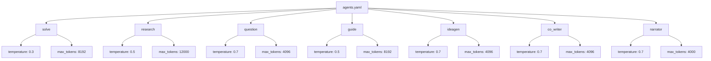
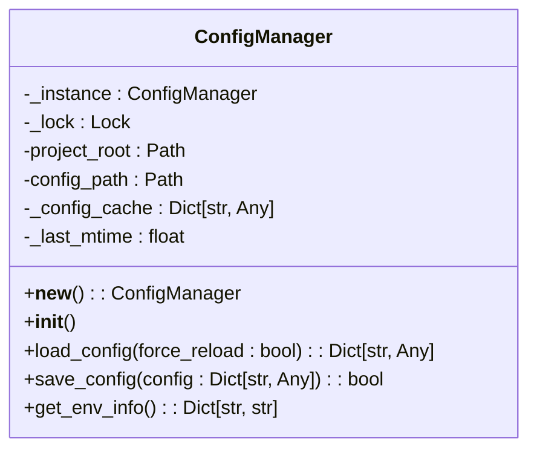
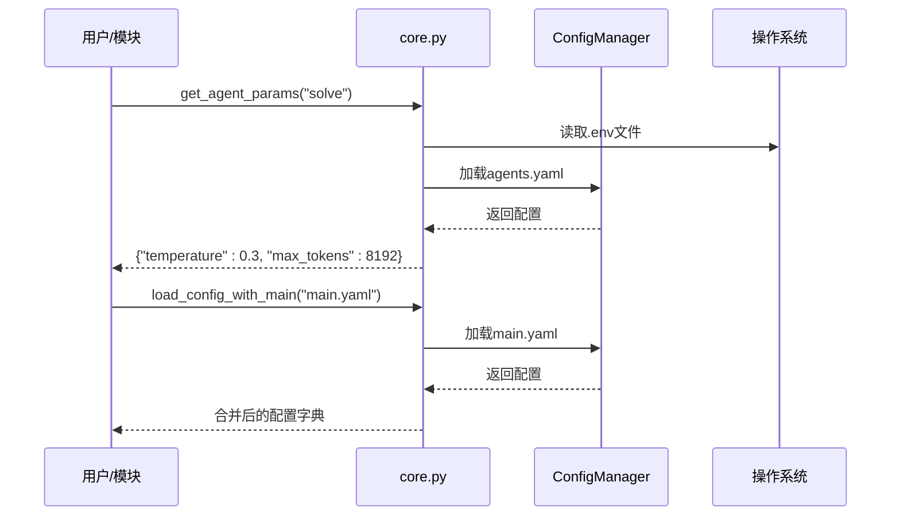
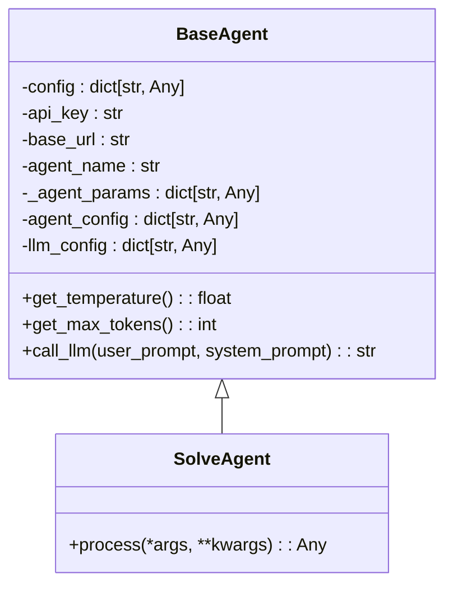

# 配置管理机制

<cite>
**本文档引用的文件**   
- [main.yaml](file://config/main.yaml)
- [agents.yaml](file://config/agents.yaml)
- [config_manager.py](file://src/utils/config_manager.py)
- [core.py](file://src/core/core.py)
- [base_agent.py](file://src/agents/solve/base_agent.py)
- [setup.py](file://src/core/setup.py)
</cite>

## 目录
1. [简介](#简介)
2. [配置文件结构](#配置文件结构)
3. [配置加载与管理](#配置加载与管理)
4. [配置应用与模块集成](#配置应用与模块集成)
5. [配置示例与最佳实践](#配置示例与最佳实践)
6. [常见问题排查](#常见问题排查)
7. [扩展自定义配置](#扩展自定义配置)
8. [结论](#结论)

## 简介
DeepTutor系统采用分层配置管理机制，通过YAML配置文件和环境变量相结合的方式，实现灵活、可扩展的系统配置。本系统主要依赖两个核心配置文件：`main.yaml` 和 `agents.yaml`，分别管理系统的通用设置和智能体的LLM参数。配置管理由`config_manager.py`和`core.py`中的工具函数实现，支持动态重载、默认值回退和环境变量覆盖等高级功能。这种设计确保了配置的集中化管理，同时保持了系统的灵活性和可维护性。

**Section sources**
- [main.yaml](file://config/main.yaml)
- [agents.yaml](file://config/agents.yaml)
- [config_manager.py](file://src/utils/config_manager.py)

## 配置文件结构

### main.yaml 结构设计
`main.yaml`是系统的主配置文件，包含所有模块共享的通用设置。其结构设计遵循模块化原则，将不同功能的配置分组管理。

```mermaid
flowchart TD
A[main.yaml] --> B[server]
A --> C[system]
A --> D[paths]
A --> E[tools]
A --> F[logging]
A --> G[tts]
A --> H[question]
A --> I[research]
A --> J[solve]
B --> B1[backend_port]
B --> B2[frontend_port]
C --> C1[language]
D --> D1[user_data_dir]
D --> D2[knowledge_bases_dir]
D --> D3[user_log_dir]
D --> D4[performance_log_dir]
D --> D5[guide_output_dir]
D --> D6[question_output_dir]
D --> D7[research_output_dir]
D --> D8[research_reports_dir]
D --> D9[solve_output_dir]
E --> E1[rag_tool]
E --> E2[run_code]
E --> E3[web_search]
E --> E4[query_item]
F --> F1[level]
F --> F2[save_to_file]
F --> F3[console_output]
F --> F4[lightrag_forwarding]
G --> G1[default_voice]
H --> H1[max_rounds]
H --> H2[rag_query_count]
H --> H3[max_parallel_questions]
H --> H4[rag_mode]
H --> H5[agents]
I --> I1[planning]
I --> I2[researching]
I --> I3[reporting]
I --> I4[rag]
I --> I5[queue]
I --> I6[presets]
J --> J1[max_solve_correction_iterations]
J --> J2[enable_citations]
J --> J3[save_intermediate_results]
J --> J4[agents]
```



**Diagram sources**
- [main.yaml](file://config/main.yaml)

#### 核心字段与系统行为影响
- **server**: 定义后端API服务器和前端开发服务器的端口，直接影响服务的网络访问。
- **system.language**: 系统全局语言设置，影响所有模块的界面和输出语言。
- **paths**: 集中定义所有数据目录路径，确保各模块使用一致的存储位置。
- **tools**: 配置系统工具，如RAG工具的默认知识库、代码执行的工作空间和安全根目录。
- **logging**: 控制日志级别、文件输出和控制台输出，影响调试信息的详细程度。
- **tts**: 设置文本转语音的默认声音。
- **question**: 配置问题生成模块的参数，如最大轮数、RAG查询数量和并行问题生成数。
- **research**: 深度研究模块的核心配置，包含规划、研究、报告等阶段的详细参数，以及预设模式（quick, medium, deep, auto）。
- **solve**: 问题求解模块的配置，包括最大修正迭代次数、引用启用和中间结果保存。

### agents.yaml 结构设计
`agents.yaml`是所有智能体LLM参数的单一事实源，采用模块化设计，每个模块共享一组参数。



**Diagram sources**
- [agents.yaml](file://config/agents.yaml)

#### 核心字段与系统行为影响
- **temperature**: 控制LLM输出的随机性。较低的值（如solve模块的0.3）产生更确定、更集中的输出，适合需要精确答案的场景；较高的值（如question模块的0.7）产生更多样化、更具创造性的输出，适合问题生成。
- **max_tokens**: 限制LLM响应的最大令牌数。较大的值（如research模块的12000）允许生成更长、更详细的响应，适合深度研究；较小的值（如narrator模块的4000）受TTS API字符限制，确保语音合成的兼容性。
- **模块化设计**: 每个模块（如solve, research）共享一组参数，简化了配置管理。`narrator`代理有独立配置，以满足TTS集成的特殊要求。

**Section sources**
- [agents.yaml](file://config/agents.yaml)

## 配置加载与管理

### ConfigManager 实现
`config_manager.py`中的`ConfigManager`类负责`main.yaml`的加载、解析和验证，实现了线程安全的单例模式。



**Diagram sources**
- [config_manager.py](file://src/utils/config_manager.py)

#### 核心功能
- **单例模式**: 确保整个应用中只有一个`ConfigManager`实例，避免配置不一致。
- **缓存与热重载**: 使用文件修改时间戳（`_last_mtime`）作为缓存失效机制。`load_config`方法在文件被修改或`force_reload`为真时重新加载配置，否则返回缓存的副本。
- **线程安全**: 使用`threading.Lock`保护配置加载和保存操作，防止并发访问导致的数据竞争。
- **动态保存**: `save_config`方法支持部分更新，通过`deep_update`函数递归合并新配置与现有配置，确保未指定的配置项保持不变。

### 核心配置加载工具
`src/core/core.py`提供了高层级的配置加载工具，整合了环境变量和YAML配置。



**Diagram sources**
- [core.py](file://src/core/core.py)

#### 核心函数
- **`get_agent_params(module_name)`**: 从`agents.yaml`加载指定模块的LLM参数。如果文件不存在或加载失败，则返回默认值（temperature=0.5, max_tokens=4096）。
- **`load_config_with_main(config_file, project_root)`**: 加载`main.yaml`作为基础配置，并可选择性地与子模块配置文件合并，返回最终的配置字典。
- **`get_path_from_config(config, path_key)`**: 从配置字典中按优先级（paths -> system -> tools）获取路径，提供向后兼容性。
- **`parse_language(language)`**: 统一解析语言配置，支持多种输入格式（"zh"/"en"/"Chinese"/"English"），并返回标准化的代码。

**Section sources**
- [config_manager.py](file://src/utils/config_manager.py)
- [core.py](file://src/core/core.py)

## 配置应用与模块集成

### 智能体中的配置应用
智能体通过继承`BaseAgent`类来统一应用配置。以`src/agents/solve/base_agent.py`为例，展示了配置如何在运行时被使用。



**Diagram sources**
- [base_agent.py](file://src/agents/solve/base_agent.py)

#### 配置应用流程
1. **初始化**: `BaseAgent.__init__`接收完整的配置字典、API密钥、基础URL和代理名称。
2. **加载LLM参数**: 调用`get_agent_params("solve")`从`agents.yaml`加载模块级LLM参数（temperature, max_tokens）。
3. **提取代理配置**: 从主配置中提取`agents`部分下以`agent_name`为键的特定配置。
4. **调用LLM**: `call_llm`方法使用`get_temperature()`和`get_max_tokens()`获取的参数来调用LLM，确保所有代理都遵循统一的配置。

### 后端模块中的配置应用
配置项在后端各模块中被广泛使用，影响系统行为。

- **API模块**: `src/api/routers/settings.py`通过`ConfigManager`读取和更新`main.yaml`中的配置，并提供API供前端修改。环境变量通过`os.environ`直接访问。
- **日志模块**: `src/core/logging/logger.py`使用`main.yaml`中的`logging`配置来初始化日志记录器，控制日志级别和输出位置。
- **系统初始化**: `src/core/setup.py`在启动时调用`init_user_directories`，使用`main.yaml`中的`paths`配置来创建必要的用户数据目录。

**Section sources**
- [base_agent.py](file://src/agents/solve/base_agent.py)
- [logger.py](file://src/core/logging/logger.py)
- [setup.py](file://src/core/setup.py)

## 配置示例与最佳实践

### 配置文件示例
**main.yaml 示例片段**:
```yaml
research:
  planning:
    decompose:
      enabled: true
      mode: auto
      initial_subtopics: 5
      auto_max_subtopics: 8
  researching:
    max_iterations: 5
    new_topic_min_score: 0.85
    execution_mode: parallel
    max_parallel_topics: 5
    tool_timeout: 60
    tool_max_retries: 2
  reporting:
    min_section_length: 800
    enable_citation_list: true
  presets:
    quick:
      description: 快速模式 - 快速研究，深度最小
      planning:
        decompose:
          mode: manual
          initial_subtopics: 1
      researching:
        max_iterations: 1
```

**agents.yaml 示例片段**:
```yaml
# Solve Module - 问题求解代理
solve:
  temperature: 0.3
  max_tokens: 8192

# Research Module - 深度研究代理
research:
  temperature: 0.5
  max_tokens: 12000

# Narrator Agent - TTS集成专用
narrator:
  temperature: 0.7
  max_tokens: 4000
```

### 最佳实践
1. **LLM参数集中管理**: 所有`temperature`和`max_tokens`设置必须在`agents.yaml`中定义，禁止在代码中硬编码。
2. **环境变量用于密钥**: API密钥和模型名称等敏感信息应通过`.env`文件设置，不应写入YAML配置。
3. **使用相对路径**: 在`main.yaml`中使用相对于项目根目录的路径，以提高配置的可移植性。
4. **利用预设模式**: 使用`research.presets`中的预设（quick/medium/deep/auto）来快速切换不同的研究深度策略。
5. **安全的代码执行**: `run_code`工具的`allowed_roots`配置限制了代码执行的安全根目录，防止文件系统越权访问。

**Section sources**
- [main.yaml](file://config/main.yaml)
- [agents.yaml](file://config/agents.yaml)

## 常见问题排查

### 配置加载失败
- **症状**: 启动时出现`Error: LLM_MODEL not set`等错误。
- **原因**: `.env`文件缺失或配置不完整。
- **解决**: 检查`.env`文件是否存在，并确保`LLM_MODEL`, `LLM_BINDING_API_KEY`, `LLM_BINDING_HOST`等关键变量已正确设置。

### 端口冲突
- **症状**: 启动后端服务时提示端口已被占用。
- **原因**: `main.yaml`中配置的`backend_port`或`frontend_port`与其他应用冲突。
- **解决**: 修改`main.yaml`中的`server`部分，选择未被使用的端口号。

### 日志未生成
- **症状**: `data/user/logs/`目录下没有日志文件。
- **原因**: `main.yaml`中的`logging.save_to_file`被设置为`false`。
- **解决**: 将`logging.save_to_file`设置为`true`。

### 知识库无法访问
- **症状**: RAG工具提示找不到知识库。
- **原因**: `main.yaml`中的`tools.rag_tool.kb_base_dir`路径错误，或`tools.rag_tool.default_kb`指定的知识库不存在。
- **解决**: 检查`kb_base_dir`路径是否正确，并确认`default_kb`指定的目录存在于该路径下。

**Section sources**
- [main.yaml](file://config/main.yaml)
- [core.py](file://src/core/core.py)

## 扩展自定义配置
要为新功能模块添加自定义配置，应遵循以下步骤：

1. **添加LLM参数**: 在`agents.yaml`中为新模块添加一个条目，例如：
   ```yaml
   new_module:
     temperature: 0.6
     max_tokens: 6000
   ```

2. **添加通用配置**: 在`main.yaml`中为新模块添加配置节，例如：
   ```yaml
   new_module:
     max_iterations: 10
     timeout: 30
     output_dir: ./data/user/new_module
   ```

3. **在代码中加载配置**: 使用`core.py`中的工具函数加载配置。
   ```python
   from src.core.core import load_config_with_main, get_agent_params
   
   # 加载主配置
   config = load_config_with_main("main.yaml", project_root)
   # 获取新模块的特定配置
   new_module_config = config.get("new_module", {})
   # 获取LLM参数
   llm_params = get_agent_params("new_module")
   ```

4. **更新文档**: 修改`config/README.md`以记录新添加的配置选项。

**Section sources**
- [agents.yaml](file://config/agents.yaml)
- [main.yaml](file://config/main.yaml)
- [core.py](file://src/core/core.py)

## 结论
DeepTutor的配置管理机制通过`main.yaml`和`agents.yaml`的分层设计，实现了配置的清晰分离和集中管理。`ConfigManager`和`core.py`提供的强大加载、解析和验证功能，确保了配置的可靠性和灵活性。该机制支持动态重载和默认值回退，使得系统在开发和生产环境中都能稳定运行。通过遵循最佳实践，开发者可以轻松地扩展和维护系统配置，同时确保了系统的安全性和可维护性。