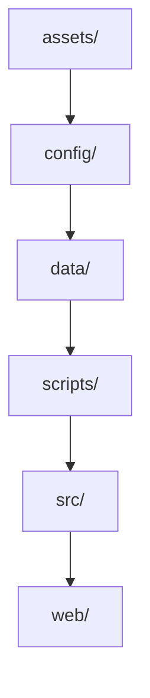
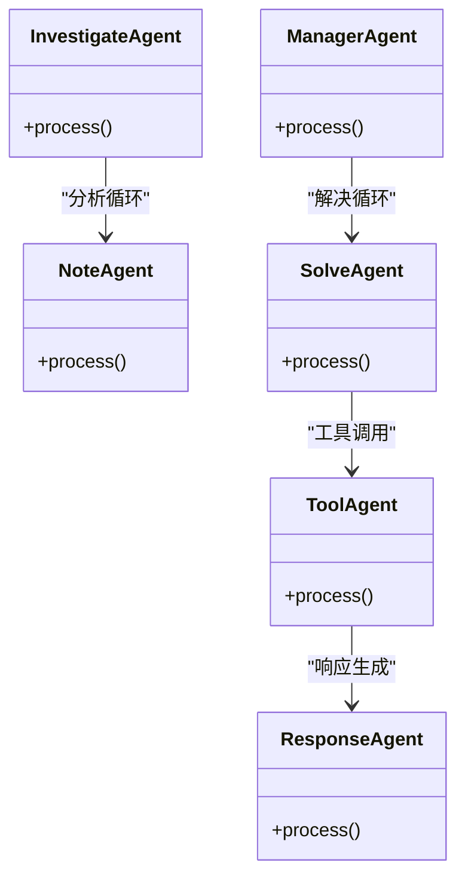
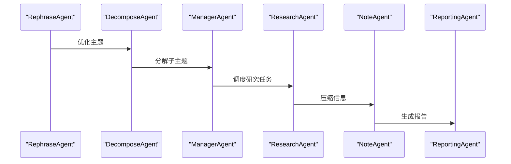
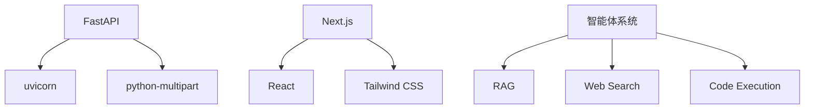

# 系统架构

<cite>
**本文档引用的文件**   
- [README.md](file://README.md)
- [pyproject.toml](file://pyproject.toml)
- [web/package.json](file://web/package.json)
- [config/main.yaml](file://config/main.yaml)
- [src/api/main.py](file://src/api/main.py)
- [web/app/layout.tsx](file://web/app/layout.tsx)
- [src/agents/solve/main_solver.py](file://src/agents/solve/main_solver.py)
- [src/agents/research/main.py](file://src/agents/research/main.py)
- [src/api/routers/solve.py](file://src/api/routers/solve.py)
- [web/lib/api.ts](file://web/lib/api.ts)
- [scripts/start_web.py](file://scripts/start_web.py)
- [requirements.txt](file://requirements.txt)
- [src/core/core.py](file://src/core/core.py)
- [src/agents/research/research_pipeline.py](file://src/agents/research/research_pipeline.py)
- [src/api/utils/history.py](file://src/api/utils/history.py)
- [src/core/logging/logger.py](file://src/core/logging/logger.py)
</cite>

## 目录
1. [引言](#引言)
2. [项目结构](#项目结构)
3. [核心组件](#核心组件)
4. [架构概述](#架构概述)
5. [详细组件分析](#详细组件分析)
6. [依赖分析](#依赖分析)
7. [性能考虑](#性能考虑)
8. [故障排除指南](#故障排除指南)
9. [结论](#结论)
10. [附录](#附录)（如有必要）

## 引言
DeepTutor是一个基于多智能体系统的个性化学习助手，旨在通过AI技术提供智能问答、知识强化、深度研究和创意生成等功能。系统采用模块化设计，结合了前端（Next.js）、后端（FastAPI）和多智能体系统，形成了一个完整的知识生态系统。本架构文档将详细描述系统的高层设计、组件交互、数据流、技术决策和部署拓扑。

## 项目结构
DeepTutor项目采用清晰的分层结构，主要分为以下几个部分：
- `assets/`: 存放静态资源，如Logo和文档。
- `config/`: 存放配置文件，包括`main.yaml`和`agents.yaml`。
- `data/`: 存放用户数据和知识库。
- `scripts/`: 存放启动和安装脚本。
- `src/`: 源代码目录，包含核心逻辑、API、智能体和工具。
- `web/`: 前端代码，基于Next.js构建。



**Diagram sources**
- [README.md](file://README.md#L1-L1359)

**Section sources**
- [README.md](file://README.md#L1-L1359)

## 核心组件
DeepTutor的核心组件包括：
- **智能体模块**：包括问题解决、研究、指导学习、创意生成等。
- **工具集成层**：支持RAG、网络搜索、学术论文数据库等。
- **知识与记忆基础**：包括知识图谱、向量存储和记忆系统。

**Section sources**
- [README.md](file://README.md#L1-L1359)

## 架构概述
DeepTutor采用分层架构，从前端到后端再到智能体系统，形成了一个完整的知识处理流程。

```mermaid
graph TD
A[前端 (Next.js)] --> B[后端 (FastAPI)]
B --> C[智能体系统]
C --> D[工具集成层]
D --> E[知识与记忆基础]
```

**Diagram sources**
- [README.md](file://README.md#L1-L1359)

## 详细组件分析
### 问题解决智能体
问题解决智能体采用双循环架构，包括分析循环和解决循环，支持多模式推理和动态知识检索。

#### 架构图


**Diagram sources**
- [src/agents/solve/main_solver.py](file://src/agents/solve/main_solver.py#L1-L779)

**Section sources**
- [src/agents/solve/main_solver.py](file://src/agents/solve/main_solver.py#L1-L779)

### 深度研究智能体
深度研究智能体基于动态主题队列架构，支持多智能体协作，分为规划、研究和报告三个阶段。

#### 架构图


**Diagram sources**
- [src/agents/research/research_pipeline.py](file://src/agents/research/research_pipeline.py#L1-L800)

**Section sources**
- [src/agents/research/research_pipeline.py](file://src/agents/research/research_pipeline.py#L1-L800)

## 依赖分析
DeepTutor的依赖关系复杂，涉及多个外部库和内部模块。



**Diagram sources**
- [requirements.txt](file://requirements.txt#L1-L62)
- [web/package.json](file://web/package.json#L1-L41)

**Section sources**
- [requirements.txt](file://requirements.txt#L1-L62)
- [web/package.json](file://web/package.json#L1-L41)

## 性能考虑
DeepTutor在设计时考虑了性能优化，包括：
- 使用异步编程模型提高响应速度。
- 通过缓存机制减少重复计算。
- 优化数据库查询以提高数据检索效率。

## 故障排除指南
### 常见问题
- **启动失败**：检查端口配置和依赖安装。
- **API调用失败**：验证API密钥和网络连接。
- **智能体响应慢**：检查LLM配置和网络延迟。

**Section sources**
- [scripts/start_web.py](file://scripts/start_web.py#L1-L374)

## 结论
DeepTutor通过模块化设计和多智能体系统，提供了一个强大的个性化学习平台。其架构设计合理，组件交互清晰，具备良好的可扩展性和维护性。未来可以进一步优化性能，增加更多智能体模块，提升用户体验。