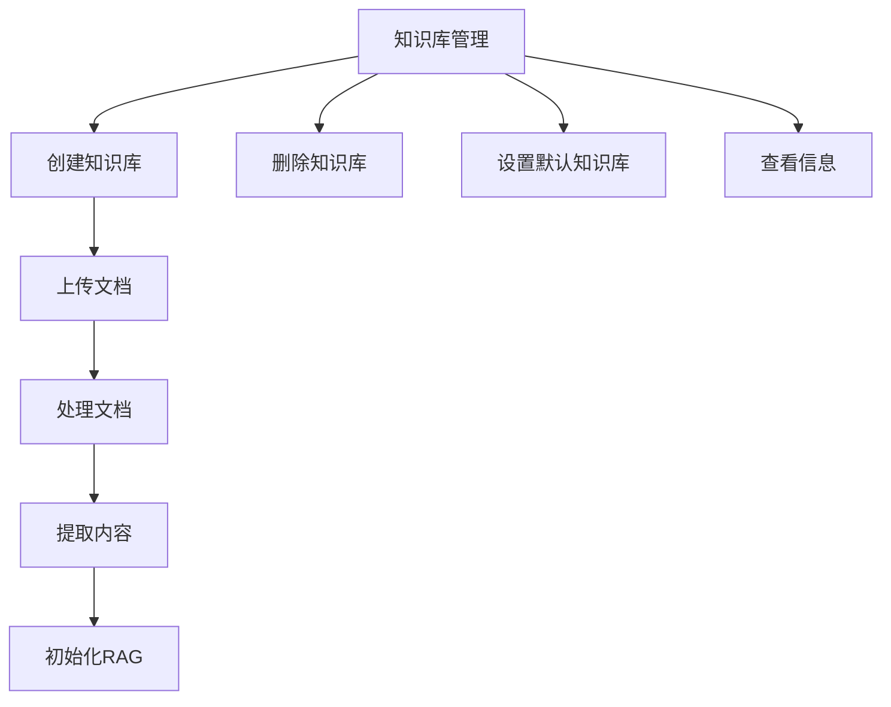
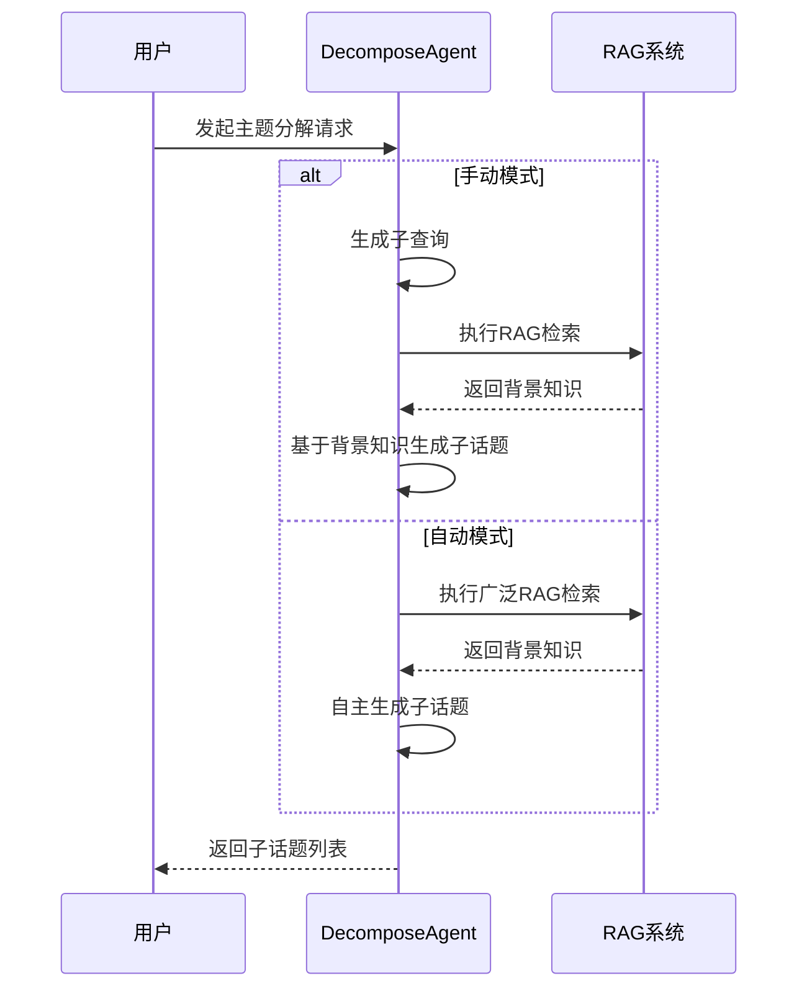
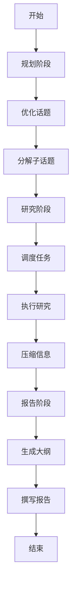
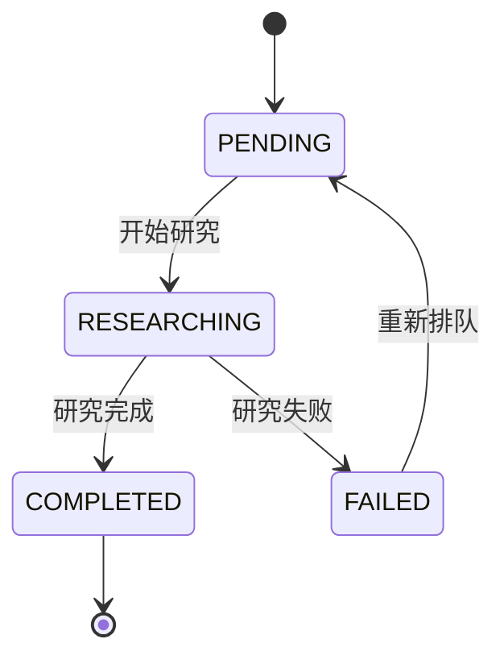
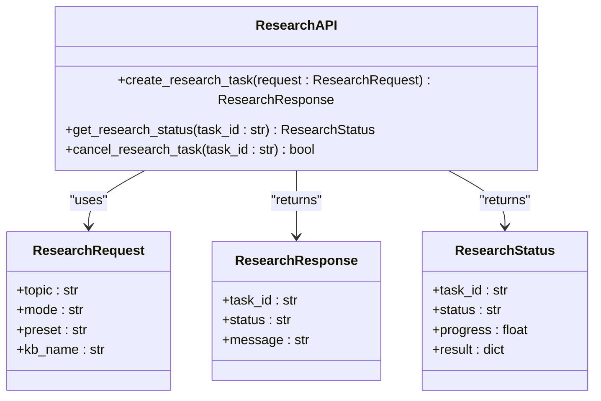

# 主题管理

<cite>
**本文档引用的文件**   
- [manager.py](file://src/knowledge/manager.py)
- [start_kb.py](file://src/knowledge/start_kb.py)
- [add_documents.py](file://src/knowledge/add_documents.py)
- [decompose_agent.py](file://src/agents/research/agents/decompose_agent.py)
- [research_agent.py](file://src/agents/research/agents/research_agent.py)
- [data_structures.py](file://src/agents/research/data_structures.py)
- [research_pipeline.py](file://src/agents/research/research_pipeline.py)
- [research.py](file://src/api/routers/research.py)
</cite>

## 目录
1. [简介](#简介)
2. [知识库管理](#知识库管理)
3. [主题分解机制](#主题分解机制)
4. [研究流程与主题管理](#研究流程与主题管理)
5. [动态主题队列](#动态主题队列)
6. [API接口](#api接口)

## 简介
DeepTutor系统中的主题管理主要通过知识库和研究模块实现。系统允许用户创建和管理多个知识库，并基于这些知识库进行深入的研究和主题分解。主题管理不仅包括知识库的增删改查，还涉及研究过程中的动态主题发现和处理。

**Section sources**
- [manager.py](file://src/knowledge/manager.py#L1-L456)
- [start_kb.py](file://src/knowledge/start_kb.py#L1-L536)

## 知识库管理
知识库是DeepTutor系统中主题管理的基础。每个知识库包含用户上传的文档、提取的内容列表、图像以及RAG（检索增强生成）存储。知识库管理功能允许用户创建、删除、设置默认知识库，并查看知识库的详细信息。

### 核心功能
- **创建知识库**：用户可以创建新的知识库并上传文档。
- **删除知识库**：支持删除指定的知识库，删除前需要确认。
- **设置默认知识库**：用户可以设置一个默认的知识库，后续操作将默认使用该知识库。
- **查看信息**：显示知识库的路径、文档数量、图像数量和RAG初始化状态等统计信息。

**Diagram sources **
- [manager.py](file://src/knowledge/manager.py#L18-L305)
- [start_kb.py](file://src/knowledge/start_kb.py#L113-L536)

**Section sources**
- [manager.py](file://src/knowledge/manager.py#L1-L456)
- [start_kb.py](file://src/knowledge/start_kb.py#L1-L536)

## 主题分解机制
主题分解是研究模块的核心功能之一，由DecomposeAgent负责执行。该代理将一个主话题分解为多个子话题，并为每个子话题生成概览。主题分解支持两种模式：手动模式和自动模式。

### 手动模式
在手动模式下，用户指定期望的子话题数量。系统首先生成子查询，然后使用RAG检索获取背景知识，最后基于这些背景知识生成指定数量的子话题。

### 自动模式
在自动模式下，系统根据话题的复杂度自主决定生成的子话题数量，通常在3到指定的最大数量之间。系统会进行一次广泛的RAG检索以获取背景知识，然后基于这些知识自主生成子话题。

**Diagram sources **
- [decompose_agent.py](file://src/agents/research/agents/decompose_agent.py#L61-L505)

**Section sources**
- [decompose_agent.py](file://src/agents/research/agents/decompose_agent.py#L1-L506)

## 研究流程与主题管理
研究模块采用三阶段架构：规划、研究和报告。在规划阶段，RephraseAgent优化话题，DecomposeAgent将话题分解为子话题。在研究阶段，ManagerAgent调度任务，ResearchAgent执行研究决策，NoteAgent压缩信息。在报告阶段，系统生成去重后的三级大纲并撰写报告。

### 主题管理流程
1. **规划阶段**：优化主话题并分解为子话题。
2. **研究阶段**：逐个研究子话题，动态发现新话题并添加到队列中。
3. **报告阶段**：生成最终报告，包含所有研究结果和引用。

**Diagram sources **
- [research_pipeline.py](file://src/agents/research/research_pipeline.py#L1-L100)
- [research_agent.py](file://src/agents/research/agents/research_agent.py#L433-L707)

**Section sources**
- [research_pipeline.py](file://src/agents/research/research_pipeline.py#L1-L100)
- [research_agent.py](file://src/agents/research/agents/research_agent.py#L1-L708)

## 动态主题队列
动态主题队列是研究系统的核心调度机制，使用TopicBlock状态管理：`PENDING → RESEARCHING → COMPLETED/FAILED`。在研究过程中，ResearchAgent可能会发现新的相关话题，并将其动态添加到队列中，从而实现动态主题发现。

### TopicBlock状态
- **PENDING**：等待研究
- **RESEARCHING**：正在研究
- **COMPLETED**：已完成
- **FAILED**：失败

### 队列操作
- **添加话题**：将新话题添加到队列末尾。
- **获取待处理话题**：获取第一个状态为PENDING的话题。
- **标记状态**：将话题标记为RESEARCHING、COMPLETED或FAILED。

**Diagram sources **
- [data_structures.py](file://src/agents/research/data_structures.py#L16-L226)

**Section sources**
- [data_structures.py](file://src/agents/research/data_structures.py#L1-L452)

## API接口
研究模块提供了RESTful API接口，允许外部系统与DeepTutor进行交互。API接口支持创建研究任务、获取研究状态和结果等操作。

### 主要端点
- `POST /api/v1/research`：创建新的研究任务
- `GET /api/v1/research/{task_id}`：获取研究任务状态和结果
- `DELETE /api/v1/research/{task_id}`：取消研究任务

**Diagram sources **
- [research.py](file://src/api/routers/research.py#L1-L100)

**Section sources**
- [research.py](file://src/api/routers/research.py#L1-L100)