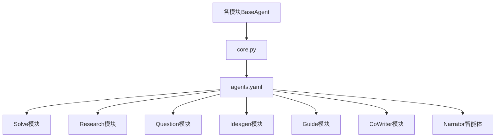
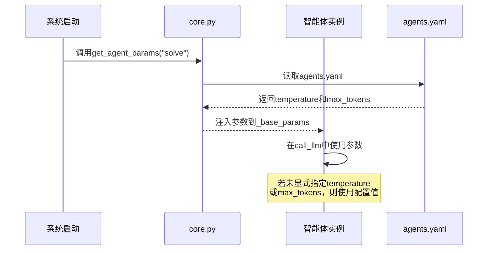

# 智能体参数配置

<cite>
**本文档引用文件**  
- [agents.yaml](file://config/agents.yaml)
- [core.py](file://src/core/core.py)
- [base_agent.py](file://src/agents/solve/base_agent.py)
- [base_idea_agent.py](file://src/agents/ideagen/base_idea_agent.py)
- [narrator_agent.py](file://src/agents/co_writer/narrator_agent.py)
</cite>

## 目录
1. [引言](#引言)
2. [统一参数配置设计](#统一参数配置设计)
3. [核心参数详解](#核心参数详解)
4. [模块级配置策略](#模块级配置策略)
5. [参数注入机制](#参数注入机制)
6. [性能影响分析](#性能影响分析)
7. [配置示例与最佳实践](#配置示例与最佳实践)

## 引言
本系统采用集中式参数管理策略，通过`agents.yaml`文件作为所有智能体模块的“单一事实来源”，统一管理`temperature`和`max_tokens`两个核心LLM参数。该设计避免了在代码中硬编码参数值，实现了配置与逻辑的解耦，提升了系统的可维护性和可调优性。

## 统一参数配置设计



**图示来源**  
- [agents.yaml](file://config/agents.yaml#L1-L55)
- [core.py](file://src/core/core.py#L114-L167)

**本节来源**  
- [agents.yaml](file://config/agents.yaml#L1-L55)
- [core.py](file://src/core/core.py#L114-L167)

## 核心参数详解

### temperature参数
控制生成文本的随机性和创造性：
- **低值（~0.3）**：强调确定性和精确性，适合分析和求解任务
- **中值（~0.5）**：平衡创造性和严谨性，适合研究和指导任务
- **高值（~0.7）**：鼓励多样性和发散性，适合创意和问题生成任务

### max_tokens参数
定义模型响应的最大长度：
- 影响生成内容的详细程度和完整性
- 需与下游系统（如TTS API）的限制相匹配
- 过高值可能增加响应延迟和计算成本

## 模块级配置策略

### Solve模块配置
```yaml
solve:
  temperature: 0.3
  max_tokens: 8192
```
- **temperature: 0.3**：强调精确性和逻辑严谨性，确保问题求解过程的可预测性和准确性
- **适用智能体**：investigate_agent、solve_agent、tool_agent、response_agent等
- **应用场景**：数学问题求解、逻辑推理、精确答案生成

**本节来源**  
- [agents.yaml](file://config/agents.yaml#L12-L14)
- [base_agent.py](file://src/agents/solve/base_agent.py#L56)

### Research模块配置
```yaml
research:
  temperature: 0.5
  max_tokens: 12000
```
- **temperature: 0.5**：在创造性和严谨性之间取得平衡，支持探索性研究同时保持学术严谨
- **max_tokens: 12000**：支持生成长篇研究报告，确保内容完整性
- **适用智能体**：rephrase_agent、decompose_agent、research_agent、reporting_agent等

**本节来源**  
- [agents.yaml](file://config/agents.yaml#L18-L20)
- [base_agent.py](file://src/agents/research/agents/base_agent.py#L162-L168)

### Question与Ideagen模块配置
```yaml
question:
  temperature: 0.7
  max_tokens: 4096

ideagen:
  temperature: 0.7
  max_tokens: 4096
```
- **temperature: 0.7**：鼓励多样性，促进创造性思维，适用于问题生成和创意构思
- **适用场景**：考试题目生成、头脑风暴、研究方向建议
- **共享机制**：各模块内所有智能体共享同一参数集

**本节来源**  
- [agents.yaml](file://config/agents.yaml#L24-L38)
- [base_idea_agent.py](file://src/agents/ideagen/base_idea_agent.py#L108-L111)

### Narrator智能体独立配置
```yaml
narrator:
  temperature: 0.7
  max_tokens: 4000
```
- **独立原因**：适配TTS（文本转语音）API的4000字符限制
- **temperature: 0.7**：保持叙述的自然流畅性和表达多样性
- **特殊性**：作为唯一独立配置的智能体，不影响其他模块参数

**本节来源**  
- [agents.yaml](file://config/agents.yaml#L46-L54)
- [narrator_agent.py](file://src/agents/co_writer/narrator_agent.py#L80)

## 参数注入机制



**图示来源**  
- [core.py](file://src/core/core.py#L114-L167)
- [base_agent.py](file://src/agents/solve/base_agent.py#L134-L150)

**本节来源**  
- [core.py](file://src/core/core.py#L114-L167)
- [base_agent.py](file://src/agents/solve/base_agent.py#L56)

## 性能影响分析
- **temperature影响**：
  - 低值：响应更稳定，但可能缺乏创造性
  - 高值：响应更多样，但可能降低一致性
- **max_tokens影响**：
  - 高值：支持更长输出，但增加响应时间和计算成本
  - 需权衡内容完整性和系统性能
- **总体原则**：根据任务类型选择合适的参数组合，平衡生成质量与系统效率

## 配置示例与最佳实践
- **长篇报告生成**：research模块设置`max_tokens: 12000`以支持详细输出
- **TTS集成**：narrator智能体设置`max_tokens: 4000`以符合API限制
- **参数调优**：通过修改`agents.yaml`文件进行全局调整，无需修改代码
- **最佳实践**：保持模块内参数一致性，仅在特殊需求下创建独立配置