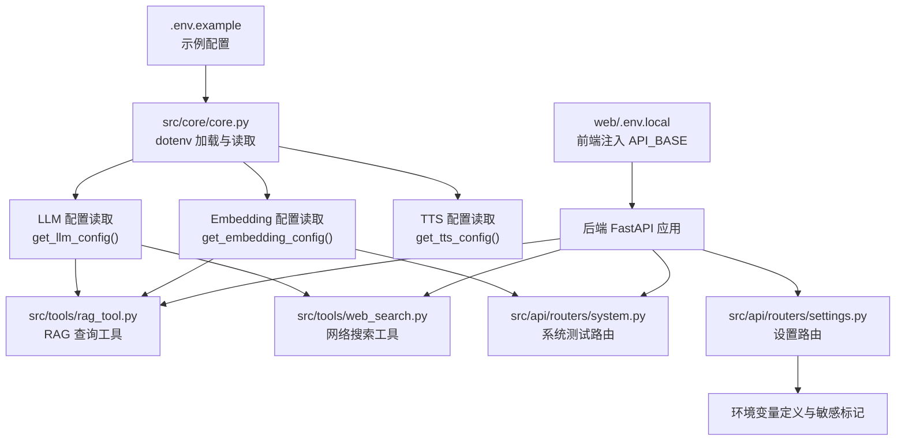
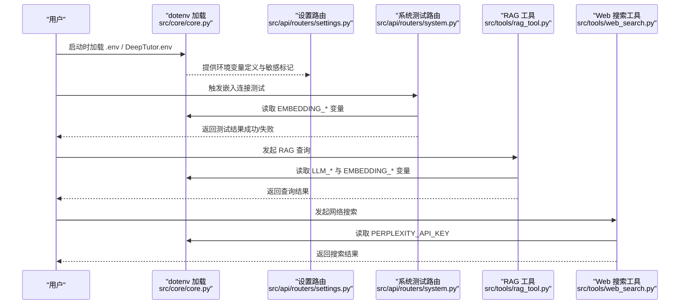
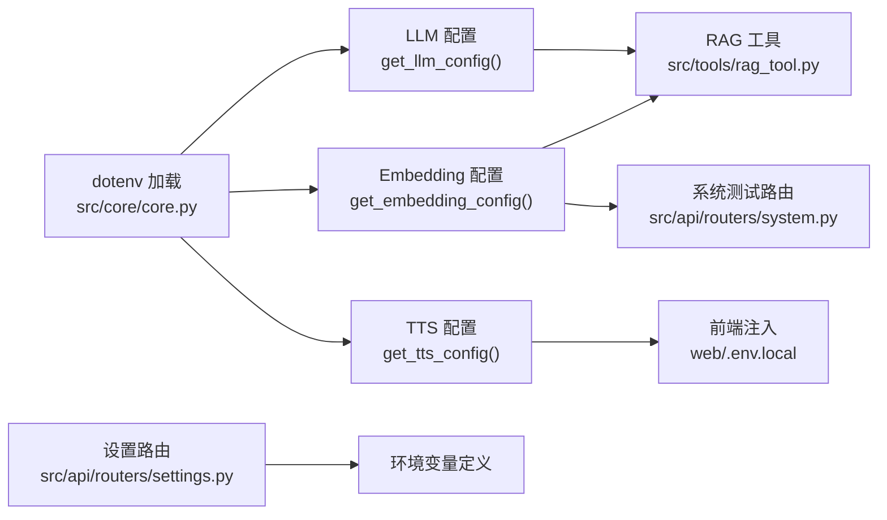
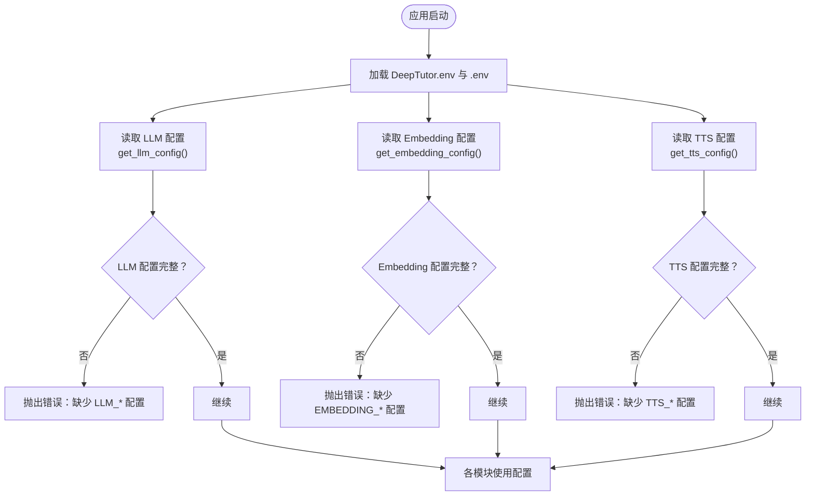

# 环境变量配置

<cite>
**本文引用的文件**
- [.env.example](file://.env.example)
- [src/core/core.py](file://src/core/core.py)
- [src/tools/web_search.py](file://src/tools/web_search.py)
- [src/tools/rag_tool.py](file://src/tools/rag_tool.py)
- [src/knowledge/config.py](file://src/knowledge/config.py)
- [src/api/routers/settings.py](file://src/api/routers/settings.py)
- [src/api/routers/system.py](file://src/api/routers/system.py)
- [config/main.yaml](file://config/main.yaml)
- [web/.env.local](file://web/.env.local)
- [src/utils/config_manager.py](file://src/utils/config_manager.py)
</cite>

## 目录
1. [简介](#简介)
2. [项目结构](#项目结构)
3. [核心组件](#核心组件)
4. [架构总览](#架构总览)
5. [详细组件分析](#详细组件分析)
6. [依赖关系分析](#依赖关系分析)
7. [性能考虑](#性能考虑)
8. [故障排查指南](#故障排查指南)
9. [结论](#结论)
10. [附录](#附录)

## 简介
本指南围绕外部服务环境变量配置展开，以 .env.example 为基准，系统讲解 LLM、Embedding、TTS、Web 搜索等外部服务的配置要点与使用方式。重点包括：
- LLM_BINDING 的选择机制及其对 API 调用协议的影响
- LLM_MODEL、LLM_BINDING_HOST、LLM_BINDING_API_KEY 的配置要求
- 主流服务商（OpenAI、DeepSeek、Qwen）的配置示例
- EMBEDDING_BINDING 和 EMBEDDING_MODEL 的配置方法，以及 text-embedding-3-large 等模型与 RAG 功能的关联
- TTS 服务（Alibaba Cloud DashScope）的 TTS_MODEL、TTS_URL、TTS_API_KEY 配置流程
- PERPLEXITY_API_KEY 在 web_search 工具中的作用机制
- 安全实践：避免提交 API 密钥到版本控制
- DISABLE_SSL_VERIFY 在自签名证书环境下的使用场景
- 系统启动时如何加载这些环境变量并进行有效性校验，以及缺失关键变量时的错误提示机制

## 项目结构
本项目通过统一的环境变量读取入口集中管理外部服务配置，并在多个子模块中按需使用。前端 Next.js 通过 web/.env.local 将后端 API 基础地址注入运行时；后端 FastAPI 通过配置路由暴露环境变量定义与校验能力。

图表来源
- [src/core/core.py](file://src/core/core.py#L1-L40)
- [src/tools/rag_tool.py](file://src/tools/rag_tool.py#L31-L120)
- [src/tools/web_search.py](file://src/tools/web_search.py#L19-L70)
- [src/api/routers/system.py](file://src/api/routers/system.py#L165-L202)
- [src/api/routers/settings.py](file://src/api/routers/settings.py#L23-L141)
- [web/.env.local](file://web/.env.local#L1-L10)

章节来源
- [src/core/core.py](file://src/core/core.py#L1-L40)
- [config/main.yaml](file://config/main.yaml#L1-L10)
- [web/.env.local](file://web/.env.local#L1-L10)

## 核心组件
- 环境变量加载与解析：在应用启动时加载 DeepTutor.env 与 .env，统一读取 LLM、Embedding、TTS、Web 搜索等关键变量，并进行严格校验与默认值处理。
- 配置读取函数：
  - get_llm_config：读取 LLM_BINDING、LLM_MODEL、LLM_BINDING_HOST、LLM_BINDING_API_KEY 并进行必填项校验。
  - get_embedding_config：读取 EMBEDDING_BINDING、EMBEDDING_MODEL、EMBEDDING_BINDING_HOST、EMBEDDING_BINDING_API_KEY，并支持可选维度与最大 token 数。
  - get_tts_config：读取 TTS_MODEL、TTS_URL、TTS_API_KEY、TTS_VOICE 并进行必填项校验。
- 设置路由：集中定义所有受支持的环境变量键名、描述、是否必需、默认值与敏感标记，便于前端展示与用户校验。
- 系统测试路由：提供嵌入连接测试，用于验证 Embedding 配置的有效性。
- Web 搜索工具：读取 PERPLEXITY_API_KEY 并调用 Perplexity API 执行网络搜索。

章节来源
- [src/core/core.py](file://src/core/core.py#L40-L112)
- [src/core/core.py](file://src/core/core.py#L170-L212)
- [src/api/routers/settings.py](file://src/api/routers/settings.py#L23-L141)
- [src/api/routers/system.py](file://src/api/routers/system.py#L165-L202)
- [src/tools/web_search.py](file://src/tools/web_search.py#L19-L70)

## 架构总览
下图展示了从环境变量到各外部服务模块的调用链路与校验点。

图表来源
- [src/core/core.py](file://src/core/core.py#L1-L40)
- [src/api/routers/settings.py](file://src/api/routers/settings.py#L23-L141)
- [src/api/routers/system.py](file://src/api/routers/system.py#L165-L202)
- [src/tools/rag_tool.py](file://src/tools/rag_tool.py#L31-L120)
- [src/tools/web_search.py](file://src/tools/web_search.py#L19-L70)

## 详细组件分析

### LLM 配置：LLM_BINDING、LLM_MODEL、LLM_BINDING_HOST、LLM_BINDING_API_KEY
- LLM_BINDING 选择机制
  - 支持 openai、azure_openai、ollama、lollms 等类型。该绑定类型决定后续调用协议与兼容性（例如 Azure OpenAI 的端点格式与鉴权方式）。
  - 绑定类型通过环境变量 LLM_BINDING 指定，默认 openai。
- LLM_MODEL
  - 必填项。示例包括 gpt-4o、gpt-4o-mini、deepseek-chat、qwen-plus、claude-3-5-sonnet 等。
- LLM_BINDING_HOST
  - 必填项。不同服务商的端点格式如下：
    - OpenAI：https://api.openai.com/v1
    - Azure OpenAI：https://YOUR_RESOURCE.openai.azure.com
    - DeepSeek：https://api.deepseek.com
    - 阿里云 Qwen：https://dashscope.aliyuncs.com/compatible-mode/v1
- LLM_BINDING_API_KEY
  - 必填项。对应各服务商的 API Key。
- 错误提示机制
  - 若 LLM_MODEL、LLM_BINDING_API_KEY、LLM_BINDING_HOST 任一未配置，将抛出明确的错误信息，提示在 .env 中补齐。

章节来源
- [.env.example](file://.env.example#L14-L31)
- [src/core/core.py](file://src/core/core.py#L40-L72)

### Embedding 配置：EMBEDDING_BINDING、EMBEDDING_MODEL、EMBEDDING_DIM、EMBEDDING_BINDING_HOST、EMBEDDING_BINDING_API_KEY
- EMBEDDING_BINDING
  - 支持 openai、azure_openai、ollama、lollms 等类型，默认 openai。
- EMBEDDING_MODEL
  - 必填项。示例包括 text-embedding-3-large、text-embedding-3-small、text-embedding-ada-002 等。
- EMBEDDING_DIM
  - 可选项。默认 3072（与 text-embedding-3-large 对应），用于 LightRAG 的向量化维度匹配。
- EMBEDDING_MAX_TOKENS
  - 可选项。默认 8192，限制单次嵌入的最大 token 数。
- EMBEDDING_BINDING_HOST、EMBEDDING_BINDING_API_KEY
  - 必填项。端点与密钥与 LLM 类似，遵循相同格式与安全实践。
- 与 RAG 的关联
  - RAG 工具在执行查询时会基于 EMBEDDING_MODEL、EMBEDDING_DIM、EMBEDDING_MAX_TOKENS 构建 EmbeddingFunc，并通过 openai_embed 接口调用外部 Embedding 服务，从而支撑检索增强生成（RAG）能力。

章节来源
- [.env.example](file://.env.example#L41-L57)
- [src/core/core.py](file://src/core/core.py#L170-L212)
- [src/tools/rag_tool.py](file://src/tools/rag_tool.py#L201-L211)
- [src/api/routers/system.py](file://src/api/routers/system.py#L165-L202)

### TTS 配置：TTS_MODEL、TTS_URL、TTS_API_KEY、TTS_VOICE
- TTS_MODEL
  - 示例：tts-1、tts-1-hd（OpenAI 兼容 API）。
- TTS_URL
  - OpenAI 兼容 API 端点示例：https://api.openai.com/v1。
- TTS_API_KEY
  - OpenAI API Key。
- TTS_VOICE
  - 默认 alloy，支持 alloy、echo、fable、onyx、nova、shimmer 等。
- 使用场景
  - 用于 Co-Writer 的旁白语音合成，需要与 LLM 绑定一致的兼容 API。

章节来源
- [.env.example](file://.env.example#L64-L71)
- [src/core/core.py](file://src/core/core.py#L75-L112)
- [src/api/routers/settings.py](file://src/api/routers/settings.py#L90-L117)

### Web 搜索：PERPLEXITY_API_KEY
- PERPLEXITY_API_KEY
  - 用于 web_search 工具调用 Perplexity API 执行网络搜索。
- 错误提示机制
  - 若未安装 perplexity 模块或未设置 PERPLEXITY_API_KEY，将抛出明确异常，提示安装依赖或配置密钥。
- 使用流程
  - 初始化 Perplexity 客户端，构造消息列表，调用 chat.completions.create 获取答案与引用链接，并可选择保存结果到文件。

章节来源
- [.env.example](file://.env.example#L74-L80)
- [src/tools/web_search.py](file://src/tools/web_search.py#L19-L70)
- [src/tools/web_search.py](file://src/tools/web_search.py#L156-L173)

### 系统配置：DISABLE_SSL_VERIFY
- DISABLE_SSL_VERIFY
  - 当使用自签名证书或企业内网代理导致证书校验失败时，可设为 true 以禁用 SSL 校验。
- 安全建议
  - 仅在开发或受控环境下启用，生产环境务必保持默认（false）并正确配置证书。

章节来源
- [.env.example](file://.env.example#L32-L33)
- [src/api/routers/settings.py](file://src/api/routers/settings.py#L127-L133)

### 知识库与环境变量：get_env_config 兼容回退
- get_env_config
  - 优先通过 get_llm_config 获取 LLM 配置（api_key、base_url），若不可用则回退直接读取 LLM_BINDING_API_KEY 与 LLM_BINDING_HOST。
- 用途
  - 为知识库初始化与文档入库等流程提供统一的环境变量读取入口。

章节来源
- [src/knowledge/config.py](file://src/knowledge/config.py#L25-L42)

## 依赖关系分析
- 环境变量加载顺序
  - 应用启动时先加载 DeepTutor.env，再加载 .env，确保本地覆盖优先级。
- 配置读取与模块耦合
  - RAG 工具与 Web 搜索工具均依赖 core.py 中的配置读取函数，形成低耦合高内聚的设计。
- 前后端联动
  - 前端 Next.js 通过 web/.env.local 注入 NEXT_PUBLIC_API_BASE，指向后端 FastAPI 服务端口；后端通过 config/main.yaml 配置端口。

图表来源
- [src/core/core.py](file://src/core/core.py#L1-L40)
- [src/tools/rag_tool.py](file://src/tools/rag_tool.py#L31-L120)
- [src/api/routers/system.py](file://src/api/routers/system.py#L165-L202)
- [web/.env.local](file://web/.env.local#L1-L10)
- [src/api/routers/settings.py](file://src/api/routers/settings.py#L23-L141)

章节来源
- [src/core/core.py](file://src/core/core.py#L1-L40)
- [config/main.yaml](file://config/main.yaml#L1-L10)
- [web/.env.local](file://web/.env.local#L1-L10)

## 性能考虑
- 嵌入维度与最大 token 数
  - EMBEDDING_DIM 与 EMBEDDING_MAX_TOKENS 的合理设置直接影响嵌入生成速度与内存占用。建议与所选模型官方推荐值保持一致（如 text-embedding-3-large 对应 3072 维度）。
- RAG 查询模式
  - RAG 支持 local、global、hybrid、naive 等模式，不同模式在召回与生成阶段的开销差异较大，可根据场景选择默认模式与回退模式。
- 网络请求与重试
  - Web 搜索与嵌入接口存在网络延迟，建议在工具层设置合理的超时与重试策略，避免阻塞主线程。

[本节为通用建议，不直接分析具体文件]

## 故障排查指南
- 缺少必填变量
  - LLM：LLM_MODEL、LLM_BINDING_API_KEY、LLM_BINDING_HOST 未配置时，get_llm_config 将抛出错误，提示在 .env 中补齐。
  - Embedding：EMBEDDING_MODEL、EMBEDDING_API_KEY、EMBEDDING_BINDING_HOST 未配置时，get_embedding_config 将抛出错误。
  - TTS：TTS_MODEL、TTS_API_KEY、TTS_URL 未配置时，get_tts_config 将抛出错误。
- Web 搜索
  - 未安装 perplexity 模块或未设置 PERPLEXITY_API_KEY 时，web_search 将抛出异常，提示安装依赖或配置密钥。
- 嵌入连接测试
  - 通过系统测试路由触发嵌入连接测试，返回成功/失败与响应时间，便于快速定位配置问题。
- 自签名证书
  - 若遇到证书校验失败，可在本地临时启用 DISABLE_SSL_VERIFY=true，但请勿在生产环境使用。

章节来源
- [src/core/core.py](file://src/core/core.py#L40-L72)
- [src/core/core.py](file://src/core/core.py#L170-L212)
- [src/core/core.py](file://src/core/core.py#L75-L112)
- [src/tools/web_search.py](file://src/tools/web_search.py#L19-L70)
- [src/api/routers/system.py](file://src/api/routers/system.py#L165-L202)
- [.env.example](file://.env.example#L32-L33)

## 结论
- 本项目通过 .env.example 提供了完整的外部服务配置模板，结合 core.py 的严格校验与 settings.py 的集中定义，实现了清晰、可维护的环境变量管理体系。
- LLM、Embedding、TTS、Web 搜索四大外部服务均可通过统一的环境变量进行配置，并在相应模块中完成调用与测试。
- 建议在团队内建立“只在本地 .env 中存放密钥”的规范，配合 .gitignore 与 CI/CD 的密钥注入机制，确保安全与合规。

[本节为总结性内容，不直接分析具体文件]

## 附录

### A. LLM_BINDING 选择机制与 API 协议影响
- 不同绑定类型会影响端点格式与鉴权方式（例如 Azure OpenAI 需要资源域名与特定路径）。
- 选择 openai/azure_openai/ollama/lollms 之一，确保 LLM_MODEL、LLM_BINDING_HOST、LLM_BINDING_API_KEY 与之匹配。

章节来源
- [.env.example](file://.env.example#L14-L31)
- [src/core/core.py](file://src/core/core.py#L40-L72)

### B. 主流服务商配置示例（基于 .env.example）
- OpenAI
  - LLM_MODEL：gpt-4o 或 gpt-4o-mini
  - LLM_BINDING_HOST：https://api.openai.com/v1
  - LLM_BINDING_API_KEY：你的 OpenAI API Key
- DeepSeek
  - LLM_MODEL：deepseek-chat
  - LLM_BINDING_HOST：https://api.deepseek.com
  - LLM_BINDING_API_KEY：你的 DeepSeek API Key
- 阿里云 Qwen
  - LLM_MODEL：qwen-plus 等
  - LLM_BINDING_HOST：https://dashscope.aliyuncs.com/compatible-mode/v1
  - LLM_BINDING_API_KEY：你的 DashScope API Key

章节来源
- [.env.example](file://.env.example#L18-L27)

### C. EMBEDDING_MODEL 与 RAG 的关系
- EMBEDDING_MODEL 与 EMBEDDING_DIM 需与知识库向量化存储保持一致，否则可能导致检索质量下降或初始化失败。
- text-embedding-3-large 对应 3072 维度，适合大多数 RAG 场景。

章节来源
- [.env.example](file://.env.example#L41-L51)
- [src/core/core.py](file://src/core/core.py#L170-L212)
- [src/tools/rag_tool.py](file://src/tools/rag_tool.py#L201-L211)

### D. TTS 服务（Alibaba Cloud DashScope）配置流程
- TTS_MODEL：tts-1 或 tts-1-hd（OpenAI 兼容 API）
- TTS_URL：https://dashscope.aliyuncs.com/compatible-mode/v1
- TTS_API_KEY：DashScope API Key
- TTS_VOICE：默认 alloy，可按需调整

章节来源
- [.env.example](file://.env.example#L64-L71)
- [src/core/core.py](file://src/core/core.py#L75-L112)

### E. PERPLEXITY_API_KEY 在 web_search 工具中的作用
- 作为 Perplexity 客户端的认证凭据，未设置时会触发异常。
- 工具内部会调用 chat.completions.create 并提取答案、引用链接与搜索结果。

章节来源
- [.env.example](file://.env.example#L74-L80)
- [src/tools/web_search.py](file://src/tools/web_search.py#L19-L70)

### F. 安全实践与 .gitignore
- 将 .env 与 .env.local 添加至 .gitignore，避免将密钥提交到版本控制。
- 在 CI/CD 中通过环境变量注入密钥，本地开发使用独立 .env 文件。

章节来源
- [.env.example](file://.env.example#L1-L6)
- [web/.env.local](file://web/.env.local#L1-L10)

### G. DISABLE_SSL_VERIFY 使用场景
- 自签名证书或企业内网代理导致证书校验失败时，可临时启用 DISABLE_SSL_VERIFY=true 进行调试。
- 生产环境务必关闭并正确配置证书。

章节来源
- [.env.example](file://.env.example#L32-L33)
- [src/api/routers/settings.py](file://src/api/routers/settings.py#L127-L133)

### H. 系统启动与环境变量加载流程
- 启动时加载 DeepTutor.env 与 .env，随后各模块通过 core.py 的配置读取函数获取所需变量。
- settings 路由提供环境变量定义与敏感标记，system 路由提供嵌入连接测试，便于快速验证配置有效性。

图表来源
- [src/core/core.py](file://src/core/core.py#L1-L40)
- [src/core/core.py](file://src/core/core.py#L40-L112)
- [src/core/core.py](file://src/core/core.py#L170-L212)

章节来源
- [src/core/core.py](file://src/core/core.py#L1-L40)
- [src/api/routers/settings.py](file://src/api/routers/settings.py#L23-L141)
- [src/api/routers/system.py](file://src/api/routers/system.py#L165-L202)