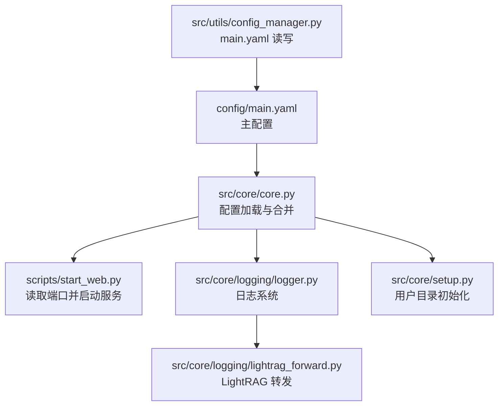
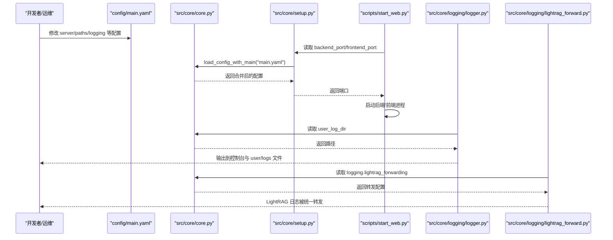
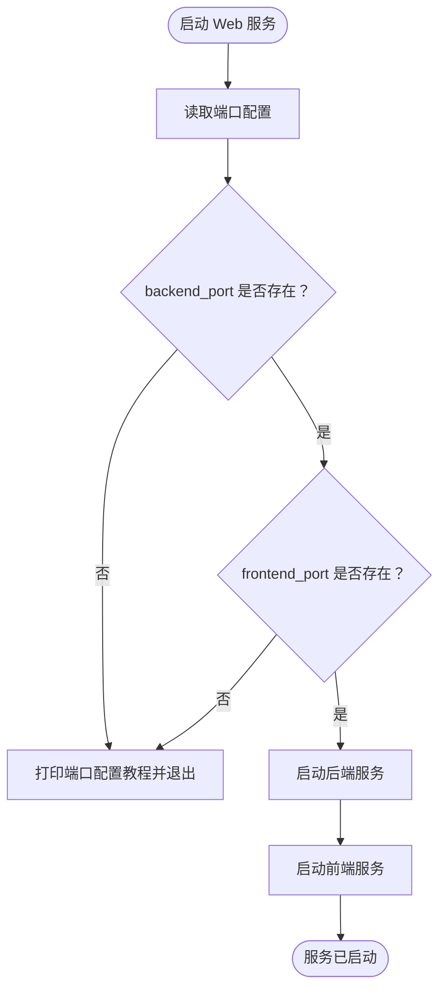
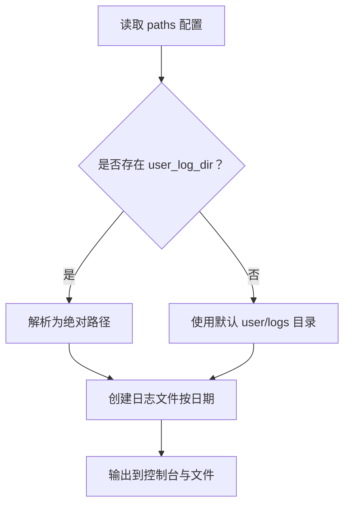
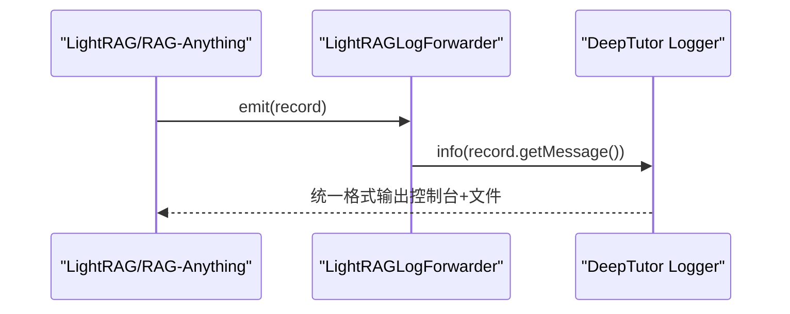
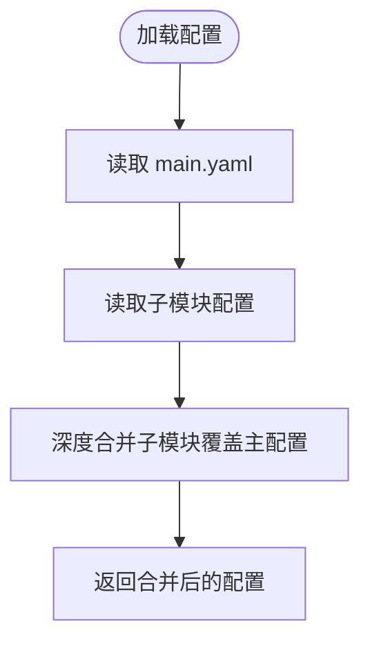
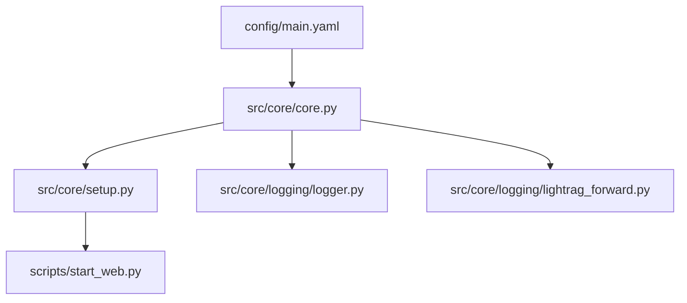

# 系统级配置

<cite>
**本文引用的文件**
- [config/main.yaml](file://config/main.yaml)
- [src/core/core.py](file://src/core/core.py)
- [src/core/setup.py](file://src/core/setup.py)
- [src/core/logging/logger.py](file://src/core/logging/logger.py)
- [src/core/logging/lightrag_forward.py](file://src/core/logging/lightrag_forward.py)
- [src/utils/config_manager.py](file://src/utils/config_manager.py)
- [scripts/start_web.py](file://scripts/start_web.py)
- [config/README.md](file://config/README.md)
- [src/agents/solve/utils/performance_monitor.py](file://src/agents/solve/utils/performance_monitor.py)
</cite>

## 目录
1. [简介](#简介)
2. [项目结构](#项目结构)
3. [核心组件](#核心组件)
4. [架构总览](#架构总览)
5. [详细组件分析](#详细组件分析)
6. [依赖关系分析](#依赖关系分析)
7. [性能考量](#性能考量)
8. [故障排查指南](#故障排查指南)
9. [结论](#结论)
10. [附录](#附录)

## 简介
本文件围绕 DeepTutor 的系统级配置进行深入说明，重点聚焦于 config/main.yaml 中的核心配置项，包括：
- server 部分：后端与前端端口配置及其对服务启动的影响
- system 与 paths 部分：语言设置与各类数据目录（用户数据、知识库、日志、研究缓存等）的路径映射机制
- logging 模块：日志级别、文件保存与控制台输出配置，以及 LightRAG 转发机制
- 实际配置示例：如将 backend_port 设置为 8001，或调整 research_output_dir 路径
- 性能日志与用户日志目录的用途差异，以及 guide_output_dir 与 question_output_dir 的分离设计
- 配置加载流程：核心配置加载器如何解析与验证系统参数，并在路径不存在时自动创建目录
- 安全配置修改指南与性能监控日志调优建议

## 项目结构
DeepTutor 的配置体系由以下关键部分组成：
- 配置文件：config/main.yaml 为主配置文件，集中定义服务器端口、系统语言、路径映射、工具与日志等全局设置
- 核心加载器：src/core/core.py 提供统一的 YAML 加载与合并逻辑
- 启动脚本：scripts/start_web.py 读取端口配置并启动前后端服务
- 日志系统：src/core/logging/logger.py 统一日志格式与输出，支持文件与控制台；LightRAG 转发器将外部日志接入统一系统
- 用户目录初始化：src/core/setup.py 在首次运行时自动创建用户数据目录结构
- 配置管理器：src/utils/config_manager.py 提供线程安全的 main.yaml 读写能力

图表来源
- [config/main.yaml](file://config/main.yaml#L1-L142)
- [src/core/core.py](file://src/core/core.py#L220-L286)
- [scripts/start_web.py](file://scripts/start_web.py#L31-L60)
- [src/core/logging/logger.py](file://src/core/logging/logger.py#L140-L183)
- [src/core/logging/lightrag_forward.py](file://src/core/logging/lightrag_forward.py#L53-L83)
- [src/core/setup.py](file://src/core/setup.py#L30-L184)
- [src/utils/config_manager.py](file://src/utils/config_manager.py#L36-L104)

章节来源
- [config/main.yaml](file://config/main.yaml#L1-L142)
- [src/core/core.py](file://src/core/core.py#L220-L286)
- [scripts/start_web.py](file://scripts/start_web.py#L31-L60)
- [src/core/logging/logger.py](file://src/core/logging/logger.py#L140-L183)
- [src/core/logging/lightrag_forward.py](file://src/core/logging/lightrag_forward.py#L53-L83)
- [src/core/setup.py](file://src/core/setup.py#L30-L184)
- [src/utils/config_manager.py](file://src/utils/config_manager.py#L36-L104)

## 核心组件
- 主配置文件（config/main.yaml）
  - server：定义后端与前端端口
  - system：系统语言设置
  - paths：用户数据、知识库、日志、研究缓存、报告、解题输出等目录映射
  - tools：RAG、代码执行、网络搜索、查询工具等通用工具配置
  - logging：日志级别、是否保存到文件、是否输出到控制台、LightRAG 转发配置
  - tts：默认语音
  - question/research/solve：各模块非 LLM 参数（轮次、迭代、模式等）

- 配置加载器（src/core/core.py）
  - load_config_with_main：加载 main.yaml 并与子模块配置合并
  - get_path_from_config：从配置中提取路径键值（优先 paths，其次 system，再工具）
  - parse_language：标准化语言代码

- 端口配置与启动（src/core/setup.py、scripts/start_web.py）
  - get_backend_port/get_frontend_port：从配置读取端口，缺失时打印教程并退出
  - start_web.py：启动前后端服务，读取端口并生成前端 .env.local

- 日志系统（src/core/logging/logger.py、src/core/logging/lightrag_forward.py）
  - Logger：统一格式、控制台彩色输出、文件输出、任务特定日志句柄
  - LightRAGLogForwarder：将 LightRAG/RAG-Anything 日志转发至统一日志系统

- 用户目录初始化（src/core/setup.py）
  - 自动创建 data/user 下的必要子目录与文件（含研究 reports/cache、co-writer/audio、logs 等）

章节来源
- [config/main.yaml](file://config/main.yaml#L1-L142)
- [src/core/core.py](file://src/core/core.py#L220-L356)
- [src/core/setup.py](file://src/core/setup.py#L243-L345)
- [scripts/start_web.py](file://scripts/start_web.py#L31-L60)
- [src/core/logging/logger.py](file://src/core/logging/logger.py#L140-L183)
- [src/core/logging/lightrag_forward.py](file://src/core/logging/lightrag_forward.py#L53-L83)

## 架构总览
下图展示配置在系统中的流转与影响范围。

图表来源
- [config/main.yaml](file://config/main.yaml#L1-L142)
- [src/core/core.py](file://src/core/core.py#L220-L286)
- [src/core/setup.py](file://src/core/setup.py#L243-L345)
- [scripts/start_web.py](file://scripts/start_web.py#L31-L60)
- [src/core/logging/logger.py](file://src/core/logging/logger.py#L620-L660)
- [src/core/logging/lightrag_forward.py](file://src/core/logging/lightrag_forward.py#L53-L83)

## 详细组件分析

### server 部分：端口配置与服务启动
- 后端端口（backend_port）
  - 作用：FastAPI/Uvicorn 后端服务监听端口
  - 读取方式：scripts/start_web.py 通过 src/core/setup.py 的 get_backend_port 获取
  - 缺失处理：若未配置，打印端口配置教程并退出
- 前端端口（frontend_port）
  - 作用：Next.js 前端开发服务器端口
  - 读取方式：scripts/start_web.py 通过 src/core/setup.py 的 get_frontend_port 获取
  - 缺失处理：同上
- 实际示例
  - 将 backend_port 设置为 8001：直接在 config/main.yaml 的 server.backend_port 写入数值
  - 若与现有占用冲突，可调整为其他可用端口（例如 8002）

图表来源
- [src/core/setup.py](file://src/core/setup.py#L243-L345)
- [scripts/start_web.py](file://scripts/start_web.py#L31-L60)

章节来源
- [src/core/setup.py](file://src/core/setup.py#L243-L345)
- [scripts/start_web.py](file://scripts/start_web.py#L31-L60)

### system 与 paths：语言与路径映射
- system.language
  - 作用：系统语言设置（en/zh），用于界面与提示文本
  - 解析：src/core/core.py 的 parse_language 支持多种输入形式并标准化为 zh/en
- paths：各类数据目录映射
  - user_data_dir：用户数据根目录
  - knowledge_bases_dir：知识库目录
  - user_log_dir：用户日志目录（统一由日志系统使用）
  - performance_log_dir：性能监控日志目录（独立于用户日志）
  - guide_output_dir：引导学习输出目录
  - question_output_dir：问题生成输出目录
  - research_output_dir：研究缓存目录
  - research_reports_dir：研究报告目录
  - solve_output_dir：解题输出目录
- 路径解析与相对路径处理
  - get_path_from_config 支持在 paths/system 中查找路径键
  - 日志系统在未显式传入 log_dir 时，会从配置中读取 user_log_dir 并转换为绝对路径
- 用户目录初始化
  - init_user_directories 在首次运行时自动创建 data/user 及其子目录（包含 logs、research/cache、research/reports、co-writer/audio 等）

图表来源
- [src/core/core.py](file://src/core/core.py#L288-L314)
- [src/core/logging/logger.py](file://src/core/logging/logger.py#L140-L183)
- [src/core/setup.py](file://src/core/setup.py#L30-L184)

章节来源
- [src/core/core.py](file://src/core/core.py#L288-L356)
- [src/core/logging/logger.py](file://src/core/logging/logger.py#L140-L183)
- [src/core/setup.py](file://src/core/setup.py#L30-L184)

### logging：日志级别、输出与 LightRAG 转发
- 日志级别与输出
  - level：统一日志级别（DEBUG/INFO/WARNING/ERROR/CRITICAL）
  - save_to_file：是否保存到文件
  - console_output：是否输出到控制台
- 日志文件与目录
  - 日志文件按日期命名（ai_tutor_YYYYMMDD.log），默认位于 data/user/logs
  - 日志系统会自动创建目录
- LightRAG 转发
  - lightrag_forwarding.enabled：是否启用转发
  - lightrag_forwarding.min_level：转发的最低日志级别
  - lightrag_forwarding.add_prefix：是否添加前缀
  - lightrag_forwarding.logger_names：场景到日志器名称的映射（如 knowledge_init、rag_tool）
  - LightRAGLogForwarder 将 LightRAG/RAG-Anything 日志统一转发到 DeepTutor 日志系统

图表来源
- [src/core/logging/lightrag_forward.py](file://src/core/logging/lightrag_forward.py#L17-L51)
- [src/core/logging/lightrag_forward.py](file://src/core/logging/lightrag_forward.py#L101-L183)
- [src/core/logging/logger.py](file://src/core/logging/logger.py#L140-L183)

章节来源
- [config/main.yaml](file://config/main.yaml#L30-L41)
- [src/core/logging/logger.py](file://src/core/logging/logger.py#L140-L183)
- [src/core/logging/lightrag_forward.py](file://src/core/logging/lightrag_forward.py#L53-L83)
- [src/core/logging/lightrag_forward.py](file://src/core/logging/lightrag_forward.py#L101-L183)

### tools：RAG、代码执行、网络搜索与查询工具
- rag_tool
  - kb_base_dir：知识库基础目录
  - default_kb：默认知识库名称
- run_code
  - workspace：代码执行工作区
  - allowed_roots：允许访问的根目录列表（安全限制）
- web_search：全局开关
- query_item：全局开关与结果数量限制

章节来源
- [config/main.yaml](file://config/main.yaml#L16-L29)

### 性能日志与用户日志目录差异
- user_log_dir：用户日志目录，用于统一的系统日志输出（控制台与文件）
- performance_log_dir：性能监控日志目录，用于记录性能指标与统计信息
- 区别：前者面向运行期日志，后者面向性能度量与分析

章节来源
- [config/main.yaml](file://config/main.yaml#L9-L13)
- [src/agents/solve/utils/performance_monitor.py](file://src/agents/solve/utils/performance_monitor.py#L88-L110)

### guide_output_dir 与 question_output_dir 的分离设计
- 分离目的：便于区分不同模块的输出产物，便于后续检索、归档与可视化
- 使用场景：引导学习与问题生成分别产生独立的输出目录，避免混杂

章节来源
- [config/main.yaml](file://config/main.yaml#L10-L13)

### 配置加载流程与自动创建机制
- 配置加载流程
  - src/core/core.py 的 load_config_with_main 会：
    - 先加载 config/main.yaml 作为基线
    - 再加载子模块配置（如 solve_config.yaml），并与主配置进行深度合并
  - get_path_from_config 从 paths/system/tools 等位置提取路径键值
- 路径不存在时的自动创建
  - 日志系统在初始化时会自动创建日志目录
  - 用户目录初始化会在首次运行时创建 data/user 及其子目录
  - 配置管理器在保存配置时确保 config 目录存在

图表来源
- [src/core/core.py](file://src/core/core.py#L220-L286)

章节来源
- [src/core/core.py](file://src/core/core.py#L220-L286)
- [src/core/logging/logger.py](file://src/core/logging/logger.py#L140-L183)
- [src/core/setup.py](file://src/core/setup.py#L30-L184)
- [src/utils/config_manager.py](file://src/utils/config_manager.py#L83-L104)

### 实际配置示例
- 将后端端口改为 8001
  - 在 config/main.yaml 的 server.backend_port 写入 8001
  - 重启服务后生效
- 调整研究输出目录
  - 将 research_output_dir 从 ./data/user/research/cache 修改为自定义路径（需保证相对路径基于项目根）
  - 注意：该路径应与研究模块的输出策略一致，避免与其他模块冲突

章节来源
- [config/main.yaml](file://config/main.yaml#L1-L142)
- [scripts/start_web.py](file://scripts/start_web.py#L31-L60)

## 依赖关系分析
- 配置文件与加载器
  - config/main.yaml 由 src/core/core.py 加载并合并
- 端口与启动
  - scripts/start_web.py 依赖 src/core/setup.py 读取端口
- 日志系统
  - src/core/logging/logger.py 依赖 src/core/core.py 读取 user_log_dir
  - src/core/logging/lightrag_forward.py 依赖 src/core/core.py 读取 logging.lightrag_forwarding
- 用户目录
  - src/core/setup.py 依赖 src/core/core.py 读取 paths.user_data_dir

图表来源
- [config/main.yaml](file://config/main.yaml#L1-L142)
- [src/core/core.py](file://src/core/core.py#L220-L286)
- [src/core/setup.py](file://src/core/setup.py#L243-L345)
- [src/core/logging/logger.py](file://src/core/logging/logger.py#L620-L660)
- [src/core/logging/lightrag_forward.py](file://src/core/logging/lightrag_forward.py#L53-L83)
- [scripts/start_web.py](file://scripts/start_web.py#L31-L60)

章节来源
- [config/main.yaml](file://config/main.yaml#L1-L142)
- [src/core/core.py](file://src/core/core.py#L220-L286)
- [src/core/setup.py](file://src/core/setup.py#L243-L345)
- [src/core/logging/logger.py](file://src/core/logging/logger.py#L620-L660)
- [src/core/logging/lightrag_forward.py](file://src/core/logging/lightrag_forward.py#L53-L83)
- [scripts/start_web.py](file://scripts/start_web.py#L31-L60)

## 性能考量
- 日志级别与性能
  - DEBUG 级别会产生大量调试信息，建议在生产环境提升到 INFO 或更高
  - 控制台输出与文件输出同时开启会增加 I/O 开销，建议仅在开发阶段开启控制台输出
- LightRAG 转发
  - 启用转发会引入额外的日志处理开销，建议在性能敏感场景关闭或提高最小级别
- 性能监控日志
  - performance_log_dir 用于记录性能指标，建议定期清理与归档，避免磁盘占用过大
- 端口选择
  - 避免与系统常用端口冲突，减少启动失败概率

[本节为通用指导，不直接分析具体文件]

## 故障排查指南
- 端口未配置导致启动失败
  - 现象：启动时打印端口配置教程并退出
  - 处理：在 config/main.yaml 添加 server.backend_port 与 server.frontend_port
- 日志目录无法写入
  - 现象：日志文件未生成或权限错误
  - 处理：检查 user_log_dir 权限，确认路径存在且可写；日志系统会自动创建目录
- LightRAG 日志未显示
  - 现象：LightRAG/RAG-Anything 日志未出现在统一日志中
  - 处理：确认 logging.lightrag_forwarding.enabled=true，且 min_level 设置合理
- 用户目录未初始化
  - 现象：首次运行缺少 data/user 子目录
  - 处理：运行启动脚本或手动触发 init_user_directories，系统会自动创建所需目录

章节来源
- [src/core/setup.py](file://src/core/setup.py#L243-L345)
- [src/core/logging/logger.py](file://src/core/logging/logger.py#L140-L183)
- [src/core/logging/lightrag_forward.py](file://src/core/logging/lightrag_forward.py#L101-L183)
- [src/core/setup.py](file://src/core/setup.py#L30-L184)

## 结论
config/main.yaml 是 DeepTutor 的系统级配置中枢，贯穿服务启动、路径解析、日志输出与工具行为。通过统一的加载与合并机制，系统实现了高内聚、低耦合的配置管理。建议在生产环境中：
- 明确区分 user_log_dir 与 performance_log_dir 的用途
- 合理设置日志级别与输出策略
- 严格控制工具的安全边界（如 run_code.allowed_roots）
- 在变更端口与路径时，确保前后端与日志系统的一致性

[本节为总结性内容，不直接分析具体文件]

## 附录
- 安全配置修改指南
  - 仅在 config/main.yaml 中修改非 LLM 参数；LLM 参数请在 .env/DeepTutor.env 中设置
  - 对于路径类配置，优先使用相对路径以增强可移植性
  - 代码执行安全：run_code.allowed_roots 限定访问范围，避免越权
- 高级用户性能监控日志调优
  - 将 logging.level 提升至 INFO，减少 DEBUG 产生的冗余日志
  - 关闭不必要的控制台输出，仅保留文件输出
  - 合理设置 LightRAG 转发的 min_level，避免过度转发
  - 定期清理 performance_log_dir 与 user_log_dir，防止磁盘压力

章节来源
- [config/README.md](file://config/README.md#L231-L272)
- [config/main.yaml](file://config/main.yaml#L1-L142)
- [src/core/logging/logger.py](file://src/core/logging/logger.py#L140-L183)
- [src/core/logging/lightrag_forward.py](file://src/core/logging/lightrag_forward.py#L53-L83)
- [src/agents/solve/utils/performance_monitor.py](file://src/agents/solve/utils/performance_monitor.py#L88-L110)