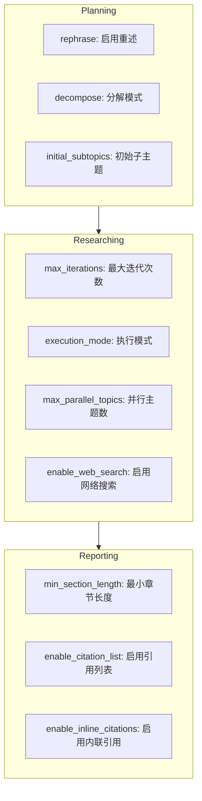
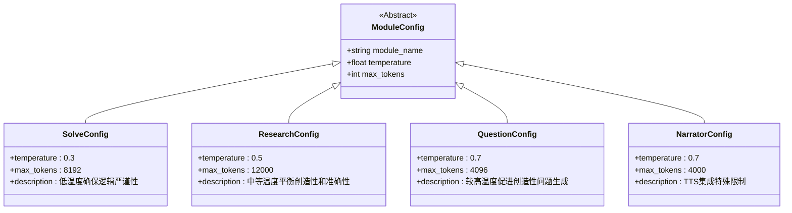
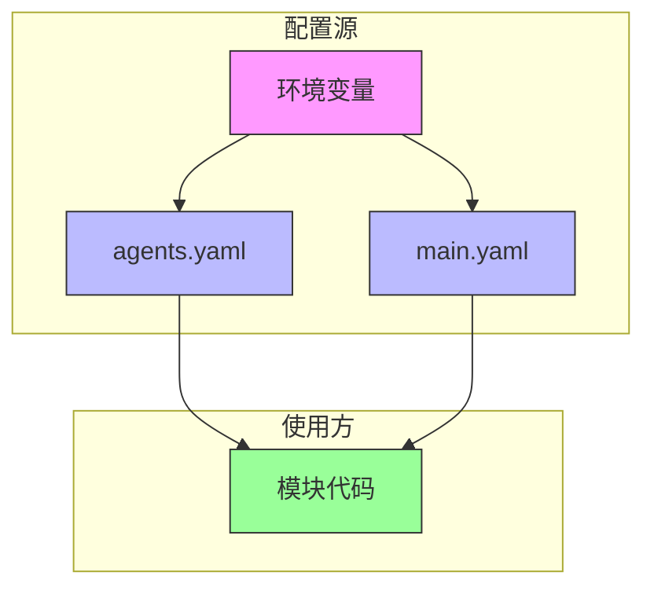
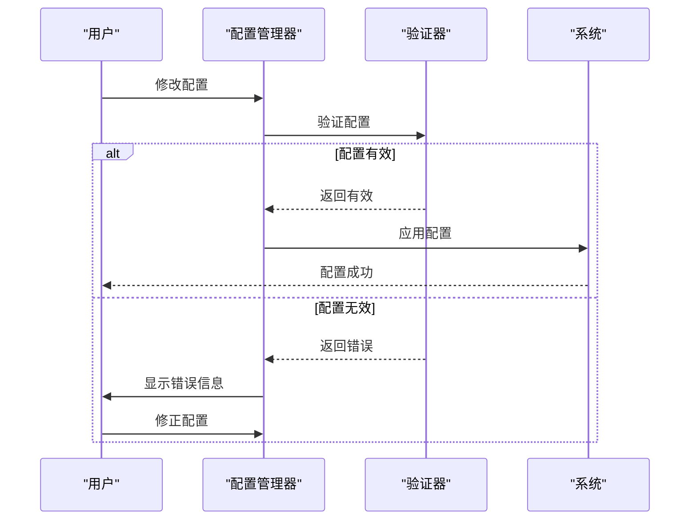

# 系统配置

<cite>
**本文档中引用的文件**  
- [main.yaml](file://config/main.yaml)
- [agents.yaml](file://config/agents.yaml)
- [.env.example](file://.env.example)
- [config_manager.py](file://src/utils/config_manager.py)
- [core.py](file://src/core/core.py)
- [setup.py](file://src/core/setup.py)
</cite>

## 目录
1. [配置架构概述](#配置架构概述)
2. [主配置文件详解](#主配置文件详解)
3. [智能体参数统一管理](#智能体参数统一管理)
4. [环境变量配置](#环境变量配置)
5. [配置加载机制](#配置加载机制)
6. [配置验证与错误处理](#配置验证与错误处理)
7. [配置示例与最佳实践](#配置示例与最佳实践)

## 配置架构概述

DeepTutor系统采用分层配置架构，通过多个配置文件协同工作，实现灵活且安全的系统配置。配置体系分为三个主要层级：环境变量、主配置文件和智能体参数配置文件。这种分层设计确保了敏感信息（如API密钥）与系统设置分离，同时提供了统一的参数管理机制。

系统配置架构遵循以下层次结构：
1. **环境变量**（`.env` 或 `DeepTutor.env`）：最高优先级，用于存储LLM API密钥、模型名称等敏感信息
2. **agents.yaml**：智能体参数的单一事实来源，集中管理所有模块的temperature和max_tokens
3. **main.yaml**：系统级共享配置，包含路径、日志、工具设置等全局参数

这种设计实现了配置的模块化和安全性，避免了敏感信息的硬编码，同时确保了参数管理的一致性。

**Section sources**
- [main.yaml](file://config/main.yaml#L1-L142)
- [agents.yaml](file://config/agents.yaml#L1-L55)
- [.env.example](file://.env.example#L1-L88)

## 主配置文件详解

### 服务器配置

`main.yaml`中的`server`部分定义了前后端服务器的端口设置，这是系统运行的基础配置。

```yaml
server:
  backend_port: 8001
  frontend_port: 3782
```

- **backend_port**: 后端API服务器端口（FastAPI/Uvicorn），默认8000
- **frontend_port**: 前端开发服务器端口（Next.js），默认3000

当端口未配置时，系统会显示详细的配置教程提示，指导用户在`main.yaml`中添加服务器配置。

**Section sources**
- [main.yaml](file://config/main.yaml#L1-L4)
- [setup.py](file://src/core/setup.py#L211-L241)

### 路径映射配置

`paths`部分定义了系统各模块的数据存储路径，确保数据组织的规范性和一致性。

```yaml
paths:
  user_data_dir: ./data/user
  knowledge_bases_dir: ./data/knowledge_bases
  user_log_dir: ./data/user/logs
  performance_log_dir: ./data/user/performance
  guide_output_dir: ./data/user/guide
  question_output_dir: ./data/user/question
  research_output_dir: ./data/user/research/cache
  research_reports_dir: ./data/user/research/reports
  solve_output_dir: ./data/user/solve
```

这些路径均为相对于项目根目录的相对路径，便于系统的移植和部署。系统启动时会自动初始化这些目录结构。

**Section sources**
- [main.yaml](file://config/main.yaml#L6-L16)
- [setup.py](file://src/core/setup.py#L57-L204)

### 日志级别配置

`logging`部分控制系统的日志输出行为，支持灵活的日志管理。

```yaml
logging:
  level: DEBUG
  save_to_file: true
  console_output: true
  lightrag_forwarding:
    enabled: true
    min_level: DEBUG
    add_prefix: true
    logger_names:
      knowledge_init: LightRAG-Init
      rag_tool: LightRAG
```

日志级别支持DEBUG、INFO、WARNING、ERROR和CRITICAL五个等级，可根据需要调整日志的详细程度。

**Section sources**
- [main.yaml](file://config/main.yaml#L30-L41)
- [core.py](file://src/core/core.py#L11-L22)

### 功能模块参数配置

#### 研究模块配置

研究模块包含planning、researching和reporting三个阶段的详细配置选项。



**Diagram sources**
- [main.yaml](file://config/main.yaml#L65-L94)
- [research_pipeline.py](file://src/agents/research/research_pipeline.py#L1-L188)

**Section sources**
- [main.yaml](file://config/main.yaml#L65-L94)
- [research_pipeline.py](file://src/agents/research/research_pipeline.py#L1-L188)

#### 研究模块阶段配置

**规划阶段 (planning)**:
- `rephrase`: 启用主题重述功能
- `decompose`: 子主题分解模式（auto/manual）
- `initial_subtopics`: 初始子主题数量
- `auto_max_subtopics`: 自动模式下的最大子主题数

**研究阶段 (researching)**:
- `max_iterations`: 最大迭代次数
- `execution_mode`: 执行模式（parallel/sequential）
- `max_parallel_topics`: 最大并行主题数
- `new_topic_min_score`: 新主题最小相似度分数
- 各类工具开关：RAG、论文搜索、网络搜索、代码执行等

**报告阶段 (reporting)**:
- `min_section_length`: 报告章节最小长度
- `enable_citation_list`: 是否启用引用列表
- `enable_inline_citations`: 是否启用内联引用

系统还提供了预设模式（presets），包括quick、medium、deep和auto四种模式，每种模式对应不同的研究深度和配置参数。

**Section sources**
- [main.yaml](file://config/main.yaml#L65-L141)
- [main.py](file://src/agents/research/main.py#L1-L188)

#### 其他模块配置

**求解模块 (solve)**:
- `max_solve_correction_iterations`: 最大修正迭代次数
- `enable_citations`: 是否启用引用
- `save_intermediate_results`: 是否保存中间结果
- 特定智能体参数：investigate_agent、precision_answer_agent等

**问题模块 (question)**:
- `max_rounds`: 最大问答轮次
- `rag_query_count`: RAG查询数量
- `max_parallel_questions`: 最大并行问题数
- 特定智能体参数：question_generation、question_validation等

**Section sources**
- [main.yaml](file://config/main.yaml#L43-L64)
- [main.yaml](file://config/main.yaml#L55-L64)

## 智能体参数统一管理

### agents.yaml配置机制

`agents.yaml`作为智能体参数的单一事实来源，集中管理所有模块的temperature和max_tokens设置。这种设计避免了在代码中硬编码这些参数，实现了参数的统一管理和维护。

```yaml
# Solve Module - 问题求解智能体
solve:
  temperature: 0.3
  max_tokens: 8192

# Research Module - 深度研究智能体
research:
  temperature: 0.5
  max_tokens: 12000

# Question Module - 问题生成智能体
question:
  temperature: 0.7
  max_tokens: 4096
```

每个模块共享一组参数，所有该模块的智能体都使用相同的temperature和max_tokens值。

**Section sources**
- [agents.yaml](file://config/agents.yaml#L1-L55)
- [core.py](file://src/core/core.py#L114-L167)

### 配置策略

不同模块采用不同的配置策略，以适应其特定的功能需求：



**Diagram sources**
- [agents.yaml](file://config/agents.yaml#L1-L55)
- [core.py](file://src/core/core.py#L114-L167)

**Section sources**
- [agents.yaml](file://config/agents.yaml#L1-L55)
- [core.py](file://src/core/core.py#L114-L167)

#### 各模块配置策略

**求解模块 (solve)**:
- **temperature: 0.3**：较低的温度值确保问题求解过程的逻辑严谨性和准确性
- **max_tokens: 8192**：较大的token限制支持复杂的推理过程

**研究模块 (research)**:
- **temperature: 0.5**：中等温度值在创造性和准确性之间取得平衡
- **max_tokens: 12000**：最大的token限制支持深度研究和长篇报告生成

**问题模块 (question)**:
- **temperature: 0.7**：较高的温度值促进创造性问题的生成
- **max_tokens: 4096**：适中的token限制满足问题生成需求

**叙述者智能体 (narrator)**:
- **temperature: 0.7**：较高的温度值使叙述更加自然流畅
- **max_tokens: 4000**：受限于OpenAI TTS API的字符限制

**Section sources**
- [agents.yaml](file://config/agents.yaml#L1-L55)
- [core.py](file://src/core/core.py#L114-L167)

## 环境变量配置

### LLM服务配置

`.env.example`文件定义了LLM服务的环境变量配置要求：

```env
# LLM服务提供商类型
LLM_BINDING=openai

# LLM模型名称
LLM_MODEL=

# LLM API端点URL
LLM_BINDING_HOST=

# LLM API认证密钥
LLM_BINDING_API_KEY=
```

这些环境变量是系统运行的必要条件，必须正确配置才能使用LLM功能。

**Section sources**
- [.env.example](file://.env.example#L14-L30)
- [core.py](file://src/core/core.py#L40-L73)

### 嵌入模型配置

嵌入模型用于语义搜索和RAG功能，其配置如下：

```env
# 嵌入服务提供商类型
EMBEDDING_BINDING=openai

# 嵌入模型名称
EMBEDDING_MODEL=text-embedding-3-large

# 嵌入向量维度
EMBEDDING_DIM=3072

# 嵌入API端点URL
EMBEDDING_BINDING_HOST=

# 嵌入API认证密钥
EMBEDDING_BINDING_API_KEY=
```

**Section sources**
- [.env.example](file://.env.example#L41-L56)
- [core.py](file://src/core/core.py#L170-L213)

### TTS服务配置

文本转语音服务配置如下：

```env
# TTS模型名称
TTS_MODEL=

# TTS API端点URL
TTS_URL=

# TTS API认证密钥
TTS_API_KEY=
```

目前系统主要支持阿里云DashScope TTS服务。

**Section sources**
- [.env.example](file://.env.example#L64-L71)
- [core.py](file://src/core/core.py#L75-L112)

### Web搜索配置

外部搜索API配置：

```env
# Perplexity API密钥
PERPLEXITY_API_KEY=
```

此密钥用于研究功能中的网络搜索能力。

**Section sources**
- [.env.example](file://.env.example#L79)
- [main.yaml](file://config/main.yaml#L26-L28)

## 配置加载机制

### 配置文件关系

系统配置文件之间存在明确的关系和加载顺序：



**Diagram sources**
- [core.py](file://src/core/core.py#L220-L262)
- [config_manager.py](file://src/utils/config_manager.py#L36-L56)

**Section sources**
- [core.py](file://src/core/core.py#L220-L262)
- [config_manager.py](file://src/utils/config_manager.py#L36-L56)

### 核心配置加载器

`src/core/core.py`中的`load_config_with_main`函数负责合并主配置和智能体配置：

```python
def load_config_with_main(config_file: str, project_root: Path | None = None) -> dict[str, Any]:
    """
    加载配置文件，自动合并main.yaml通用配置
    
    Args:
        config_file: 子模块配置文件名（如"solve_config.yaml"）
        project_root: 项目根目录（若为None，则尝试自动检测）
    
    Returns:
        合并后的配置字典
    """
    # 1. 加载main.yaml（通用配置）
    # 2. 加载子模块配置文件
    # 3. 合并配置：main.yaml为基础，子模块配置覆盖
    merged_config = _deep_merge(main_config, module_config)
    
    return merged_config
```

该函数实现了深度合并（deep merge），确保子模块配置能够正确覆盖主配置中的相应部分。

**Section sources**
- [core.py](file://src/core/core.py#L220-L262)
- [config_manager.py](file://src/utils/config_manager.py#L36-L56)

### 配置管理器

`src/utils/config_manager.py`中的`ConfigManager`类提供了线程安全的配置读写功能：

```python
class ConfigManager:
    """
    线程安全的配置文件读写管理器
    主要管理config/main.yaml和读取.env
    """
    
    def load_config(self, force_reload: bool = False) -> Dict[str, Any]:
        """加载配置文件"""
        
    def save_config(self, config: Dict[str, Any]) -> bool:
        """保存配置文件"""
        
    def get_env_info(self) -> Dict[str, str]:
        """读取环境变量信息"""
```

该管理器使用缓存机制，基于文件修改时间进行缓存管理，提高配置读取效率。

**Section sources**
- [config_manager.py](file://src/utils/config_manager.py#L9-L138)

## 配置验证与错误处理

### 配置验证机制

系统实现了多层次的配置验证机制，确保配置的完整性和正确性。



**Diagram sources**
- [config_validator.py](file://src/agents/solve/utils/config_validator.py#L13-L313)
- [core.py](file://src/core/core.py#L40-L112)

**Section sources**
- [config_validator.py](file://src/agents/solve/utils/config_validator.py#L13-L313)

### 错误处理机制

当关键配置缺失时，系统提供详细的错误提示和解决方案：

```python
def print_port_config_tutorial():
    """打印端口配置教程"""
    logger.error("PORT CONFIGURATION REQUIRED")
    logger.error("请在config/main.yaml中配置服务器端口:")
    logger.error("添加以下部分到config/main.yaml:")
    logger.error("  server:")
    logger.error("    backend_port: 8000")
    logger.error("    frontend_port: 3000")
```

对于LLM配置缺失，系统会提示具体的环境变量配置要求：

```python
if not model:
    raise ValueError("Error: LLM_MODEL未设置，请在.env文件中配置")
if not api_key:
    raise ValueError("Error: LLM_BINDING_API_KEY未设置，请在.env文件中配置")
if not base_url:
    raise ValueError("Error: LLM_BINDING_HOST未设置，请在.env文件中配置")
```

**Section sources**
- [setup.py](file://src/core/setup.py#L211-L241)
- [core.py](file://src/core/core.py#L60-L65)

## 配置示例与最佳实践

### 基础配置示例

**设置后端端口为8001**:
```yaml
server:
  backend_port: 8001
  frontend_port: 3782
```

**为研究模块配置temperature: 0.5**:
```yaml
research:
  temperature: 0.5
  max_tokens: 12000
```

**启用Web搜索功能**:
```yaml
tools:
  web_search:
    enabled: true
```

**Section sources**
- [main.yaml](file://config/main.yaml#L1-L142)
- [agents.yaml](file://config/agents.yaml#L1-L55)

### 初学者配置入门

对于初学者，建议按照以下步骤进行配置：

1. **复制环境变量文件**：
   ```bash
   cp .env.example .env
   ```

2. **编辑.env文件，填写必要信息**：
   ```env
   LLM_MODEL=gpt-4o
   LLM_BINDING_API_KEY=your_api_key_here
   LLM_BINDING_HOST=https://api.openai.com/v1
   ```

3. **配置服务器端口**：
   ```yaml
   # config/main.yaml
   server:
     backend_port: 8001
     frontend_port: 3000
   ```

4. **验证配置**：
   启动系统，检查是否正常运行

**Section sources**
- [.env.example](file://.env.example#L1-L88)
- [main.yaml](file://config/main.yaml#L1-L142)

### 高级性能调优建议

对于高级用户，可通过以下配置优化系统性能：

**调整研究深度**:
```yaml
research:
  planning:
    decompose:
      initial_subtopics: 8  # 增加初始子主题数
  researching:
    max_parallel_topics: 8  # 增加并行主题数
    max_iterations: 10      # 增加最大迭代次数
  reporting:
    min_section_length: 1000 # 增加最小章节长度
```

**优化智能体参数**:
```yaml
# 提高问题生成的创造性
question:
  temperature: 0.8
  max_tokens: 8192

# 增强求解的严谨性
solve:
  temperature: 0.2
  max_tokens: 16384
```

**启用性能监控**:
```yaml
logging:
  level: INFO
  performance_log_dir: ./data/user/performance
```

**Section sources**
- [main.yaml](file://config/main.yaml#L65-L141)
- [agents.yaml](file://config/agents.yaml#L1-L55)