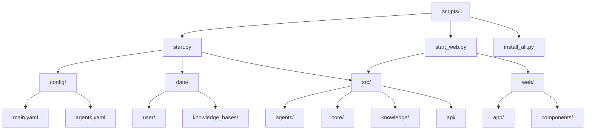
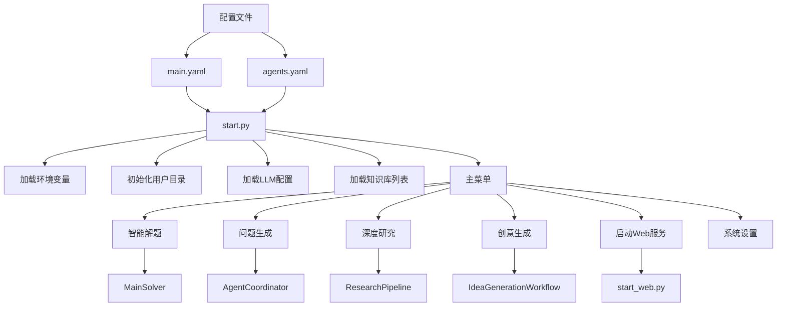
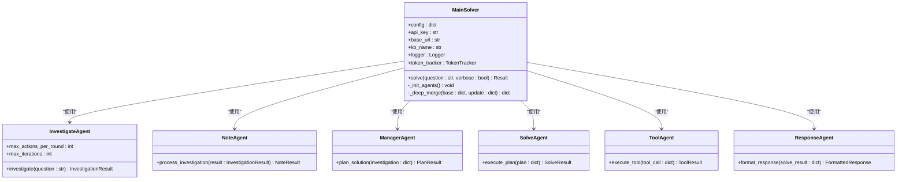
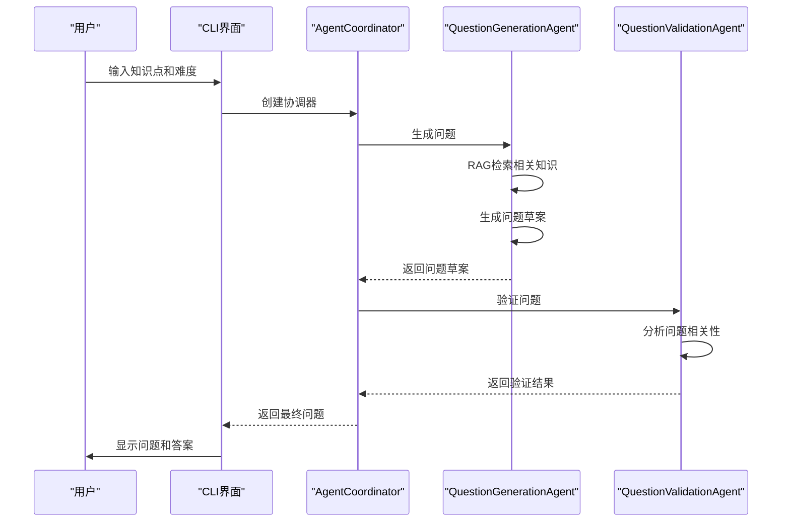
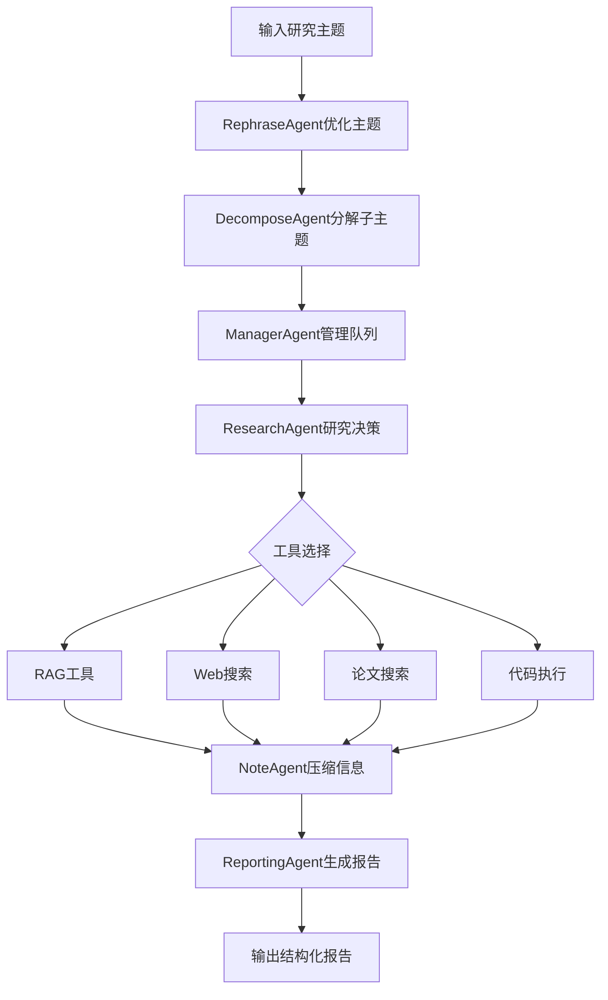
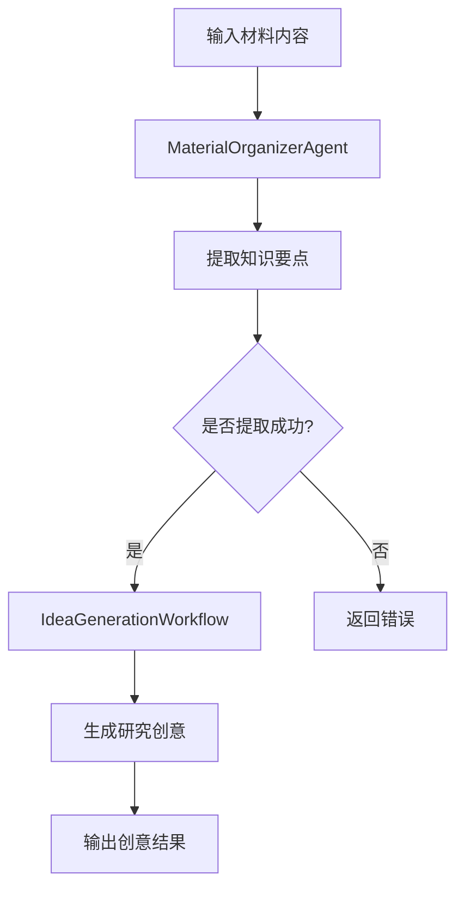
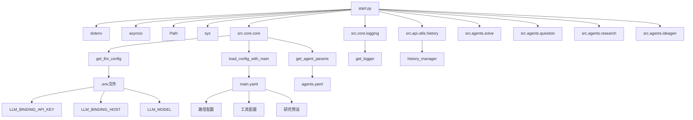

# CLI部署

<cite>
**本文档引用的文件**  
- [start.py](file://scripts/start.py)
- [start_web.py](file://scripts/start_web.py)
- [main.yaml](file://config/main.yaml)
- [agents.yaml](file://config/agents.yaml)
- [core.py](file://src/core/core.py)
- [setup.py](file://src/core/setup.py)
- [history.py](file://src/api/utils/history.py)
- [main_solver.py](file://src/agents/solve/main_solver.py)
- [research_pipeline.py](file://src/agents/research/research_pipeline.py)
- [idea_generation_workflow.py](file://src/agents/ideagen/idea_generation_workflow.py)
- [kb.py](file://src/knowledge/kb.py)
- [README.md](file://README.md)
</cite>

## 目录
1. [简介](#简介)
2. [项目结构](#项目结构)
3. [核心组件](#核心组件)
4. [架构概述](#架构概述)
5. [详细组件分析](#详细组件分析)
6. [依赖分析](#依赖分析)
7. [性能考虑](#性能考虑)
8. [故障排除指南](#故障排除指南)
9. [结论](#结论)

## 简介
DeepTutor是一个基于AI的个性化学习助手系统，提供命令行界面（CLI）和Web界面两种部署模式。本文档重点介绍通过`start.py`脚本启动CLI模式的方法，详细说明其支持的智能解题、问题生成、深度研究和创意生成等功能模式的执行流程、参数配置、输出机制及常见问题解决方案。

## 项目结构
DeepTutor项目采用模块化设计，主要目录包括`config`（配置文件）、`data`（数据存储）、`scripts`（启动脚本）、`src`（源代码）和`web`（前端代码）。CLI核心启动脚本位于`scripts/start.py`，负责初始化系统、加载配置并提供交互式菜单。



**Diagram sources**
- [start.py](file://scripts/start.py#L1-L808)
- [start_web.py](file://scripts/start_web.py#L1-L374)
- [main.yaml](file://config/main.yaml#L1-L142)

**Section sources**
- [start.py](file://scripts/start.py#L1-L808)
- [README.md](file://README.md#L1-L1359)

## 核心组件
CLI系统的核心是`AITutorStarter`类，它提供了主菜单、知识库选择、功能模式执行和系统设置等功能。系统通过`start.py`脚本启动，加载环境变量和配置文件，初始化日志系统和用户目录，并提供智能解题、问题生成、深度研究、创意生成、Web服务启动和系统设置等主要功能。

**Section sources**
- [start.py](file://scripts/start.py#L41-L786)
- [core.py](file://src/core/core.py#L40-L73)

## 架构概述
CLI系统采用模块化架构，通过`start.py`作为统一入口，调用不同模块的API实现各项功能。系统依赖`config/main.yaml`进行路径和工具配置，通过`config/agents.yaml`统一管理各模块的LLM参数，并利用`src/core/core.py`中的配置加载机制确保配置的一致性。



**Diagram sources**
- [start.py](file://scripts/start.py#L24-L742)
- [main.yaml](file://config/main.yaml#L1-L142)
- [agents.yaml](file://config/agents.yaml#L1-L55)

## 详细组件分析

### 智能解题模式分析
智能解题模式采用双循环架构（分析循环+求解循环），通过`MainSolver`类实现。用户输入问题后，系统首先进行深度分析，然后通过多智能体协作完成求解。



**Diagram sources**
- [main_solver.py](file://src/agents/solve/main_solver.py#L30-L200)
- [start.py](file://scripts/start.py#L143-L259)

**Section sources**
- [start.py](file://scripts/start.py#L143-L259)
- [main_solver.py](file://src/agents/solve/main_solver.py#L1-L779)

### 问题生成模式分析
问题生成模式通过`AgentCoordinator`协调问题生成和验证两个智能体，支持基于知识库的自定义问题生成和基于参考试卷的模仿生成。



**Diagram sources**
- [start.py](file://scripts/start.py#L260-L399)
- [question/__init__.py](file://src/agents/question/__init__.py#L1-L29)

**Section sources**
- [start.py](file://scripts/start.py#L260-L399)
- [question/__init__.py](file://src/agents/question/__init__.py#L1-L29)

### 深度研究模式分析
深度研究模式采用三阶段架构（规划→研究→报告），通过`ResearchPipeline`实现系统化的知识探索和文献综述。



**Diagram sources**
- [start.py](file://scripts/start.py#L401-L577)
- [research/main.py](file://src/agents/research/main.py#L1-L188)

**Section sources**
- [start.py](file://scripts/start.py#L401-L577)
- [research/main.py](file://src/agents/research/main.py#L1-L188)

### 创意生成模式分析
创意生成模式通过`IdeaGenerationWorkflow`从用户输入的材料中提取知识点并生成研究创意，支持跨领域知识合成。



**Diagram sources**
- [start.py](file://scripts/start.py#L578-L647)
- [idea_generation_workflow.py](file://src/agents/ideagen/idea_generation_workflow.py#L1-L100)

**Section sources**
- [start.py](file://scripts/start.py#L578-L647)
- [idea_generation_workflow.py](file://src/agents/ideagen/idea_generation_workflow.py#L1-L100)

## 依赖分析
CLI系统依赖多个配置文件和核心模块，通过`src/core/core.py`统一加载配置，确保系统各组件的协调工作。



**Diagram sources**
- [start.py](file://scripts/start.py#L11-L35)
- [core.py](file://src/core/core.py#L1-L200)
- [main.yaml](file://config/main.yaml#L1-L142)
- [agents.yaml](file://config/agents.yaml#L1-L55)

**Section sources**
- [start.py](file://scripts/start.py#L11-L35)
- [core.py](file://src/core/core.py#L1-L200)

## 性能考虑
CLI系统在设计时考虑了性能和资源管理，通过配置文件控制各模块的资源使用。`main.yaml`中的`max_parallel_topics`参数限制了并行研究主题的数量，`tool_timeout`设置了工具调用的超时时间，`max_iterations`限制了各阶段的最大迭代次数，防止无限循环。

系统还通过`PerformanceMonitor`跟踪性能指标，但默认情况下性能日志记录已禁用以避免创建不必要的目录。`TokenTracker`用于实时跟踪令牌使用情况，并通过`display_manager`更新状态。

## 故障排除指南
### 环境变量未配置
当出现"LLM_BINDING_API_KEY not set"等错误时，表示环境变量未正确配置。解决方案是创建`.env`文件并添加必要的API密钥：

```bash
cp .env.example .env
# 编辑.env文件，添加API密钥
```

### 依赖缺失
如果出现模块导入错误，需要确保所有依赖已安装：

```bash
# 使用自动化脚本安装
bash scripts/install_all.sh
# 或手动安装
pip install -r requirements.txt
npm install
```

### 知识库加载失败
当知识库加载失败时，检查`data/knowledge_bases`目录是否存在，以及`kb_config.json`配置文件是否正确。如果没有配置文件，系统会扫描目录中的子目录作为知识库。

### 端口配置问题
启动Web服务时可能出现端口配置错误，需要在`config/main.yaml`中配置端口：

```yaml
server:
  backend_port: 8000
  frontend_port: 3000
```

### Web服务启动失败
如果Web服务无法启动，检查`start_web.py`脚本中的npm路径，并确保Node.js已正确安装。脚本会自动检查npm可用性并在缺失时提示安装。

**Section sources**
- [start.py](file://scripts/start.py#L59-L62)
- [start_web.py](file://scripts/start_web.py#L128-L135)
- [setup.py](file://src/core/setup.py#L211-L240)
- [core.py](file://src/core/core.py#L60-L65)

## 结论
DeepTutor的CLI部署提供了一个功能强大且易于使用的命令行界面，支持智能解题、问题生成、深度研究和创意生成等多种模式。系统通过模块化设计和统一的配置管理，确保了各组件的协调工作和配置的一致性。通过`start.py`脚本，用户可以方便地访问所有核心功能，并通过交互式菜单进行操作。系统还提供了完善的错误处理和故障排除机制，确保了部署的稳定性和可靠性。