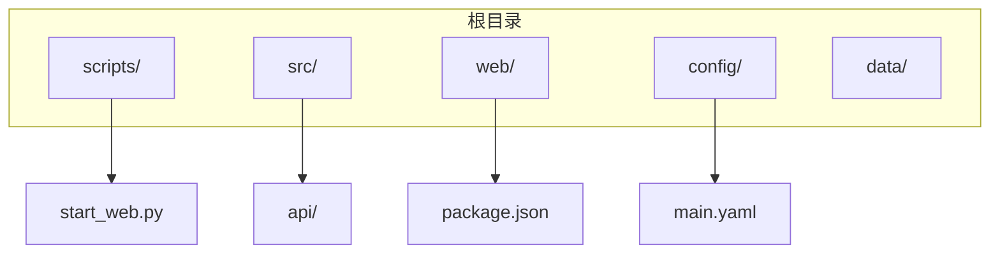
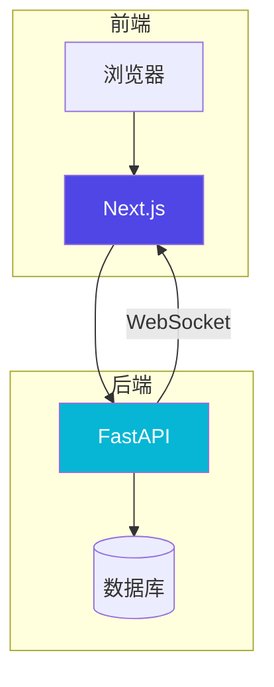
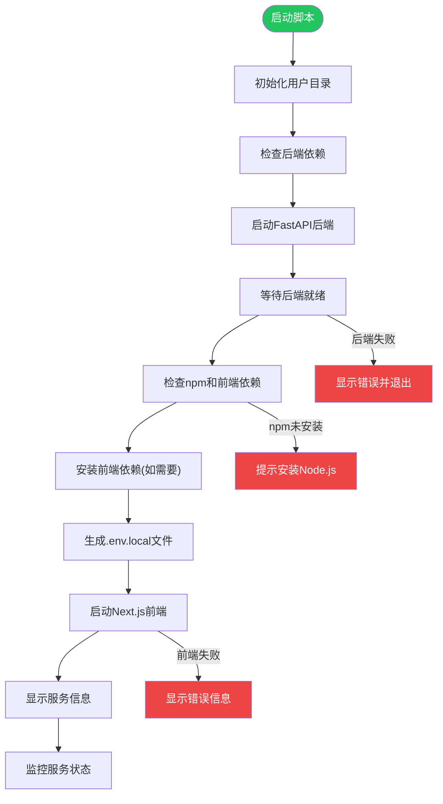
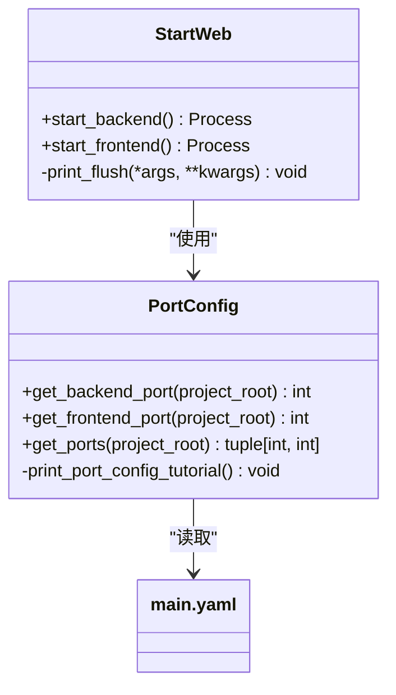
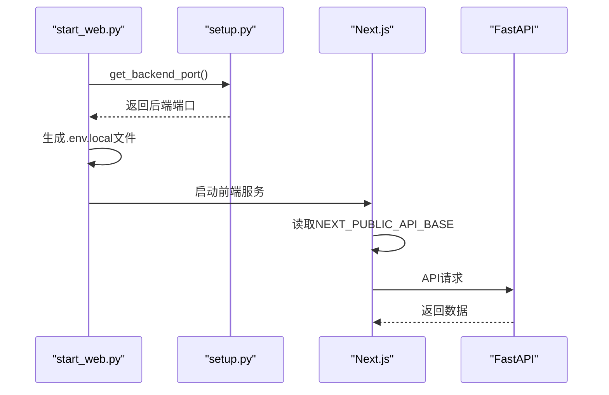
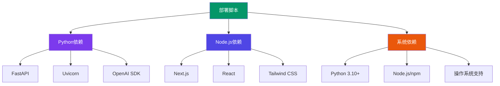

# Web服务部署

<cite>
**本文档引用的文件**  
- [start_web.py](file://scripts/start_web.py)
- [setup.py](file://src/core/setup.py)
- [main.yaml](file://config/main.yaml)
- [run_server.py](file://src/api/run_server.py)
- [.env.local](file://web/.env.local)
- [requirements.txt](file://requirements.txt)
- [package.json](file://web/package.json)
</cite>

## 目录
1. [简介](#简介)
2. [项目结构](#项目结构)
3. [核心组件](#核心组件)
4. [架构概述](#架构概述)
5. [详细组件分析](#详细组件分析)
6. [依赖分析](#依赖分析)
7. [性能考虑](#性能考虑)
8. [故障排除指南](#故障排除指南)
9. [结论](#结论)

## 简介
本文档详细介绍了DeepTutor项目的Web服务部署流程，重点说明如何通过`start_web.py`脚本启动全栈服务。该脚本能够同时启动FastAPI后端和Next.js前端服务，并处理服务间的协同工作机制。文档涵盖了端口配置、环境变量设置、依赖检查、健康检查和错误恢复等关键机制，并提供了从开发环境到生产环境的迁移指南。

## 项目结构
DeepTutor项目采用前后端分离的架构，主要包含以下目录结构：
- `scripts/`：包含启动和安装脚本
- `src/`：后端Python源代码
- `web/`：前端Next.js应用
- `config/`：配置文件
- `data/`：用户数据和知识库

**Diagram sources**
- [start_web.py](file://scripts/start_web.py#L1-L374)
- [main.yaml](file://config/main.yaml#L1-L142)

**Section sources**
- [start_web.py](file://scripts/start_web.py#L1-L374)
- [main.yaml](file://config/main.yaml#L1-L142)

## 核心组件
`start_web.py`脚本是整个部署流程的核心，负责协调前后端服务的启动。它通过调用`src.core.setup`模块获取端口配置，并确保用户数据目录的正确初始化。

**Section sources**
- [start_web.py](file://scripts/start_web.py#L1-L374)
- [setup.py](file://src/core/setup.py#L1-L346)

## 架构概述
DeepTutor采用现代化的全栈架构，后端使用FastAPI框架提供REST API，前端使用Next.js构建用户界面。两个服务通过HTTP和WebSocket进行通信。

**Diagram sources**
- [start_web.py](file://scripts/start_web.py#L1-L374)
- [main.py](file://src/api/main.py#L1-L129)

## 详细组件分析

### 启动脚本分析
`start_web.py`脚本实现了复杂的启动逻辑，包括依赖检查、端口配置和错误处理。

#### 启动流程图

**Diagram sources**
- [start_web.py](file://scripts/start_web.py#L1-L374)

#### 端口配置机制

**Diagram sources**
- [setup.py](file://src/core/setup.py#L243-L345)
- [main.yaml](file://config/main.yaml#L1-L3)

**Section sources**
- [setup.py](file://src/core/setup.py#L243-L345)
- [main.yaml](file://config/main.yaml#L1-L3)

### 前后端通信配置
脚本通过生成`.env.local`文件来配置前后端通信，确保前端能够正确访问后端API。

#### 环境变量配置流程

**Diagram sources**
- [start_web.py](file://scripts/start_web.py#L186-L203)
- [.env.local](file://web/.env.local#L1-L9)

## 依赖分析
部署过程涉及多个层次的依赖管理，包括Python包、Node.js包和系统级依赖。

**Diagram sources**
- [requirements.txt](file://requirements.txt#L1-L62)
- [package.json](file://web/package.json#L1-L41)

**Section sources**
- [requirements.txt](file://requirements.txt#L1-L62)
- [package.json](file://web/package.json#L1-L41)

## 性能考虑
部署脚本在设计时考虑了多个性能和可靠性因素，包括：
- 使用unbuffered输出确保日志实时性
- 合理的超时设置防止无限等待
- 并行处理能力优化启动速度
- 内存使用优化

## 故障排除指南
以下是部署过程中常见的问题及其解决方案：

### 常见问题及解决方案
| 问题 | 原因 | 解决方案 |
|------|------|---------|
| npm未找到 | Node.js未安装或不在PATH中 | 安装Node.js或添加到系统PATH |
| 端口冲突 | 指定端口已被占用 | 修改config/main.yaml中的端口配置 |
| 依赖安装失败 | 网络问题或权限不足 | 检查网络连接或使用管理员权限 |
| 后端启动失败 | 配置错误或依赖缺失 | 检查日志并验证依赖安装 |
| 前端无法连接后端 | API基础URL配置错误 | 验证.env.local文件内容 |

**Section sources**
- [start_web.py](file://scripts/start_web.py#L129-L135)
- [install_all.py](file://scripts/install_all.py#L121-L320)

### 错误恢复机制
脚本实现了多层次的错误检测和恢复机制：
1. 依赖检查：在启动前验证所有必要组件
2. 健康检查：启动后验证服务可用性
3. 自动恢复：尝试重新安装缺失的依赖
4. 优雅退出：清理资源并提供清晰的错误信息

## 结论
`start_web.py`脚本提供了一个完整、可靠的Web服务部署解决方案。通过自动化处理前后端服务的启动、配置和依赖管理，大大简化了开发和部署流程。建议用户在生产环境中根据具体需求调整端口配置和性能参数，并定期更新依赖以确保安全性和稳定性。