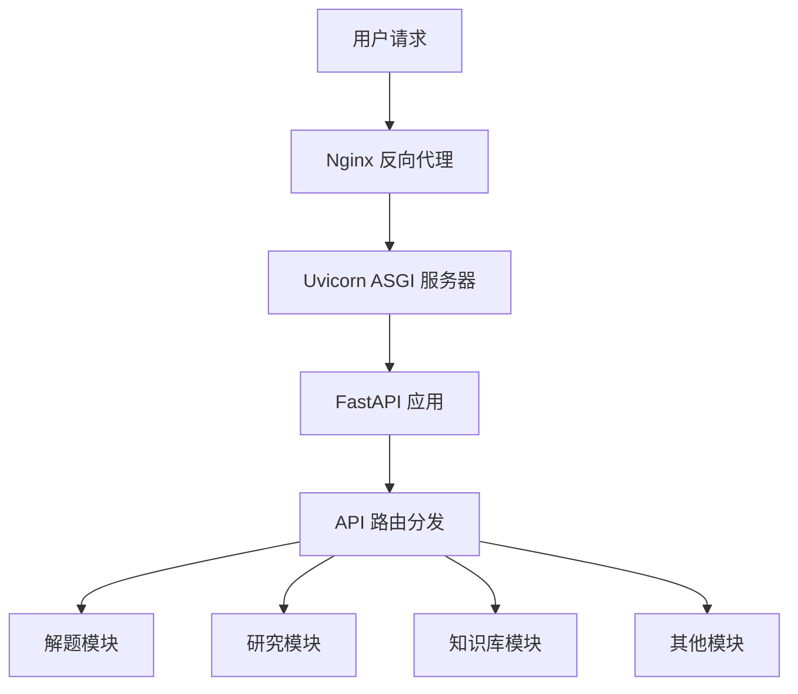
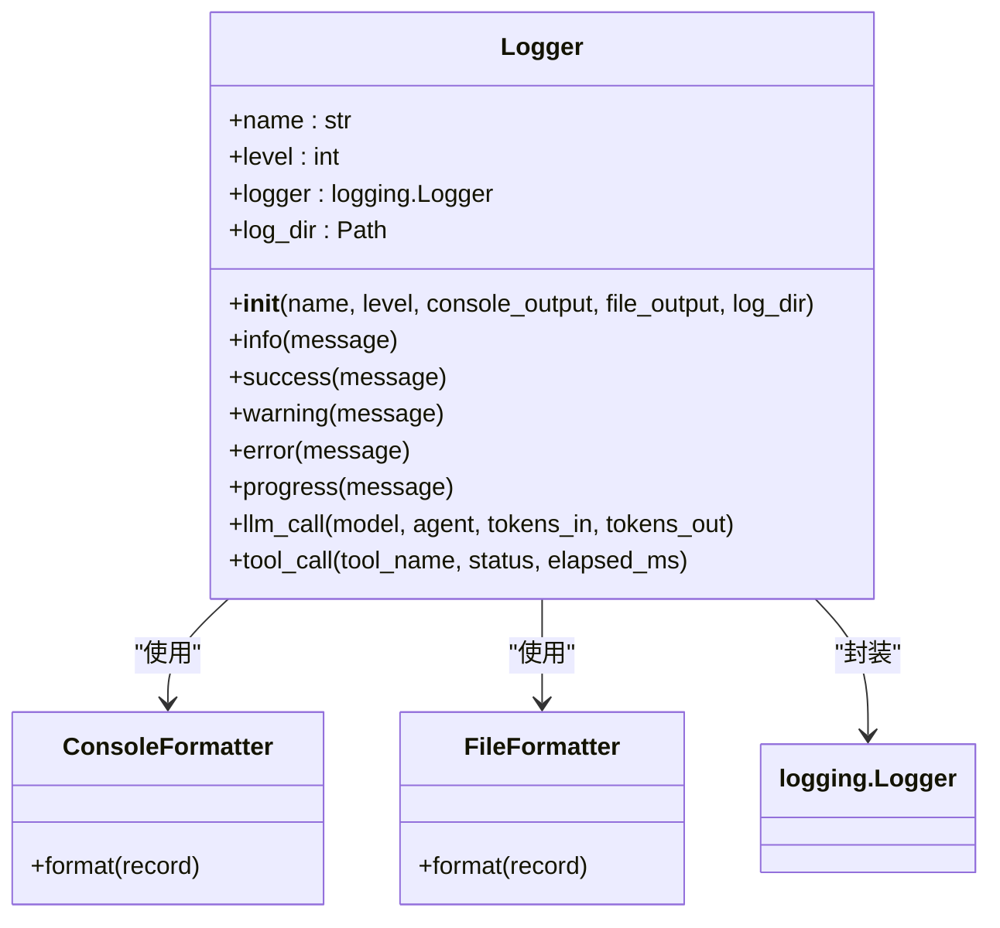

# 生产环境部署

<cite>
**本文档中引用的文件**  
- [start.py](file://scripts/start.py)
- [start_web.py](file://scripts/start_web.py)
- [run_server.py](file://src/api/run_server.py)
- [main.py](file://src/api/main.py)
- [main.yaml](file://config/main.yaml)
- [setup.py](file://src/core/setup.py)
- [logger.py](file://src/core/logging/logger.py)
- [requirements.txt](file://requirements.txt)
</cite>

## 目录
1. [简介](#简介)
2. [Uvicorn与FastAPI后端服务部署](#uvicorn与fastapi后端服务部署)
3. [日志管理与错误监控](#日志管理与错误监控)
4. [反向代理服务器配置](#反向代理服务器配置)
5. [容器化部署方案](#容器化部署方案)
6. [生产环境安全配置](#生产环境安全配置)
7. [从开发到生产的过渡指南](#从开发到生产的过渡指南)
8. [总结](#总结)

## 简介

DeepTutor 是一个基于多智能体协作和检索增强生成（RAG）技术的智能学习助手系统。本指南详细介绍了将 DeepTutor 部署到生产环境的最佳实践，涵盖了从后端服务运行、日志监控、反向代理配置到容器化部署和安全策略的各个方面。目标是为用户提供一个稳定、高效且安全的生产级部署方案。

**Section sources**
- [main.py](file://src/api/main.py#L1-L129)
- [start_web.py](file://scripts/start_web.py#L1-L374)

## Uvicorn与FastAPI后端服务部署

### 使用Uvicorn运行FastAPI服务

DeepTutor 的后端基于 FastAPI 框架构建，并通过 Uvicorn 作为 ASGI 服务器来运行。项目提供了多种启动方式，其中推荐在生产环境中使用 `run_server.py` 脚本，因为它通过 Python API 启动，避免了 Windows 系统下命令行路径解析的问题。

**推荐的启动参数与配置**

在 `src/api/run_server.py` 中，Uvicorn 的配置如下：

- **应用对象**: `"src.api.main:app"`，指定了 FastAPI 应用实例的导入路径。
- **主机地址**: `host="0.0.0.0"`，允许外部网络访问。
- **端口**: 通过 `get_backend_port()` 函数从 `config/main.yaml` 文件中动态读取，确保配置集中管理。
- **自动重载**: `reload=True`，在开发环境中非常有用，但在生产环境中应谨慎使用。DeepTutor 通过 `reload_excludes` 参数精心配置了排除列表，以避免因生成的输出文件（如研究、解题结果）触发不必要的服务重启。
- **日志级别**: `log_level="info"`，提供足够的运行时信息，同时避免过多的调试日志影响性能。



**Diagram sources**
- [run_server.py](file://src/api/run_server.py#L51-L59)
- [main.py](file://src/api/main.py#L39-L81)

### 进程管理与性能优化

为了确保后端服务的高可用性，建议使用专业的进程管理工具，如 `systemd` 或 `supervisord`。

**使用 systemd 管理服务**

创建一个 systemd 服务单元文件 `/etc/systemd/system/deeptutor-backend.service`：

```ini
[Unit]
Description=DeepTutor Backend Service
After=network.target

[Service]
Type=simple
User=deeptutor
WorkingDirectory=/path/to/DeepTutor
ExecStart=/path/to/venv/bin/python src/api/run_server.py
Restart=always
RestartSec=10
Environment=PYTHONUNBUFFERED=1
Environment=PYTHONUTF8=1

[Install]
WantedBy=multi-user.target
```

此配置确保服务在崩溃后自动重启，并设置了必要的环境变量以保证 UTF-8 编码的正确性。

**性能优化选项**

- **Gunicorn + Uvicorn 工人**: 在高并发场景下，可以使用 Gunicorn 作为进程管理器，搭配 Uvicorn 工人（workers）来实现多进程部署。例如：`gunicorn -k uvicorn.workers.UvicornWorker -w 4 src.api.main:app`。这可以充分利用多核 CPU。
- **异步处理**: DeepTutor 的核心逻辑（如研究、解题）大量使用 `async/await`，确保了 I/O 密集型操作（如调用 LLM API、网络搜索）的高效处理，避免阻塞主线程。

**Section sources**
- [run_server.py](file://src/api/run_server.py#L51-L59)
- [main.py](file://src/api/main.py#L26-L37)
- [setup.py](file://src/core/setup.py#L243-L334)

## 日志管理与错误监控

### 日志系统架构

DeepTutor 实现了一个统一的日志系统，位于 `src/core/logging/` 目录下。该系统提供了一致的格式和丰富的日志级别，便于调试和监控。

**日志级别与符号**

日志系统定义了多个级别，并使用特定符号进行可视化：
- `INFO`: ○ 信息
- `SUCCESS`: ✓ 成功
- `WARNING`: ⚠ 警告
- `ERROR`: ✗ 错误
- `PROGRESS`: → 进度
- `LLM_CALL`: ◇ LLM 调用

**日志输出**

日志同时输出到控制台和文件：
- **控制台**: 使用 `ConsoleFormatter`，带有颜色和符号，便于实时观察。
- **文件**: 使用 `FileFormatter`，包含时间戳、日志级别和模块名，格式为 `TIMESTAMP [LEVEL] [Module] Message`，保存在 `data/user/logs/` 目录下，按日期命名（如 `ai_tutor_20231001.log`）。



**Diagram sources**
- [logger.py](file://src/core/logging/logger.py#L104-L659)

### 错误监控策略

- **结构化日志**: 所有关键操作（如 LLM 调用、工具调用）都记录了详细的输入、输出和执行时间，便于事后分析错误原因。
- **异常捕获**: 在 `main.py` 的 `lifespan` 上下文管理器中，可以优雅地处理应用的启动和关闭事件。同时，FastAPI 的异常处理器应捕获所有未处理的异常，并将其记录为 `ERROR` 级别日志。
- **外部监控**: 建议将日志文件接入 ELK（Elasticsearch, Logstash, Kibana）或类似系统，实现日志的集中存储、搜索和可视化告警。

**Section sources**
- [logger.py](file://src/core/logging/logger.py#L104-L659)
- [main.py](file://src/api/main.py#L26-L37)

## 反向代理服务器配置

### Nginx 配置示例

Nginx 作为反向代理服务器，负责托管前端静态文件并代理 API 请求到后端服务。

**配置文件 `/etc/nginx/sites-available/deeptutor`**

```nginx
server {
    listen 80;
    server_name your-domain.com;

    # 托管前端静态文件
    location / {
        root /path/to/DeepTutor/web/.next;
        try_files $uri $uri/ /index.html;
    }

    # 代理API请求到Uvicorn后端
    location /api/ {
        proxy_pass http://127.0.0.1:8001/;
        proxy_set_header Host $host;
        proxy_set_header X-Real-IP $remote_addr;
        proxy_set_header X-Forwarded-For $proxy_add_x_forwarded_for;
        proxy_set_header X-Forwarded-Proto $scheme;
        proxy_http_version 1.1;
        proxy_set_header Upgrade $http_upgrade;
        proxy_set_header Connection "upgrade";
    }

    # 托管用户生成的输出文件
    location /api/outputs/ {
        alias /path/to/DeepTutor/data/user/;
        expires 1y;
        add_header Cache-Control "public, immutable";
    }
}
```

**关键点说明**:
- `location /` 将根路径的请求指向 Next.js 构建后的静态文件目录。
- `location /api/` 将所有以 `/api/` 开头的请求代理到运行在 `8001` 端口的 Uvicorn 服务。
- `location /api/outputs/` 使用 `alias` 指令，将 `/api/outputs/` 路径映射到 `data/user/` 目录，使前端可以直接访问后端生成的文件（如图片、PDF）。`expires` 和 `Cache-Control` 头部用于设置长期缓存，提升性能。

**Section sources**
- [main.py](file://src/api/main.py#L50-L67)

## 容器化部署方案

### Docker 镜像构建

创建 `Dockerfile` 来构建 DeepTutor 的后端镜像。

```Dockerfile
FROM python:3.10-slim

WORKDIR /app

# 复制依赖文件
COPY requirements.txt .

# 安装系统依赖和Python包
RUN apt-get update && apt-get install -y --no-install-recommends \
    && pip install --no-cache-dir -r requirements.txt \
    && apt-get autoremove -y && apt-get clean && rm -rf /var/lib/apt/lists/*

# 复制应用代码
COPY . .

# 创建非root用户
RUN useradd --create-home --shell /bin/bash app && chown -R app:app /app
USER app

# 设置环境变量
ENV PYTHONUNBUFFERED=1
ENV PYTHONUTF8=1

# 暴露端口
EXPOSE 8001

# 启动命令
CMD ["python", "src/api/run_server.py"]
```

**构建和运行**:
```bash
docker build -t deeptutor-backend .
docker run -d -p 8001:8001 --name deeptutor-app deeptutor-backend
```

### Kubernetes 部署配置

以下是一个简化的 Kubernetes 部署（Deployment）和 Service 配置示例。

**`deployment.yaml`**

```yaml
apiVersion: apps/v1
kind: Deployment
metadata:
  name: deeptutor-backend
spec:
  replicas: 3
  selector:
    matchLabels:
      app: deeptutor-backend
  template:
    metadata:
      labels:
        app: deeptutor-backend
    spec:
      containers:
      - name: backend
        image: deeptutor-backend:latest
        ports:
        - containerPort: 8001
        env:
        - name: PYTHONUNBUFFERED
          value: "1"
        - name: PYTHONUTF8
          value: "1"
        volumeMounts:
        - name: user-data
          mountPath: /app/data/user
      volumes:
      - name: user-data
        persistentVolumeClaim:
          claimName: deeptutor-pvc
---
apiVersion: v1
kind: Service
metadata:
  name: deeptutor-service
spec:
  selector:
    app: deeptutor-backend
  ports:
    - protocol: TCP
      port: 80
      targetPort: 8001
  type: LoadBalancer
```

此配置创建了一个包含 3 个副本的 Deployment，并通过一个 LoadBalancer 类型的 Service 暴露服务。`persistentVolumeClaim` 用于持久化存储用户数据（如日志、生成的文件）。

**Section sources**
- [requirements.txt](file://requirements.txt#L1-L62)
- [run_server.py](file://src/api/run_server.py#L21-L60)

## 生产环境安全配置

### API密钥保护

- **环境变量**: LLM 的 API 密钥必须通过 `.env` 或 `DeepTutor.env` 文件配置，这些文件应被 `.gitignore` 忽略，绝不能提交到版本控制系统。
- **Kubernetes Secrets**: 在 Kubernetes 环境中，应使用 `Secrets` 来管理 API 密钥，并通过环境变量注入到容器中。

### 请求速率限制

虽然 DeepTutor 本身未内置速率限制，但应在反向代理层（如 Nginx）或 API 网关层实现。

**Nginx 速率限制示例**:
```nginx
limit_req_zone $binary_remote_addr zone=api:10m rate=10r/s;

location /api/ {
    limit_req zone=api burst=20 nodelay;
    proxy_pass http://127.0.0.1:8001/;
    # ... 其他代理设置
}
```
此配置限制每个 IP 地址每秒最多 10 个请求，突发允许 20 个。

### 输入验证机制

- **FastAPI Pydantic**: DeepTutor 的 API 路由使用 Pydantic 模型进行请求体验证，确保了输入数据的类型和格式正确。
- **内容安全**: 对于用户提交的文本，应进行基本的恶意内容过滤。对于代码执行工具，其工作目录被严格限制在 `./data/user/run_code_workspace` 内，防止任意文件读写。

**Section sources**
- [main.py](file://src/api/main.py#L41-L48)
- [setup.py](file://src/core/setup.py#L21-L25)

## 从开发到生产的过渡指南

### 配置文件管理与环境隔离

DeepTutor 使用 `config/main.yaml` 作为核心配置文件。生产环境应维护独立的配置文件，与开发环境隔离。

**`config/main.yaml` (生产环境示例)**:
```yaml
server:
  backend_port: 8001
  frontend_port: 3000
logging:
  level: INFO # 生产环境使用INFO，减少DEBUG日志
  save_to_file: true
  console_output: false # 生产环境可关闭控制台输出，由日志系统接管
system:
  language: en
```

### 持续集成/持续部署 (CI/CD) 流程

一个典型的 CI/CD 流程如下：
1. **代码提交**: 开发者将代码推送到 Git 仓库。
2. **CI (持续集成)**:
   - 触发 CI 流水线（如 GitHub Actions）。
   - 运行代码格式化（Black, Ruff）和静态检查。
   - 执行单元测试。
   - 构建 Docker 镜像并推送到镜像仓库（如 Docker Hub, AWS ECR）。
3. **CD (持续部署)**:
   - 手动或自动触发部署。
   - 更新 Kubernetes 部署的镜像版本。
   - Kubernetes 滚动更新应用，确保服务不中断。

**Section sources**
- [main.yaml](file://config/main.yaml#L1-L142)
- [pyproject.toml](file://pyproject.toml#L1-L159)

## 总结

成功部署 DeepTutor 到生产环境需要综合考虑服务运行、日志监控、网络配置、容器化和安全策略。通过使用 Uvicorn 和 Gunicorn 确保高性能，利用 Nginx 进行高效的反向代理和静态文件服务，结合 Docker 和 Kubernetes 实现可扩展和高可用的部署，并通过严格的配置管理和安全措施保护系统。遵循本指南，可以构建一个稳定、可靠且安全的 DeepTutor 生产环境。