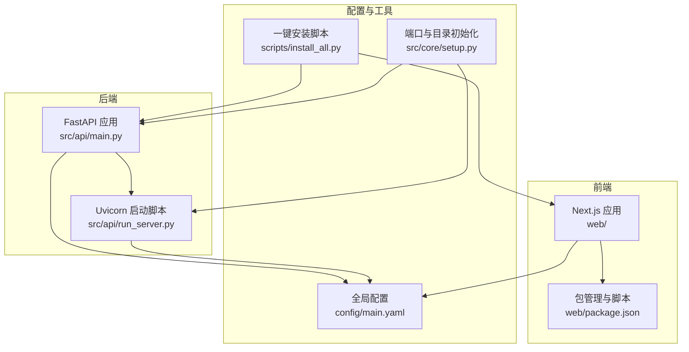
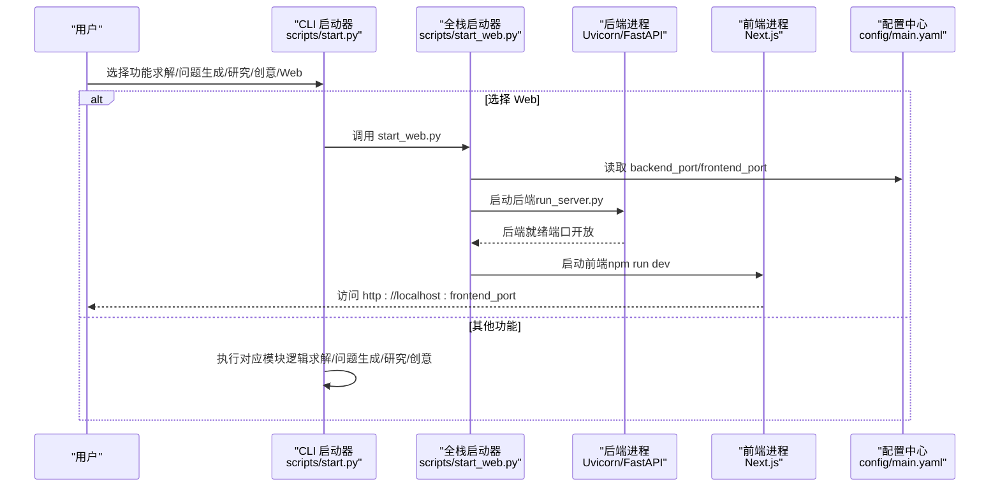
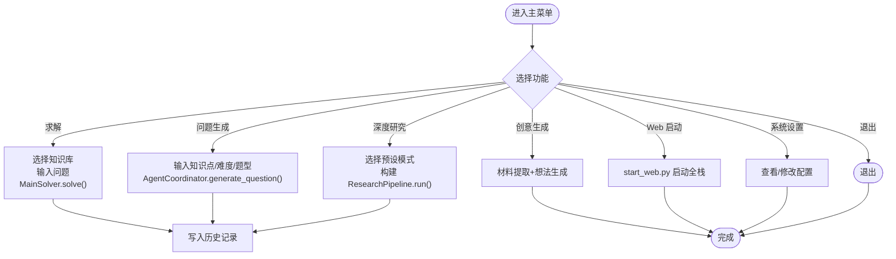
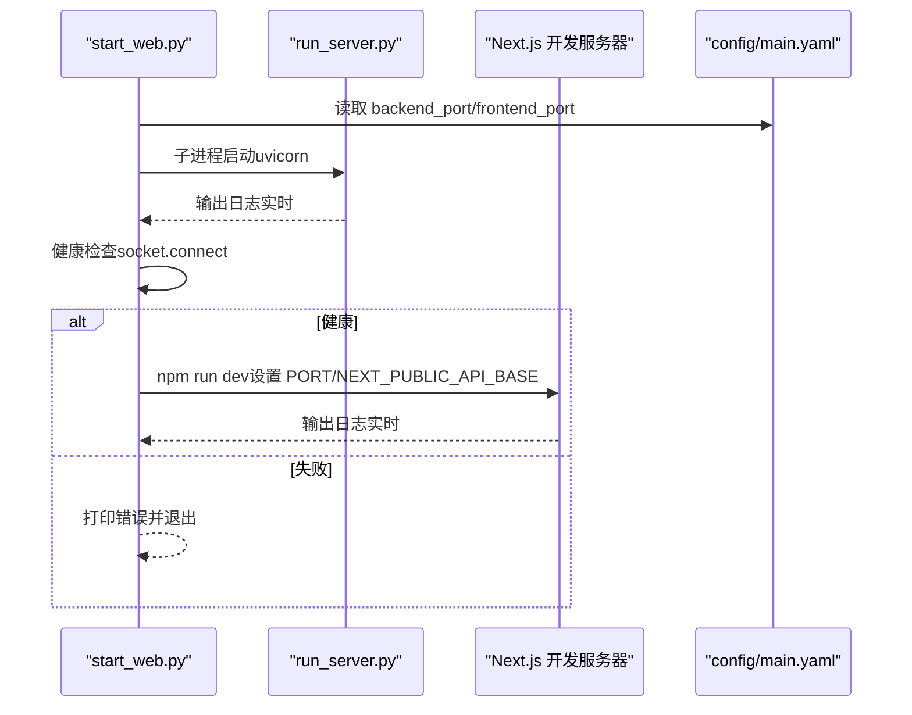
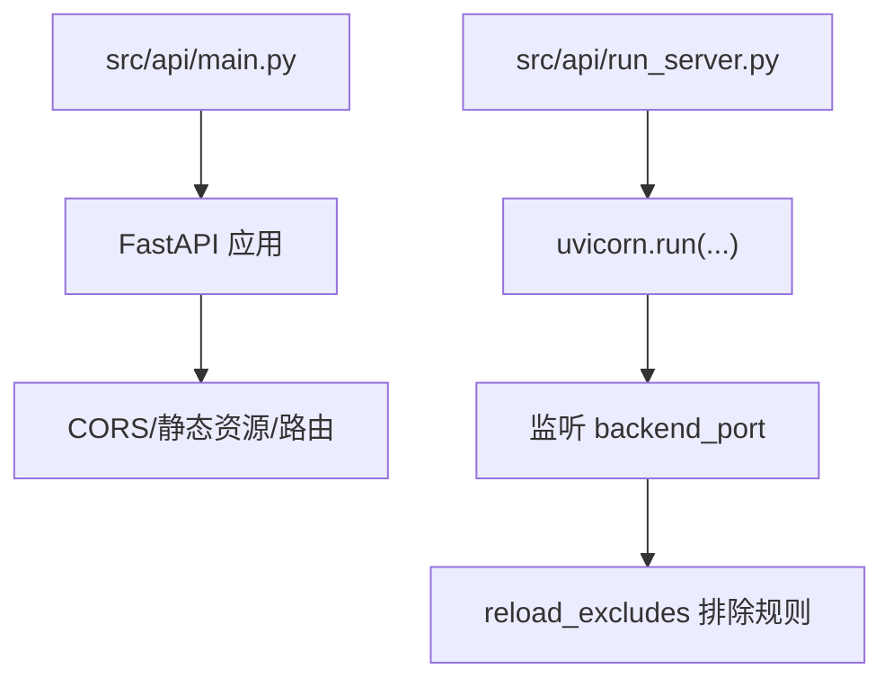
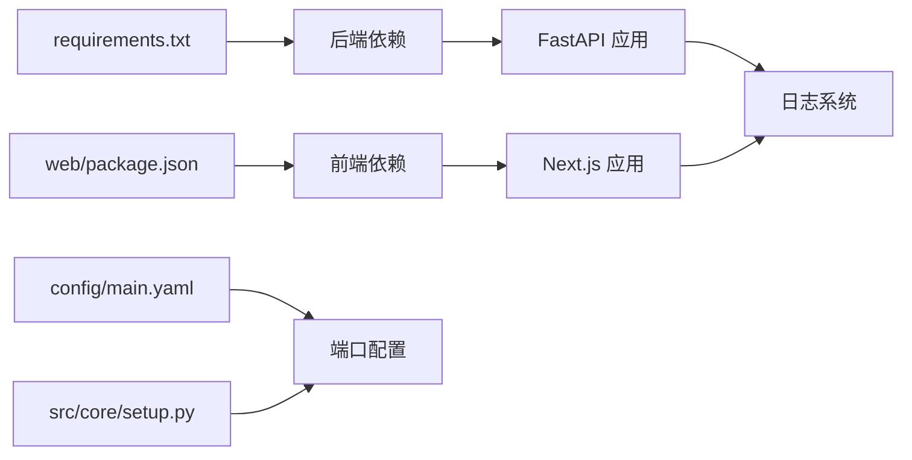

# 部署指南

<cite>
**本文引用的文件**
- [scripts/start.py](file://scripts/start.py)
- [scripts/start_web.py](file://scripts/start_web.py)
- [src/api/run_server.py](file://src/api/run_server.py)
- [src/api/main.py](file://src/api/main.py)
- [src/core/setup.py](file://src/core/setup.py)
- [config/main.yaml](file://config/main.yaml)
- [web/package.json](file://web/package.json)
- [web/.env.local](file://web/.env.local)
- [requirements.txt](file://requirements.txt)
- [src/core/logging/logger.py](file://src/core/logging/logger.py)
- [scripts/install_all.py](file://scripts/install_all.py)
</cite>

## 目录
1. [简介](#简介)
2. [项目结构](#项目结构)
3. [核心组件](#核心组件)
4. [架构总览](#架构总览)
5. [详细组件分析](#详细组件分析)
6. [依赖关系分析](#依赖关系分析)
7. [性能与生产部署建议](#性能与生产部署建议)
8. [故障排查指南](#故障排查指南)
9. [结论](#结论)
10. [附录：部署场景与最佳实践](#附录部署场景与最佳实践)

## 简介
本指南面向需要在本地或生产环境中部署 DeepTutor 的用户，系统性讲解以下内容：
- 通过 CLI 脚本启动 DeepTutor 的三种模式：求解、问题生成、深度研究，以及通过 start_web.py 启动全栈服务（前后端协同）。
- 使用 Uvicorn 运行 FastAPI 后端与使用 npm 启动 Next.js 前端的标准命令与参数。
- 生产环境部署最佳实践、常见问题与排障方法、日志与监控策略，以及从开发到生产的平滑过渡建议。

## 项目结构
DeepTutor 采用“Python 后端 + Next.js 前端”的双栈架构，配合统一的配置中心与日志系统：
- 后端：FastAPI 应用位于 src/api，通过 run_server.py 或直接 uvicorn 启动。
- 前端：Next.js 应用于 web 目录，通过 npm scripts 启动开发服务器。
- 配置：config/main.yaml 提供端口、路径、日志等级等全局配置。
- 启动脚本：scripts/start.py 提供 CLI 模式；scripts/start_web.py 提供一键启动前后端的服务编排。

图表来源
- [src/api/main.py](file://src/api/main.py#L1-L129)
- [src/api/run_server.py](file://src/api/run_server.py#L1-L60)
- [web/package.json](file://web/package.json#L1-L41)
- [config/main.yaml](file://config/main.yaml#L1-L20)
- [src/core/setup.py](file://src/core/setup.py#L243-L346)
- [scripts/install_all.py](file://scripts/install_all.py#L1-L200)

章节来源
- [src/api/main.py](file://src/api/main.py#L1-L129)
- [src/api/run_server.py](file://src/api/run_server.py#L1-L60)
- [web/package.json](file://web/package.json#L1-L41)
- [config/main.yaml](file://config/main.yaml#L1-L20)
- [src/core/setup.py](file://src/core/setup.py#L243-L346)
- [scripts/install_all.py](file://scripts/install_all.py#L1-L200)

## 核心组件
- CLI 启动器（scripts/start.py）
  - 提供求解、问题生成、深度研究、创意生成、Web 服务、系统设置等菜单项。
  - 自动加载 .env 并初始化用户数据目录，支持知识库选择与历史记录保存。
- 全栈启动器（scripts/start_web.py）
  - 统一获取端口、检查依赖、启动后端与前端，实时输出日志，健康检查与优雅停止。
- FastAPI 后端（src/api/main.py）
  - 定义路由、CORS、静态资源挂载、生命周期管理与用户目录初始化。
- Uvicorn 启动脚本（src/api/run_server.py）
  - 以 Python API 方式启动 Uvicorn，避免 Windows 路径解析问题，支持 reload 排除规则。
- 配置与端口管理（src/core/setup.py）
  - 从 config/main.yaml 读取 server.backend_port 与 server.frontend_port，提供错误提示与默认值回退。
- 日志系统（src/core/logging/logger.py）
  - 统一控制台与文件日志格式、级别、输出目录（默认 data/user/logs），支持任务级日志句柄。
- 依赖与安装（requirements.txt、web/package.json、scripts/install_all.py）
  - 后端依赖集中于 requirements.txt；前端依赖由 package.json 管理；install_all.py 提供一键安装与平台检测。

章节来源
- [scripts/start.py](file://scripts/start.py#L1-L808)
- [scripts/start_web.py](file://scripts/start_web.py#L1-L374)
- [src/api/main.py](file://src/api/main.py#L1-L129)
- [src/api/run_server.py](file://src/api/run_server.py#L1-L60)
- [src/core/setup.py](file://src/core/setup.py#L243-L346)
- [src/core/logging/logger.py](file://src/core/logging/logger.py#L1-L200)
- [requirements.txt](file://requirements.txt#L1-L62)
- [web/package.json](file://web/package.json#L1-L41)
- [scripts/install_all.py](file://scripts/install_all.py#L1-L200)

## 架构总览
下图展示从 CLI 到全栈服务的启动路径与交互关系。

图表来源
- [scripts/start.py](file://scripts/start.py#L740-L798)
- [scripts/start_web.py](file://scripts/start_web.py#L245-L374)
- [src/api/run_server.py](file://src/api/run_server.py#L20-L60)
- [config/main.yaml](file://config/main.yaml#L1-L10)

## 详细组件分析

### CLI 启动模式（求解/问题生成/深度研究/创意）
- 功能入口
  - 主菜单包含求解、问题生成、深度研究、创意生成、Web 启动、系统设置、退出。
- 求解模式
  - 选择知识库、输入问题、启动 MainSolver，输出统计信息与结果文件路径，写入历史。
- 问题生成模式
  - 输入知识点、难度、题型，调用 AgentCoordinator 生成题目与答案，输出到指定目录。
- 深度研究模式
  - 支持快速/标准/深度/自动四种预设，构建 ResearchPipeline，输出报告与统计。
- 创意生成模式
  - 对材料进行知识点抽取与研究想法生成。
- 系统设置
  - 展示 LLM 配置、可用知识库、配置文件位置，提示修改方式。

图表来源
- [scripts/start.py](file://scripts/start.py#L95-L140)
- [scripts/start.py](file://scripts/start.py#L143-L260)
- [scripts/start.py](file://scripts/start.py#L261-L400)
- [scripts/start.py](file://scripts/start.py#L401-L577)
- [scripts/start.py](file://scripts/start.py#L578-L647)
- [scripts/start.py](file://scripts/start.py#L703-L766)

章节来源
- [scripts/start.py](file://scripts/start.py#L95-L140)
- [scripts/start.py](file://scripts/start.py#L143-L260)
- [scripts/start.py](file://scripts/start.py#L261-L400)
- [scripts/start.py](file://scripts/start.py#L401-L577)
- [scripts/start.py](file://scripts/start.py#L578-L647)
- [scripts/start.py](file://scripts/start.py#L703-L766)

### 全栈服务启动（start_web.py）
- 端口配置
  - 从 config/main.yaml 读取 server.backend_port 与 server.frontend_port，若缺失则打印教程并退出。
- 后端启动
  - 通过子进程运行 src/api/run_server.py，设置编码与缓冲策略，实时输出日志线程。
- 健康检查
  - 循环尝试连接 localhost:backend_port，等待后端就绪。
- 前端启动
  - 检查 npm 是否存在，自动安装 node_modules（若不存在），生成 .env.local 写入 NEXT_PUBLIC_API_BASE，然后启动 npm run dev。
- 优雅停止
  - 捕获中断信号，分别终止前后端进程并等待退出。

图表来源
- [scripts/start_web.py](file://scripts/start_web.py#L20-L120)
- [scripts/start_web.py](file://scripts/start_web.py#L120-L243)
- [scripts/start_web.py](file://scripts/start_web.py#L245-L374)
- [src/api/run_server.py](file://src/api/run_server.py#L20-L60)
- [config/main.yaml](file://config/main.yaml#L1-L10)

章节来源
- [scripts/start_web.py](file://scripts/start_web.py#L20-L120)
- [scripts/start_web.py](file://scripts/start_web.py#L120-L243)
- [scripts/start_web.py](file://scripts/start_web.py#L245-L374)
- [src/api/run_server.py](file://src/api/run_server.py#L20-L60)
- [config/main.yaml](file://config/main.yaml#L1-L10)

### FastAPI 后端与 Uvicorn 启动
- 生命周期与静态资源
  - FastAPI 应用定义 CORS、静态资源挂载（/api/outputs 映射到 data/user）、路由注册与生命周期事件。
- Uvicorn 启动
  - run_server.py 以 Python API 方式启动，设置 reload_excludes 排除临时与输出目录，避免不必要的热重载。
- 端口与路径
  - 端口来自 src/core/setup.py 的 get_backend_port，路径来自 config/main.yaml。

图表来源
- [src/api/main.py](file://src/api/main.py#L1-L129)
- [src/api/run_server.py](file://src/api/run_server.py#L20-L60)
- [src/core/setup.py](file://src/core/setup.py#L243-L346)
- [config/main.yaml](file://config/main.yaml#L1-L10)

章节来源
- [src/api/main.py](file://src/api/main.py#L1-L129)
- [src/api/run_server.py](file://src/api/run_server.py#L20-L60)
- [src/core/setup.py](file://src/core/setup.py#L243-L346)
- [config/main.yaml](file://config/main.yaml#L1-L10)

## 依赖关系分析
- 后端依赖
  - requirements.txt 包含 FastAPI、Uvicorn、HTTP 客户端、LLM SDK、RAG 工具等。
- 前端依赖
  - web/package.json 定义 Next.js 与 UI/工具库，scripts/start_web.py 在启动前确保 node_modules 存在。
- 配置与端口
  - config/main.yaml 提供 server.backend_port 与 server.frontend_port；src/core/setup.py 提供读取与错误提示。
- 日志
  - src/core/logging/logger.py 统一日志格式与输出目录，默认 data/user/logs。

图表来源
- [requirements.txt](file://requirements.txt#L1-L62)
- [web/package.json](file://web/package.json#L1-L41)
- [config/main.yaml](file://config/main.yaml#L1-L10)
- [src/core/setup.py](file://src/core/setup.py#L243-L346)
- [src/core/logging/logger.py](file://src/core/logging/logger.py#L140-L200)

章节来源
- [requirements.txt](file://requirements.txt#L1-L62)
- [web/package.json](file://web/package.json#L1-L41)
- [config/main.yaml](file://config/main.yaml#L1-L10)
- [src/core/setup.py](file://src/core/setup.py#L243-L346)
- [src/core/logging/logger.py](file://src/core/logging/logger.py#L140-L200)

## 性能与生产部署建议
- 后端运行
  - 使用 Uvicorn 的生产模式（非 --reload），结合反向代理（如 Nginx）与进程管理（如 systemd/Gunicorn）。
  - 合理设置 reload_excludes，避免频繁热重载导致的 I/O 压力。
- 前端运行
  - 使用 npm run build 生成静态产物，再以 npm run start 启动生产服务器。
- 资源与缓存
  - 将大文件输出目录（如 data/user/research/reports、data/user/solve）置于独立磁盘或卷，避免与系统盘争用。
- 并发与限流
  - 在网关层对 API 设置速率限制与超时，防止突发流量压垮后端。
- 安全
  - 严格限制 CORS 允许来源，生产环境不要使用通配符。
  - 环境变量敏感信息通过后端 API 更新并在进程内生效，不持久化至 .env 文件。

[本节为通用建议，无需特定文件来源]

## 故障排查指南
- 端口冲突
  - 症状：后端或前端无法启动，提示端口占用。
  - 解决：修改 config/main.yaml 中的 server.backend_port/server.frontend_port，确保未被其他应用占用。
  - 参考：src/core/setup.py 的 get_backend_port/get_frontend_port/print_port_config_tutorial。
- 依赖缺失
  - 症状：pip 安装失败、npm 未找到。
  - 解决：先执行 scripts/install_all.py 完成一键安装；若仍失败，手动 pip install -r requirements.txt 与 npm install。
  - 参考：scripts/install_all.py、requirements.txt、web/package.json。
- 环境变量未配置
  - 症状：LLM 配置加载失败、API 报错。
  - 解决：在 .env 或 DeepTutor.env 中配置所需变量；或通过后端 /api/v1/settings/env 接口在线更新。
  - 参考：scripts/start.py 的 LLM 配置加载与错误提示。
- 日志定位
  - 默认日志目录：data/user/logs/，按日期分文件；可调整 config/main.yaml 中 logging.level 与 paths.user_log_dir。
  - 参考：src/core/logging/logger.py 的日志目录与格式。

章节来源
- [src/core/setup.py](file://src/core/setup.py#L211-L241)
- [src/core/setup.py](file://src/core/setup.py#L243-L346)
- [scripts/install_all.py](file://scripts/install_all.py#L1-L200)
- [requirements.txt](file://requirements.txt#L1-L62)
- [web/package.json](file://web/package.json#L1-L41)
- [scripts/start.py](file://scripts/start.py#L41-L70)
- [src/core/logging/logger.py](file://src/core/logging/logger.py#L140-L200)
- [config/main.yaml](file://config/main.yaml#L1-L20)

## 结论
通过 CLI 与全栈启动器，DeepTutor 提供了从单模块到全栈的一键部署体验。生产部署建议采用 Uvicorn 生产模式与 Next.js 生产启动，配合严格的端口与 CORS 策略、完善的日志与监控体系，确保稳定与可观测性。遇到常见问题时，优先检查端口、依赖与环境变量配置，并利用内置日志定位根因。

[本节为总结，无需特定文件来源]

## 附录：部署场景与最佳实践

### 场景一：仅启动后端 API 服务
- 使用 Uvicorn 直接启动后端
  - 命令：python -m uvicorn src.api.main:app --host 0.0.0.0 --port 8000 --reload
  - 参数说明：host、port、reload 控制热重载；reload_excludes 可在 run_server.py 中配置。
- 生产模式
  - 去掉 --reload，使用反向代理与进程管理器托管。

章节来源
- [src/api/run_server.py](file://src/api/run_server.py#L20-L60)
- [src/api/main.py](file://src/api/main.py#L88-L129)

### 场景二：前后端分离部署
- 后端（FastAPI + Uvicorn）
  - 通过 config/main.yaml 配置 backend_port，使用 run_server.py 或 uvicorn 直启。
- 前端（Next.js）
  - npm run build 生成静态产物，npm run start 启动生产服务器；或使用 npm run dev 进行开发。
  - 通过 .env.local 或环境变量 NEXT_PUBLIC_API_BASE 指向后端地址。

章节来源
- [config/main.yaml](file://config/main.yaml#L1-L10)
- [src/api/run_server.py](file://src/api/run_server.py#L20-L60)
- [web/package.json](file://web/package.json#L1-L41)
- [web/.env.local](file://web/.env.local#L1-L10)

### 场景三：一键启动全栈服务
- 使用 scripts/start_web.py
  - 自动读取 config/main.yaml 端口，启动后端与前端，实时输出日志，健康检查与优雅停止。
- 适用：开发调试、快速验证。

章节来源
- [scripts/start_web.py](file://scripts/start_web.py#L245-L374)

### 服务监控与日志管理
- 日志存储
  - 默认路径：data/user/logs/，按日期命名文件。
- 日志级别
  - 可在 config/main.yaml 中设置 logging.level；也可通过 get_logger 的 level 参数动态调整。
- 日志转发
  - 可启用 lightrag_forwarding 等转发配置，将特定模块日志转发至外部系统。

章节来源
- [src/core/logging/logger.py](file://src/core/logging/logger.py#L140-L200)
- [config/main.yaml](file://config/main.yaml#L30-L41)

### 从开发到生产的平滑过渡
- 端口与网络
  - 开发：使用 scripts/start_web.py 自动分配端口；生产：固定端口并通过反向代理暴露。
- 依赖与版本
  - 使用 requirements.txt 与 package.json 锁定版本；生产使用 npm ci 与 pip install --no-cache-dir。
- 安全加固
  - 限制 CORS 来源，敏感环境变量通过后端 API 更新并在进程内生效。
- 性能优化
  - 后端：合理设置并发 worker 数量；前端：开启静态资源缓存与 CDN。
- 可观测性
  - 结合日志、指标与链路追踪，建立告警与回放能力。

[本节为通用建议，无需特定文件来源]