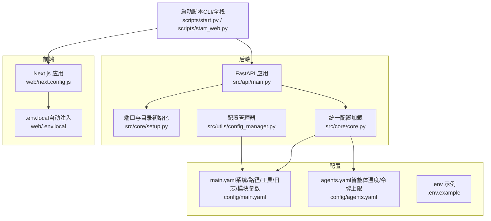
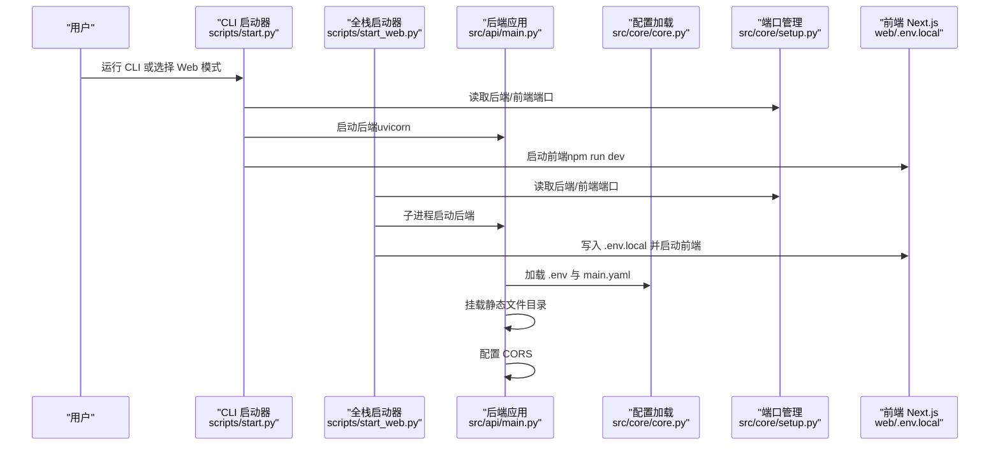
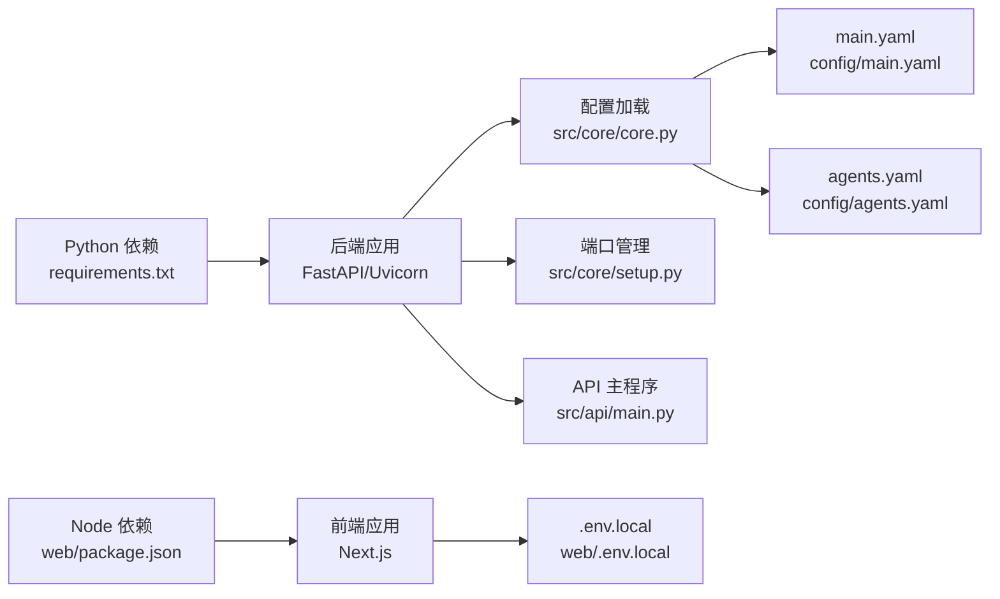

# 配置与部署

<cite>
**本文引用的文件**
- [config/main.yaml](file://config/main.yaml)
- [config/agents.yaml](file://config/agents.yaml)
- [scripts/start.py](file://scripts/start.py)
- [scripts/start_web.py](file://scripts/start_web.py)
- [src/core/setup.py](file://src/core/setup.py)
- [src/core/core.py](file://src/core/core.py)
- [src/api/main.py](file://src/api/main.py)
- [.env.example](file://.env.example)
- [web/.env.local](file://web/.env.local)
- [web/next.config.js](file://web/next.config.js)
- [requirements.txt](file://requirements.txt)
- [pyproject.toml](file://pyproject.toml)
- [src/utils/config_manager.py](file://src/utils/config_manager.py)
</cite>

## 目录
1. [简介](#简介)
2. [项目结构](#项目结构)
3. [核心组件](#核心组件)
4. [架构总览](#架构总览)
5. [详细组件分析](#详细组件分析)
6. [依赖关系分析](#依赖关系分析)
7. [性能考虑](#性能考虑)
8. [故障排查指南](#故障排查指南)
9. [结论](#结论)
10. [附录](#附录)

## 简介
本章节面向初学者与有经验的开发者，系统性说明 DeepTutor 的配置与部署流程。内容覆盖：
- 如何配置系统设置、智能体参数与环境变量
- 来自实际配置文件的具体示例（例如服务器端口配置）
- 部署拓扑、环境要求与最佳实践
- 常见配置问题及解决方案
- 生产环境部署指南（含 CORS 配置与静态文件服务）

## 项目结构
DeepTutor 采用“后端 Python + 前端 Next.js”的双栈架构，通过统一的配置中心与启动脚本实现一键式本地开发与部署。

图表来源
- [src/api/main.py](file://src/api/main.py#L1-L129)
- [src/core/setup.py](file://src/core/setup.py#L206-L346)
- [src/core/core.py](file://src/core/core.py#L20-L357)
- [src/utils/config_manager.py](file://src/utils/config_manager.py#L1-L138)
- [config/main.yaml](file://config/main.yaml#L1-L142)
- [config/agents.yaml](file://config/agents.yaml#L1-L55)
- [scripts/start.py](file://scripts/start.py#L1-L808)
- [scripts/start_web.py](file://scripts/start_web.py#L1-L374)
- [web/.env.local](file://web/.env.local#L1-L10)
- [web/next.config.js](file://web/next.config.js#L1-L26)

章节来源
- [scripts/start.py](file://scripts/start.py#L1-L808)
- [scripts/start_web.py](file://scripts/start_web.py#L1-L374)
- [src/api/main.py](file://src/api/main.py#L1-L129)
- [src/core/setup.py](file://src/core/setup.py#L206-L346)
- [src/core/core.py](file://src/core/core.py#L20-L357)
- [config/main.yaml](file://config/main.yaml#L1-L142)
- [config/agents.yaml](file://config/agents.yaml#L1-L55)
- [web/.env.local](file://web/.env.local#L1-L10)
- [web/next.config.js](file://web/next.config.js#L1-L26)

## 核心组件
- 统一配置加载与合并：后端通过统一入口读取 .env 并合并 config/main.yaml，再按模块拆分传递给各子系统。
- 智能体参数集中管理：config/agents.yaml 提供温度与最大令牌上限的单一可信源，避免硬编码。
- 启动与端口管理：scripts/start.py 与 scripts/start_web.py 负责用户交互与前后端进程启动；端口由 src/core/setup.py 从 config/main.yaml 读取。
- 静态文件服务：后端挂载用户输出目录为静态资源根，便于前端直接访问生成产物。
- CORS 与安全：默认允许所有来源，生产环境建议限定来源。

章节来源
- [src/core/core.py](file://src/core/core.py#L20-L357)
- [config/agents.yaml](file://config/agents.yaml#L1-L55)
- [scripts/start.py](file://scripts/start.py#L1-L808)
- [scripts/start_web.py](file://scripts/start_web.py#L1-L374)
- [src/core/setup.py](file://src/core/setup.py#L206-L346)
- [src/api/main.py](file://src/api/main.py#L1-L129)

## 架构总览
下图展示从配置到运行的关键链路与数据流。

图表来源
- [scripts/start.py](file://scripts/start.py#L648-L768)
- [scripts/start_web.py](file://scripts/start_web.py#L1-L374)
- [src/api/main.py](file://src/api/main.py#L1-L129)
- [src/core/core.py](file://src/core/core.py#L20-L357)
- [src/core/setup.py](file://src/core/setup.py#L243-L335)
- [web/.env.local](file://web/.env.local#L1-L10)

## 详细组件分析

### 系统设置与路径配置（config/main.yaml）
- 服务器端口
  - 后端端口：server.backend_port
  - 前端端口：server.frontend_port
- 路径与输出
  - 用户数据目录：paths.user_data_dir
  - 知识库目录：paths.knowledge_bases_dir
  - 日志与报告目录：paths.user_log_dir、paths.performance_log_dir、paths.research_reports_dir 等
- 工具配置
  - RAG 工具：tools.rag_tool.default_kb、kb_base_dir
  - 代码执行：tools.run_code.allowed_roots、workspace
  - 外部搜索：tools.web_search.enabled、tools.query_item.enabled/max_results
- 日志与转发
  - 日志级别与输出：logging.level、logging.save_to_file、logging.console_output
  - LightRAG 日志转发：logging.lightrag_forwarding.*
- 语音合成（TTS）
  - 默认音色：tts.default_voice
- 模块级参数
  - 问题生成/验证：question.max_rounds、question.rag_query_count、question.max_parallel_questions、question.rag_mode、question.agents.*
  - 解题流程：solve.max_solve_correction_iterations、enable_citations、save_intermediate_results、solve.agents.*
  - 深度研究：research.planning.*、research.researching.*、research.reporting.*、research.rag.*、research.queue.*、research.presets.*

章节来源
- [config/main.yaml](file://config/main.yaml#L1-L142)

### 智能体参数（config/agents.yaml）
- 温度与最大令牌上限集中定义，模块化复用，避免分散硬编码
- 模块覆盖范围：solve、research、question、guide、ideagen、co_writer、narrator
- narrator 独立配置：受限于 TTS API 字符限制，max_tokens 限制为 4000

章节来源
- [config/agents.yaml](file://config/agents.yaml#L1-L55)

### 环境变量与加载（.env.example 与 src/core/core.py）
- LLM 配置：LLM_BINDING、LLM_MODEL、LLM_BINDING_HOST、LLM_BINDING_API_KEY、DISABLE_SSL_VERIFY
- 嵌入模型：EMBEDDING_BINDING、EMBEDDING_MODEL、EMBEDDING_DIM、EMBEDDING_BINDING_HOST、EMBEDDING_BINDING_API_KEY
- TTS 配置：TTS_MODEL、TTS_URL、TTS_API_KEY、TTS_VOICE
- 外部搜索：PERPLEXITY_API_KEY
- 日志：RAG_TOOL_MODULE_LOG_LEVEL
- 加载顺序：优先加载 DeepTutor.env，其次 .env，均不覆盖已存在的环境变量

章节来源
- [.env.example](file://.env.example#L1-L88)
- [src/core/core.py](file://src/core/core.py#L10-L72)

### 启动与端口管理（scripts/start.py 与 scripts/start_web.py）
- CLI 启动器
  - 初始化用户目录、加载 LLM 配置、显示可用知识库列表
  - 支持启动后端 API、前端、或两者
- 全栈启动器
  - 读取 config/main.yaml 中的 server.backend_port 与 server.frontend_port
  - 自动写入 web/.env.local（NEXT_PUBLIC_API_BASE），确保前端可直连后端
  - 后端健康检查与实时日志输出
  - Windows/Unix 编码与缓冲处理

章节来源
- [scripts/start.py](file://scripts/start.py#L1-L808)
- [scripts/start_web.py](file://scripts/start_web.py#L1-L374)
- [web/.env.local](file://web/.env.local#L1-L10)

### 端口读取与校验（src/core/setup.py）
- get_backend_port()/get_frontend_port() 从 config/main.yaml 读取端口
- 若缺失，打印端口配置教程并退出
- get_ports() 返回二元组，供启动器使用

章节来源
- [src/core/setup.py](file://src/core/setup.py#L243-L335)

### 后端 API 配置（src/api/main.py）
- CORS
  - 默认允许所有来源（开发便利），生产环境需改为具体来源
- 静态文件服务
  - 将 data/user 挂载为 /api/outputs，前端可直接访问生成产物
- 生命周期
  - 启动时初始化用户目录，关闭时优雅退出
- Uvicorn 启动
  - 从配置读取端口，排除大量用户产出目录以避免热重载误触发

章节来源
- [src/api/main.py](file://src/api/main.py#L1-L129)

### 前端构建与别名（web/next.config.js）
- 修复 mermaid 依赖兼容性（cytoscape CJS 别名）
- 开启 mermaid 转译包支持

章节来源
- [web/next.config.js](file://web/next.config.js#L1-L26)

### 配置管理器（src/utils/config_manager.py）
- 单例线程安全配置管理器
- 读取/保存 config/main.yaml，基于文件修改时间缓存
- 读取 .env 文件中的键值，回退至 os.environ
- 适用于 GUI/设置页场景下的配置持久化

章节来源
- [src/utils/config_manager.py](file://src/utils/config_manager.py#L1-L138)

## 依赖关系分析
- Python 依赖集中在 requirements.txt，包含 FastAPI、Uvicorn、OpenAI、LightRAG、Perplexity、DashScope 等
- 前端依赖集中在 web/package.json，Next.js 14 与 mermaid 等
- 语言与格式化工具在 pyproject.toml 中配置（Black/Ruff）

图表来源
- [requirements.txt](file://requirements.txt#L1-L62)
- [web/package.json](file://web/package.json#L1-L41)
- [src/core/core.py](file://src/core/core.py#L20-L357)
- [src/core/setup.py](file://src/core/setup.py#L206-L346)
- [src/api/main.py](file://src/api/main.py#L1-L129)
- [config/main.yaml](file://config/main.yaml#L1-L142)
- [config/agents.yaml](file://config/agents.yaml#L1-L55)
- [web/.env.local](file://web/.env.local#L1-L10)

章节来源
- [requirements.txt](file://requirements.txt#L1-L62)
- [web/package.json](file://web/package.json#L1-L41)
- [pyproject.toml](file://pyproject.toml#L1-L159)

## 性能考虑
- 端口与路径
  - 使用 config/main.yaml 统一管理端口，避免硬编码导致冲突
  - 用户目录与知识库路径集中配置，减少 IO 开销
- 日志与转发
  - 合理设置 logging.level 与 save_to_file，避免磁盘写满
  - LightRAG 日志转发仅在必要时开启，降低额外开销
- 工具与搜索
  - 外部搜索与 RAG 工具的超时与重试次数应结合网络状况调整
- 代码执行工作区
  - 将 workspace 与临时目录加入 reload_excludes，避免频繁热重载
- 前端构建
  - mermaid 与相关依赖转译会增加构建时间，建议在 CI 中缓存依赖

[本节为通用指导，无需列出具体文件来源]

## 故障排查指南
- 端口未配置或被占用
  - 症状：启动失败并提示端口配置教程
  - 处理：在 config/main.yaml 添加 server.backend_port 与 server.frontend_port，并确保未被占用
  - 参考
    - [src/core/setup.py](file://src/core/setup.py#L211-L241)
    - [src/core/setup.py](file://src/core/setup.py#L243-L335)
- LLM/TTS/嵌入模型配置缺失
  - 症状：启动时报错提示缺少关键配置
  - 处理：复制 .env.example 为 .env，填写 LLM_*、EMBEDDING_*、TTS_* 等字段
  - 参考
    - [.env.example](file://.env.example#L1-L88)
    - [src/core/core.py](file://src/core/core.py#L40-L112)
    - [src/core/core.py](file://src/core/core.py#L170-L213)
- 前端无法连接后端
  - 症状：浏览器控制台跨域错误或 404
  - 处理：确认 NEXT_PUBLIC_API_BASE 与后端端口一致；生产环境请将 CORS 允许来源改为具体域名
  - 参考
    - [web/.env.local](file://web/.env.local#L1-L10)
    - [src/api/main.py](file://src/api/main.py#L41-L48)
- 静态文件无法访问
  - 症状：生成产物无法在前端显示
  - 处理：确认 data/user 目录存在且挂载路径正确
  - 参考
    - [src/api/main.py](file://src/api/main.py#L50-L68)
- 热重载频繁触发
  - 症状：开发时频繁重启
  - 处理：确认 reload_excludes 已包含 run_code_workspace 与日志目录
  - 参考
    - [src/api/main.py](file://src/api/main.py#L107-L128)
- 前端依赖安装失败
  - 症状：npm install 报错
  - 处理：检查 Node.js 是否安装，网络是否可达；必要时清理缓存重试
  - 参考
    - [scripts/start_web.py](file://scripts/start_web.py#L128-L177)

章节来源
- [src/core/setup.py](file://src/core/setup.py#L211-L335)
- [.env.example](file://.env.example#L1-L88)
- [src/core/core.py](file://src/core/core.py#L40-L213)
- [web/.env.local](file://web/.env.local#L1-L10)
- [src/api/main.py](file://src/api/main.py#L41-L68)
- [scripts/start_web.py](file://scripts/start_web.py#L128-L177)

## 结论
通过集中化的配置文件与启动脚本，DeepTutor 实现了清晰的配置边界与可维护的部署流程。建议在生产环境中：
- 明确 CORS 允许来源
- 固定并审查端口与路径
- 严格管理环境变量与敏感信息
- 对静态文件与日志进行容量与权限管控

[本节为总结，无需列出具体文件来源]

## 附录

### 生产环境部署最佳实践
- CORS
  - 将 allow_origins 限定为前端域名，避免通配符带来的风险
  - 参考
    - [src/api/main.py](file://src/api/main.py#L41-L48)
- 静态文件服务
  - 使用反向代理（如 Nginx）托管 /api/outputs，提升性能与安全性
  - 参考
    - [src/api/main.py](file://src/api/main.py#L50-L68)
- 端口与防火墙
  - 在 config/main.yaml 中设置稳定的端口，开放对应端口
  - 参考
    - [config/main.yaml](file://config/main.yaml#L1-L4)
    - [src/core/setup.py](file://src/core/setup.py#L243-L335)
- 环境变量
  - 将 .env 移出版本控制，使用机密管理工具注入
  - 参考
    - [.env.example](file://.env.example#L1-L88)
- 日志与监控
  - 合理设置日志级别与输出位置，接入集中式日志系统
  - 参考
    - [config/main.yaml](file://config/main.yaml#L30-L41)
- 健康检查与重启策略
  - 使用 systemd 或容器编排工具管理进程生命周期
  - 参考
    - [src/api/main.py](file://src/api/main.py#L1-L129)

### 常用配置项速查
- 服务器端口
  - 后端：server.backend_port
  - 前端：server.frontend_port
  - 参考
    - [config/main.yaml](file://config/main.yaml#L1-L4)
    - [src/core/setup.py](file://src/core/setup.py#L243-L335)
- 路径与输出
  - 用户数据目录：paths.user_data_dir
  - 知识库目录：paths.knowledge_bases_dir
  - 日志与报告目录：paths.user_log_dir、paths.research_reports_dir 等
  - 参考
    - [config/main.yaml](file://config/main.yaml#L6-L16)
- 工具与搜索
  - RAG 工具：tools.rag_tool.default_kb、kb_base_dir
  - 代码执行：tools.run_code.allowed_roots、workspace
  - 外部搜索：tools.web_search.enabled、tools.query_item.enabled/max_results
  - 参考
    - [config/main.yaml](file://config/main.yaml#L16-L30)
- 日志与转发
  - 日志级别与输出：logging.level、logging.save_to_file、logging.console_output
  - LightRAG 日志转发：logging.lightrag_forwarding.*
  - 参考
    - [config/main.yaml](file://config/main.yaml#L30-L41)
- 智能体参数
  - solve、research、question、guide、ideagen、co_writer、narrator 的 temperature 与 max_tokens
  - 参考
    - [config/agents.yaml](file://config/agents.yaml#L1-L55)
- 环境变量
  - LLM：LLM_BINDING、LLM_MODEL、LLM_BINDING_HOST、LLM_BINDING_API_KEY、DISABLE_SSL_VERIFY
  - 嵌入：EMBEDDING_BINDING、EMBEDDING_MODEL、EMBEDDING_DIM、EMBEDDING_BINDING_HOST、EMBEDDING_BINDING_API_KEY
  - TTS：TTS_MODEL、TTS_URL、TTS_API_KEY、TTS_VOICE
  - 外部搜索：PERPLEXITY_API_KEY
  - 日志：RAG_TOOL_MODULE_LOG_LEVEL
  - 参考
    - [.env.example](file://.env.example#L1-L88)