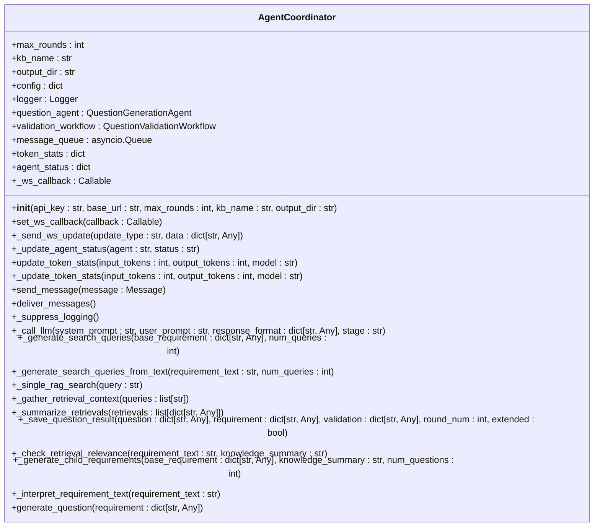
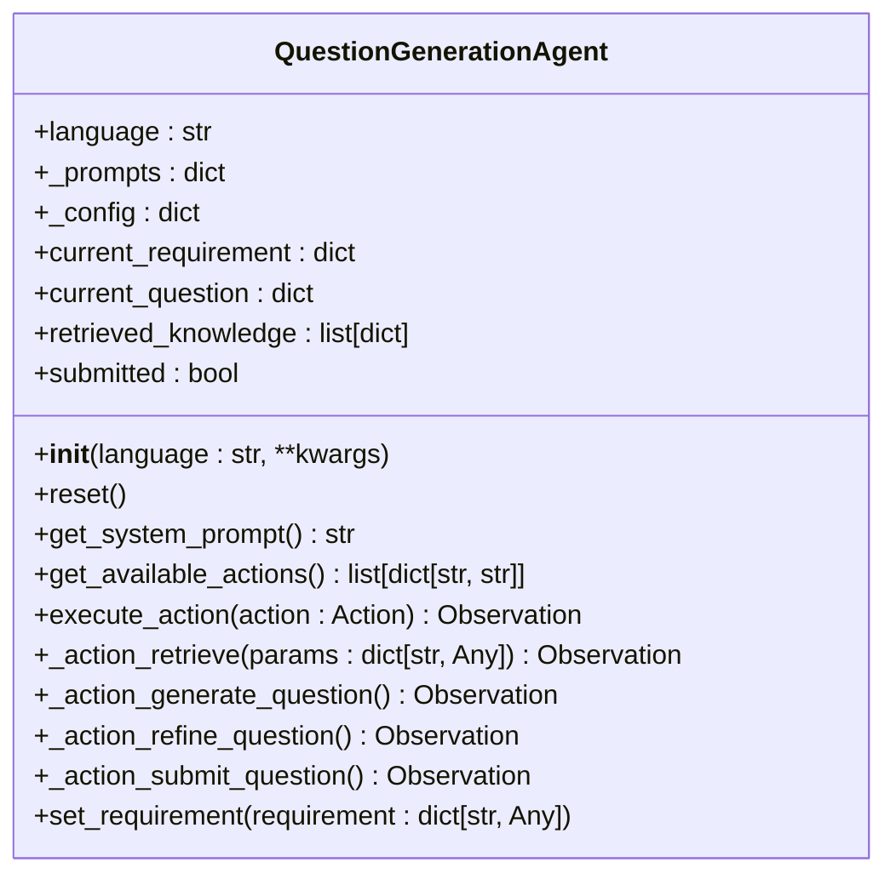
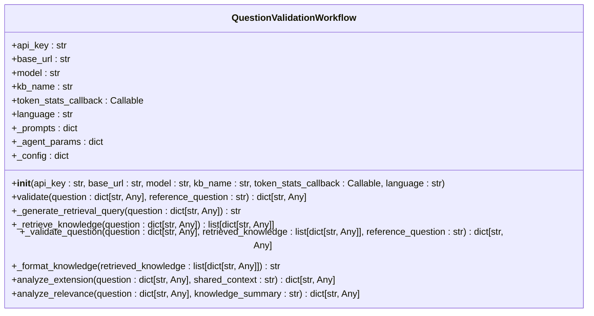
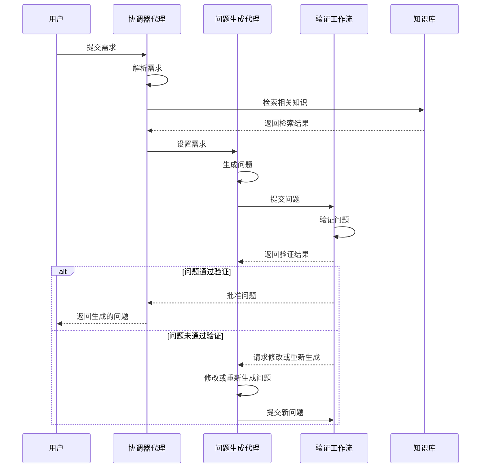
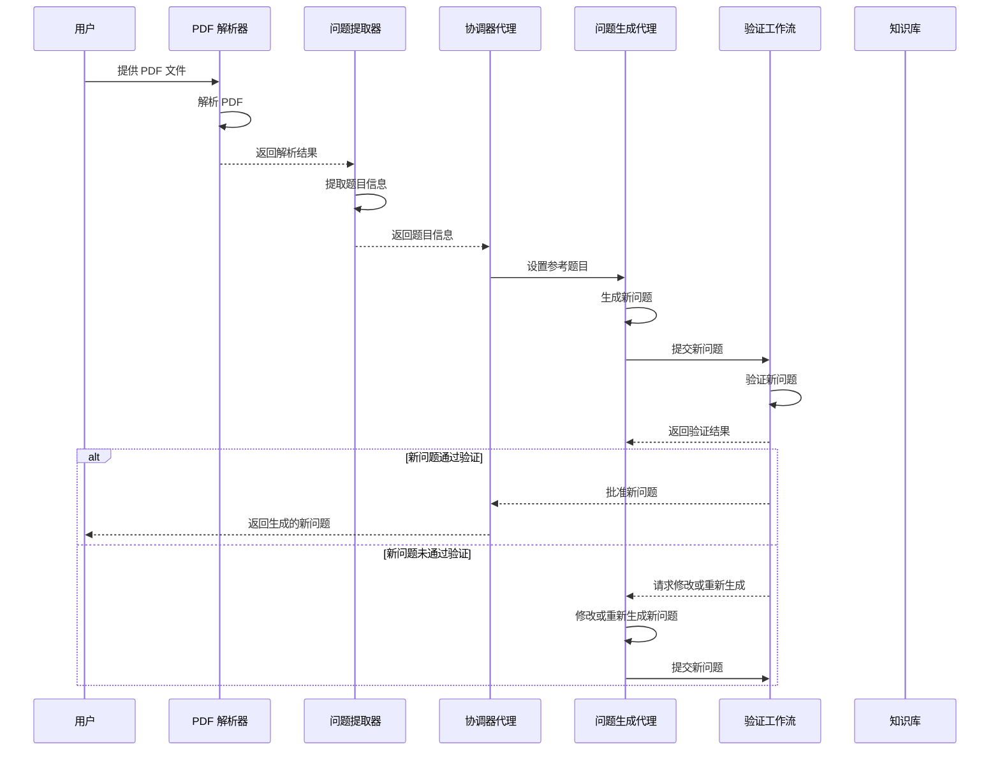

# 问题生成

<cite>
**本文档引用的文件**   
- [coordinator.py](file://src/agents/question/coordinator.py)
- [generation_agent.py](file://src/agents/question/agents/generation_agent.py)
- [validation_workflow.py](file://src/agents/question/validation_workflow.py)
- [exam_mimic.py](file://src/agents/question/tools/exam_mimic.py)
- [example.py](file://src/agents/question/example.py)
- [main.yaml](file://config/main.yaml)
- [agents.yaml](file://config/agents.yaml)
- [coordinator.yaml](file://src/agents/question/prompts/en/coordinator.yaml)
- [generation_agent.yaml](file://src/agents/question/prompts/en/generation_agent.yaml)
- [validation_agent.yaml](file://src/agents/question/prompts/en/validation_agent.yaml)
- [validation_workflow.yaml](file://src/agents/question/prompts/en/validation_workflow.yaml)
</cite>

## 目录
1. [简介](#简介)
2. [核心组件](#核心组件)
3. [自定义模式实现](#自定义模式实现)
4. [模仿模式实现](#模仿模式实现)
5. [配置选项与参数](#配置选项与参数)
6. [与其他组件的关系](#与其他组件的关系)
7. [常见问题及解决方案](#常见问题及解决方案)
8. [结论](#结论)

## 简介
DeepTutor 项目中的问题生成功能旨在通过协调多个智能体来生成高质量的考试题目。该功能支持两种主要模式：自定义模式和模仿模式。自定义模式允许用户根据特定的知识点、难度和题型要求生成问题；而模仿模式则基于现有的考试题目生成新的、具有创新性的题目。整个过程由协调器代理（Agent Coordinator）管理，确保生成的问题既符合要求又具备足够的创新性。

**Section sources**
- [coordinator.py](file://src/agents/question/coordinator.py#L1-L2138)
- [example.py](file://src/agents/question/example.py#L1-L109)

## 核心组件
问题生成功能的核心组件包括协调器代理（Agent Coordinator）、问题生成代理（Question Generation Agent）和验证工作流（Validation Workflow）。这些组件协同工作，确保生成的问题经过严格的验证和优化。

### 协调器代理
协调器代理负责管理问题生成代理和验证工作流之间的协作。它初始化并配置各个代理，处理消息队列，并跟踪生成过程的状态。协调器代理还提供了 WebSocket 回调接口，用于向前端发送实时更新。

**Diagram sources**
- [coordinator.py](file://src/agents/question/coordinator.py#L79-L800)

### 问题生成代理
问题生成代理负责根据用户的需求生成问题。它使用检索到的知识库内容作为基础，确保生成的问题准确且严谨。代理通过一系列动作（如检索、生成、精炼和提交）来完成任务。

**Diagram sources**
- [generation_agent.py](file://src/agents/question/agents/generation_agent.py#L42-L361)

### 验证工作流
验证工作流负责验证生成的问题是否符合要求。它通过检索相关知识、验证问题的严谨性和正确性，并决定是否批准、请求修改或重新生成问题。

**Diagram sources**
- [validation_workflow.py](file://src/agents/question/validation_workflow.py#L43-L595)

## 自定义模式实现
自定义模式允许用户根据特定的知识点、难度和题型要求生成问题。用户可以通过提供自然语言描述或结构化需求来启动生成过程。

### 实现细节
1. **需求解析**：协调器代理首先解析用户提供的需求，提取核心知识点、难度、题型和附加要求。
2. **知识检索**：使用 RAG 工具从知识库中检索与需求相关的理论解释、定义和定理。
3. **问题生成**：问题生成代理利用检索到的知识生成问题，并确保问题的严谨性和准确性。
4. **验证与反馈**：生成的问题被提交给验证工作流进行验证。如果问题未通过验证，代理会根据反馈进行修改或重新生成。

**Diagram sources**
- [coordinator.py](file://src/agents/question/coordinator.py#L607-L800)
- [generation_agent.py](file://src/agents/question/agents/generation_agent.py#L96-L361)
- [validation_workflow.py](file://src/agents/question/validation_workflow.py#L91-L595)

## 模仿模式实现
模仿模式基于现有的考试题目生成新的、具有创新性的题目。这种模式特别适用于需要保持相同难度和知识范围但改变场景和推理过程的情况。

### 实现细节
1. **PDF 解析**：使用 MinerU 工具解析 PDF 考试试卷，提取题目内容和相关图像。
2. **问题提取**：通过 LLM 分析解析后的 Markdown 文件和内容列表，提取所有题目信息。
3. **新问题生成**：问题生成代理基于参考题目生成新的问题，确保核心知识点不变，但场景和推理过程有所变化。
4. **验证与反馈**：生成的新问题同样需要经过验证工作流的验证，以确保其质量和创新性。

**Diagram sources**
- [exam_mimic.py](file://src/agents/question/tools/exam_mimic.py#L35-L599)
- [pdf_parser.py](file://src/agents/question/tools/pdf_parser.py#L37-L199)
- [question_extractor.py](file://src/agents/question/tools/question_extractor.py#L229-L322)

## 配置选项与参数
问题生成功能的配置选项和参数主要在 `config/main.yaml` 和 `config/agents.yaml` 文件中定义。这些配置文件控制了生成过程的各种行为，如最大轮次、并行生成数量、RAG 模式等。

### 主要配置选项
- **max_rounds**：生成过程中允许的最大轮次，默认值为 10。
- **rag_query_count**：每次检索时生成的查询数量，默认值为 3。
- **max_parallel_questions**：并行生成的最大问题数量，默认值为 3。
- **rag_mode**：RAG 检索模式，可选值为 "naive" 或 "hybrid"，默认值为 "naive"。

### 参数说明
- **api_key**：API 密钥，用于访问 LLM 服务。
- **base_url**：API 服务的基地址。
- **model**：使用的 LLM 模型名称。
- **kb_name**：知识库名称。
- **token_stats_callback**：回调函数，用于更新令牌统计信息。

**Section sources**
- [main.yaml](file://config/main.yaml#L43-L47)
- [agents.yaml](file://config/agents.yaml#L22-L27)

## 与其他组件的关系
问题生成功能与其他组件紧密协作，确保生成的问题能够满足各种需求。以下是主要的交互关系：

### 与知识库的交互
问题生成代理和验证工作流都依赖于知识库来获取必要的理论知识。RAG 工具用于从知识库中检索相关信息，确保生成的问题基于准确的知识。

### 与前端的交互
协调器代理通过 WebSocket 回调接口向前端发送实时更新，包括生成进度、验证结果和最终问题。这使得用户可以实时监控生成过程。

### 与配置管理的交互
配置管理模块加载 `main.yaml` 和 `agents.yaml` 文件中的配置选项，确保生成过程的行为符合预期。

**Section sources**
- [coordinator.py](file://src/agents/question/coordinator.py#L100-L119)
- [validation_workflow.py](file://src/agents/question/validation_workflow.py#L85-L90)
- [example.py](file://src/agents/question/example.py#L101-L104)

## 常见问题及解决方案
在使用问题生成功能时，可能会遇到一些常见问题。以下是一些典型问题及其解决方案：

### 问题1：生成的问题质量不高
**原因**：可能是由于知识库中的相关内容不足或检索到的知识不够相关。
**解决方案**：
- 确保知识库中包含足够的相关内容。
- 调整 RAG 模式的设置，尝试不同的检索策略。
- 提供更详细的生成需求，帮助代理更好地理解用户意图。

### 问题2：生成过程耗时过长
**原因**：可能是由于并行生成的数量过多或每轮生成的时间过长。
**解决方案**：
- 减少并行生成的数量，降低系统负载。
- 优化生成代理的提示词，减少不必要的计算。
- 增加最大轮次限制，避免无限循环。

### 问题3：验证失败频繁
**原因**：可能是由于生成的问题与参考题目过于相似，缺乏创新性。
**解决方案**：
- 在生成需求中明确指出需要创新性的要求。
- 使用模仿模式时，确保参考题目和新题目在场景和推理过程上有显著差异。
- 调整验证工作流的严格程度，适当放宽某些标准。

**Section sources**
- [coordinator.py](file://src/agents/question/coordinator.py#L646-L800)
- [validation_workflow.py](file://src/agents/question/validation_workflow.py#L118-L595)

## 结论
DeepTutor 项目中的问题生成功能通过协调多个智能体实现了高质量的考试题目生成。自定义模式和模仿模式分别满足了不同场景下的需求，确保生成的问题既符合要求又具备足够的创新性。通过合理的配置和优化，用户可以高效地生成高质量的考试题目，提升教学和学习的效果。