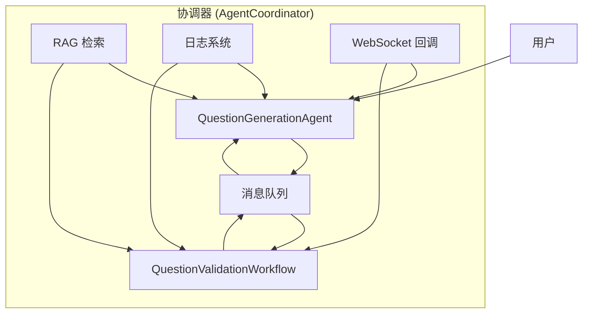
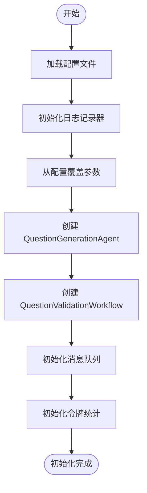
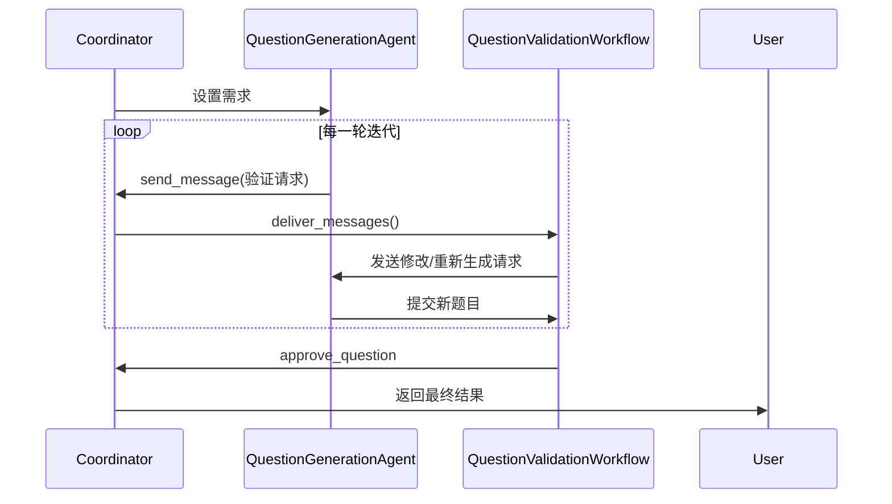
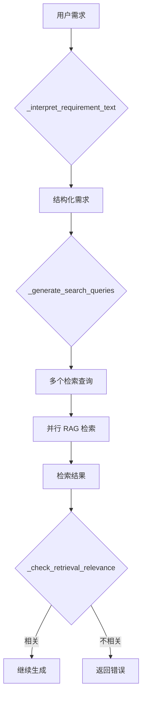
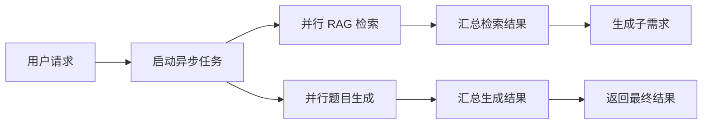

# 问题生成协调器

<cite>
**本文档引用的文件**  
- [coordinator.py](file://src/agents/question/coordinator.py)
- [validation_workflow.py](file://src/agents/question/validation_workflow.py)
- [generation_agent.py](file://src/agents/question/agents/generation_agent.py)
- [validation_agent.py](file://src/agents/question/agents/validation_agent.py)
- [example.py](file://src/agents/question/example.py)
- [coordinator.yaml](file://src/agents/question/prompts/en/coordinator.yaml)
- [validation_workflow.yaml](file://src/agents/question/prompts/en/validation_workflow.yaml)
- [generation_agent.yaml](file://src/agents/question/prompts/en/generation_agent.yaml)
</cite>

## 目录
1. [简介](#简介)
2. [核心架构与组件](#核心架构与组件)
3. [初始化流程](#初始化流程)
4. [公共接口与方法](#公共接口与方法)
5. [消息队列与通信机制](#消息队列与通信机制)
6. [WebSocket 回调集成](#websocket-回调集成)
7. [与 RAG 工具的交互](#与-rag-工具的交互)
8. [日志与令牌统计跟踪](#日志与令牌统计跟踪)
9. [常见问题与解决方案](#常见问题与解决方案)
10. [异步架构分析](#异步架构分析)
11. [附录：配置与提示词](#附录配置与提示词)

## 简介

问题生成协调器（AgentCoordinator）是 DeepTutor 系统中负责协调问题生成代理（QuestionGenerationAgent）和问题验证工作流（QuestionValidationWorkflow）的核心组件。它实现了 ReAct（推理+行动）范式，通过多轮迭代协作，确保生成的题目既符合用户需求，又在知识库支持范围内保持严谨性。

该协调器不仅管理两个独立代理之间的消息传递，还集成了检索增强生成（RAG）机制、WebSocket 实时更新、令牌消耗统计和错误处理等关键功能。其设计目标是实现高质量、可验证、可追溯的自动化题目生成流程。

**Section sources**
- [coordinator.py](file://src/agents/question/coordinator.py#L1-L50)
- [__init__.py](file://src/agents/question/__init__.py#L1-L29)

## 核心架构与组件

问题生成协调器采用模块化设计，主要由以下几个核心组件构成：

- **QuestionGenerationAgent**：负责根据用户需求和检索到的知识生成题目。
- **QuestionValidationWorkflow**：固定流程，负责验证生成题目的准确性、相关性和创新性。
- **消息队列（Message Queue）**：用于代理间异步通信。
- **RAG 检索工具**：从知识库中检索与题目相关的理论知识。
- **日志与统计系统**：记录运行日志并跟踪令牌消耗。



**Diagram sources**
- [coordinator.py](file://src/agents/question/coordinator.py#L79-L800)
- [validation_workflow.py](file://src/agents/question/validation_workflow.py#L43-L595)
- [generation_agent.py](file://src/agents/question/agents/generation_agent.py#L42-L361)

## 初始化流程

当 `AgentCoordinator` 被实例化时，它会执行一系列初始化操作，确保所有依赖组件正确配置。

1. **加载配置**：从 `main.yaml` 和 `question_config.yaml` 加载系统配置，包括最大迭代轮数、RAG 查询数量等。
2. **创建日志记录器**：根据配置初始化日志系统，用于记录运行时信息。
3. **实例化代理**：
   - 创建 `QuestionGenerationAgent` 实例，用于生成题目。
   - 创建 `QuestionValidationWorkflow` 实例，用于验证题目。
4. **初始化消息队列**：创建一个异步队列，用于代理间的通信。
5. **设置令牌统计**：初始化一个字典来跟踪 LLM 调用的输入/输出令牌数和成本。



**Diagram sources**
- [coordinator.py](file://src/agents/question/coordinator.py#L84-L157)

## 公共接口与方法

`AgentCoordinator` 提供了清晰的公共接口，供外部系统调用。

### generate_question 方法

这是协调器的核心方法，用于生成单个题目。

**方法签名**:
```python
async def generate_question(self, requirement: dict[str, Any]) -> dict[str, Any]
```

**参数**:
- `requirement` (dict): 题目生成需求，包含知识点、难度、题型等。

**返回值**:
- `success` (bool): 是否成功生成题目。
- `question` (dict): 生成的题目内容。
- `validation` (dict): 验证结果。
- `rounds` (int): 迭代轮数。
- `error` (str): 错误类型（如果失败）。

**流程**:
1. 重置代理状态。
2. 启动多轮迭代循环（最多 `max_rounds` 轮）。
3. 在每一轮中：
   - 调用 `QuestionGenerationAgent` 生成或修改题目。
   - 将题目提交给 `QuestionValidationWorkflow` 进行验证。
   - 根据验证结果决定是批准、请求修改还是重新生成。
4. 返回最终结果。

**Section sources**
- [coordinator.py](file://src/agents/question/coordinator.py#L607-L800)

### generate_multiple_questions 方法

该方法用于从自然语言提示中生成多个题目。

**方法签名**:
```python
async def generate_questions_from_prompt(self, requirement_text: str, num_questions: int) -> dict[str, Any]
```

**流程**:
1. 调用 `_interpret_requirement_text` 将自然语言转换为结构化需求。
2. 调用 `_generate_search_queries_from_text` 生成多个检索查询。
3. 并行执行 RAG 检索。
4. 调用 `_generate_child_requirements` 将基础需求分解为多个子需求。
5. 并行调用 `generate_question` 生成多个题目。

**Section sources**
- [coordinator.py](file://src/agents/question/coordinator.py#L802-L1000)

## 消息队列与通信机制

协调器使用 `asyncio.Queue` 实现代理间的异步通信。这种设计解耦了生成和验证两个过程，提高了系统的灵活性和可维护性。

- **发送消息**: `send_message` 方法将 `Message` 对象放入队列。
- **传递消息**: `deliver_messages` 方法从队列中取出消息并分发给目标代理。
- **消息类型**: 包括 `validate_request`、`request_modification`、`request_regeneration` 等。



**Diagram sources**
- [coordinator.py](file://src/agents/question/coordinator.py#L221-L233)
- [generation_agent.py](file://src/agents/question/agents/generation_agent.py#L337-L356)
- [validation_workflow.py](file://src/agents/question/validation_workflow.py#L91-L137)

## WebSocket 回调集成

为了实现前端实时更新，协调器支持 WebSocket 回调。

- **设置回调**: `set_ws_callback` 方法用于注册回调函数。
- **发送更新**: `_send_ws_update` 方法在关键节点（如状态变更、进度更新）发送消息。
- **更新类型**: 包括 `agent_status`、`token_stats`、`progress` 等。

```python
def set_ws_callback(self, callback: Callable):
    """设置用于前端流式更新的 WebSocket 回调。"""
    self._ws_callback = callback

async def _send_ws_update(self, update_type: str, data: dict[str, Any]):
    """通过 WebSocket 回调发送更新（如果可用）。"""
    if self._ws_callback:
        try:
            await self._ws_callback({"type": update_type, **data})
        except Exception as e:
            self.logger.debug(f"发送 WS 更新失败: {e}")
```

**Section sources**
- [coordinator.py](file://src/agents/question/coordinator.py#L169-L188)

## 与 RAG 工具的交互

协调器通过 `rag_search` 工具与知识库进行交互，确保生成的题目基于真实的知识内容。

- **检索查询生成**: 使用 LLM 将用户需求转换为精确的知识点检索查询。
- **并行检索**: `_gather_retrieval_context` 方法并行执行多个查询，提高效率。
- **相关性检查**: 使用 LLM 判断检索到的知识是否与用户需求相关。



**Diagram sources**
- [coordinator.py](file://src/agents/question/coordinator.py#L306-L412)
- [tools/rag_tool.py](file://src/tools/rag_tool.py)

## 日志与令牌统计跟踪

协调器集成了完善的日志和统计功能。

### 日志系统

- 使用 `src.core.logging` 模块记录详细运行日志。
- 支持不同级别的日志输出（DEBUG、INFO、WARNING、ERROR）。
- 可以抑制第三方库的冗余日志。

### 令牌统计

- `update_token_stats` 方法跟踪每次 LLM 调用的输入/输出令牌数。
- 自动计算成本（基于 gpt-4o-mini 的定价）。
- 通过 WebSocket 将统计信息实时推送到前端。

```python
def update_token_stats(self, input_tokens: int = 0, output_tokens: int = 0, model: str = None):
    """更新令牌统计信息。"""
    self.token_stats["calls"] += 1
    self.token_stats["input_tokens"] += input_tokens
    self.token_stats["output_tokens"] += output_tokens
    self.token_stats["tokens"] = self.token_stats["input_tokens"] + self.token_stats["output_tokens"]
    self.token_stats["cost"] = (
        self.token_stats["input_tokens"] * 0.00000015
        + self.token_stats["output_tokens"] * 0.0000006
    )
    asyncio.create_task(self._send_ws_update("token_stats", {"stats": self.token_stats}))
```

**Section sources**
- [coordinator.py](file://src/agents/question/coordinator.py#L189-L216)
- [core/logging/logger.py](file://src/core/logging/logger.py)

## 常见问题与解决方案

### 检索失败

**问题**: RAG 检索返回空结果或不相关内容。

**原因**:
- 知识库中缺少相关知识点。
- 检索查询生成不准确。

**解决方案**:
1. 检查知识库是否包含所需内容。
2. 优化 `coordinator.yaml` 中的 `generate_search_queries` 提示词。
3. 增加 `rag_query_count` 的数量以提高覆盖率。

### 验证工作流错误

**问题**: 验证工作流返回 `request_regeneration`，导致循环无法结束。

**原因**:
- 生成的题目与检索到的知识完全不匹配。
- 创新性不足（在仿题模式下）。

**解决方案**:
1. 检查 `validation_workflow.yaml` 中的验证标准。
2. 确保 `QuestionGenerationAgent` 严格遵循检索到的知识。
3. 在 `generate_with_reference` 提示词中强化创新性要求。

### 代理状态异常

**问题**: 代理状态卡在 "running" 或 "pending"。

**原因**:
- 代理内部发生未捕获的异常。
- 消息队列阻塞。

**解决方案**:
1. 检查日志中的错误信息。
2. 确保 `send_message` 回调正确设置。
3. 增加超时机制和重试逻辑。

**Section sources**
- [coordinator.py](file://src/agents/question/coordinator.py#L691-L712)
- [validation_workflow.py](file://src/agents/question/validation_workflow.py#L345-L352)

## 异步架构分析

整个协调器系统基于 `asyncio` 构建，实现了高效的异步并发。

- **非阻塞 I/O**: 所有 LLM 调用和 RAG 检索都是异步的。
- **并行执行**: 多个 RAG 查询和多个题目生成可以并行处理。
- **事件驱动**: 通过消息队列和回调实现事件驱动的通信。



**Diagram sources**
- [coordinator.py](file://src/agents/question/coordinator.py#L392-L394)
- [example.py](file://src/agents/question/example.py#L83-L104)

## 附录：配置与提示词

### 配置文件

- `config/main.yaml`: 主配置文件，包含全局设置。
- `config/agents.yaml`: 代理特定配置。
- `config/question_config.yaml`: 问题生成专用配置。

### 提示词文件

- `src/agents/question/prompts/en/coordinator.yaml`: 协调器专用提示词。
- `src/agents/question/prompts/en/generation_agent.yaml`: 生成代理提示词。
- `src/agents/question/prompts/en/validation_workflow.yaml`: 验证工作流提示词。

这些提示词文件定义了 LLM 的行为，是系统智能的核心。

**Section sources**
- [coordinator.yaml](file://src/agents/question/prompts/en/coordinator.yaml)
- [generation_agent.yaml](file://src/agents/question/prompts/en/generation_agent.yaml)
- [validation_workflow.yaml](file://src/agents/question/prompts/en/validation_workflow.yaml)