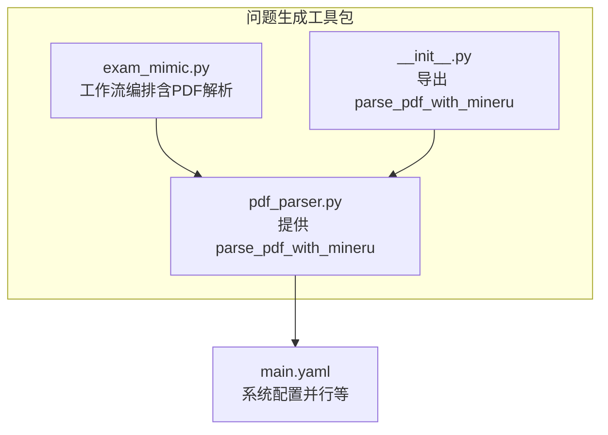
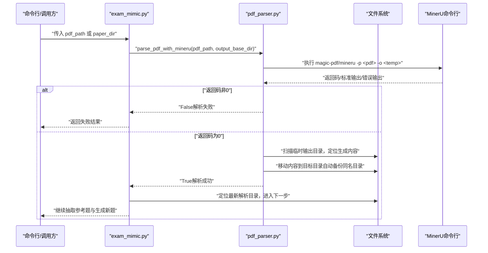
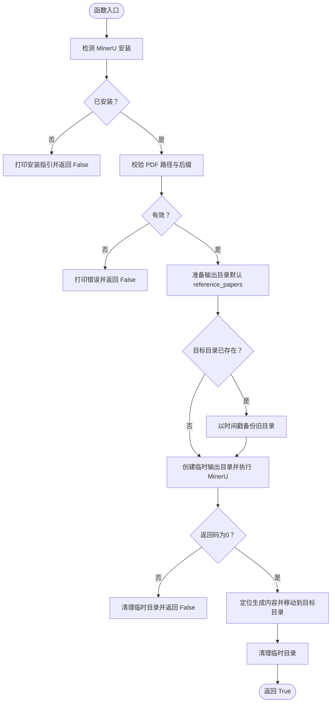
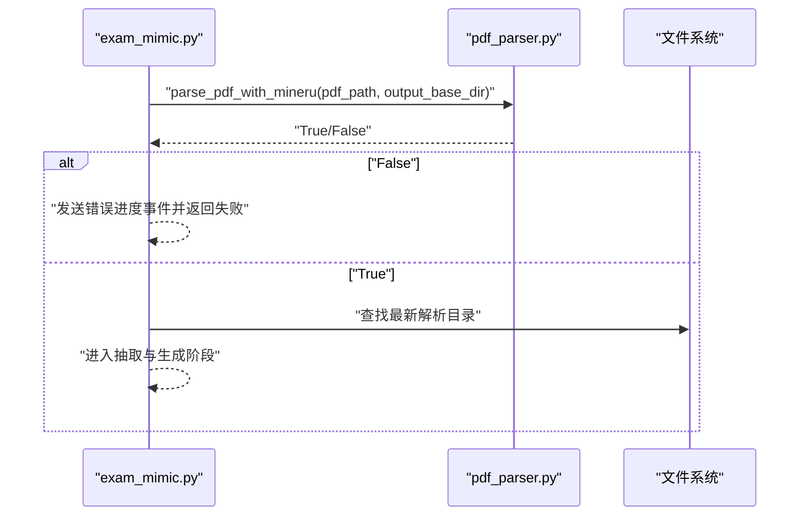
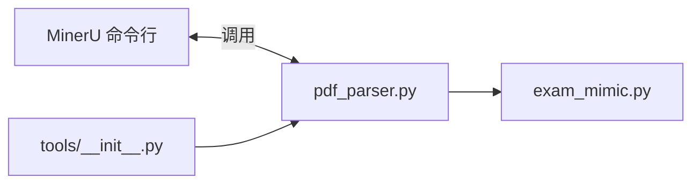

# PDF解析工具

<cite>
**本文引用的文件**
- [pdf_parser.py](file://src/agents/question/tools/pdf_parser.py)
- [exam_mimic.py](file://src/agents/question/tools/exam_mimic.py)
- [__init__.py（工具包导出）](file://src/agents/question/tools/__init__.py)
- [README.md（问题生成模块）](file://src/agents/question/README.md)
- [main.yaml（系统配置）](file://config/main.yaml)
</cite>

## 目录
1. [简介](#简介)
2. [项目结构](#项目结构)
3. [核心组件](#核心组件)
4. [架构总览](#架构总览)
5. [详细组件分析](#详细组件分析)
6. [依赖关系分析](#依赖关系分析)
7. [性能考量](#性能考量)
8. [故障排查指南](#故障排查指南)
9. [结论](#结论)
10. [附录](#附录)

## 简介
本文件围绕“PDF解析工具”展开，重点解释并记录 parse_pdf_with_mineru 函数的实现细节与用途。该工具通过调用 MinerU（magic-pdf 或 mineru 命令行工具）将 PDF 考试试卷解析为结构化内容，并将结果保存到指定输出目录。文档还说明了该工具如何与问题生成工作流（exam_mimic 模块）集成，作为第一步输入处理；同时提供命令行使用方式、在其他模块中的集成方法、参数与返回值说明、常见问题与最佳实践，以及性能优化建议。

## 项目结构
与 PDF 解析直接相关的核心文件位于 src/agents/question/tools 下：
- pdf_parser.py：提供 parse_pdf_with_mineru 函数及命令行入口
- exam_mimic.py：问题生成工作流，其中第一步即调用 parse_pdf_with_mineru
- __init__.py：工具包导出，统一暴露 parse_pdf_with_mineru
- README.md：包含使用示例与输出目录结构说明

图表来源
- [pdf_parser.py](file://src/agents/question/tools/pdf_parser.py#L1-L198)
- [exam_mimic.py](file://src/agents/question/tools/exam_mimic.py#L1-L120)
- [__init__.py（工具包导出）](file://src/agents/question/tools/__init__.py#L1-L14)
- [main.yaml（系统配置）](file://config/main.yaml#L1-L142)

章节来源
- [pdf_parser.py](file://src/agents/question/tools/pdf_parser.py#L1-L198)
- [exam_mimic.py](file://src/agents/question/tools/exam_mimic.py#L1-L120)
- [__init__.py（工具包导出）](file://src/agents/question/tools/__init__.py#L1-L14)
- [README.md（问题生成模块）](file://src/agents/question/README.md#L280-L324)

## 核心组件
- parse_pdf_with_mineru(pdf_path: str, output_base_dir: str = None) -> bool
  - 功能：检测并调用 MinerU 命令行工具解析 PDF，将生成内容移动到目标目录，返回布尔值表示是否成功
  - 参数：
    - pdf_path：PDF 文件绝对或相对路径
    - output_base_dir：输出基础目录，默认参考脚本所在根目录下的 reference_papers
  - 返回值：bool，成功为 True，失败为 False
- 命令行入口：python pdf_parser.py <pdf_path> [-o/--output <dir>]，用于直接运行解析

章节来源
- [pdf_parser.py](file://src/agents/question/tools/pdf_parser.py#L36-L158)
- [pdf_parser.py](file://src/agents/question/tools/pdf_parser.py#L160-L198)

## 架构总览
parse_pdf_with_mineru 在 exam_mimic 的“解析阶段”被调用，作为参考型题目生成流程的第一步。其职责是将 PDF 转换为结构化中间产物（Markdown 等），供后续抽取参考题与生成新题使用。

图表来源
- [exam_mimic.py](file://src/agents/question/tools/exam_mimic.py#L194-L230)
- [pdf_parser.py](file://src/agents/question/tools/pdf_parser.py#L90-L150)

## 详细组件分析

### 组件A：parse_pdf_with_mineru 实现与行为
- 安装检测
  - 优先尝试 magic-pdf --version，其次 mineru --version，若均不可用则提示安装
- 输入校验
  - 路径存在性与后缀校验（仅接受 .pdf）
- 输出目录策略
  - 默认输出基础目录为项目根目录下的 reference_papers
  - 若目标目录已存在，则以时间戳重命名备份，避免覆盖
  - 使用临时目录 temp_mineru_output 存放 MinerU 生成内容，完成后移动到最终目标
- 执行流程
  - 调用 MinerU 命令行，捕获返回码与标准输出/错误输出
  - 若失败，清理临时目录并返回 False
  - 成功时，定位生成内容（可能是 PDF 名称子目录或临时目录本身），逐项移动至目标目录，覆盖同名文件/目录
  - 清理临时目录并打印生成文件清单
- 返回值
  - 成功返回 True，失败返回 False

图表来源
- [pdf_parser.py](file://src/agents/question/tools/pdf_parser.py#L14-L158)

章节来源
- [pdf_parser.py](file://src/agents/question/tools/pdf_parser.py#L14-L158)

### 组件B：命令行使用方式
- 直接运行脚本
  - python pdf_parser.py <pdf_path> [-o/--output <dir>]
  - 示例见脚本内帮助与 epilog
- 在其他模块中集成
  - from src.agents.question.tools import parse_pdf_with_mineru
  - await parse_pdf_with_mineru(pdf_path, output_base_dir="data/user/question/mimic_papers")

章节来源
- [pdf_parser.py](file://src/agents/question/tools/pdf_parser.py#L160-L198)
- [README.md（问题生成模块）](file://src/agents/question/README.md#L280-L307)

### 组件C：与 exam_mimic 的集成
- exam_mimic 在“解析阶段”调用 parse_pdf_with_mineru，将 PDF 转换为可抽取参考题的中间格式
- 若传入 paper_dir 则跳过解析，直接定位已解析目录
- 成功后继续抽取参考题并生成新题

图表来源
- [exam_mimic.py](file://src/agents/question/tools/exam_mimic.py#L194-L230)
- [pdf_parser.py](file://src/agents/question/tools/pdf_parser.py#L90-L150)

章节来源
- [exam_mimic.py](file://src/agents/question/tools/exam_mimic.py#L194-L230)

## 依赖关系分析
- 外部依赖
  - MinerU 命令行工具（magic-pdf 或 mineru），需先安装
- 内部依赖
  - pdf_parser.py 导出 parse_pdf_with_mineru
  - exam_mimic.py 依赖 pdf_parser.py 进行 PDF 解析
  - 工具包统一导出 parse_pdf_with_mineru，便于模块间导入

图表来源
- [pdf_parser.py](file://src/agents/question/tools/pdf_parser.py#L90-L150)
- [exam_mimic.py](file://src/agents/question/tools/exam_mimic.py#L194-L230)
- [__init__.py（工具包导出）](file://src/agents/question/tools/__init__.py#L1-L14)

章节来源
- [__init__.py（工具包导出）](file://src/agents/question/tools/__init__.py#L1-L14)
- [pdf_parser.py](file://src/agents/question/tools/pdf_parser.py#L90-L150)
- [exam_mimic.py](file://src/agents/question/tools/exam_mimic.py#L194-L230)

## 性能考量
- 并发与批处理
  - exam_mimic 中对生成阶段采用异步并发（最大并行数由配置控制），但 PDF 解析阶段默认串行，避免磁盘与外部进程竞争
- 临时目录策略
  - 使用 temp_mineru_output 避免与目标目录直接写冲突，解析完成后一次性移动，减少多次 IO
- 目录备份
  - 同名输出目录存在时自动备份，避免覆盖历史结果，便于回溯与对比
- I/O 与磁盘空间
  - 大量 PDF 批处理时建议使用独立磁盘或临时目录，降低 IO 抖动

章节来源
- [pdf_parser.py](file://src/agents/question/tools/pdf_parser.py#L70-L150)
- [main.yaml（系统配置）](file://config/main.yaml#L44-L54)
- [exam_mimic.py](file://src/agents/question/tools/exam_mimic.py#L330-L346)

## 故障排查指南
- MinerU 未安装
  - 现象：检测失败并打印安装指引
  - 处理：按提示安装 magic-pdf[full] 或 mineru
- PDF 路径错误
  - 现象：文件不存在或后缀非 .pdf
  - 处理：确认路径与扩展名
- 解析失败
  - 现象：MinerU 返回码非0，打印 stdout/stderr
  - 处理：检查 PDF 是否损坏、权限是否足够、MinerU 版本是否兼容
- 输出目录冲突
  - 现象：目标目录已存在
  - 处理：自动备份为带时间戳的同名目录，确认备份无误后再继续
- 临时目录残留
  - 现象：异常退出导致临时目录未清理
  - 处理：手动清理 temp_mineru_output 或等待下次运行自动覆盖

章节来源
- [pdf_parser.py](file://src/agents/question/tools/pdf_parser.py#L14-L158)

## 结论
parse_pdf_with_mineru 提供了稳定、健壮的 PDF 解析能力，具备完善的安装检测、路径校验、输出目录备份与临时目录管理机制。它与 exam_mimic 紧密集成，构成“参考型题目生成”的关键一环。遵循本文提供的安装要求、使用方式与最佳实践，可在保证可靠性的同时提升整体处理效率。

## 附录
- 命令行示例
  - python pdf_parser.py /path/to/paper.pdf
  - python pdf_parser.py /path/to/paper.pdf -o /custom/output/dir
- 在模块中集成
  - from src.agents.question.tools import parse_pdf_with_mineru
  - await parse_pdf_with_mineru(pdf_path, output_base_dir="data/user/question/mimic_papers")
- 输出目录结构参考
  - 参考问题生成模块 README 中的目录结构说明

章节来源
- [pdf_parser.py](file://src/agents/question/tools/pdf_parser.py#L160-L198)
- [README.md（问题生成模块）](file://src/agents/question/README.md#L280-L324)