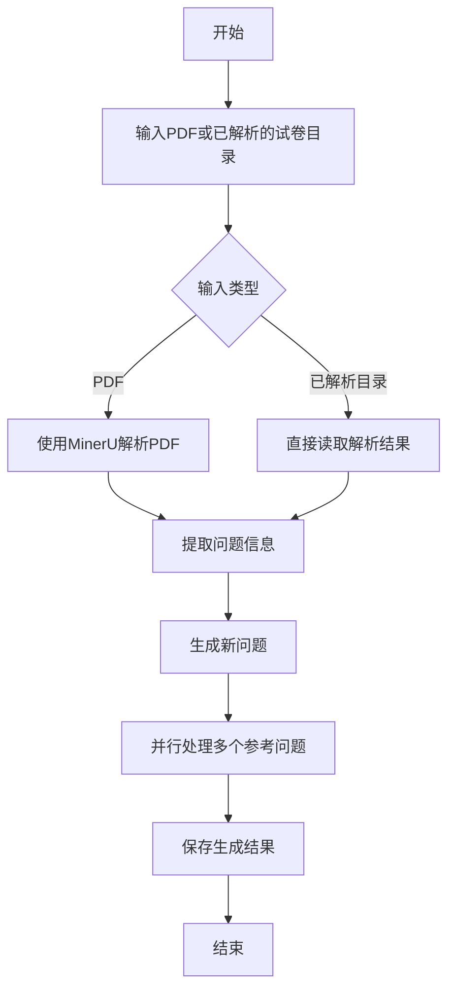
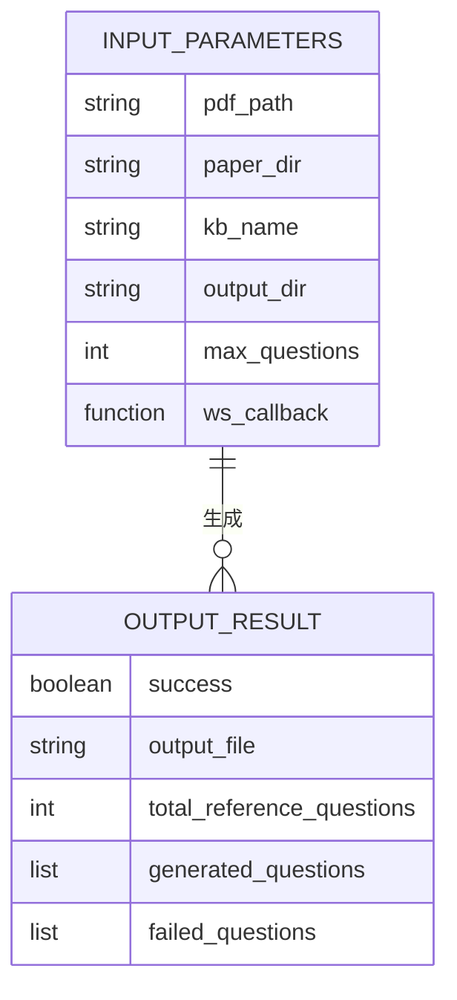
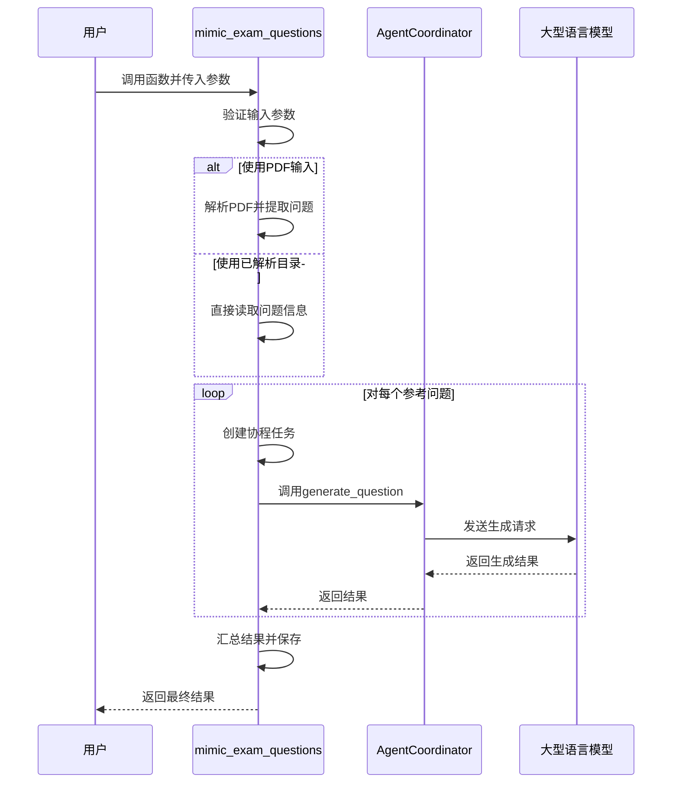
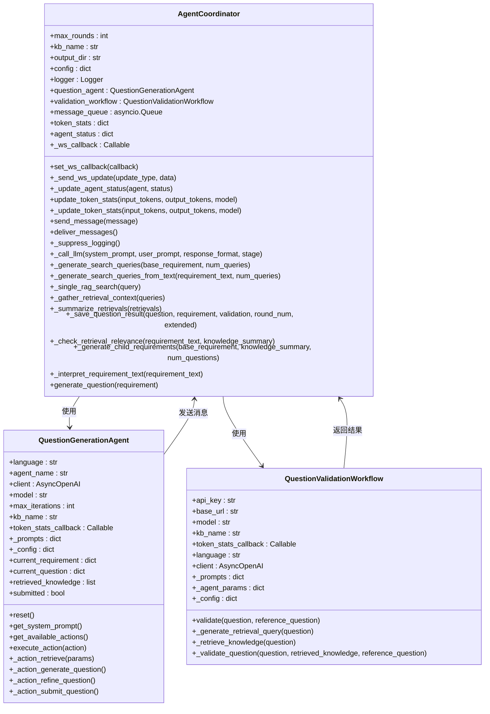

# 考试模仿生成工具

<cite>
**本文档中引用的文件**  
- [exam_mimic.py](file://src/agents/question/tools/exam_mimic.py)
- [coordinator.py](file://src/agents/question/coordinator.py)
- [pdf_parser.py](file://src/agents/question/tools/pdf_parser.py)
- [question_extractor.py](file://src/agents/question/tools/question_extractor.py)
- [validation_workflow.py](file://src/agents/question/validation_workflow.py)
- [generation_agent.py](file://src/agents/question/agents/generation_agent.py)
- [main.yaml](file://config/main.yaml)
- [agents.yaml](file://config/agents.yaml)
- [question.py](file://src/api/routers/question.py)
</cite>

## 目录
1. [简介](#简介)
2. [核心功能与工作流](#核心功能与工作流)
3. [公共接口与参数详解](#公共接口与参数详解)
4. [异步并行处理机制](#异步并行处理机制)
5. [与AgentCoordinator的集成](#与agentcoordinator的集成)
6. [常见问题与解决方案](#常见问题与解决方案)
7. [最佳实践与性能优化](#最佳实践与性能优化)
8. [WebSocket实时进度监控](#websocket实时进度监控)
9. [结论](#结论)

## 简介

考试模仿生成工具是一个基于参考试卷的问题生成系统，旨在通过自动化流程创建与原始试卷在知识点和难度上相似但场景和表述不同的新问题。该工具作为问题生成工作流的核心编排器，整合了PDF解析、问题提取和基于参考问题的新问题生成三大功能。它通过调用`mimic_exam_questions`函数，实现从原始PDF试卷到新生成问题的端到端自动化，广泛应用于教育领域的题库扩充和个性化学习材料生成。

该工具的设计目标是提供一个高效、可靠且可扩展的解决方案，以支持大规模的考试题目生成需求。通过利用先进的自然语言处理技术和知识库检索机制，该工具能够确保生成的问题不仅在形式上与原题相似，而且在内容深度和认知要求上也保持一致。

**Section sources**
- [exam_mimic.py](file://src/agents/question/tools/exam_mimic.py#L1-L599)

## 核心功能与工作流

考试模仿生成工具的核心功能是通过`mimic_exam_questions`函数实现的，该函数作为整个工作流的编排中心，协调多个子任务的执行。其工作流分为三个主要阶段：PDF解析、问题提取和新问题生成。

在第一阶段，工具使用MinerU技术对输入的PDF试卷进行解析，将其转换为结构化的Markdown格式文件，并提取出图像等多媒体资源。这一过程确保了原始试卷的内容能够被准确地数字化，为后续的处理打下基础。

第二阶段涉及从解析后的文档中提取所有问题信息。这一步骤利用大型语言模型（LLM）分析Markdown内容，识别并提取每个问题的文本、选项以及相关的图像链接。提取的结果被保存为JSON格式的文件，便于后续的程序化处理。

第三阶段是新问题的生成。在此阶段，工具为每一个提取出的参考问题调用`generate_question_from_reference`函数，该函数通过与`AgentCoordinator`的交互，生成新的、具有创新性的题目。整个过程遵循严格的规则，确保新问题在保持原有知识点和难度的同时，改变问题的场景和推理路径。

**Diagram sources**
- [exam_mimic.py](file://src/agents/question/tools/exam_mimic.py#L71-L529)

**Section sources**
- [exam_mimic.py](file://src/agents/question/tools/exam_mimic.py#L71-L529)
- [pdf_parser.py](file://src/agents/question/tools/pdf_parser.py#L37-L157)
- [question_extractor.py](file://src/agents/question/tools/question_extractor.py#L229-L286)

## 公共接口与参数详解

`mimic_exam_questions`函数提供了清晰的公共接口，接受多个参数以控制其行为。这些参数包括`pdf_path`、`paper_dir`、`kb_name`、`output_dir`、`max_questions`和`ws_callback`，每个参数都有特定的作用和默认值。

- `pdf_path`：指定待解析的PDF试卷文件路径。如果提供了此参数，则工具将首先使用MinerU对PDF进行解析。
- `paper_dir`：指定一个已经过MinerU解析的试卷目录路径。此参数与`pdf_path`互斥，只能选择其中一个作为输入源。
- `kb_name`：指定用于生成问题的知识库名称。该知识库包含了生成问题所需的相关知识点和理论依据。
- `output_dir`：指定生成问题的输出目录。如果不指定，则默认使用输入试卷所在的目录。
- `max_questions`：限制处理的参考问题数量，主要用于测试或调试目的。
- `ws_callback`：一个可选的异步回调函数，用于通过WebSocket向前端发送实时进度更新。

函数的返回值是一个字典，包含生成结果和统计信息，如成功生成的问题数量、失败的问题列表以及输出文件的路径。

**Diagram sources**
- [exam_mimic.py](file://src/agents/question/tools/exam_mimic.py#L71-L529)

**Section sources**
- [exam_mimic.py](file://src/agents/question/tools/exam_mimic.py#L71-L529)

## 异步并行处理机制

为了提高效率，考试模仿生成工具采用了异步并行处理机制来同时处理多个参考问题。这种机制通过Python的`asyncio`库实现，允许工具在等待I/O操作完成的同时执行其他任务，从而最大化资源利用率。

在`mimic_exam_questions`函数中，通过创建一个信号量（Semaphore）来控制最大并行数，防止因并发请求过多而导致系统资源耗尽。具体来说，`max_parallel_questions`配置项定义了可以同时运行的最大任务数，通常设置为3，以平衡性能和资源消耗。

每个参考问题的处理都被封装在一个独立的协程中，该协程负责调用`generate_question_from_reference`函数并处理其结果。所有这些协程被添加到一个任务列表中，并通过`asyncio.gather`函数并发执行。一旦所有任务完成，工具会收集结果，区分成功和失败的生成，并生成最终的统计报告。

**Diagram sources**
- [exam_mimic.py](file://src/agents/question/tools/exam_mimic.py#L326-L465)

**Section sources**
- [exam_mimic.py](file://src/agents/question/tools/exam_mimic.py#L326-L465)

## 与AgentCoordinator的集成

考试模仿生成工具通过`AgentCoordinator`类与问题生成和验证工作流进行深度集成。`AgentCoordinator`作为协调者，管理着`QuestionGenerationAgent`和`QuestionValidationWorkflow`之间的协作，确保生成的问题既符合要求又经过严格验证。

当`mimic_exam_questions`函数需要生成一个新问题时，它会创建一个新的`AgentCoordinator`实例，并通过`generate_question_from_reference`函数传递参考问题的信息。`AgentCoordinator`随后初始化`QuestionGenerationAgent`，为其提供必要的上下文和要求，然后启动生成流程。

生成的初步问题会被提交给`QuestionValidationWorkflow`进行验证。验证工作流会检索相关知识，检查问题的准确性、完整性和一致性，并根据结果决定是否批准问题或请求修改。如果问题未通过验证，`AgentCoordinator`会指导`QuestionGenerationAgent`进行迭代优化，直到问题满足所有标准或达到最大迭代次数。

**Diagram sources**
- [coordinator.py](file://src/agents/question/coordinator.py#L79-L800)
- [generation_agent.py](file://src/agents/question/agents/generation_agent.py#L42-L200)
- [validation_workflow.py](file://src/agents/question/validation_workflow.py#L43-L200)

**Section sources**
- [coordinator.py](file://src/agents/question/coordinator.py#L79-L800)
- [generation_agent.py](file://src/agents/question/agents/generation_agent.py#L42-L200)
- [validation_workflow.py](file://src/agents/question/validation_workflow.py#L43-L200)

## 常见问题与解决方案

在使用考试模仿生成工具时，可能会遇到一些常见问题，如输入参数冲突、知识库不存在或并行生成失败。针对这些问题，工具提供了相应的错误处理机制和解决方案。

首先，关于输入参数冲突，`mimic_exam_questions`函数明确要求`pdf_path`和`paper_dir`参数互斥，即只能选择其中一个作为输入源。如果用户同时提供了这两个参数，函数将立即返回错误信息，提示用户选择唯一的输入方式。

其次，当指定的知识库（`kb_name`）不存在时，工具会在尝试检索知识时抛出异常。为了避免这种情况，建议用户在调用函数前确认知识库的正确性和可用性。此外，工具的日志系统会记录详细的错误信息，帮助用户快速定位问题。

最后，关于并行生成失败的问题，通常是由于系统资源不足或网络连接不稳定导致的。为了解决这个问题，可以通过调整`max_parallel_questions`配置项来降低并发数，或者优化网络环境以提高稳定性。同时，工具的异常处理机制能够捕获并记录每个失败的任务，确保即使部分任务失败，整体流程仍能继续执行。

**Section sources**
- [exam_mimic.py](file://src/agents/question/tools/exam_mimic.py#L105-L115)
- [coordinator.py](file://src/agents/question/coordinator.py#L116-L118)
- [validation_workflow.py](file://src/agents/question/validation_workflow.py#L67-L72)

## 最佳实践与性能优化

为了充分发挥考试模仿生成工具的潜力，遵循一些最佳实践和性能优化建议是非常重要的。首先，合理配置`max_parallel_questions`参数是关键。根据系统的硬件配置和网络条件，适当调整该值可以在保证性能的同时避免资源过度消耗。例如，在资源有限的环境中，可以将该值设置为2或3，而在高性能服务器上则可以适当增加。

其次，为了保证生成问题的质量，应仔细设置LLM的`temperature`和`max_tokens`参数。`temperature`参数控制生成文本的随机性，较低的值（如0.3）有助于生成更稳定和一致的内容，而较高的值（如0.7）则能带来更多的创意和多样性。`max_tokens`参数决定了生成文本的最大长度，应根据问题的复杂度和预期答案的长度进行调整。

此外，利用WebSocket回调（`ws_callback`）实现实时进度监控也是提升用户体验的重要手段。通过向用户提供详细的进度信息，如当前处理的问题编号、已完成的任务数和预计剩余时间，可以帮助用户更好地了解生成过程的状态。

**Section sources**
- [agents.yaml](file://config/agents.yaml#L23-L26)
- [main.yaml](file://config/main.yaml#L43-L46)
- [exam_mimic.py](file://src/agents/question/tools/exam_mimic.py#L336-L337)

## WebSocket实时进度监控

考试模仿生成工具通过WebSocket回调机制实现了实时进度监控，使用户能够及时了解生成过程的进展情况。`ws_callback`参数接受一个异步函数，该函数会在不同阶段被调用，传递事件类型和相关数据。

例如，在PDF解析阶段，工具会发送`progress`事件，告知用户当前处于“parsing”阶段，并提供具体的进度信息。在问题提取和生成阶段，工具会定期发送`question_update`事件，报告每个问题的处理状态，包括成功、失败或正在进行。最后，在生成完成后，工具会发送`summary`事件，汇总整个生成过程的结果，包括成功和失败的问题数量以及输出文件的路径。

这种实时反馈机制不仅提高了用户的参与感，还使得在出现问题时能够迅速采取措施，如暂停生成、调整参数或重新启动任务。

**Section sources**
- [exam_mimic.py](file://src/agents/question/tools/exam_mimic.py#L92-L98)
- [question.py](file://src/api/routers/question.py#L192-L199)

## 结论

考试模仿生成工具通过整合PDF解析、问题提取和基于参考问题的新问题生成，提供了一个强大且灵活的解决方案，用于自动化创建高质量的考试题目。其核心函数`mimic_exam_questions`作为工作流的编排器，不仅实现了高效的异步并行处理，还通过与`AgentCoordinator`的深度集成，确保了生成问题的准确性和一致性。

通过遵循最佳实践和性能优化建议，用户可以充分利用该工具的功能，生成符合特定需求的个性化学习材料。无论是用于教育机构的题库建设，还是个人学习者的自我测试，该工具都展现出了巨大的应用潜力和价值。