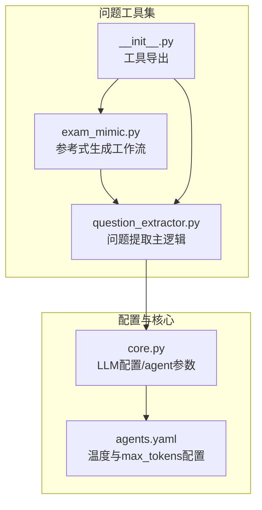
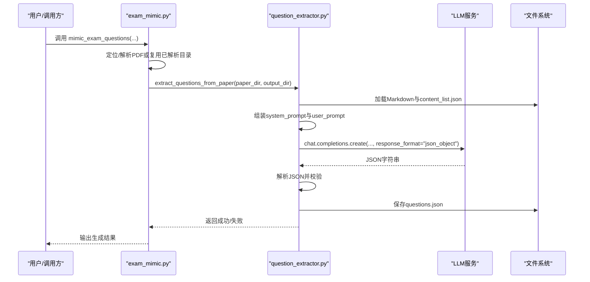
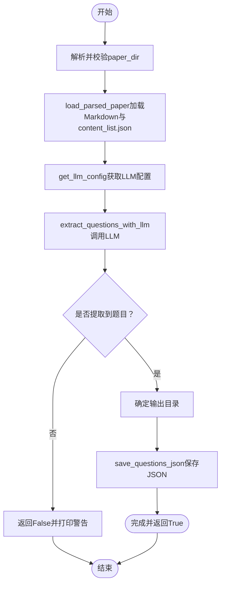
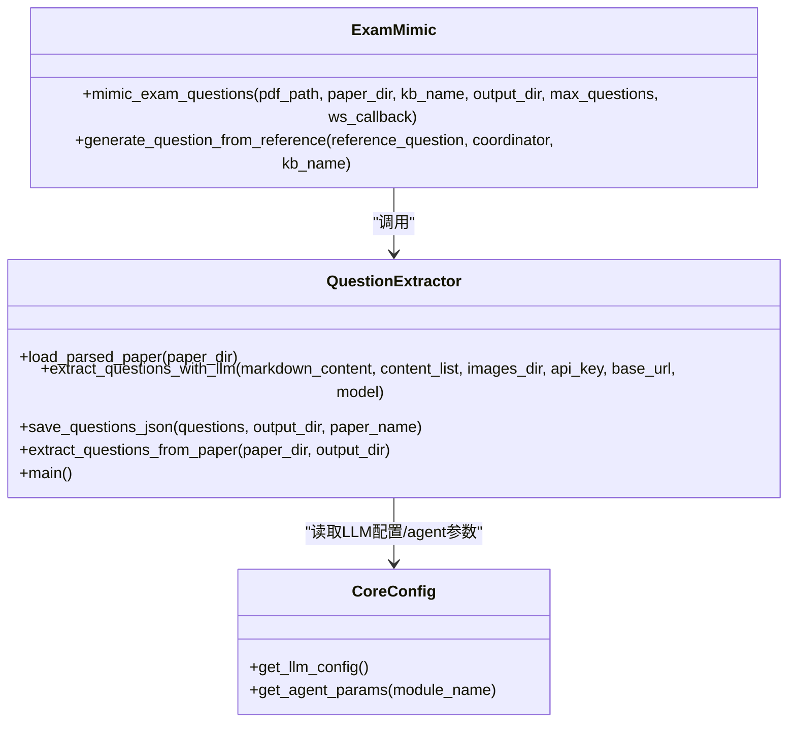
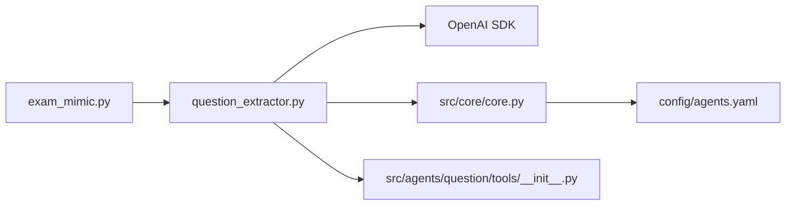

# 问题提取工具

<cite>
**本文引用的文件**
- [question_extractor.py](file://src/agents/question/tools/question_extractor.py)
- [exam_mimic.py](file://src/agents/question/tools/exam_mimic.py)
- [core.py](file://src/core/core.py)
- [agents.yaml](file://config/agents.yaml)
- [__init__.py](file://src/agents/question/tools/__init__.py)
</cite>

## 目录
1. [简介](#简介)
2. [项目结构](#项目结构)
3. [核心组件](#核心组件)
4. [架构总览](#架构总览)
5. [详细组件分析](#详细组件分析)
6. [依赖关系分析](#依赖关系分析)
7. [性能考虑](#性能考虑)
8. [故障排查指南](#故障排查指南)
9. [结论](#结论)
10. [附录](#附录)

## 简介
本文件系统性阐述“问题提取工具”的设计与实现，重点围绕 extract_questions_from_paper 函数：该工具从 MinerU 解析后的考试试卷目录中加载 Markdown 内容与 content_list.json，并借助大语言模型（LLM）分析提取所有题目信息，包括题干文本与相关图像文件名。工具输出结构化的 JSON 文件，供后续“问题模仿生成”工作流使用。文档涵盖公共接口、参数说明、返回值、提示词设计、与 exam_mimic 协调器的集成方式、常见问题与最佳实践，以及性能优化建议。

## 项目结构
问题提取工具位于 src/agents/question/tools 目录下，核心文件包括：
- question_extractor.py：问题提取主逻辑与命令行入口
- exam_mimic.py：参考式问题生成工作流，其中第二步即调用问题提取工具
- core.py：统一配置管理，提供 LLM 配置读取与 agent 参数获取
- agents.yaml：各模块温度与最大 token 配置
- __init__.py：导出工具集

图表来源
- [question_extractor.py](file://src/agents/question/tools/question_extractor.py#L1-L321)
- [exam_mimic.py](file://src/agents/question/tools/exam_mimic.py#L1-L599)
- [core.py](file://src/core/core.py#L1-L200)
- [agents.yaml](file://config/agents.yaml#L1-L55)
- [__init__.py](file://src/agents/question/tools/__init__.py#L1-L13)

章节来源
- [question_extractor.py](file://src/agents/question/tools/question_extractor.py#L1-L321)
- [exam_mimic.py](file://src/agents/question/tools/exam_mimic.py#L1-L599)
- [core.py](file://src/core/core.py#L1-L200)
- [agents.yaml](file://config/agents.yaml#L1-L55)
- [__init__.py](file://src/agents/question/tools/__init__.py#L1-L13)

## 核心组件
- extract_questions_from_paper(paper_dir: str, output_dir: str | None = None) -> bool
  - 功能：从 MinerU 解析的试卷目录中提取题目，保存为结构化 JSON
  - 输入：
    - paper_dir：MinerU 解析后的目录路径（通常包含 auto 子目录）
    - output_dir：可选，输出目录，默认与 paper_dir 同目录
  - 返回：布尔值，表示提取是否成功
- extract_questions_with_llm(...)：内部调用 LLM，构造 system_prompt 与 user_prompt，解析 JSON 并返回问题列表
- load_parsed_paper(...)：扫描目录，定位 Markdown 与 content_list.json，统计图片数量
- save_questions_json(...)：将提取结果写入 JSON 文件，包含 paper_name、extraction_time、total_questions、questions 字段

章节来源
- [question_extractor.py](file://src/agents/question/tools/question_extractor.py#L229-L321)

## 架构总览
问题提取工具在“参考式问题生成”工作流中承担第二步：先解析 PDF 或复用已解析目录，再调用问题提取工具从解析产物中抽取题目。抽取完成后，工作流进入第三步，基于参考题目并行生成新题。

图表来源
- [exam_mimic.py](file://src/agents/question/tools/exam_mimic.py#L249-L301)
- [question_extractor.py](file://src/agents/question/tools/question_extractor.py#L229-L321)

## 详细组件分析

### extract_questions_from_paper 函数详解
- 目录与输入验证
  - 将传入路径解析为绝对路径并检查存在性
  - 打印当前处理目录
- 加载解析产物
  - 若存在 auto 子目录优先使用；否则直接在根目录查找
  - 查找首个 .md 文件作为 Markdown 内容
  - 查找 *_content_list.json 作为内容索引（可选）
  - 统计 images 目录中的图片数量（可选）
- LLM 配置与调用
  - 通过 get_llm_config 读取 LLM 模型、API Key、基础 URL
  - 通过 get_agent_params 获取温度与最大 token
  - 使用 response_format={"type":"json_object"} 强制 LLM 返回 JSON
- 结果处理与落盘
  - 若未提取到任何题目，打印警告并返回失败
  - 默认输出目录为 paper_dir，否则使用指定 output_dir
  - 以 paper 名称+时间戳命名输出 JSON，包含统计信息

图表来源
- [question_extractor.py](file://src/agents/question/tools/question_extractor.py#L229-L321)

章节来源
- [question_extractor.py](file://src/agents/question/tools/question_extractor.py#L229-L321)

### 提示词设计（system_prompt 与 user_prompt）
- system_prompt 设计要点
  - 明确角色：专业考试卷分析助手
  - 任务目标：从给定 Markdown 内容中提取全部题目信息
  - 输出规范：严格要求 JSON 结构，包含 question_number、question_text、images 三项
  - 多选合并规则：将题干与选项合并为完整题干文本
  - 图像关联：仅列出存在的图片文件名，无图时为空数组
  - 格式要求：确保返回合法 JSON
- user_prompt 设计要点
  - 传入 Markdown 全文（限制长度，避免超出上下文）
  - 传入可用图片文件名列表，便于 LLM 关联题干与图片
  - 明确要求：不遗漏任何题目，保持原文本不修改

章节来源
- [question_extractor.py](file://src/agents/question/tools/question_extractor.py#L104-L149)

### 与 exam_mimic 的集成
- exam_mimic 在第二阶段调用 extract_questions_from_paper，若检测到已有 *_questions.json 则直接读取；否则触发提取流程
- 工作流顺序
  - 第一步：解析 PDF（MinerU）或复用已解析目录
  - 第二步：提取参考题目（本工具）
  - 第三步：并行生成新题（基于参考题）

章节来源
- [exam_mimic.py](file://src/agents/question/tools/exam_mimic.py#L249-L301)

### 类与方法关系图

图表来源
- [question_extractor.py](file://src/agents/question/tools/question_extractor.py#L1-L321)
- [exam_mimic.py](file://src/agents/question/tools/exam_mimic.py#L1-L599)
- [core.py](file://src/core/core.py#L40-L114)

## 依赖关系分析
- 外部依赖
  - OpenAI SDK：用于 chat.completions 接口调用
  - Python 标准库：json、argparse、pathlib、datetime、traceback
- 内部依赖
  - src.core.core：get_llm_config、get_agent_params
  - config/agents.yaml：统一的温度与最大 token 配置
  - src/agents/question/tools/__init__.py：工具导出入口

图表来源
- [question_extractor.py](file://src/agents/question/tools/question_extractor.py#L1-L321)
- [core.py](file://src/core/core.py#L1-L200)
- [agents.yaml](file://config/agents.yaml#L1-L55)
- [__init__.py](file://src/agents/question/tools/__init__.py#L1-L13)
- [exam_mimic.py](file://src/agents/question/tools/exam_mimic.py#L1-L599)

章节来源
- [question_extractor.py](file://src/agents/question/tools/question_extractor.py#L1-L321)
- [core.py](file://src/core/core.py#L1-L200)
- [agents.yaml](file://config/agents.yaml#L1-L55)
- [__init__.py](file://src/agents/question/tools/__init__.py#L1-L13)
- [exam_mimic.py](file://src/agents/question/tools/exam_mimic.py#L1-L599)

## 性能考虑
- 上下文长度控制
  - user_prompt 中对 Markdown 文本做了长度截断，避免超出模型上下文窗口
- JSON 强制输出
  - 通过 response_format={"type":"json_object"} 降低后处理成本，提高稳定性
- 并发与批处理
  - 问题提取本身为单次调用；但 exam_mimic 在第三步会并行生成新题，可在配置中调整并发度
- Token 与成本控制
  - 建议结合 agents.yaml 的 max_tokens 设置与实际 prompt 长度，合理评估调用成本
- 超时与重试
  - 建议在调用层增加超时与指数退避重试策略（当前实现未内置），以提升鲁棒性

[本节为通用性能建议，不直接分析具体文件]

## 故障排查指南
- LLM API 配置错误
  - 症状：抛出缺失配置异常或提示未设置 .env
  - 处理：确认 .env 文件中 LLM_MODEL、LLM_BINDING_API_KEY、LLM_BINDING_HOST 已正确配置
  - 参考：get_llm_config 对上述键进行严格校验
- JSON 解析失败
  - 症状：LLM 返回非 JSON 或格式不合法
  - 处理：检查 system_prompt 是否明确要求 JSON；必要时缩短 Markdown 输入；确认 response_format 正确
- 无法找到 Markdown 文件
  - 症状：提示未在目录中发现 .md 文件
  - 处理：确认 MinerU 解析产物目录结构，确保存在 auto 子目录或根目录下有 .md 文件
- 无图片目录或图片未关联
  - 症状：images 字段为空或与题干不匹配
  - 处理：确认 images 目录存在且包含有效图片；检查题干中对图片的引用是否与文件名一致
- 无提取结果
  - 症状：返回 False，提示未提取到题目
  - 处理：增大 max_tokens、优化提示词、检查 Markdown 排版与多选合并规则

章节来源
- [core.py](file://src/core/core.py#L40-L72)
- [question_extractor.py](file://src/agents/question/tools/question_extractor.py#L156-L189)
- [question_extractor.py](file://src/agents/question/tools/question_extractor.py#L247-L251)

## 结论
问题提取工具通过标准化的提示词与严格的 JSON 输出约束，将 MinerU 解析后的试卷内容转化为结构化题目清单，为后续“参考式问题生成”提供高质量输入。其与 exam_mimic 的无缝集成，使得从解析到生成的端到端流程清晰可控。建议在生产环境中完善超时与重试、监控 token 使用、规范 .env 配置，以获得更稳定与高效的体验。

[本节为总结性内容，不直接分析具体文件]

## 附录

### 公共接口与参数说明
- extract_questions_from_paper(paper_dir: str, output_dir: str | None = None) -> bool
  - paper_dir：MinerU 解析后的目录路径
  - output_dir：可选，输出目录，默认与 paper_dir 同目录
  - 返回：布尔值，表示提取是否成功

章节来源
- [question_extractor.py](file://src/agents/question/tools/question_extractor.py#L229-L287)

### 调用示例与最佳实践
- 命令行调用
  - 直接提取：python question_extractor.py reference_papers/exam_20241129_143052
  - 指定输出目录：python question_extractor.py reference_papers/exam_20241129_143052 -o ./output
- 代码中调用
  - 通过 exam_mimic.mimic_exam_questions 自动触发提取流程
  - 或直接调用 extract_questions_from_paper 进行独立提取
- 最佳实践
  - 确保 .env 中 LLM 配置完整
  - 控制 Markdown 长度，避免超出上下文
  - 保证图片文件名与题干引用一致
  - 使用 response_format 强制 JSON 输出
  - 监控 token 使用与成本，必要时调整 max_tokens

章节来源
- [question_extractor.py](file://src/agents/question/tools/question_extractor.py#L289-L321)
- [exam_mimic.py](file://src/agents/question/tools/exam_mimic.py#L249-L301)