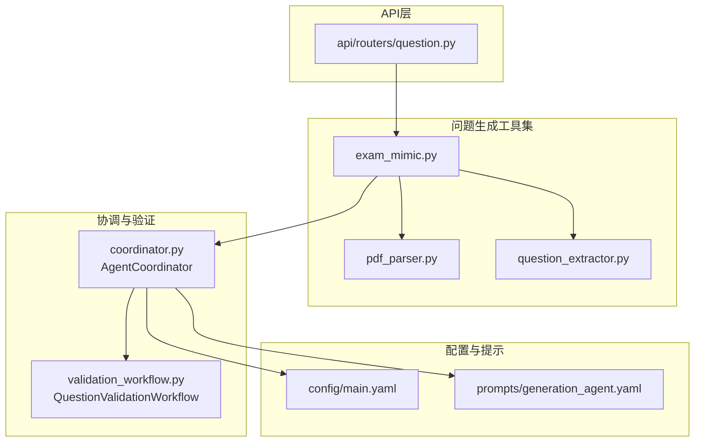
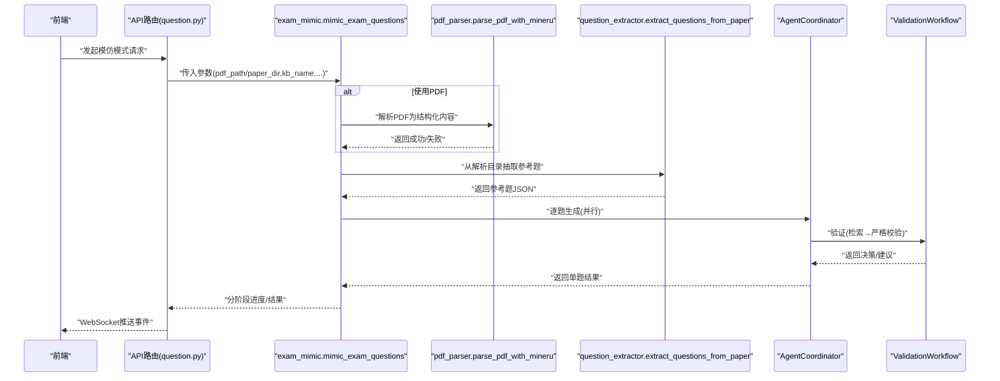
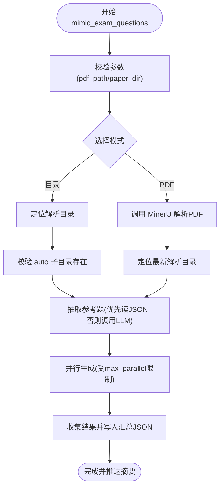
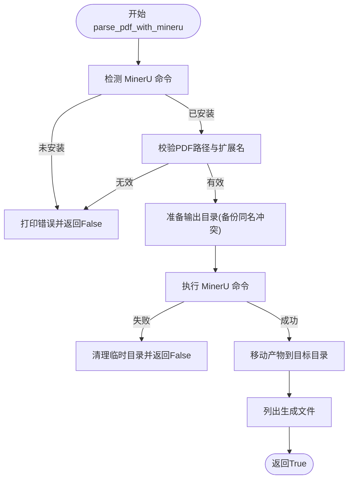
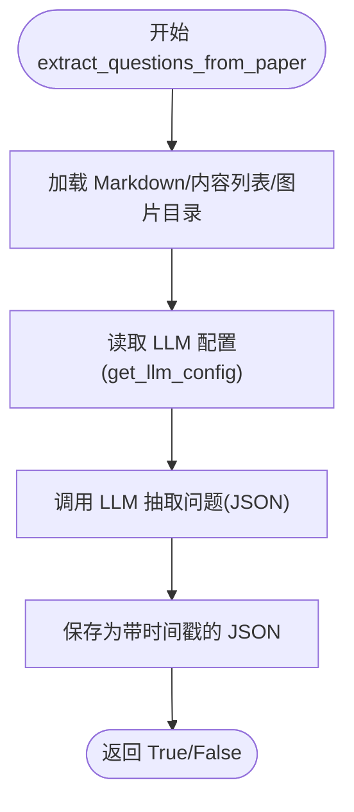
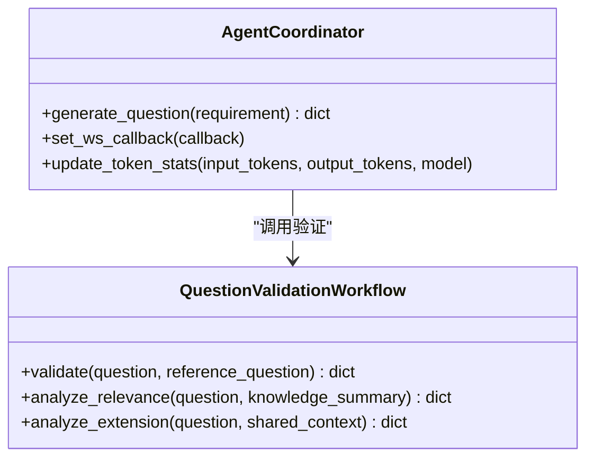
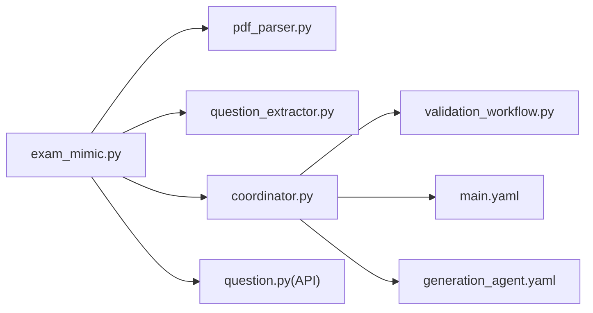

# 问题生成工具集

<cite>
**本文引用的文件**
- [exam_mimic.py](file://src/agents/question/tools/exam_mimic.py)
- [pdf_parser.py](file://src/agents/question/tools/pdf_parser.py)
- [question_extractor.py](file://src/agents/question/tools/question_extractor.py)
- [coordinator.py](file://src/agents/question/coordinator.py)
- [validation_workflow.py](file://src/agents/question/validation_workflow.py)
- [question.py（API路由器）](file://src/api/routers/question.py)
- [main.yaml](file://config/main.yaml)
- [generation_agent.yaml](file://src/agents/question/prompts/en/generation_agent.yaml)
- [example.py](file://src/agents/question/example.py)
</cite>

## 目录
1. [简介](#简介)
2. [项目结构](#项目结构)
3. [核心组件](#核心组件)
4. [架构总览](#架构总览)
5. [详细组件分析](#详细组件分析)
6. [依赖关系分析](#依赖关系分析)
7. [性能考量](#性能考量)
8. [故障排查指南](#故障排查指南)
9. [结论](#结论)
10. [附录](#附录)

## 简介
本文件系统化梳理 DeepTutor 问题生成工具集，重点覆盖以下三个工具：
- exam_mimic.py：基于参考题目的“模仿式”生成工作流，支持从 PDF 或已解析目录中抽取参考题，再通过协调器与验证流水线生成新题。
- pdf_parser.py：封装 MinerU 的 PDF 解析能力，将 PDF 转为可读的结构化内容与图片资源。
- question_extractor.py：利用 LLM 从 MinerU 解析出的 Markdown 与内容列表中抽取编号问题，输出标准化 JSON。

同时说明这些工具如何与问题生成协调器（AgentCoordinator）及验证流水线（QuestionValidationWorkflow）集成，支持“自定义模式”和“模仿模式”，并给出常见问题的排查建议与最佳实践。

## 项目结构
问题生成工具位于 src/agents/question/tools 下，配合 src/agents/question/coordinator.py 与 src/agents/question/validation_workflow.py 实现端到端的生成与验证；API 层在 src/api/routers/question.py 中暴露 WebSocket 接口以实时推送进度；全局配置由 config/main.yaml 提供。

图表来源
- [exam_mimic.py](file://src/agents/question/tools/exam_mimic.py#L1-L120)
- [pdf_parser.py](file://src/agents/question/tools/pdf_parser.py#L1-L120)
- [question_extractor.py](file://src/agents/question/tools/question_extractor.py#L1-L120)
- [coordinator.py](file://src/agents/question/coordinator.py#L1-L120)
- [validation_workflow.py](file://src/agents/question/validation_workflow.py#L1-L120)
- [question.py（API路由器）](file://src/api/routers/question.py#L180-L220)
- [main.yaml](file://config/main.yaml#L40-L60)
- [generation_agent.yaml](file://src/agents/question/prompts/en/generation_agent.yaml#L1-L40)

章节来源
- [exam_mimic.py](file://src/agents/question/tools/exam_mimic.py#L1-L120)
- [pdf_parser.py](file://src/agents/question/tools/pdf_parser.py#L1-L120)
- [question_extractor.py](file://src/agents/question/tools/question_extractor.py#L1-L120)
- [coordinator.py](file://src/agents/question/coordinator.py#L1-L120)
- [validation_workflow.py](file://src/agents/question/validation_workflow.py#L1-L120)
- [question.py（API路由器）](file://src/api/routers/question.py#L180-L220)
- [main.yaml](file://config/main.yaml#L40-L60)
- [generation_agent.yaml](file://src/agents/question/prompts/en/generation_agent.yaml#L1-L40)

## 核心组件
- exam_mimic.py
  - 公共接口：mimic_exam_questions(...)，generate_question_from_reference(...)
  - 功能：解析 PDF 或复用已解析目录 → 抽取参考题 → 并行生成新题 → 输出汇总 JSON
  - 关键参数：pdf_path、paper_dir、kb_name、output_dir、max_questions、ws_callback
  - 返回：包含成功/失败统计与结果列表的字典
- pdf_parser.py
  - 公共接口：parse_pdf_with_mineru(pdf_path, output_base_dir)
  - 功能：检测 MinerU 安装 → 校验 PDF → 执行解析 → 移动产物至目标目录
  - 返回：布尔值表示是否成功
- question_extractor.py
  - 公共接口：extract_questions_from_paper(paper_dir, output_dir)
  - 功能：加载 Markdown 与内容列表 → 读取图片目录 → 调用 LLM 抽取问题 → 保存 JSON
  - 返回：布尔值表示是否成功
- AgentCoordinator（coordinator.py）
  - 公共接口：generate_question(requirement)
  - 功能：生成阶段（多轮迭代）+ 验证阶段（检索知识 → 严格校验）→ 统计与日志
  - 关键配置：max_rounds、rag_query_count、max_parallel_questions、rag_mode
- QuestionValidationWorkflow（validation_workflow.py）
  - 公共接口：validate(question, reference_question)
  - 功能：生成检索查询 → RAG 检索 → LLM 严格验证 → 返回决策与建议
  - 关键配置：rag_mode、提示模板（prompts）

章节来源
- [exam_mimic.py](file://src/agents/question/tools/exam_mimic.py#L70-L120)
- [pdf_parser.py](file://src/agents/question/tools/pdf_parser.py#L37-L120)
- [question_extractor.py](file://src/agents/question/tools/question_extractor.py#L229-L287)
- [coordinator.py](file://src/agents/question/coordinator.py#L607-L800)
- [validation_workflow.py](file://src/agents/question/validation_workflow.py#L90-L140)
- [main.yaml](file://config/main.yaml#L43-L57)

## 架构总览
下图展示“模仿模式”的完整端到端流程：前端通过 WebSocket 触发 exam_mimic.mimic_exam_questions，内部按顺序执行 PDF 解析、参考题抽取、并行生成与验证、汇总落盘，并通过回调向前端推送进度。

图表来源
- [question.py（API路由器）](file://src/api/routers/question.py#L184-L216)
- [exam_mimic.py](file://src/agents/question/tools/exam_mimic.py#L190-L320)
- [pdf_parser.py](file://src/agents/question/tools/pdf_parser.py#L37-L120)
- [question_extractor.py](file://src/agents/question/tools/question_extractor.py#L229-L287)
- [coordinator.py](file://src/agents/question/coordinator.py#L607-L800)
- [validation_workflow.py](file://src/agents/question/validation_workflow.py#L90-L140)

## 详细组件分析

### exam_mimic.py：参考题模仿生成
- 输入与模式
  - 支持两种输入模式：直接提供 PDF（自动解析）或提供已解析目录（paper_dir）
  - 参数：pdf_path、paper_dir、kb_name、output_dir、max_questions、ws_callback
  - 返回：包含参考数量、成功/失败统计与每题结果的字典
- 处理流程
  - 参数校验：二选一且互斥
  - 已解析目录定位：支持相对路径与多候选位置查找
  - PDF 解析：调用 MinerU 命令，产出结构化内容与图片
  - 参考题抽取：优先读取已存在的 *_questions.json，否则调用 LLM 抽取
  - 并行生成：根据配置限制最大并发，逐题构建生成要求并调用协调器
  - 结果汇总：写入时间戳命名的 JSON 文件，推送摘要
- 关键实现点
  - 进度回调：send_progress 封装 WebSocket 回调，统一事件类型
  - 并发控制：信号量 + 锁保证计数与并发安全
  - 生成要求：附加参考题文本、是否含图、知识库名、创新约束等
- 公共接口
  - mimic_exam_questions(...)：主流程入口
  - generate_question_from_reference(...)：单题生成封装
- 调用示例（路径）
  - CLI 示例：参见 exam_mimic.py 主函数帮助信息
  - API 示例：参见 question.py 的 WebSocket 路由调用

图表来源
- [exam_mimic.py](file://src/agents/question/tools/exam_mimic.py#L105-L320)
- [pdf_parser.py](file://src/agents/question/tools/pdf_parser.py#L37-L120)
- [question_extractor.py](file://src/agents/question/tools/question_extractor.py#L229-L287)

章节来源
- [exam_mimic.py](file://src/agents/question/tools/exam_mimic.py#L70-L530)
- [question.py（API路由器）](file://src/api/routers/question.py#L184-L216)

### pdf_parser.py：PDF 解析器（MinerU）
- 功能概述
  - 自动检测 MinerU 命令（magic-pdf 或 mineru）
  - 校验输入 PDF 路径与格式
  - 执行解析并将产物移动到目标目录
  - 失败时清理临时目录并返回错误信息
- 公共接口
  - parse_pdf_with_mineru(pdf_path, output_base_dir)：返回布尔值
- 调用示例（路径）
  - CLI 示例：参见脚本帮助信息
  - 内部调用：exam_mimic 在解析阶段调用该函数

图表来源
- [pdf_parser.py](file://src/agents/question/tools/pdf_parser.py#L14-L150)

章节来源
- [pdf_parser.py](file://src/agents/question/tools/pdf_parser.py#L1-L199)

### question_extractor.py：编号问题抽取器（LLM）
- 功能概述
  - 加载 MinerU 生成的 Markdown 与内容列表
  - 读取 images 目录，统计可用图片
  - 使用 LLM（OpenAI 客户端）对内容进行分析，抽取编号问题
  - 保存为带时间戳的 JSON 文件，包含统计信息
- 公共接口
  - extract_questions_from_paper(paper_dir, output_dir)：返回布尔值
  - extract_questions_with_llm(...)：核心 LLM 抽取逻辑
- 调用示例（路径）
  - CLI 示例：参见脚本帮助信息
  - 内部调用：exam_mimic 在需要时调用该函数

图表来源
- [question_extractor.py](file://src/agents/question/tools/question_extractor.py#L229-L287)
- [question_extractor.py](file://src/agents/question/tools/question_extractor.py#L69-L179)

章节来源
- [question_extractor.py](file://src/agents/question/tools/question_extractor.py#L1-L322)

### 协调器与验证流水线：自定义模式与模仿模式
- AgentCoordinator
  - 初始化：加载配置（main.yaml），构造生成代理与验证流水线，设置并发与日志
  - generate_question(requirement)：多轮生成 + 验证，支持拒绝与重试
  - WebSocket 回调：向前端推送状态与令牌统计
- QuestionValidationWorkflow
  - validate(question, reference_question)：检索 → 严格验证 → 返回决策/建议
  - analyze_relevance / analyze_extension：对“自定义模式”进行相关性与扩展性分析
- 配置要点
  - main.yaml 中 question 段控制 max_rounds、rag_query_count、max_parallel_questions、rag_mode
  - generation_agent.yaml 提供生成提示词（含“模仿式”生成模板）

图表来源
- [coordinator.py](file://src/agents/question/coordinator.py#L607-L800)
- [validation_workflow.py](file://src/agents/question/validation_workflow.py#L90-L140)
- [main.yaml](file://config/main.yaml#L43-L57)
- [generation_agent.yaml](file://src/agents/question/prompts/en/generation_agent.yaml#L45-L86)

章节来源
- [coordinator.py](file://src/agents/question/coordinator.py#L1-L200)
- [validation_workflow.py](file://src/agents/question/validation_workflow.py#L1-L200)
- [main.yaml](file://config/main.yaml#L43-L57)
- [generation_agent.yaml](file://src/agents/question/prompts/en/generation_agent.yaml#L45-L86)

## 依赖关系分析
- 工具间依赖
  - exam_mimic 依赖 pdf_parser 与 question_extractor
  - exam_mimic 通过 AgentCoordinator 调用生成与验证
- 外部依赖
  - LLM：OpenAI 客户端，配置来源于环境变量或 .env
  - RAG：统一 rag_search 工具，模式由配置决定
  - MinerU：MinerU 命令行工具（magic-pdf 或 mineru）
- 配置耦合
  - main.yaml 的 question 段影响并发、轮次与检索策略
  - generation_agent.yaml 的提示词影响生成质量与风格

图表来源
- [exam_mimic.py](file://src/agents/question/tools/exam_mimic.py#L1-L120)
- [pdf_parser.py](file://src/agents/question/tools/pdf_parser.py#L1-L120)
- [question_extractor.py](file://src/agents/question/tools/question_extractor.py#L1-L120)
- [coordinator.py](file://src/agents/question/coordinator.py#L1-L120)
- [validation_workflow.py](file://src/agents/question/validation_workflow.py#L1-L120)
- [question.py（API路由器）](file://src/api/routers/question.py#L184-L216)
- [main.yaml](file://config/main.yaml#L43-L57)
- [generation_agent.yaml](file://src/agents/question/prompts/en/generation_agent.yaml#L1-L40)

章节来源
- [exam_mimic.py](file://src/agents/question/tools/exam_mimic.py#L1-L120)
- [pdf_parser.py](file://src/agents/question/tools/pdf_parser.py#L1-L120)
- [question_extractor.py](file://src/agents/question/tools/question_extractor.py#L1-L120)
- [coordinator.py](file://src/agents/question/coordinator.py#L1-L120)
- [validation_workflow.py](file://src/agents/question/validation_workflow.py#L1-L120)
- [question.py（API路由器）](file://src/api/routers/question.py#L184-L216)
- [main.yaml](file://config/main.yaml#L43-L57)
- [generation_agent.yaml](file://src/agents/question/prompts/en/generation_agent.yaml#L1-L40)

## 性能考量
- 并发与吞吐
  - exam_mimic 使用信号量限制并行生成数量，避免 LLM 与 RAG 负载过高
  - main.yaml 的 max_parallel_questions 控制并发上限
- 检索效率
  - rag_mode 可设为 naive/hybrid，平衡速度与准确性
  - 生成检索查询时尽量聚焦核心知识点，减少无关上下文
- I/O 与缓存
  - MinerU 解析后产物直接移动到目标目录，避免重复拷贝
  - 已存在 *_questions.json 时跳过 LLM 抽取，节省成本
- 日志与统计
  - 协调器内置令牌统计与成本估算，便于监控与优化

[本节为通用指导，无需特定文件来源]

## 故障排查指南
- PDF 解析失败
  - 现象：返回“解析失败”或无输出
  - 排查：确认 MinerU 已安装（magic-pdf 或 mineru），检查 PDF 路径与格式，查看命令行输出与错误日志
  - 参考实现：pdf_parser.parse_pdf_with_mineru
- 问题抽取不准确
  - 现象：抽取为空或 JSON 不规范
  - 排查：确认 Markdown 与内容列表存在；检查 LLM 配置（api_key/base_url/model）；查看 LLM 返回内容与 JSON 解析异常
  - 参考实现：question_extractor.extract_questions_with_llm
- 生成被拒绝
  - 现象：返回 task_rejected
  - 排查：知识库缺少所需内容；调整知识点或确保 KB 包含支撑材料
  - 参考实现：coordinator.generate_question
- 验证不通过
  - 现象：返回 request_modification/request_regeneration
  - 排查：检索知识不足或问题与 KB 不匹配；根据 issues/suggestions 修改后重试
  - 参考实现：validation_workflow.validate
- WebSocket 进度丢失
  - 现象：前端无进度更新
  - 排查：确认 ws_callback 正常；检查 API 路由中的回调封装与异常捕获
  - 参考实现：question.py 的 ws_callback 与 exam_mimic 的 send_progress

章节来源
- [pdf_parser.py](file://src/agents/question/tools/pdf_parser.py#L37-L120)
- [question_extractor.py](file://src/agents/question/tools/question_extractor.py#L150-L200)
- [coordinator.py](file://src/agents/question/coordinator.py#L690-L720)
- [validation_workflow.py](file://src/agents/question/validation_workflow.py#L247-L353)
- [question.py（API路由器）](file://src/api/routers/question.py#L184-L216)

## 结论
问题生成工具集通过 exam_mimic、pdf_parser、question_extractor 三者协作，实现了从 PDF 到参考题再到新题的完整链路；在协调器与验证流水线的加持下，既能支持“自定义模式”的快速生成，也能在“模仿模式”下保持与参考题在知识点、难度与推理路径上的创新一致性。通过合理的并发控制、检索策略与日志统计，系统在稳定性与性能之间取得良好平衡。

[本节为总结，无需特定文件来源]

## 附录

### 使用示例与最佳实践
- CLI 使用
  - exam_mimic：参见 exam_mimic.py 主函数帮助信息
  - pdf_parser：参见 pdf_parser.py 主函数帮助信息
  - question_extractor：参见 question_extractor.py 主函数帮助信息
- API 集成
  - 通过 question.py 的 WebSocket 路由触发 exam_mimic，实时接收进度事件
- 最佳实践
  - 先用 pdf_parser 对 PDF 进行预解析，再复用 paper_dir，避免重复 LLM 抽取
  - 合理设置 max_parallel_questions，避免 LLM 限流
  - 在 main.yaml 中根据场景切换 rag_mode（naive/hybrid）
  - 为 LLM 配置稳定的 api_key/base_url/model

章节来源
- [exam_mimic.py](file://src/agents/question/tools/exam_mimic.py#L532-L599)
- [pdf_parser.py](file://src/agents/question/tools/pdf_parser.py#L160-L199)
- [question_extractor.py](file://src/agents/question/tools/question_extractor.py#L289-L322)
- [question.py（API路由器）](file://src/api/routers/question.py#L184-L216)
- [main.yaml](file://config/main.yaml#L43-L57)