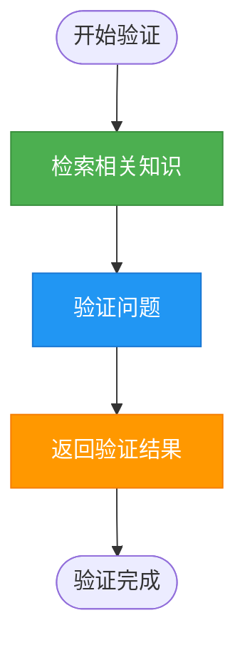
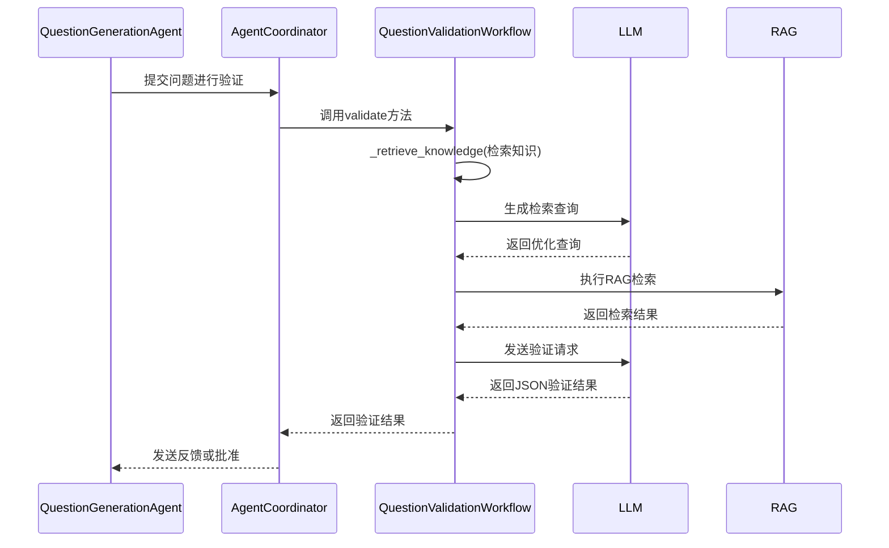
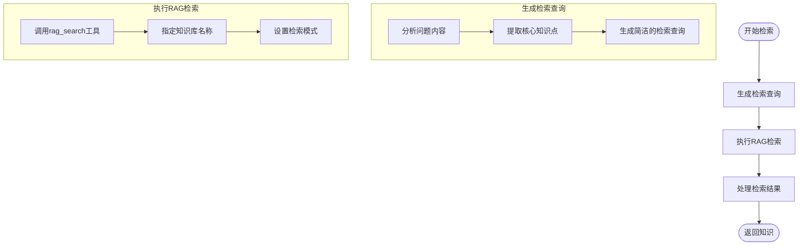
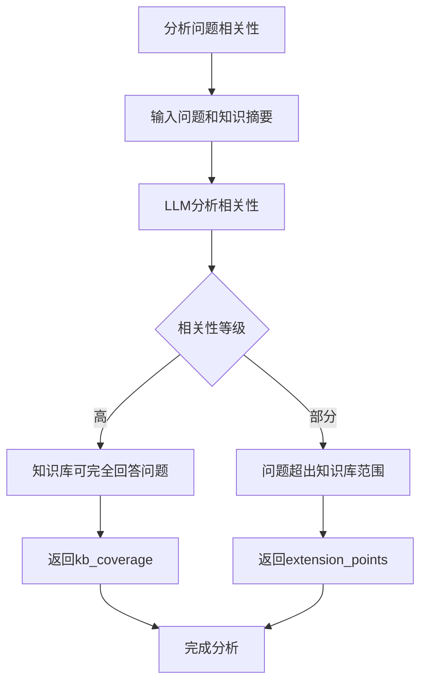
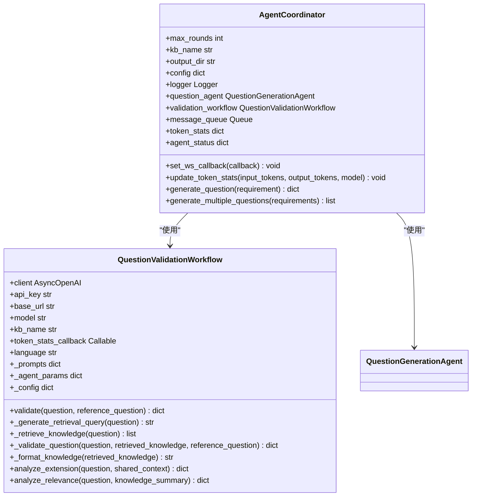
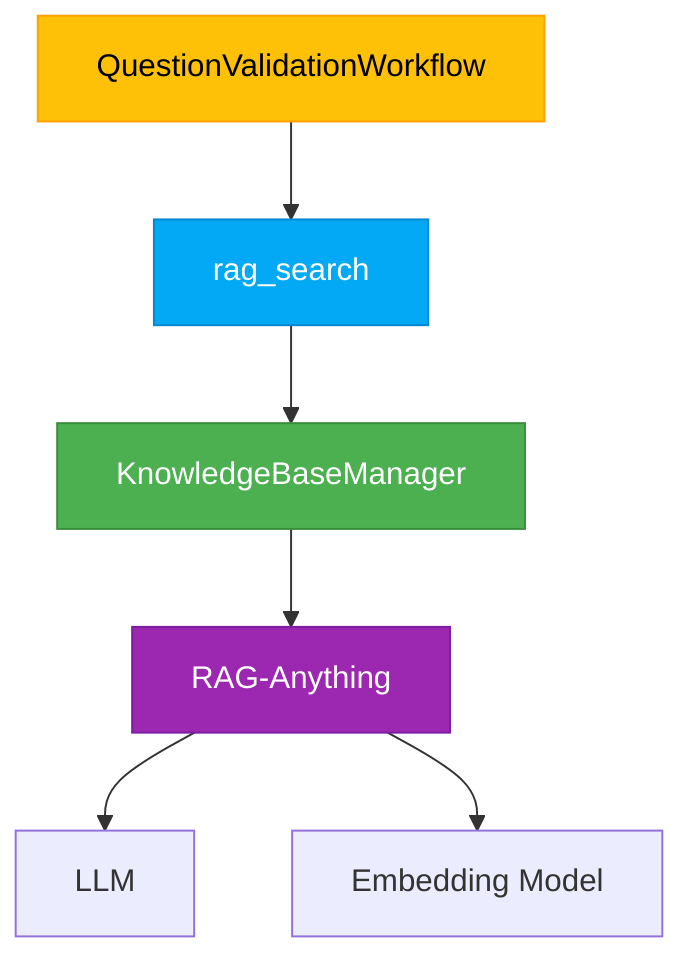
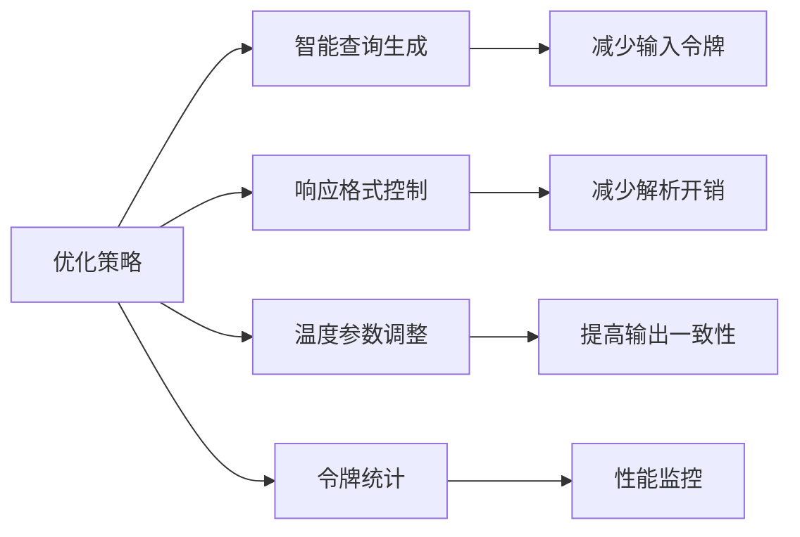

# 问题验证工作流

<cite>
**本文档引用的文件**
- [validation_workflow.py](file://src/agents/question/validation_workflow.py)
- [coordinator.py](file://src/agents/question/coordinator.py)
- [validation_agent.py](file://src/agents/question/agents/validation_agent.py)
- [rag_tool.py](file://src/tools/rag_tool.py)
- [main.yaml](file://config/main.yaml)
- [validation_workflow.yaml](file://src/agents/question/prompts/en/validation_workflow.yaml)
</cite>

## 目录
1. [简介](#简介)
2. [固定流水线架构](#固定流水线架构)
3. [核心方法实现](#核心方法实现)
4. [配置选项与参数](#配置选项与参数)
5. [系统集成关系](#系统集成关系)
6. [常见问题处理](#常见问题处理)
7. [性能优化考虑](#性能优化考虑)
8. [结论](#结论)

## 简介

问题验证工作流是DeepTutor系统中确保生成问题质量的核心组件。该工作流采用固定的三阶段流水线架构：检索（retrieve）→ 验证（validate）→ 返回（return），通过RAG（检索增强生成）工具和大语言模型（LLM）对生成的问题进行严格验证。工作流与问题生成协调器和知识库紧密集成，确保生成的问题在知识准确性、创新性和严谨性方面达到高标准。

**Section sources**
- [validation_workflow.py](file://src/agents/question/validation_workflow.py#L1-L595)

## 固定流水线架构

问题验证工作流采用固定的三阶段流水线架构，确保验证过程的一致性和可靠性。该架构由`QuestionValidationWorkflow`类实现，其核心流程如下：



**Diagram sources**
- [validation_workflow.py](file://src/agents/question/validation_workflow.py#L91-L137)

### 检索阶段

在检索阶段，工作流首先使用LLM生成一个优化的检索查询，然后通过RAG工具从知识库中检索相关知识。这个阶段的关键是生成能够准确反映问题核心知识点的查询，而不是直接使用原始问题文本。

### 验证阶段

在验证阶段，工作流将检索到的知识与待验证的问题进行对比分析。通过精心设计的提示词（prompt），LLM被引导从多个维度评估问题的质量，包括知识充分性、答案可推导性、问题清晰度等。

### 返回阶段

在返回阶段，工作流将验证结果以结构化的JSON格式返回，包括决策结果、发现的问题、修改建议和推理过程。这个阶段还负责将检索到的知识一并返回，为后续的分析提供上下文。

## 核心方法实现

### _validate_question 方法

`_validate_question`方法是验证工作流的核心，负责执行实际的验证逻辑。该方法接收待验证的问题、检索到的知识以及参考问题（用于创新性检查），并返回验证结果。



**Diagram sources**
- [validation_workflow.py](file://src/agents/question/validation_workflow.py#L247-L352)
- [coordinator.py](file://src/agents/question/coordinator.py#L762-L764)

该方法的关键实现细节包括：
- 使用JSON格式的响应确保输出结构化
- 对LLM返回的"issues"和"suggestions"字段进行类型检查和转换，确保它们始终是列表
- 在系统提示中明确验证标准，包括对基础知识的宽松判断原则
- 支持与参考问题的对比，以检查生成问题的创新性

### _retrieve_knowledge 方法

`_retrieve_knowledge`方法负责从知识库中检索验证所需的知识。该方法首先调用`_generate_retrieval_query`使用LLM生成优化的检索查询，然后通过RAG工具执行实际的检索。



**Diagram sources**
- [validation_workflow.py](file://src/agents/question/validation_workflow.py#L211-L246)

该方法的关键特性包括：
- 使用LLM智能生成检索查询，而不是直接使用问题文本
- 支持多种RAG检索模式（如hybrid、naive）
- 对检索失败进行优雅处理，返回空列表而不是抛出异常
- 将检索到的知识格式化为包含查询和答案的字典列表

### _analyze_relevance 方法

`_analyze_relevance`方法用于分析问题与知识库内容的相关性，特别适用于非迭代的自定义模式。该方法返回问题与知识库的相关性等级（高或部分），以及具体的覆盖范围和扩展点。



**Diagram sources**
- [validation_workflow.py](file://src/agents/question/validation_workflow.py#L469-L586)

该方法的输出结构如下：
```json
{
  "relevance": "high|partial",
  "kb_coverage": "描述知识库中测试的概念",
  "extension_points": "描述超出知识库范围的扩展点"
}
```

## 配置选项与参数

问题验证工作流支持多种配置选项，这些选项主要通过配置文件和初始化参数进行设置。

### 初始化参数

`QuestionValidationWorkflow`类的初始化方法接受以下参数：

| 参数 | 类型 | 默认值 | 描述 |
|------|------|--------|------|
| `api_key` | str \| None | 从环境变量读取 | LLM API密钥 |
| `base_url` | str \| None | 从环境变量读取 | LLM API端点 |
| `model` | str \| None | "gpt-4o" | 使用的模型名称 |
| `kb_name` | str \| None | None | 知识库名称 |
| `token_stats_callback` | Callable \| None | None | 令牌统计回调函数 |
| `language` | str | "en" | 提示词语言 |

**Section sources**
- [validation_workflow.py](file://src/agents/question/validation_workflow.py#L46-L80)

### 配置文件选项

系统的主要配置文件`main.yaml`中包含与问题验证相关的配置：

```yaml
question:
  max_rounds: 10
  rag_query_count: 3
  max_parallel_questions: 3
  rag_mode: naive
  agents:
    question_generation:
      max_iterations: 5
      retrieve_top_k: 30
    question_validation:
      strict_mode: true
```

这些配置项控制着验证工作流的行为，如最大验证轮次、RAG检索模式等。

## 系统集成关系

问题验证工作流与系统的其他组件有着紧密的集成关系，特别是与问题生成协调器和知识库。

### 与问题生成协调器的集成

问题验证工作流与`AgentCoordinator`紧密协作，形成一个闭环的生成-验证循环。协调器负责管理整个工作流，包括：

- 初始化问题生成代理和验证工作流
- 管理消息队列，实现代理间的通信
- 跟踪令牌使用情况和成本
- 处理验证结果并决定下一步行动



**Diagram sources**
- [coordinator.py](file://src/agents/question/coordinator.py#L79-L89)
- [validation_workflow.py](file://src/agents/question/validation_workflow.py#L43-L87)

### 与知识库的集成

问题验证工作流通过RAG工具与知识库进行交互。`rag_search`函数是连接工作流与知识库的桥梁，它封装了复杂的检索逻辑，包括：

- 从配置中获取LLM和嵌入模型的配置
- 确定知识库的存储路径
- 执行实际的RAG查询
- 返回结构化的查询结果



**Diagram sources**
- [validation_workflow.py](file://src/agents/question/validation_workflow.py#L223-L230)
- [rag_tool.py](file://src/tools/rag_tool.py#L31-L239)

## 常见问题处理

### 检索失败

当RAG检索失败时，系统会优雅地处理这一情况，而不是让整个流程崩溃。在`_retrieve_knowledge`方法中，使用了try-catch块来捕获异常：

```python
try:
    result = await rag_search(
        query=query,
        kb_name=self.kb_name,
        mode=rag_mode,
        only_need_context=True,
    )
    # 处理结果
except Exception as e:
    logger.warning(f"Retrieval failed: {e!s}")
    return []
```

这种设计确保了即使检索失败，验证流程也能继续进行，只是在没有检索到知识的情况下进行验证。

### LLM响应解析错误

由于LLM的输出可能不符合预期格式，系统在解析JSON响应时包含了错误处理机制：

```python
try:
    result = json.loads(response_content)
    # 确保issues和suggestions是列表
    issues = result.get("issues", [])
    if not isinstance(issues, list):
        issues = [issues] if isinstance(issues, dict) else []
    # 类似处理suggestions
except Exception as e:
    logger.warning(f"Validation failed: {e!s}")
    return {
        "decision": "request_regeneration",
        "issues": [f"Validation error: {e!s}"],
        "suggestions": ["Please regenerate the question"],
        "reasoning": "An error occurred during validation",
    }
```

这种防御性编程确保了系统在面对LLM输出异常时仍能提供有意义的反馈。

## 性能优化考虑

### 上下文截断

为了控制令牌使用量，系统对长文本进行了智能截断。在`_format_knowledge`方法中：

```python
if len(answer) > 3000:
    answer = answer[:3000] + "...[truncated]"
```

类似的截断也应用于`analyze_extension`和`analyze_relevance`方法中的上下文处理。这种策略在保持信息完整性的同时有效控制了上下文长度。

### 令牌使用优化

系统通过多种方式优化令牌使用：

1. **智能查询生成**：使用LLM生成简洁的检索查询，而不是直接使用完整的问题文本
2. **响应格式控制**：使用`response_format={"type": "json_object"}`确保LLM输出结构化，减少解析开销
3. **温度参数调整**：在生成检索查询时使用较低的温度（0.3），确保输出的确定性和一致性
4. **令牌统计**：通过`token_stats_callback`跟踪令牌使用情况，为性能分析提供数据



**Diagram sources**
- [validation_workflow.py](file://src/agents/question/validation_workflow.py#L170-L177)
- [validation_workflow.py](file://src/agents/question/validation_workflow.py#L284-L286)

## 结论

问题验证工作流是DeepTutor系统中确保问题质量的关键组件。通过固定的三阶段流水线架构，该工作流有效地结合了RAG工具和LLM的优势，实现了对生成问题的全面验证。工作流的设计考虑了实际应用中的各种挑战，包括检索失败、LLM输出异常和性能优化等问题，展现了高度的鲁棒性和实用性。与问题生成协调器和知识库的紧密集成使得整个系统能够高效地生成高质量、创新性强的教育问题。