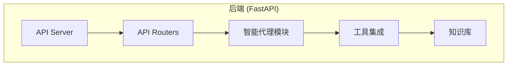
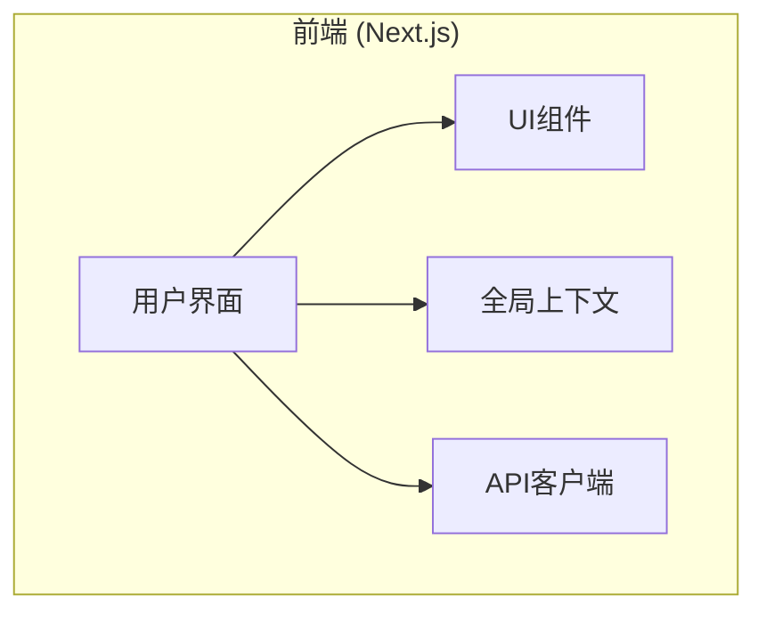
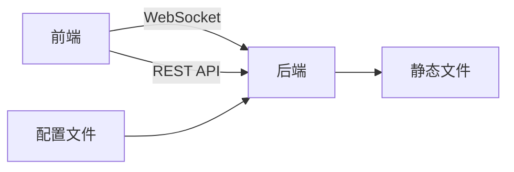
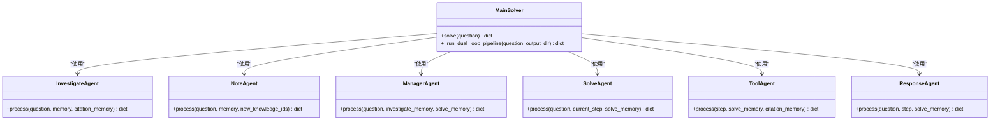
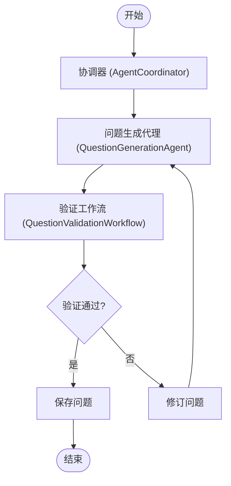
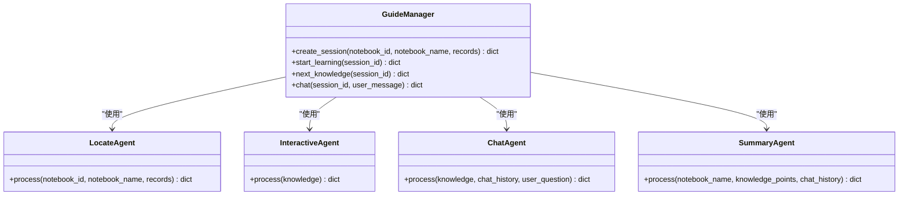
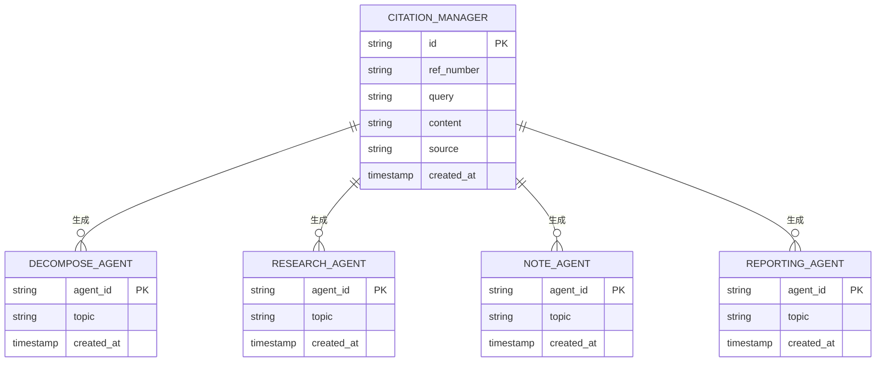
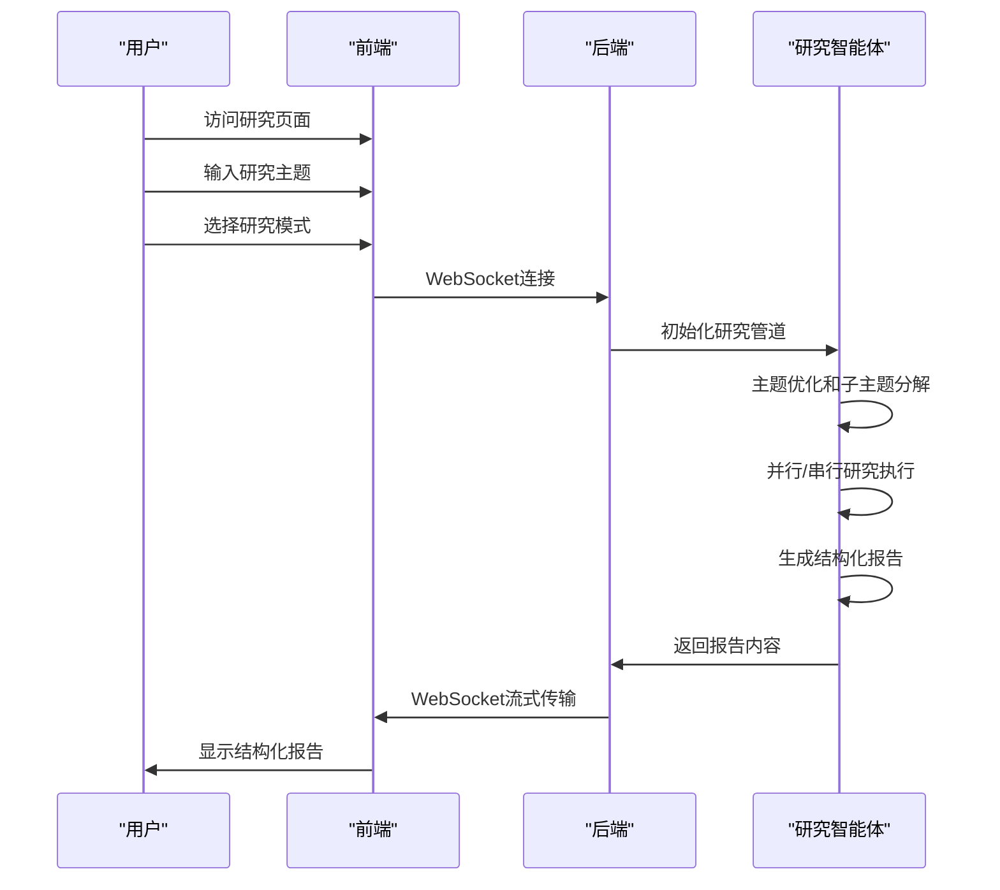
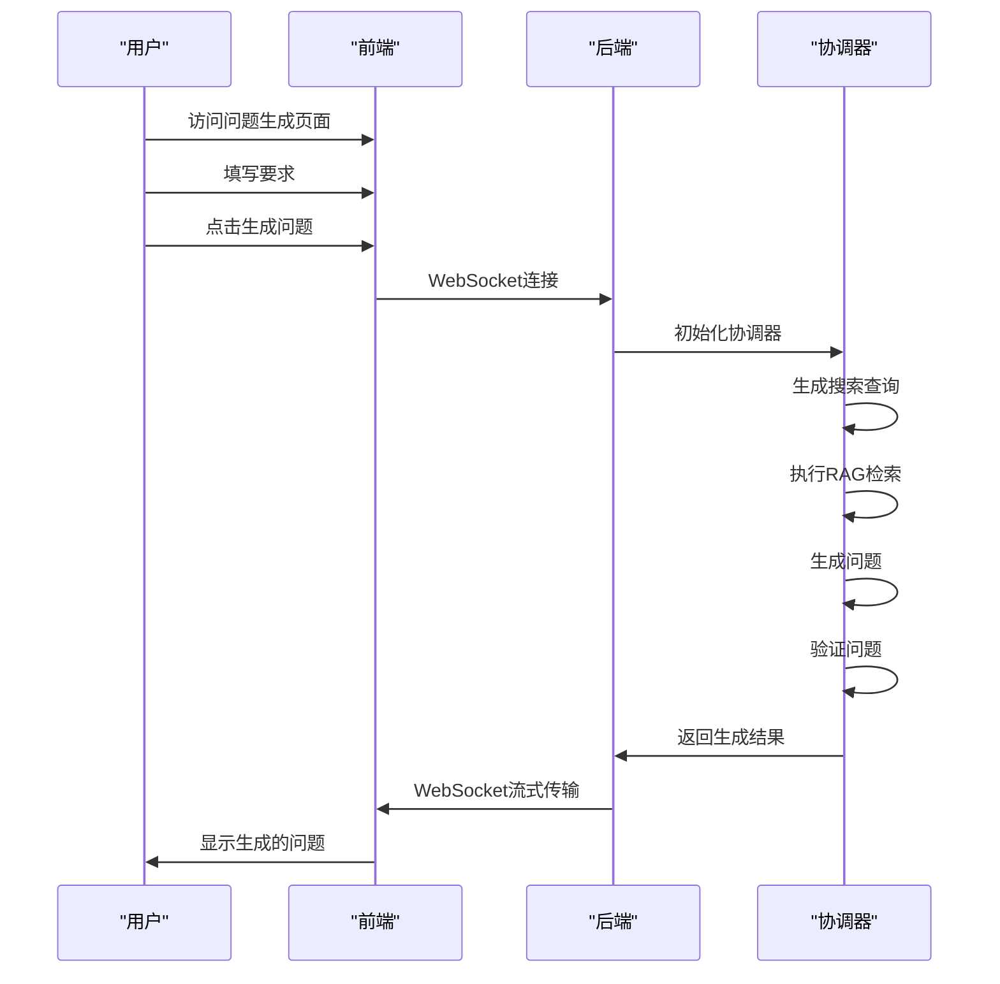
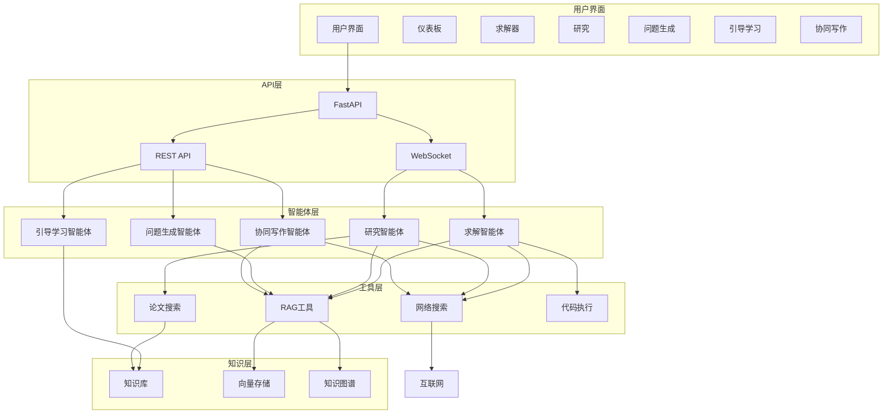

# 项目概述

<cite>
**本文档引用的文件**   
- [README.md](file://README.md)
- [main.yaml](file://config/main.yaml)
- [agents.yaml](file://config/agents.yaml)
- [main.py](file://src/api/main.py)
- [layout.tsx](file://web/app/layout.tsx)
- [main_solver.py](file://src/agents/solve/main_solver.py)
- [main.py](file://src/agents/research/main.py)
- [coordinator.py](file://src/agents/question/coordinator.py)
- [guide_manager.py](file://src/agents/guide/guide_manager.py)
- [edit_agent.py](file://src/agents/co_writer/edit_agent.py)
- [solve.py](file://src/api/routers/solve.py)
- [research.py](file://src/api/routers/research.py)
- [question.py](file://src/api/routers/question.py)
- [api.ts](file://web/lib/api.ts)
</cite>

## 目录
1. [引言](#引言)
2. [核心功能](#核心功能)
3. [系统架构](#系统架构)
4. [前后端架构](#前后端架构)
5. [多智能体协作系统](#多智能体协作系统)
6. [RAG技术实现](#rag技术实现)
7. [典型用例](#典型用例)
8. [系统上下文图](#系统上下文图)

## 引言

DeepTutor是一个基于多智能体协作和RAG（检索增强生成）技术的个性化学习助手。该项目旨在通过先进的AI技术为用户提供智能解题、深度研究、引导式学习、问题生成、创意生成和协同写作等核心功能。系统采用FastAPI作为后端框架，Next.js作为前端框架，构建了一个完整的全栈学习辅助平台。

DeepTutor的核心理念是通过多智能体系统的协作，模拟人类专家的思维过程，为用户提供深度、精准和个性化的学习支持。系统能够处理复杂的学术问题，进行深入的研究分析，并生成高质量的学习材料。

**Section sources**
- [README.md](file://README.md#L1-L185)

## 核心功能

DeepTutor提供了六大核心功能，涵盖了从基础学习到高级研究的完整学习周期。

### 智能解题
智能解题功能基于双循环架构（分析循环+求解循环），结合RAG、网络搜索、论文搜索和代码执行等多种工具，提供逐步的解题过程和精确的引用。系统能够理解复杂问题，分解求解步骤，并通过多轮迭代确保答案的准确性。

### 深度研究
深度研究功能采用"DR-in-KG"（知识图谱中的深度研究）架构，基于动态主题队列系统，实现多智能体在规划、研究和报告三个阶段的协作。系统支持并行和串行两种执行模式，能够进行跨学科的知识综合和新颖见解的发现。

### 引导式学习
引导式学习功能基于笔记本内容，自动生成渐进式学习路径。通过多智能体协作，系统能够识别关键知识点，生成交互式HTML页面，并提供上下文感知的问答功能。学习过程支持进度跟踪和会话持久化。

### 问题生成
问题生成功能支持两种模式：自定义模式和模仿模式。自定义模式基于背景知识分析，生成与用户知识水平相匹配的练习题；模仿模式能够解析参考试卷，生成风格和难度完全匹配的练习题，实现真实的考试模拟。

### 创意生成
创意生成功能支持系统化头脑风暴和跨源知识综合。系统能够从多个知识源中提取信息，进行概念合成，生成结构化的学习材料，并识别知识空白，发现有前景的新研究方向。

### 协同写作
协同写作功能提供AI辅助的Markdown编辑器，支持重写、缩短、扩展等编辑操作，以及自动注释和TTS（文本转语音）朗读功能。用户可以利用RAG或网络搜索增强上下文，生成高质量的写作内容。

**Section sources**
- [README.md](file://README.md#L31-L148)

## 系统架构

DeepTutor的系统架构分为四个主要层次：用户界面层、智能代理模块、工具集成层和知识与记忆基础。

### 用户界面层
用户界面层提供直观的双向查询-响应流程，支持结构化响应生成，能够将复杂信息组织成可操作的输出。前端采用Next.js框架，提供现代化的用户交互体验。

### 智能代理模块
智能代理模块是系统的核心，包含多个功能模块：
- **问题求解与评估**：提供逐步解题和自定义评估生成
- **研究与学习**：支持深度主题探索和引导式学习
- **创意生成**：实现自动化和交互式概念开发

### 工具集成层
工具集成层提供多种信息检索和处理分析功能：
- **信息检索**：支持RAG混合检索、实时网络搜索和学术论文数据库
- **处理与分析**：提供Python代码执行、查询项查找和PDF解析功能

### 知识与记忆基础
知识与记忆基础为系统提供持久化的知识存储和上下文管理：
- **知识图谱**：通过实体-关系映射实现语义连接和知识发现
- **向量存储**：基于嵌入的语义搜索实现智能内容检索
- **记忆系统**：管理会话状态和引用跟踪，确保上下文连续性

**Section sources**
- [README.md](file://README.md#L185-L208)

## 前后端架构

DeepTutor采用现代化的前后端分离架构，后端使用FastAPI，前端使用Next.js，两者通过WebSocket和REST API进行高效通信。

### 后端架构 (FastAPI)
后端基于FastAPI框架构建，提供高性能的API服务。主要特点包括：
- **WebSocket支持**：实现实时流式传输，显示推理过程
- **模块化路由**：按功能模块组织API路由，包括求解、研究、问题生成等
- **生命周期管理**：优雅处理应用启动和关闭事件
- **静态文件服务**：挂载用户目录以访问生成的工件（如图像、PDF等）



**Diagram sources **
- [main.py](file://src/api/main.py#L1-L129)
- [solve.py](file://src/api/routers/solve.py#L1-L294)

### 前端架构 (Next.js)
前端基于Next.js框架构建，提供现代化的用户界面。主要特点包括：
- **组件化设计**：使用React组件构建用户界面
- **状态管理**：通过Context API管理全局状态
- **响应式布局**：支持不同屏幕尺寸的自适应布局
- **国际化支持**：内置多语言支持



**Diagram sources **
- [layout.tsx](file://web/app/layout.tsx#L1-L39)
- [page.tsx](file://web/app/page.tsx#L1-L384)

### 前后端通信
前后端通过WebSocket和REST API进行通信，实现高效的数据交换：
- **WebSocket**：用于实时流式传输，如解题过程、研究进度等
- **REST API**：用于常规的请求-响应交互，如获取知识库列表、保存笔记等
- **环境变量配置**：通过`.env.local`文件自动配置API基础URL



**Diagram sources **
- [api.ts](file://web/lib/api.ts#L1-L59)
- [solve.py](file://src/api/routers/solve.py#L1-L294)

## 多智能体协作系统

DeepTutor的核心是多智能体协作系统，不同功能模块由专门的智能体组成，通过协作完成复杂任务。

### 求解智能体
求解智能体采用双循环架构：
- **分析循环**：由InvestigateAgent和NoteAgent组成，负责问题分析和知识收集
- **求解循环**：由ManagerAgent、SolveAgent、ToolAgent、ResponseAgent等组成，负责求解步骤执行和结果生成



**Diagram sources **
- [main_solver.py](file://src/agents/solve/main_solver.py#L1-L779)

### 研究智能体
研究智能体采用三阶段架构：
- **规划阶段**：由RephraseAgent和DecomposeAgent组成，负责主题优化和子主题分解
- **研究阶段**：由ManagerAgent、ResearchAgent和NoteAgent组成，负责研究决策和信息压缩
- **报告阶段**：由ReportingAgent负责，生成结构化报告

```mermaid
sequenceDiagram
participant User as "用户"
participant Rephrase as "RephraseAgent"
participant Decompose as "DecomposeAgent"
participant Manager as "ManagerAgent"
participant Research as "ResearchAgent"
participant Note as "NoteAgent"
participant Reporting as "ReportingAgent"
User->>Rephrase : 输入研究主题
Rephrase->>Rephrase : 优化主题
Rephrase->>Decompose : 分解子主题
Decompose->>Manager : 创建主题队列
Manager->>Research : 调度研究任务
Research->>Research : 知识充分性检查
Research->>Note : 压缩原始工具输出
Note->>Manager : 更新队列状态
Manager->>Reporting : 生成报告
Reporting->>User : 返回结构化报告
```

**Diagram sources **
- [main.py](file://src/agents/research/main.py#L1-L188)

### 问题生成智能体
问题生成智能体采用协调器模式：
- **协调器**：管理问题生成代理和验证工作流的协作
- **生成代理**：负责生成问题
- **验证工作流**：负责验证问题的相关性和质量



**Diagram sources **
- [coordinator.py](file://src/agents/question/coordinator.py#L1-L800)

### 引导学习智能体
引导学习智能体采用多代理协作模式：
- **定位代理**：识别3-5个渐进式知识点
- **交互代理**：将知识点转换为可视化HTML页面
- **聊天代理**：提供上下文感知的问答
- **总结代理**：生成学习总结



**Diagram sources **
- [guide_manager.py](file://src/agents/guide/guide_manager.py#L1-L475)

## RAG技术实现

DeepTutor广泛使用RAG（检索增强生成）技术，将外部知识库与大语言模型相结合，提高回答的准确性和相关性。

### RAG架构
系统采用混合检索模式，结合了朴素检索和混合检索的优势：
- **朴素检索**：直接基于查询进行语义搜索
- **混合检索**：结合关键词搜索和语义搜索，提高检索精度

### 知识库管理
知识库管理功能允许用户创建和管理自己的知识库：
- **多格式支持**：支持上传单个或多个文件进行批处理
- **自动处理**：系统自动处理大文件，知识库在处理完成后即可使用
- **持久化存储**：所有用户内容和系统数据存储在`data/`目录下

### 引用管理系统
系统实现了统一的引用管理系统，确保引用的准确性和一致性：
- **集中式设计**：CitationManager作为单一事实源，负责引用ID生成、ref_number映射和去重
- **线程安全**：在并行执行模式下，使用AsyncCitationManagerWrapper确保引用管理的线程安全
- **后处理**：自动将`[N]`格式的引用转换为可点击的`[[N]](#ref-N)`链接



**Diagram sources **
- [main.yaml](file://config/main.yaml#L1-L142)
- [research.py](file://src/agents/research/main.py#L1-L188)

## 典型用例

### 启动研究任务
启动研究任务的典型流程如下：



**Diagram sources **
- [research.py](file://src/api/routers/research.py#L1-L407)

### 生成问题
生成问题的典型流程如下：



**Diagram sources **
- [question.py](file://src/api/routers/question.py#L1-L465)

## 系统上下文图



**Diagram sources **
- [README.md](file://README.md#L185-L208)
- [main.py](file://src/api/main.py#L1-L129)