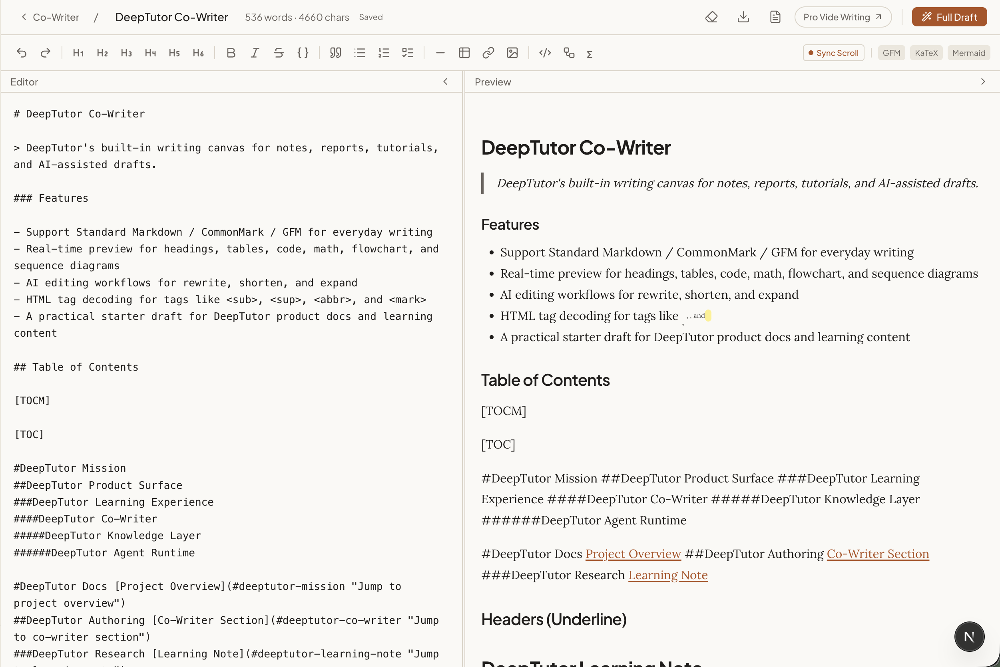
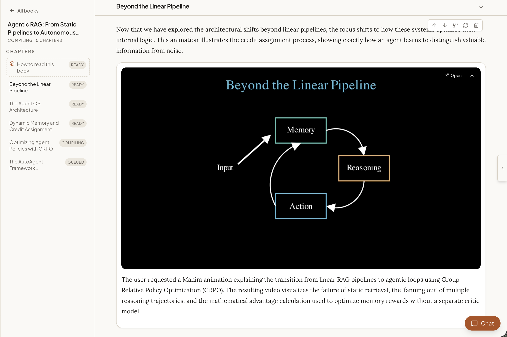
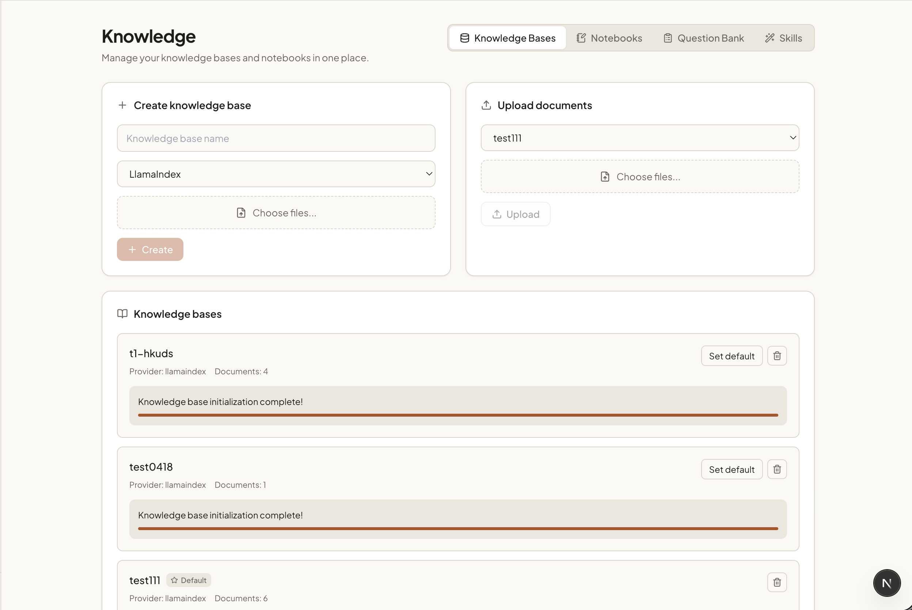

<div align="center">


# DeepTutor: Twój spersonalizowany korepetytor oparty na agentach AI

<a href="https://trendshift.io/repositories/17099" target="_blank"></a>

[](https://www.python.org/downloads/)
[](https://nextjs.org/)
[](../../LICENSE)
[](https://github.com/HKUDS/DeepTutor/releases)
[](https://arxiv.org/abs/2604.26962)

[](https://discord.gg/eRsjPgMU4t)
[](../../Communication.md)
[](https://github.com/HKUDS/DeepTutor/issues/78)

[Funkcje](#-kluczowe-funkcje) · [Jak zacząć](#-jak-zacząć) · [Odkrywaj](#-odkrywaj-deeptutor) · [TutorBoty](#-tutorbot--trwali-autonomiczni-korepetytorzy-ai) · [CLI](#%EF%B8%8F-deeptutor-cli--interfejs-dla-agentów) · [Multi-użytkownik](#-multi-użytkownik--współdzielone-wdrożenia) · [Roadmapa](#%EF%B8%8F-harmonogram) · [Społeczność](#-społeczność--ekosystem)

[🇬🇧 English](../../README.md) · [🇨🇳 中文](README_CN.md) · [🇯🇵 日本語](README_JA.md) · [🇪🇸 Español](README_ES.md) · [🇫🇷 Français](README_FR.md) · [🇸🇦 العربية](README_AR.md) · [🇷🇺 Русский](README_RU.md) · [🇮🇳 हिन्दी](README_HI.md) · [🇵🇹 Português](README_PT.md) · [🇹🇭 ภาษาไทย](README_TH.md) · 🇵🇱 [Polski](README_PL.md)

</div>

---

> 🤝 **Każda pomoc jest mile widziana!** Zapoznaj się z naszym [Przewodnikiem dla kontrybutorów](../../CONTRIBUTING.md), aby poznać nasze standardy kodowania, strategię zarządzania gałęziami i dowiedzieć się, jak zacząć.

### 📦 Wydania

> **[2026.5.9]** [v1.3.9](https://github.com/HKUDS/DeepTutor/releases/tag/v1.3.9) — TutorBot obsługuje Zulip i NVIDIA NIM, bezpieczniejszy routing modeli rozumujących, `deeptutor start`, podpowiedzi w pasku bocznym i parytet magazynu sesji.

> **[2026.5.8]** [v1.3.8](https://github.com/HKUDS/DeepTutor/releases/tag/v1.3.8) — Opcjonalne wdrożenia multi-user z izolowanymi workspace’ami, uprawnieniami admina, trasami auth i scoped runtime access.

> **[2026.5.4]** [v1.3.7](https://github.com/HKUDS/DeepTutor/releases/tag/v1.3.7) — Poprawki modeli rozumujących/dostawców, widoczna historia indeksu wiedzy, bezpieczniejsze czyszczenie Co-Writer i edycja szablonów.

> **[2026.5.3]** [v1.3.6](https://github.com/HKUDS/DeepTutor/releases/tag/v1.3.6) — Wybór modeli z katalogu w czacie i TutorBot, bezpieczniejsza ponowna indeksacja RAG, poprawki limitu tokenów OpenAI Responses, walidacja edytora Skills.

> **[2026.5.2]** [v1.3.5](https://github.com/HKUDS/DeepTutor/releases/tag/v1.3.5) — Płynniejsze ustawienia lokalnego uruchamiania, bezpieczniejsze zapytania RAG, bardziej przejrzyste uwierzytelnianie lokalnych embeddings, dopracowanie trybu ciemnego w Ustawieniach.

> **[2026.5.1]** [v1.3.4](https://github.com/HKUDS/DeepTutor/releases/tag/v1.3.4) — Trwałość czatu na stronach książki i przepływy przebudowy, odniesienia z czatu do książki, lepsza obsługa języka/rozumowania, wzmocnienie ekstrakcji dokumentów RAG.

> **[2026.4.30]** [v1.3.3](https://github.com/HKUDS/DeepTutor/releases/tag/v1.3.3) — Obsługa embeddingów NVIDIA NIM i Gemini, ujednolicony kontekst Space dla historii czatu / umiejętności / pamięci, migawki sesji, odporność ponownej indeksacji RAG.

> **[2026.4.29]** [v1.3.2](https://github.com/HKUDS/DeepTutor/releases/tag/v1.3.2) — Przejrzyste adresy URL endpointów embeddingów, odporność ponownej indeksacji RAG przy nieprawidłowych zapisanych wektorach, czyszczenie pamięci dla wyjścia modeli rozumujących, poprawka runtime Deep Solve.

> **[2026.4.28]** [v1.3.1](https://github.com/HKUDS/DeepTutor/releases/tag/v1.3.1) — Stabilność: bezpieczniejsze routowanie RAG i walidacja embeddingów, persystencja Docker, bezpieczne wprowadzanie z IME, odporność Windows/GBK.

> **[2026.4.27]** [v1.3.0](https://github.com/HKUDS/DeepTutor/releases/tag/v1.3.0) — Wersjonowane indeksy KB z przepływem ponownej indeksacji, przebudowana przestrzeń wiedzy, automatyczne wykrywanie embeddingów z nowymi adapterami, hub Space.

> **[2026.4.25]** [v1.2.5](https://github.com/HKUDS/DeepTutor/releases/tag/v1.2.5) — Trwałe załączniki czatu z szufladą podglądu plików, potoki zdolności świadome załączników, eksport Markdown TutorBot.

> **[2026.4.25]** [v1.2.4](https://github.com/HKUDS/DeepTutor/releases/tag/v1.2.4) — Załączniki tekst / kod / SVG, konfiguracja jednym poleceniem, eksport czatu Markdown, zwarty interfejs zarządzania KB.

<details>
<summary><b>Starsze wydania (ponad 2 tygodnie temu)</b></summary>

> **[2026.4.24]** [v1.2.3](https://github.com/HKUDS/DeepTutor/releases/tag/v1.2.3) — Załączniki dokumentów (PDF/DOCX/XLSX/PPTX), blok rozumowania modelu, edytor szablonów Soul, zapis z Co-Writer do notesu.

> **[2026.4.22]** [v1.2.2](https://github.com/HKUDS/DeepTutor/releases/tag/v1.2.2) — System Skills tworzonych przez użytkownika, optymalizacja wydajności wpisywania w czacie, autostart TutorBot, UI biblioteki książek, wizualizacje pełnoekranowe.

> **[2026.4.21]** [v1.2.1](https://github.com/HKUDS/DeepTutor/releases/tag/v1.2.1) — Limity tokenów na etap, ponowna generacja odpowiedzi we wszystkich punktach wejścia, poprawki zgodności RAG i Gemma.

> **[2026.4.20]** [v1.2.0](https://github.com/HKUDS/DeepTutor/releases/tag/v1.2.0) — Kompilator Book Engine „żywych książek", Co-Writer wielodokumentowy, interaktywne wizualizacje HTML, @-wzmianki banku pytań na czacie.

> **[2026.4.18]** [v1.1.2](https://github.com/HKUDS/DeepTutor/releases/tag/v1.1.2) — Zakładka Channels oparta na schemacie, konsolidacja RAG w jednym potoku, zewnętrzne prompty czatu.

> **[2026.4.17]** [v1.1.1](https://github.com/HKUDS/DeepTutor/releases/tag/v1.1.1) — Uniwersalne „Odpowiedz teraz", synchronizacja przewijania Co-Writer, zunifikowany panel ustawień, przycisk Stop przy strumieniowaniu.

> **[2026.4.15]** [v1.1.0](https://github.com/HKUDS/DeepTutor/releases/tag/v1.1.0) — Przepisanie parsera bloków matematycznych LaTeX, diagnostyka LLM przez `agents.yaml`, naprawa przekazywania nagłówków HTTP, wskazówki dla Docker + lokalne LLM.

> **[2026.4.14]** [v1.1.0-beta](https://github.com/HKUDS/DeepTutor/releases/tag/v1.1.0-beta) — Sesje zapisywane w zakładkach, nowy motyw Snow, heartbeat i automatyczne wznawianie WebSocket, przebudowa rejestru embeddings, integracja z Serper.

> **[2026.4.13]** [v1.0.3](https://github.com/HKUDS/DeepTutor/releases/tag/v1.0.3) — Notatnik na pytania z zakładkami i kategoriami, Mermaid w Wizualizacjach, wykrywanie niedopasowania embeddings, kompatybilność Qwen/vLLM, LM Studio i llama.cpp, motyw Glass.

> **[2026.4.11]** [v1.0.2](https://github.com/HKUDS/DeepTutor/releases/tag/v1.0.2) — Ujednolicenie wyszukiwania z fallbackiem do SearXNG, naprawa przełączania dostawców, łatki na wycieki pamięci we frontendzie.

> **[2026.4.10]** [v1.0.1](https://github.com/HKUDS/DeepTutor/releases/tag/v1.0.1) — Funkcja Wizualizacji (Chart.js/SVG), zapobieganie powtarzaniu pytań w quizach, obsługa modelu o4-mini.

> **[2026.4.10]** [v1.0.0-beta.4](https://github.com/HKUDS/DeepTutor/releases/tag/v1.0.0-beta.4) — Śledzenie postępu wektoryzacji z automatycznym ponawianiem, wieloplatformowe poprawki zależności, naprawa walidacji typów MIME.

> **[2026.4.8]** [v1.0.0-beta.3](https://github.com/HKUDS/DeepTutor/releases/tag/v1.0.0-beta.3) — Przejście na natywne SDK OpenAI i Anthropic (rezygnacja z litellm), obsługa Math Animator dla Windows, niezawodne parsowanie JSON, pełne tłumaczenie na chiński.

> **[2026.4.7]** [v1.0.0-beta.2](https://github.com/HKUDS/DeepTutor/releases/tag/v1.0.0-beta.2) — Przeładowywanie ustawień w locie, zagnieżdżone wyniki z MinerU, łatki dla WebSocketów, podniesienie wymagań do Pythona 3.11+.

> **[2026.4.4]** [v1.0.0-beta.1](https://github.com/HKUDS/DeepTutor/releases/tag/v1.0.0-beta.1) — Całkowicie nowa architektura oparta na agentach (~200 tys. linii kodu): system wtyczek Tools + Capabilities, nowe CLI i SDK, TutorBot, Co-Writer, Guided Learning, długoterminowa pamięć.

> **[2026.1.23]** [v0.6.0](https://github.com/HKUDS/DeepTutor/releases/tag/v0.6.0) — Pamięć sesji, przyrostowe przesyłanie dokumentów, elastyczny import do RAG, pełne wsparcie języka chińskiego.

> **[2026.1.18]** [v0.5.2](https://github.com/HKUDS/DeepTutor/releases/tag/v0.5.2) — Integracja z Docling (RAG-Anything), optymalizacja logów, paczka mniejszych poprawek.

> **[2026.1.15]** [v0.5.0](https://github.com/HKUDS/DeepTutor/releases/tag/v0.5.0) — Centralna konfiguracja usług, wybór potoku RAG dla każdej bazy wiedzy, przebudowa generowania pytań, personalizacja paska bocznego.

> **[2026.1.9]** [v0.4.0](https://github.com/HKUDS/DeepTutor/releases/tag/v0.4.0) — Wsparcie dla wielu dostawców LLM i embeddingów, nowa strona główna, wydzielenie RAG, porządkowanie zmiennych środowiskowych.

> **[2026.1.5]** [v0.3.0](https://github.com/HKUDS/DeepTutor/releases/tag/v0.3.0) — Zunifikowana architektura PromptManager, wdrożenie CI/CD przez GitHub Actions, gotowe obrazy Dockera w GHCR.

> **[2026.1.2]** [v0.2.0](https://github.com/HKUDS/DeepTutor/releases/tag/v0.2.0) — Wdrożenie w Dockerze, aktualizacja do Next.js 16 i React 19, zabezpieczenie WebSocketów, krytyczne łatki bezpieczeństwa.

</details>

### 📰 Aktualności

> **[2026.4.19]** 🎉 20 000 gwiazdek w 111 dni! Dziękujemy za wsparcie — pracujemy dalej, aby stworzyć prawdziwie spersonalizowane, inteligentne korepetycje dostępne dla każdego.

> **[2026.4.10]** 📄 Nasz artykuł jest już na arXiv! Przeczytaj [preprint](https://arxiv.org/abs/2604.26962), aby poznać założenia i idee stojące za DeepTutor.

> **[2026.4.4]** Doczekaliśmy się! ✨ DeepTutor v1.0.0 jest już dostępny — ewolucja w kierunku architektury agentowej, przebudowana od podstaw, z TutorBotami i płynnym przełączaniem trybów na licencji Apache-2.0.

> **[2026.2.6]** 🚀 Mamy 10 000 gwiazdek w zaledwie 39 dni! Ogromne podziękowania dla naszej społeczności.

> **[2026.1.1]** Szczęśliwego Nowego Roku! Wpadnij na naszego [Discorda](https://discord.gg/eRsjPgMU4t), [WeChat](https://github.com/HKUDS/DeepTutor/issues/78) lub dołącz do [Dyskusji](https://github.com/HKUDS/DeepTutor/discussions).

> **[2025.12.29]** Oficjalnie wystartowaliśmy! Pierwsze wydanie DeepTutor ujrzało światło dzienne.

## ✨ Kluczowe funkcje

- **Zunifikowana przestrzeń czatu** — Sześć trybów, jedna konwersacja. Chat, Deep Solve, Quizy, Deep Research, Math Animator i Wizualizacje współdzielą kontekst — zacznij od pytania, przejdź do rozwiązywania problemów przez agentów, generuj quizy, wizualizuj pojęcia i zagłęb się w research bez utraty wątku.
- **Co-Writer** — Przestrzeń Markdown do pracy z wieloma dokumentami, w której AI jest partnerem. Zaznacz tekst i poproś o przepisanie, rozwinięcie lub streszczenie, czerpiąc z bazy wiedzy i internetu. Każda notatka zasila ekosystem nauki.
- **Book Engine** — Przekształć notatki w strukturyzowane, interaktywne „żywe książki". Pipeline wieloagentowy generuje spis treści, dobiera źródła i buduje strony z 13 typów bloków (m.in. quizów, fiszek, osi czasu, grafów koncepcyjnych, demo interaktywnych).
- **Centrum Wiedzy** — Bazy RAG z PDF/Markdown/DOCX, kolorowe notatniki, bank pytań, własne Skills via `SKILL.md` kształtujące styl nauczania.
- **Długoterminowa Pamięć** — DeepTutor buduje Twój profil: czego się uczyłeś, jak uczysz, dokąd zmierzasz. Pamięć jest współdzielona przez wszystkie funkcje i TutorBoty.
- **Osobiste TutorBoty** — To nie chatboty — to autonomiczni nauczyciele z własną przestrzenią, pamięcią, osobowością i umiejętnościami. Napędzane przez [nanobot](https://github.com/HKUDS/nanobot).
- **CLI dla agentów** — Każda funkcja, baza wiedzy, sesja i TutorBot jednym poleceniem; Rich dla ludzi, JSON dla agentów. Daj [`SKILL.md`](../../SKILL.md) agentowi i operuje autonomicznie.
- **Opcjonalne uwierzytelnianie** — Domyślnie wyłączone. Dwie zmienne środowiskowe włączają logowanie przy publicznym hostingu. Multi-użytkownik: bcrypt, JWT, rejestracja, panel admina. Opcjonalnie **PocketBase** jako sidecar (OAuth, lepsza współbieżność) bez zmian w kodzie.

---

## 🚀 Jak zacząć

### Wymagania

| Wymaganie | Wersja | Jak sprawdzić | Uwagi |
|:---|:---|:---|:---|
| [Git](https://git-scm.com/) | Dowolna | `git --version` | Do pobrania repozytorium |
| [Python](https://www.python.org/downloads/) | 3.11+ | `python --version` | Środowisko uruchomieniowe backendu |
| [Node.js](https://nodejs.org/) | 20.9+ | `node --version` | Frontend runtime dla lokalnych instalacji Web |
| [npm](https://www.npmjs.com/) | Dołączony do Node.js | `npm --version` | Instalowany razem z Node.js |

> **Tylko Windows (brak kompilatora):** Bez Visual Studio zainstaluj [Visual Studio Build Tools](https://visualstudio.microsoft.com/visual-cpp-build-tools/) z obciążeniem **Programowanie aplikacji klasycznych w języku C++**.

Potrzebujesz też **klucza API** od co najmniej jednego dostawcy LLM (np. [OpenAI](https://platform.openai.com/api-keys), [DeepSeek](https://platform.deepseek.com/), [Anthropic](https://console.anthropic.com/)). Setup Tour poprowadzi przez konfigurację.

### Opcja A — Setup Tour (zalecane)

Interaktywny wizard CLI dla pierwszej lokalnej instalacji Web: sprawdza środowisko, instaluje zależności Python i Node.js, tworzy `.env` oraz pozwala wybrać dodatki (TutorBot, Matrix, Math Animator).

**1. Sklonuj repozytorium**

```bash
git clone https://github.com/HKUDS/DeepTutor.git
cd DeepTutor
```

**2. Utwórz i aktywuj środowisko Python**

Wybierz jedną z poniższych opcji.

macOS / Linux z `venv`:

```bash
python3 -m venv .venv
source .venv/bin/activate
python -m pip install --upgrade pip
```

Windows PowerShell z `venv`:

```powershell
py -3.11 -m venv .venv
.\.venv\Scripts\Activate.ps1
python -m pip install --upgrade pip
```

Anaconda / Miniconda:

```bash
conda create -n deeptutor python=3.11
conda activate deeptutor
python -m pip install --upgrade pip
```

**3. Uruchom interaktywny przewodnik**

```bash
python scripts/start_tour.py
```

Podczas instalacji wizard pyta o profil zależności:

| Wybór | Co instaluje | Kiedy wybrać |
|:---|:---|:---|
| Web app (zalecane) | CLI + API + RAG/parsowanie dokumentów | Większość nowych użytkowników |
| Web + TutorBot | Dodaje silnik TutorBot i popularne SDK kanałów | Jeśli chcesz autonomicznych tutorów |
| Web + TutorBot + Matrix | Dodaje wsparcie Matrix/Element | Tylko jeśli masz zainstalowane `libolm` |
| Dodatek Math Animator | Instaluje Manim osobno | Tylko jeśli potrzebujesz animacji i masz LaTeX/ffmpeg |

Po zakończeniu wizarda:

```bash
python scripts/start_web.py
```

> **Codzienne uruchamianie** — Tour jest potrzebny tylko raz. Później wystarczy aktywować środowisko Python i uruchomić `python scripts/start_web.py`. Uruchom `start_tour.py` ponownie tylko przy zmianie dostawców, portów lub instalacji dodatków.

> **Aktualizacja lokalnej instalacji** — Uruchom `python scripts/update.py`. Skrypt pobiera zmiany z remote dla bieżącej gałęzi, pokazuje różnice i wykonuje bezpieczny fast-forward pull.

### Opcja B — Ręczna instalacja lokalna

**1. Sklonuj repozytorium**

```bash
git clone https://github.com/HKUDS/DeepTutor.git
cd DeepTutor
```

**2. Utwórz i aktywuj środowisko Python** — jak w Opcji A.

**3. Zainstaluj zależności**

```bash
# Backend + Web server. Zawiera CLI, RAG, parsowanie dokumentów, wbudowane SDK LLM.
python -m pip install -e ".[server]"

# Opcjonalne dodatki (instaluj tylko potrzebne):
#   python -m pip install -e ".[tutorbot]"
#   python -m pip install -e ".[tutorbot,matrix]"  # wymaga libolm
#   python -m pip install -e ".[math-animator]"
#   python -m pip install -e ".[all]"

# Frontend — wymaga Node.js 20.9+
cd web
npm install
cd ..
```

**4. Skonfiguruj środowisko**

```bash
cp .env.example .env
```

Edytuj `.env` i wypełnij przynajmniej pola LLM. Pola embedding są potrzebne dla bazy wiedzy.

```dotenv
# LLM (wymagane do czatu)
LLM_BINDING=openai
LLM_MODEL=gpt-4o-mini
LLM_API_KEY=sk-xxx
LLM_HOST=https://api.openai.com/v1

# Embedding (wymagane dla Bazy Wiedzy / RAG)
EMBEDDING_BINDING=openai
EMBEDDING_MODEL=text-embedding-3-large
EMBEDDING_API_KEY=sk-xxx
# v1.3.0+: użyj pełnego URL endpointu, nie tylko https://api.openai.com/v1
EMBEDDING_HOST=https://api.openai.com/v1/embeddings
# Zostaw puste, chyba że musisz wymusić konkretny wymiar
EMBEDDING_DIMENSION=
```

<details>
<summary><b>Obsługiwani dostawcy LLM</b></summary>

| Dostawca | Binding | Domyślny bazowy URL |
|:--|:--|:--|
| AiHubMix | `aihubmix` | `https://aihubmix.com/v1` |
| Anthropic | `anthropic` | `https://api.anthropic.com/v1` |
| Azure OpenAI | `azure_openai` | — |
| BytePlus | `byteplus` | `https://ark.ap-southeast.bytepluses.com/api/v3` |
| BytePlus Coding Plan | `byteplus_coding_plan` | `https://ark.ap-southeast.bytepluses.com/api/coding/v3` |
| Custom | `custom` | — |
| Custom (Anthropic API) | `custom_anthropic` | — |
| DashScope | `dashscope` | `https://dashscope.aliyuncs.com/compatible-mode/v1` |
| DeepSeek | `deepseek` | `https://api.deepseek.com` |
| Gemini | `gemini` | `https://generativelanguage.googleapis.com/v1beta/openai/` |
| GitHub Copilot | `github_copilot` | `https://api.githubcopilot.com` |
| Groq | `groq` | `https://api.groq.com/openai/v1` |
| llama.cpp | `llama_cpp` | `http://localhost:8080/v1` |
| LM Studio | `lm_studio` | `http://localhost:1234/v1` |
| MiniMax | `minimax` | `https://api.minimaxi.com/v1` |
| MiniMax (Anthropic) | `minimax_anthropic` | `https://api.minimaxi.com/anthropic` |
| Mistral | `mistral` | `https://api.mistral.ai/v1` |
| Moonshot | `moonshot` | `https://api.moonshot.cn/v1` |
| Ollama | `ollama` | `http://localhost:11434/v1` |
| OpenAI | `openai` | `https://api.openai.com/v1` |
| OpenAI Codex | `openai_codex` | `https://chatgpt.com/backend-api` |
| OpenRouter | `openrouter` | `https://openrouter.ai/api/v1` |
| OpenVINO Model Server | `ovms` | `http://localhost:8000/v3` |
| Qianfan | `qianfan` | `https://qianfan.baidubce.com/v2` |
| SiliconFlow | `siliconflow` | `https://api.siliconflow.cn/v1` |
| Step Fun | `stepfun` | `https://api.stepfun.com/v1` |
| vLLM/Local | `vllm` | — |
| VolcEngine | `volcengine` | `https://ark.cn-beijing.volces.com/api/v3` |
| VolcEngine Coding Plan | `volcengine_coding_plan` | `https://ark.cn-beijing.volces.com/api/coding/v3` |
| Xiaomi MIMO | `xiaomi_mimo` | `https://api.xiaomimimo.com/v1` |
| Zhipu AI | `zhipu` | `https://open.bigmodel.cn/api/paas/v4` |

</details>

<details>
<summary><b>Obsługiwani dostawcy Embedding</b></summary>

| Dostawca | Binding | Przykład modelu | Domyślny wymiar |
|:--|:--|:--|:--|
| OpenAI | `openai` | `text-embedding-3-large` | 3072 |
| Azure OpenAI | `azure_openai` | nazwa wdrożenia | — |
| Cohere | `cohere` | `embed-v4.0` | 1024 |
| Jina | `jina` | `jina-embeddings-v3` | 1024 |
| Ollama | `ollama` | `nomic-embed-text` | 768 |
| vLLM / LM Studio | `vllm` | Dowolny model embeddings | — |
| Dowolny zgodny z OpenAI | `custom` | — | — |

Dostawcy zgodni z OpenAI (DashScope, SiliconFlow itp.) działają poprzez binding `custom` lub `openai`.

</details>

<details>
<summary><b>Obsługiwani dostawcy wyszukiwania web</b></summary>

| Dostawca | Klucz środowiska | Uwagi |
|:--|:--|:--|
| Brave | `BRAVE_API_KEY` | Zalecany, dostępny bezpłatny tier |
| Tavily | `TAVILY_API_KEY` | |
| Serper | `SERPER_API_KEY` | Wyniki Google przez Serper |
| Jina | `JINA_API_KEY` | |
| SearXNG | — | Self-hosted, bez klucza API |
| DuckDuckGo | — | Bez klucza API |
| Perplexity | `PERPLEXITY_API_KEY` | Wymaga klucza API |

</details>

**5. Uruchom usługi**

Najszybszy sposób:

```bash
python scripts/start_web.py
```

To uruchamia backend i frontend. Otwórz URL frontendowy wyświetlony w terminalu.

Alternatywnie, uruchom każdą usługę ręcznie:

```bash
# Backend (FastAPI)
python -m deeptutor.api.run_server

# Frontend (Next.js) — w osobnym terminalu
cd web && npm run dev -- -p 3782
```

| Usługa | Domyślny port |
|:---:|:---:|
| Backend | `8001` |
| Frontend | `3782` |

Otwórz [http://localhost:3782](http://localhost:3782) i gotowe.

### Opcja C — Docker

Docker łączy backend i frontend w jednym kontenerze — nie wymagana lokalna instalacja Python ani Node.js. Potrzebny jest tylko [Docker Desktop](https://www.docker.com/products/docker-desktop/) (lub Docker Engine + Compose na Linux).

**1. Skonfiguruj zmienne środowiskowe**

```bash
git clone https://github.com/HKUDS/DeepTutor.git
cd DeepTutor
cp .env.example .env
```

Edytuj `.env` jak w Opcji B.

**2a. Pobierz oficjalny obraz (zalecane)**

```bash
docker compose -f docker-compose.ghcr.yml up -d
```

Aby przypiąć konkretną wersję, edytuj tag w `docker-compose.ghcr.yml`:

```yaml
image: ghcr.io/hkuds/deeptutor:1.3.4  # lub :latest
```

**2b. Kompilacja ze źródeł**

```bash
docker compose up -d
```

**3. Weryfikacja i zarządzanie**

```bash
docker compose logs -f   # wyświetlaj logi
docker compose down       # zatrzymaj i usuń kontener
```

<details>
<summary><b>Cloud / serwer zdalny</b></summary>

Na serwerze zdalnym przeglądarka musi znać publiczny URL backendu. Dodaj do `.env`:

```dotenv
NEXT_PUBLIC_API_BASE_EXTERNAL=https://your-server.com:8001
```

</details>

<details>
<summary><b>Uwierzytelnianie (publiczne wdrożenia)</b></summary>

Uwierzytelnianie jest **domyślnie wyłączone**. Dla wdrożeń multi-tenant zob. sekcję [Multi-użytkownik](#-multi-użytkownik--współdzielone-wdrożenia) poniżej.

**Headless single-user (bez `/register`):** wstępna konfiguracja przez zmienne środowiskowe:

```bash
python -c "from deeptutor.services.auth import hash_password; print(hash_password('yourpassword'))"
```

```dotenv
AUTH_ENABLED=true
AUTH_USERNAME=admin
AUTH_PASSWORD_HASH=<wklej hash tutaj>
AUTH_SECRET=your-secret-here
```

</details>

<details>
<summary><b>Sidecar PocketBase (opcjonalne uwierzytelnianie + przechowywanie)</b></summary>

PocketBase to opcjonalny, lekki backend zastępujący wbudowane SQLite/JSON.

> ⚠️ **Tryb PocketBase jest aktualnie tylko dla jednego użytkownika.** Domyślny schemat nie ma pola `role` w `users` (każde logowanie = `role=user`), a zapytania nie są filtrowane po `user_id`. Wdrożenia multi-użytkownik: zostaw `POCKETBASE_URL` puste.

```bash
docker compose up -d
open http://localhost:8090/_/
pip install pocketbase
python scripts/pb_setup.py
```

```dotenv
POCKETBASE_URL=http://localhost:8090
POCKETBASE_ADMIN_EMAIL=admin@example.com
POCKETBASE_ADMIN_PASSWORD=your-admin-password
```

</details>

<details>
<summary><b>Tryb programowania (hot-reload)</b></summary>

```bash
docker compose -f docker-compose.yml -f docker-compose.dev.yml up
```

Zmiany w `deeptutor/`, `deeptutor_cli/`, `scripts/` i `web/` są odzwierciedlane natychmiast.

</details>

<details>
<summary><b>Niestandardowe porty</b></summary>

```dotenv
BACKEND_PORT=9001
FRONTEND_PORT=4000
```

Następnie: `docker compose up -d`

</details>

<details>
<summary><b>Trwałość danych</b></summary>

| Ścieżka kontenera | Ścieżka hosta | Zawartość |
|:---|:---|:---|
| `/app/data/user` | `./data/user` | Ustawienia, workspace, sesje, logi |
| `/app/data/memory` | `./data/memory` | Pamięć długoterminowa (`SUMMARY.md`, `PROFILE.md`) |
| `/app/data/knowledge_bases` | `./data/knowledge_bases` | Dokumenty i indeksy wektorowe |

</details>

<details>
<summary><b>Opis zmiennych środowiskowych</b></summary>

> Pełna lista z komentarzami w [`.env.example`](../../.env.example).

| Zmienna | Wymagana | Opis |
|:---|:---:|:---|
| `LLM_BINDING` | **Tak** | Dostawca LLM (`openai`, `anthropic`, `deepseek` itp.) |
| `LLM_MODEL` | **Tak** | Nazwa modelu (np. `gpt-4o`) |
| `LLM_API_KEY` | **Tak** | Klucz API LLM |
| `LLM_HOST` | **Tak** | Bazowy URL completions |
| `LLM_API_VERSION` | Nie | Wymagane dla Azure OpenAI |
| `LLM_REASONING_EFFORT` | Nie | DeepSeek `high`/`max`/`minimal` lub OpenAI o-series `low`/`medium`/`high` |
| `EMBEDDING_BINDING` | Tylko KB | Dostawca embeddings |
| `EMBEDDING_MODEL` | Tylko KB | Nazwa modelu embeddings |
| `EMBEDDING_API_KEY` | Tylko KB | Klucz API embeddings |
| `EMBEDDING_HOST` | Tylko KB | Pełny URL endpointu embeddings (v1.3.0+) |
| `EMBEDDING_DIMENSION` | Nie | Wymiar wektora; puste = auto-detekcja |
| `SEARCH_PROVIDER` | Nie | `brave`, `tavily`, `serper`, `jina`, `perplexity`, `searxng`, `duckduckgo` |
| `SEARCH_API_KEY` | Nie | Klucz API wyszukiwania |
| `BACKEND_PORT` | Nie | Port backendu (domyślnie `8001`) |
| `FRONTEND_PORT` | Nie | Port frontendu (domyślnie `3782`) |
| `NEXT_PUBLIC_API_BASE_EXTERNAL` | Nie | Publiczny URL backendu dla wdrożeń cloud |
| `CORS_ORIGIN` | Nie | Dodatkowe origin do listy CORS FastAPI |
| `DISABLE_SSL_VERIFY` | Nie | Wyłącz weryfikację TLS (domyślnie `false`) |
| `AUTH_ENABLED` | Nie | `true` wymaga logowania (domyślnie `false`) |
| `AUTH_SECRET` | Nie | Sekret JWT; puste = auto-generacja |
| `AUTH_TOKEN_EXPIRE_HOURS` | Nie | Czas ważności sesji w godzinach (domyślnie `24`) |
| `AUTH_COOKIE_SECURE` | Nie | Oznacz cookie `Secure` przy HTTPS (domyślnie `false`) |
| `AUTH_USERNAME` | Nie | Single-user: nazwa admina |
| `AUTH_PASSWORD_HASH` | Nie | Single-user: hash bcrypt hasła admina |
| `POCKETBASE_URL` | Nie | Włącza sidecar PocketBase (tylko single-user) |
| `POCKETBASE_ADMIN_EMAIL` / `POCKETBASE_ADMIN_PASSWORD` | Nie | Dane admin dla backendu Python |
| `CHAT_ATTACHMENT_DIR` | Nie | Nadpisanie katalogu załączników czatu |

</details>

### Opcja D — Tylko CLI

```bash
python -m pip install -e ".[cli]"
cp .env.example .env   # następnie edytuj .env i wprowadź klucze API
```

```bash
deeptutor chat                                   # Interaktywny REPL
deeptutor run chat "Explain Fourier transform"   # Jednorazowe wywołanie
deeptutor run deep_solve "Solve x^2 = 4"         # Rozwiązywanie wieloagentowe
deeptutor kb create my-kb --doc textbook.pdf     # Utwórz bazę wiedzy
```

---

## 📖 Odkrywaj DeepTutor

<div align="center">

</div>

### 💬 Czat — zunifikowana inteligentna przestrzeń robocza

<div align="center">

</div>

Sześć trybów w jednym miejscu, połączonych **zunifikowanym systemem zarządzania kontekstem**. Historia rozmów, bazy wiedzy i odniesienia zachowują się pomiędzy trybami.

| Tryb | Co robi |
|:---|:---|
| **Czat** | Rozmowa wspomagana narzędziami: RAG, web, kod, głębokie rozumowanie, brainstorming, wyszukiwanie artykułów. |
| **Deep Solve** | Wieloagentowe rozwiązywanie problemów z precyzyjnymi cytatami źródeł na każdym etapie. |
| **Generowanie quizów** | Testy oparte na bazie wiedzy z wbudowaną walidacją. |
| **Deep Research** | Dekompozycja tematu, równoległe agenty badawcze z RAG/web/artykuły, pełny raport z cytatami. |
| **Math Animator** | Konwersja pojęć matematycznych na animacje i scenariusze w Manim. |
| **Wizualizacja** | Interaktywne diagramy SVG, wykresy Chart.js, grafy Mermaid lub strony HTML z opisów w języku naturalnym. |

Narzędzia są **oddzielone od przepływów pracy** — sam decydujesz, które włączyć.

### ✍️ Co-Writer — wielodokumentowa przestrzeń pisania z AI

<div align="center">

</div>

Twórz i zarządzaj wieloma dokumentami, z których każdy jest zapisywany osobno. Zaznacz tekst i wybierz **Przepisz**, **Rozwiń** lub **Skróć** — czerpiąc kontekst z bazy wiedzy lub sieci. Edycja jest nieniszcząca z pełnym undo/redo; każdy fragment możesz zapisać do notesu.

### 📖 Book Engine — interaktywne „żywe książki"

<div align="center">

</div>

Podaj temat i wskaż bazę wiedzy — DeepTutor tworzy strukturyzowaną, interaktywną książkę. Pipeline wieloagentowy proponuje zarys, pobiera źródła, planuje strony i kompiluje bloki. Ty kontrolujesz: przeglądasz propozycję, zmieniasz kolejność rozdziałów, rozmawiasz przy dowolnej stronie.

Strony składają się z 13 typów bloków — tekst, ramka, quiz, fiszki, kod, rysunek, zagłębienie, animacja, demo, oś czasu, wykres koncepcyjny, sekcja, notatka użytkownika — każdy z własnym komponentem interaktywnym.

### 📚 Zarządzanie wiedzą — Twoja infrastruktura edukacyjna

<div align="center">

</div>

- **Bazy wiedzy** — PDF, Office (DOCX/XLSX/PPTX), Markdown i pliki tekstowe; dodawaj dokumenty stopniowo.
- **Notatniki** — Organizuj zapisy z Czatu, Co-Writer, Książki lub Deep Research w kolorowych notatnikach.
- **Bank pytań** — Przeglądaj wygenerowane pytania, dodawaj do zakładek i @-oznaczaj w czacie.
- **Skills** — Twórz niestandardowe persony nauczycielskie via `SKILL.md`: nazwa, opis, opcjonalne wyzwalacze, Markdown wstrzykiwany do system prompt.

Baza wiedzy nie jest biernym magazynem — aktywnie uczestniczy w każdej rozmowie.

### 🧠 Pamięć — DeepTutor uczy się razem z Tobą

<div align="center">

</div>

- **Podsumowanie** — Bieżące zestawienie postępów w nauce.
- **Profil** — Preferencje, poziom, cele, styl komunikacji — automatycznie doskonalone.

Pamięć jest współdzielona przez wszystkie funkcje i TutorBoty. Im więcej używasz, tym bardziej spersonalizowany staje się DeepTutor.

---

### 🦞 TutorBot — Trwali, autonomiczni nauczyciele AI

<div align="center">

</div>

TutorBot to nie chatbot — to **trwały, wieloinstancyjny agent** zbudowany na [nanobot](https://github.com/HKUDS/nanobot). Każdy TutorBot ma własny workspace, pamięć i osobowość. Stwórz sokratejskiego korepetytora, cierpliwego trenera pisania i rygorystycznego doradcę naukowego — wszystkie działają jednocześnie.

<div align="center">

</div>

- **Szablony Soul** — Osobowość i filozofia nauczania przez edytowalne pliki Soul.
- **Niezależna przestrzeń robocza** — Własna pamięć, sesje, umiejętności; dostęp do wspólnej warstwy wiedzy.
- **Proaktywny Heartbeat** — Cykliczne sprawdzanie postępów, przypomnienia o powtórkach, zaplanowane zadania.
- **Pełny dostęp do narzędzi** — RAG, kod, web, artykuły naukowe, głębokie rozumowanie, brainstorming.
- **Nauka umiejętności** — Dodaj pliki skill do workspace, aby nauczyć bota nowych zdolności.
- **Wielokanałowa obecność** — Telegram, Discord, Slack, Feishu, WeChat Work, DingTalk, Matrix, Email i inne.
- **Zespoły i subagenci** — Twórz subagentów lub koordynuj zespoły wieloagentowe dla złożonych zadań.

```bash
deeptutor bot create math-tutor --persona "Socratic math teacher who uses probing questions"
deeptutor bot create writing-coach --persona "Patient, detail-oriented writing mentor"
deeptutor bot list                  # Zobacz wszystkich aktywnych tutorów
```

---

### ⌨️ DeepTutor CLI — Interfejs dla agentów

<div align="center">

</div>

DeepTutor jest w pełni natywny dla CLI. Każda funkcja, baza wiedzy, sesja i TutorBot jednym poleceniem — bez przeglądarki. Przekaż [`SKILL.md`](../../SKILL.md) agentowi ([nanobot](https://github.com/HKUDS/nanobot)), a będzie operować DeepTutor autonomicznie.

```bash
deeptutor run chat "Explain the Fourier transform" -t rag --kb textbook
deeptutor run deep_solve "Prove that sqrt(2) is irrational" -t reason
deeptutor run deep_question "Linear algebra" --config num_questions=5
deeptutor run deep_research "Attention mechanisms in transformers"
deeptutor run visualize "Draw the architecture of a transformer"
```

```bash
deeptutor chat --capability deep_solve --kb my-kb
# W REPL: /cap, /tool, /kb, /history, /notebook, /config
```

```bash
deeptutor kb create my-kb --doc textbook.pdf
deeptutor kb add my-kb --docs-dir ./papers/
deeptutor kb search my-kb "gradient descent"
deeptutor kb set-default my-kb
```

```bash
deeptutor run chat "Summarize chapter 3" -f rich
deeptutor run chat "Summarize chapter 3" -f json
```

```bash
deeptutor session list
deeptutor session open <id>
```

<details>
<summary><b>Pełna dokumentacja poleceń CLI</b></summary>

**Najwyższy poziom**

| Polecenie | Opis |
|:---|:---|
| `deeptutor run <capability> <message>` | Uruchom funkcję w jednej turze (`chat`, `deep_solve`, `deep_question`, `deep_research`, `math_animator`, `visualize`) |
| `deeptutor chat` | Interaktywny REPL (`--capability`, `--tool`, `--kb`, `--language`) |
| `deeptutor serve` | Uruchom serwer API DeepTutor |

**`deeptutor bot`**

| Polecenie | Opis |
|:---|:---|
| `deeptutor bot list` | Lista instancji TutorBot |
| `deeptutor bot create <id>` | Utwórz i uruchom bota (`--name`, `--persona`, `--model`) |
| `deeptutor bot start <id>` | Uruchom bota |
| `deeptutor bot stop <id>` | Zatrzymaj bota |

**`deeptutor kb`**

| Polecenie | Opis |
|:---|:---|
| `deeptutor kb list` | Lista baz wiedzy |
| `deeptutor kb info <name>` | Szczegóły bazy wiedzy |
| `deeptutor kb create <name>` | Utwórz z dokumentów (`--doc`, `--docs-dir`) |
| `deeptutor kb add <name>` | Dodaj dokumenty |
| `deeptutor kb search <name> <query>` | Przeszukaj bazę wiedzy |
| `deeptutor kb set-default <name>` | Ustaw jako domyślną KB |
| `deeptutor kb delete <name>` | Usuń bazę wiedzy (`--force`) |

**`deeptutor memory`**

| Polecenie | Opis |
|:---|:---|
| `deeptutor memory show [file]` | Wyświetl pamięć (`summary`, `profile`, `all`) |
| `deeptutor memory clear [file]` | Wyczyść pamięć (`--force`) |

**`deeptutor session`**

| Polecenie | Opis |
|:---|:---|
| `deeptutor session list` | Lista sesji (`--limit`) |
| `deeptutor session show <id>` | Komunikaty sesji |
| `deeptutor session open <id>` | Wznów sesję w REPL |
| `deeptutor session rename <id>` | Zmień nazwę sesji (`--title`) |
| `deeptutor session delete <id>` | Usuń sesję |

**`deeptutor notebook`**

| Polecenie | Opis |
|:---|:---|
| `deeptutor notebook list` | Lista notatników |
| `deeptutor notebook create <name>` | Utwórz notatnik (`--description`) |
| `deeptutor notebook show <id>` | Rekordy notatnika |
| `deeptutor notebook add-md <id> <path>` | Importuj Markdown jako rekord |
| `deeptutor notebook replace-md <id> <rec> <path>` | Zastąp rekord Markdown |
| `deeptutor notebook remove-record <id> <rec>` | Usuń rekord |

**`deeptutor book`**

| Polecenie | Opis |
|:---|:---|
| `deeptutor book list` | Lista wszystkich książek w workspace |
| `deeptutor book health <book_id>` | Sprawdź dryft KB i stan książki |
| `deeptutor book refresh-fingerprints <book_id>` | Odśwież odciski palców KB |

**`deeptutor config` / `plugin` / `provider`**

| Polecenie | Opis |
|:---|:---|
| `deeptutor config show` | Podsumowanie konfiguracji |
| `deeptutor plugin list` | Zarejestrowane narzędzia i funkcje |
| `deeptutor plugin info <name>` | Szczegóły narzędzia |
| `deeptutor provider login <provider>` | Uwierzytelnienie dostawcy (`openai-codex` OAuth; `github-copilot` weryfikuje sesję Copilot) |

</details>

---

### 👥 Multi-użytkownik — Współdzielone wdrożenia z workspace'ami per-użytkownik

<div align="center">

</div>

Włącz uwierzytelnianie, a DeepTutor staje się wdrożeniem multi-tenant z **izolowanymi workspace'ami per-użytkownik** i **zasobami kurowanymi przez admina**. Pierwsza zarejestrowana osoba zostaje adminem i konfiguruje modele, klucze API i bazy wiedzy dla wszystkich. Kolejne konta tworzy admin (tylko na zaproszenie), każdy dostaje scoped historię czatu/pamięć/notatniki/bazy wiedzy.

**Szybki start (5 kroków):**

```bash
# 1. Włącz auth w .env w katalogu głównym
echo 'AUTH_ENABLED=true' >> .env
# Opcjonalne — sekret JWT; auto-generowany jeśli puste
echo 'AUTH_SECRET=<wklej 64+ losowych znaków>' >> .env

# 2. Uruchom ponownie web stack
python scripts/start_web.py

# 3. Otwórz http://localhost:3782/register i utwórz pierwsze konto
#    Pierwsza rejestracja jest jedyną publiczną; ten użytkownik staje
#    się adminem, a endpoint /register jest automatycznie zamykany

# 4. Jako admin, przejdź do /admin/users → "Dodaj użytkownika"

# 5. Dla każdego użytkownika, kliknij ikonę suwaka → przypisz profile LLM,
#    bazy wiedzy i skills → zapisz
```

**Co widzi admin:**

- **Pełna strona Ustawień** pod `/settings` — LLM/embedding/wyszukiwanie, klucze API, katalog modeli.
- **Zarządzanie użytkownikami** pod `/admin/users` — tworzenie, awansowanie, degradowanie i usuwanie kont.
- **Edytor grantów** — wybór profili modeli, KB i skills dla nie-adminów; granty zawierają **tylko logiczne ID**, klucze API nie przekraczają granicy.
- **Dziennik audytu** — każda zmiana grantu w `multi-user/_system/audit/usage.jsonl`.

**Co dostają zwykli użytkownicy:**

- **Izolowany workspace** pod `multi-user/<uid>/` — własne `chat_history.db`, pamięć, notatniki, KB.
- **Dostęp tylko do odczytu** do KB/skills przypisanych przez admina z oznaczeniem „Przypisano przez admina".
- **Ograniczona strona Ustawień** — tylko motyw, język, podsumowanie przyznanych modeli; brak kluczy API.
- **Scoped LLM** — rozmowy przez model przyznany przez admina; brak grantu = odrzucenie.

**Struktura workspace'u:**

```
multi-user/
├── _system/
│   ├── auth/users.json          # Zahashowane dane, role
│   ├── auth/auth_secret         # Sekret JWT (auto-generowany)
│   ├── grants/<uid>.json        # Granty zasobów per-użytkownik
│   └── audit/usage.jsonl        # Dziennik audytu
└── <uid>/
    ├── user/
    │   ├── chat_history.db
    │   ├── settings/interface.json
    │   └── workspace/{chat,co-writer,book,...}
    ├── memory/{SUMMARY.md,PROFILE.md}
    └── knowledge_bases/...
```

**Konfiguracja:**

| Zmienna | Wymagana | Opis |
|:---|:---|:---|
| `AUTH_ENABLED` | Tak | `true` włącza multi-user auth. Domyślnie `false`. |
| `AUTH_SECRET` | Zalecane | Sekret JWT; puste = zapis do `multi-user/_system/auth/auth_secret`. |
| `AUTH_TOKEN_EXPIRE_HOURS` | Nie | Ważność JWT; domyślnie 24 godziny. |
| `AUTH_USERNAME` / `AUTH_PASSWORD_HASH` | Nie | Dane fallback dla single-user. Puste w trybie multi-user. |
| `NEXT_PUBLIC_AUTH_ENABLED` | Auto | Lustro `AUTH_ENABLED` przez `start_web.py` dla Next.js middleware. |

> ⚠️ **Tryb PocketBase (`POCKETBASE_URL` ustawiony) — tylko single-user** — brak pola `role`, brak filtrowania po `user_id`. Multi-user: zostaw `POCKETBASE_URL` puste.

> ⚠️ **Zalecany jeden proces.** Promocja pierwszego admina chroniona przez `threading.Lock`. Multi-worker: utwórz pierwszego admina offline.

## 🗺️ Harmonogram

| Status | Kamień milowy |
|:---:|:---|
| 🎯 | **Uwierzytelnianie i logowanie** — opcjonalna strona logowania dla wdrożeń publicznych |
| 🎯 | **Motywy i wygląd** — różnorodne motywy i konfigurowalny UI |
| 🎯 | **Ulepszenie interakcji** — optymalizacja ikon i szczegółów interakcji |
| 🔜 | **Lepsza pamięć** — integracja lepszego zarządzania pamięcią |
| 🔜 | **Integracja LightRAG** — [LightRAG](https://github.com/HKUDS/LightRAG) jako zaawansowany silnik KB |
| 🔜 | **Strona dokumentacji** — przewodniki, API reference i samouczki |

> Jeśli DeepTutor jest przydatny, [przyznaj nam gwiazdkę](https://github.com/HKUDS/DeepTutor/stargazers)!

---

## 🌐 Społeczność i ekosystem

| Projekt | Rola w DeepTutor |
|:---|:---|
| [**nanobot**](https://github.com/HKUDS/nanobot) | Ultralekki silnik agenta dla TutorBot |
| [**LlamaIndex**](https://github.com/run-llama/llama_index) | Pipeline RAG i indeksowanie dokumentów |
| [**ManimCat**](https://github.com/Wing900/ManimCat) | Generowanie animacji matematycznych |

**Z ekosystemu HKUDS:**

| [⚡ LightRAG](https://github.com/HKUDS/LightRAG) | [🤖 AutoAgent](https://github.com/HKUDS/AutoAgent) | [🔬 AI-Researcher](https://github.com/HKUDS/AI-Researcher) | [🧬 nanobot](https://github.com/HKUDS/nanobot) |
|:---:|:---:|:---:|:---:|
| Prosty i szybki RAG | Framework agenta bez kodowania | Zautomatyzowane badania | Ultralekki agent AI |

## 🤝 Współtworzenie

<div align="center">

Mamy nadzieję, że DeepTutor stanie się prezentem dla społeczności. 🎁

<a href="https://github.com/HKUDS/DeepTutor/graphs/contributors">
  
</a>

</div>

Zobacz [CONTRIBUTING.md](../../CONTRIBUTING.md) dla wytycznych dotyczących środowiska deweloperskiego, standardów kodu i procesu pull requestów.

## ⭐ Historia gwiazdek

<div align="center">

<a href="https://www.star-history.com/#HKUDS/DeepTutor&type=timeline&legend=top-left">
  <picture>
    <source media="(prefers-color-scheme: dark)" srcset="https://api.star-history.com/svg?repos=HKUDS/DeepTutor&type=timeline&theme=dark&legend=top-left" />
    <source media="(prefers-color-scheme: light)" srcset="https://api.star-history.com/svg?repos=HKUDS/DeepTutor&type=timeline&legend=top-left" />
    
  </picture>
</a>

</div>

<p align="center">
 <a href="https://www.star-history.com/hkuds/deeptutor">
  <picture>
   <source media="(prefers-color-scheme: dark)" srcset="https://api.star-history.com/badge?repo=HKUDS/DeepTutor&theme=dark" />
   <source media="(prefers-color-scheme: light)" srcset="https://api.star-history.com/badge?repo=HKUDS/DeepTutor" />
   
  </picture>
 </a>
</p>

<div align="center">

**[Data Intelligence Lab @ HKU](https://github.com/HKUDS)**

[⭐ Oznacz nas gwiazdką](https://github.com/HKUDS/DeepTutor/stargazers) · [🐛 Zgłoś błąd](https://github.com/HKUDS/DeepTutor/issues) · [💬 Dyskusje](https://github.com/HKUDS/DeepTutor/discussions)

---

Na licencji [Apache License 2.0](../../LICENSE).

<p>
  
</p>

</div>
